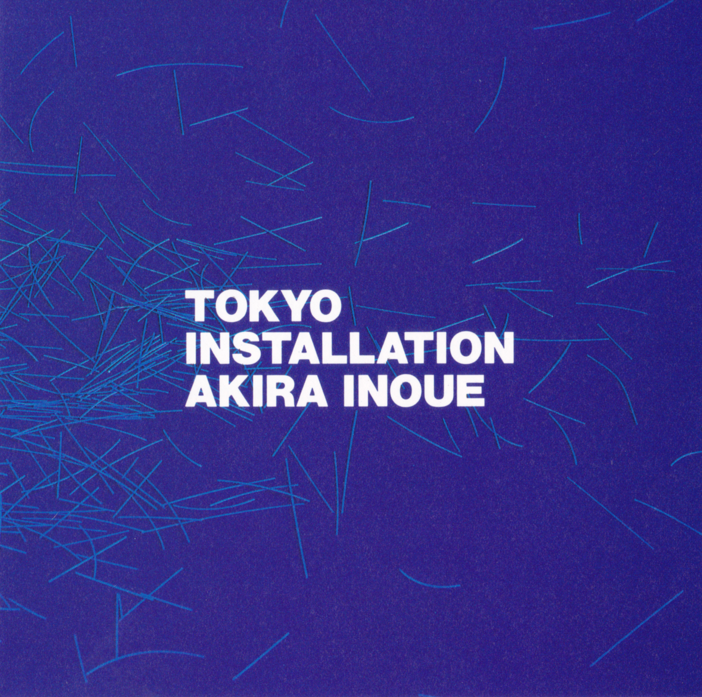
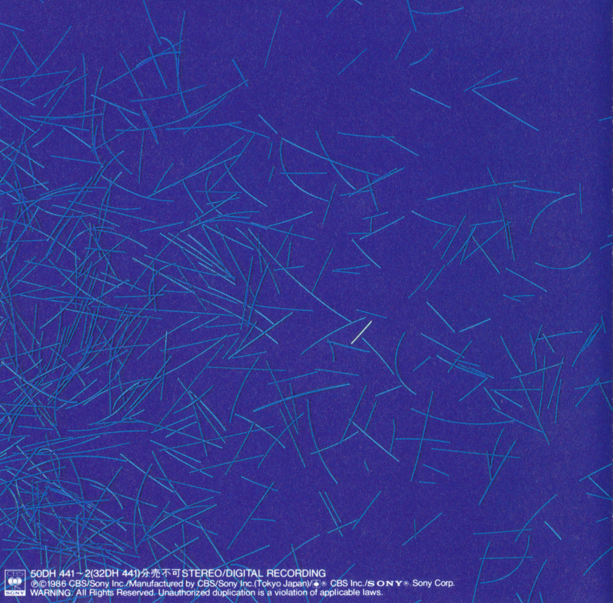
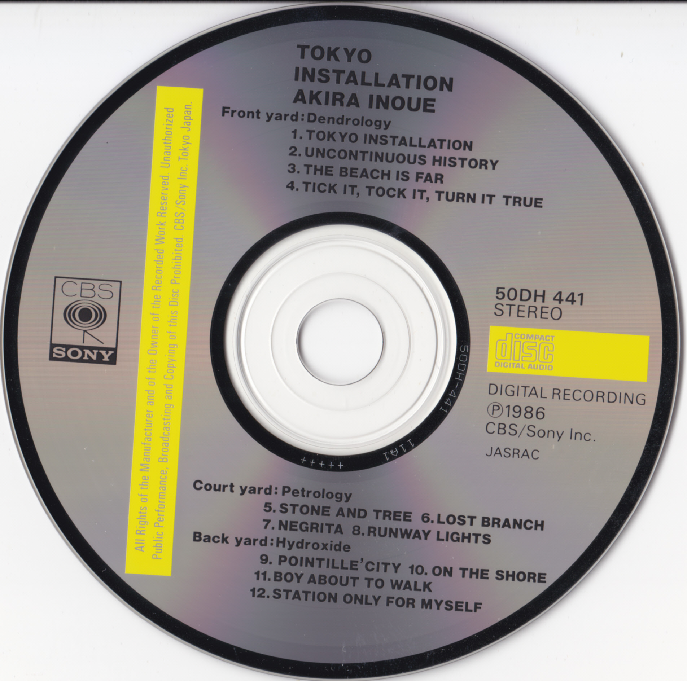

<!--
 pandoc -s --filter pandoc-crossref -M "crossrefYaml=./crossref_config.yaml" -f markdown -t html5 --mathjax --css ./style.css ./akira-inoue-1986-tokyo-installation.md > ./akira-inoue-1986-tokyo-installation.html
-->

[ホームに戻る](./index.html)

## 井上鑑 / Tokyo Installation (1986年)

- レーベル: CBSソニー
- 規格品番: 50DH-441〜2 (32DH 441 / 18DH 442)
- 発売日: 1986年6月1日

再発を強く希望。宜しくお願いします。このまま埋もれてしまうのは本当に勿体ありません。アートブック付きCDとして5,000円で発売されました。LPやカセットテープでの発売なし。CDが普及し始めた時期とはいえ、アートブック付きのため値段は高め、さらにインスト盤ということもあって、流通量はあまり多くないと考えられます。オークションでもなかなか見かけない作品ですが、頑張って入手しました。

浜田省吾が「滑走路夕景」と「水辺にて」の2曲、尾崎豊が「歩き出すまえの少年」と「たった独りのための駅」の2曲を提供しています。尾崎豊が他のアーティストに提供したのは、この2曲だけです。エレクトリックドラムにはなんと、イエスやキング・クリムゾンのドラマーであるビル・ブルーフォードが参加しています。有り得ないほど豪華です。オークションでは井上鑑ファン、浜田省吾ファン、尾崎豊ファン、ビル・ブルーフォードのファンがぶつかり合うので、かなりの競争になります。

聴き始めた当初は、なかなか最後まで聴き通すことができなかったのですが、あるときを境に一気にハマっていきました。繊細な琴と、バキバキドコドコした激しいドラムが見事に融合しています。和風でも洋風でもなく、なかなか独特の雰囲気です。「System Overload」(1988年)や「Head, Hands And Feet」(1989年)といった以降の作品でも琴が起用されています。変拍子が炸裂。5曲目「石と樹」とかは、7→6→7→7→7→6→7→5拍子のフレーズが繰り返し登場。9曲目「点描の都市」が一番好きです。10曲目「水辺にて」には、井上鑑、浜田省吾、尾崎豊の3人の会話の一部が収録されています。

### 収録曲

- 第1の庭: 樹 (Front Yard: Dendrology)
  1. Tokyo Installation (6:54)
  2. 不連続性の歴史 (Uncontinuous History) (6:08)
  3. 遠い波 (The Beach Is Far) (5:21)
  4. Tick It, Tock It, Turn It True (6:06)
- 第2の庭: 石 (Court Yard: Petrology)
  5. 石と樹 (Stone And Tree) (5:36)
  6. 失われた枝 (Lost Branch) (2:29)
  7. Negrita (5:41)
  8. 滑走路夕景 (Runway Lights) (4:36)
- 第3の庭: 水 (Back Yard: Hydroxide)
  9. 点描の都市 (Pointille'City) (6:14)
  10. 水辺にて (On The Shore) (3:30)
  11. 歩き出すまえの少年 (Boy About To Talk) (5:03)
  12. たった独りのための駅 (Station Only For Myself) (3:40)

### ジャケット(表面)

### ジャケット(裏面)

### ジャケット (バックインレイ)

### 盤面

