<!--
 pandoc -s --filter pandoc-crossref -M "crossrefYaml=./crossref_config.yaml" -f markdown -t html5 --mathjax --css ./style.css ./off-course-ca35-series.md > ./off-course-ca35-series.html
-->

[ホームに戻る](./index.html)

## オフコース CA35シリーズ

オフコースの「僕の贈りもの」から「Next Sound Track」までのアルバムと、「Selection 1973-78」「Selection 1978-81」「Yes-Yes-Yes オフコースA面コレクション」の3枚のベストアルバムは、1982年11月から1984年2月までの間にCD化されています。
これらのCDは、東芝EMIのExpressレーベルから定価3500円で発売され、カタログ番号はCA35で始まります。
売れ行きがあまり良くなかったのか、1985年9月28日に定価3200円として再度発売されました (カタログ番号はCA32で始まる)。
CA35で始まる最初のCDは、1年半程度で廃盤となったので、現在では非常に入手が困難になっています。
アーカイブの意味も兼ねて、自分が持っているものを紹介します (発売日は予想です)。

### I Love You (CA35-1002)

- 10thアルバム
- 発売日: 1982年11月1日
- 備考: 自分が持っているものは、マトリクスが「CA35-1002 61A4」(かっこいいフォント)、そして「CSR COMPACT DISC」の刻印付きです。
「CSR COMPACT DISC」の刻印は、1983年秋頃〜1985年春頃までのCDにみられます。
「xxAx」のようなマトリクス(例えば11A1や11A2)は1984年以降のCDによくみられるので、発売時期は1984〜85年だと思います。
1982年に発売された最初のプレスは、マトリクスが「CA35-1002-1 1D1」「CA35-1002-1 1D2」(細いフォント)、そして「MANUFACTURED BY CBS/SONY RECODS INC.」の刻印付きです。
- 入手のしやすさ: 大ヒットした作品なので、マトリクスや刻印にこだわらなければ、比較的容易に入手できます。

[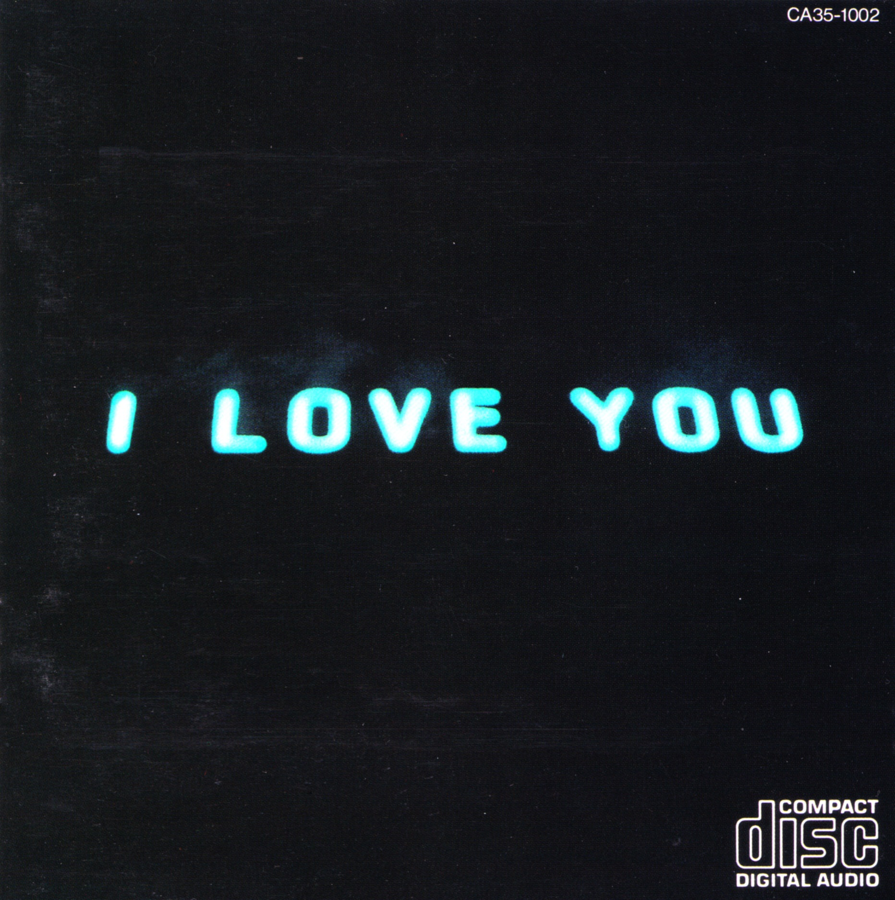](images/Off-Course-1982-I-Love-You-CA35-1002-0.jpg)
[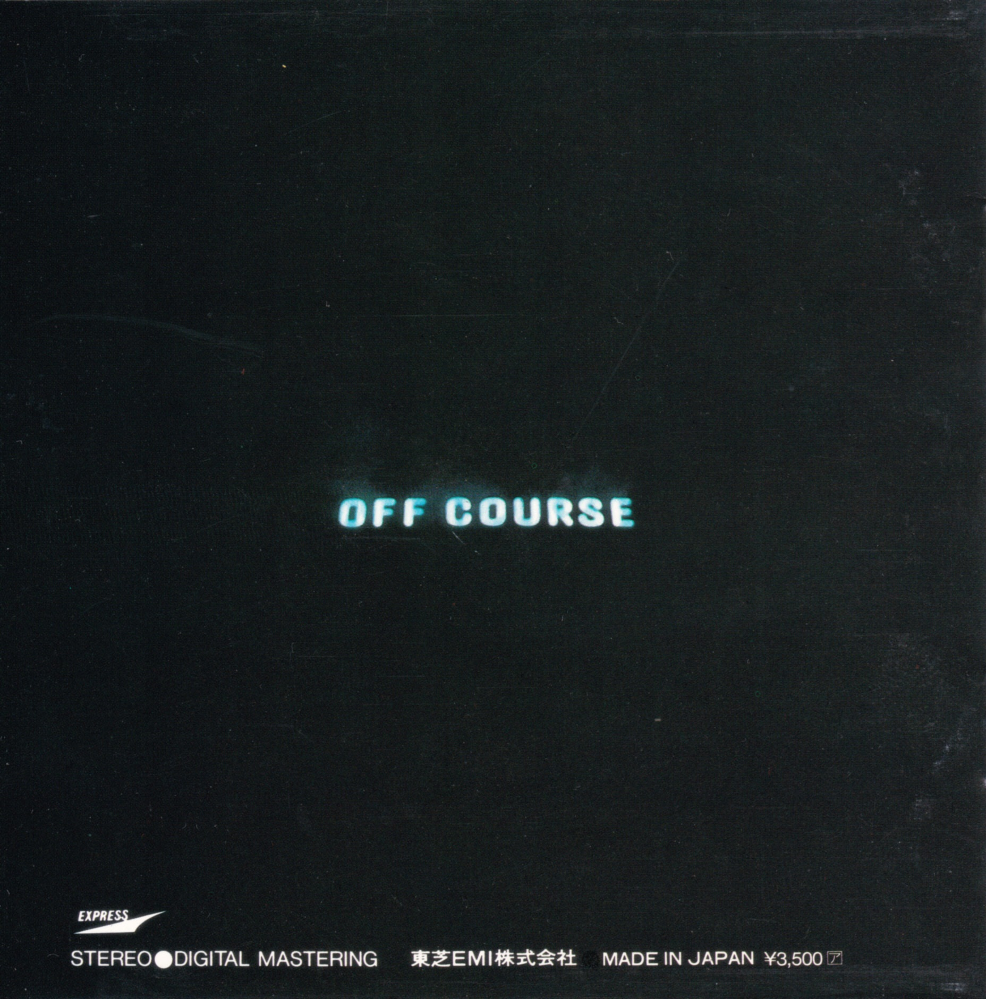](images/Off-Course-1982-I-Love-You-CA35-1002-1.jpg)

[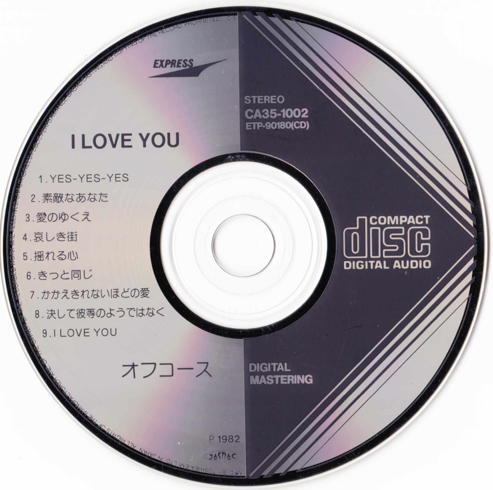](images/Off-Course-1982-I-Love-You-CA35-1002-3.jpg)

### Selection 1973-78 (CA35-1006)

- ベストアルバム
- 発売日: 1983年?月
- 備考: 1983年の何月に発売されたのか分かりません。
寺尾聰の「Reflections」の初CD化(CA35-1003)が1983年2月21日、アリスのベストアルバム「ベスト10」(CA35-1008)が1983年5月21日発売なので、その間のどこかです。
自分が持っているものは、マトリクスが「CA35-1006-1 1B1」(幅広いフォント)です。
このフォントは、東芝EMIの工場で1983年に製造されたCDにしか使われていないそうなので、発売時期は1983〜84年前半だと思います。
- 入手のしやすさ: オークションでの目撃頻度は「Selection 1978-81」や「Yes-Yes-Yes」といった他のベストアルバムよりは低いのですが、入手はそこまで困難ではありません。
オフコースの作品が一挙にCD化されたとき、やはりベストアルバムを選択した人が多かったのだと思います。

### Selection 1978-81 (CA35-1007)

- ベストアルバム
- 発売日: 1983年?月
- 備考: 1983年の何月に発売されたのか分かりません。
寺尾聰の「Reflections」の初CD化(CA35-1003)が1983年2月21日、アリスのベストアルバム「ベスト10」(CA35-1008)が1983年5月21日発売なので、その間のどこかです。
自分が持っているものは、マトリクスが「CA35-1007 11A2」(かっこいいフォント)、そして「CSR COMPACT DISC」の刻印付きです。
発売時期は1984〜85年前半だと思います。
- 入手のしやすさ: オークションではよくみかけます。
CA35シリーズのなかで最も入手が容易だと思います。
「さよなら」「Yes-No」「I Love You」などのヒットシングルを収録しているため、CD黎明期であるにもかかわらず、よく売れたのだと思います。

### Only Just Begun -Off Course Instruments (CA35-1014)

- 非公式インストゥルメンタルアルバム (第一弾)
- 発売日: 1983年7月21日
- 備考: 未所持。
- 入手のしやすさ: ごく稀にオークションでみかけますが、高額なので手が出せません。

### We Are (CA35-1015)

- 8thアルバム
- 発売日: 1983年7月21日
- 備考: 自分が持っているものは、マトリクスが「CA35-1015 11」(かっこいいフォント)、そして「MANUFACTURED BY CBS/SONY RECORDS INC.」の刻印付きです。
マトリクスが「11」なので最初のプレスです。
- 入手のしやすさ: 大ヒットした作品なので、比較的入手が容易です。

[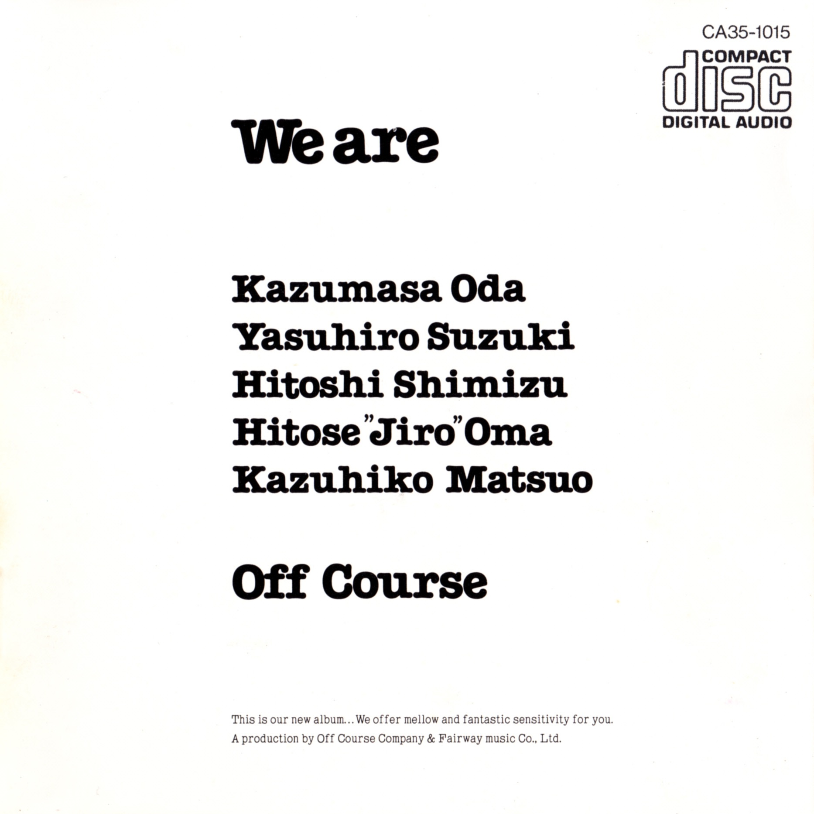](images/Off-Course-1980-We-Are-CA35-1015-0.jpg)

[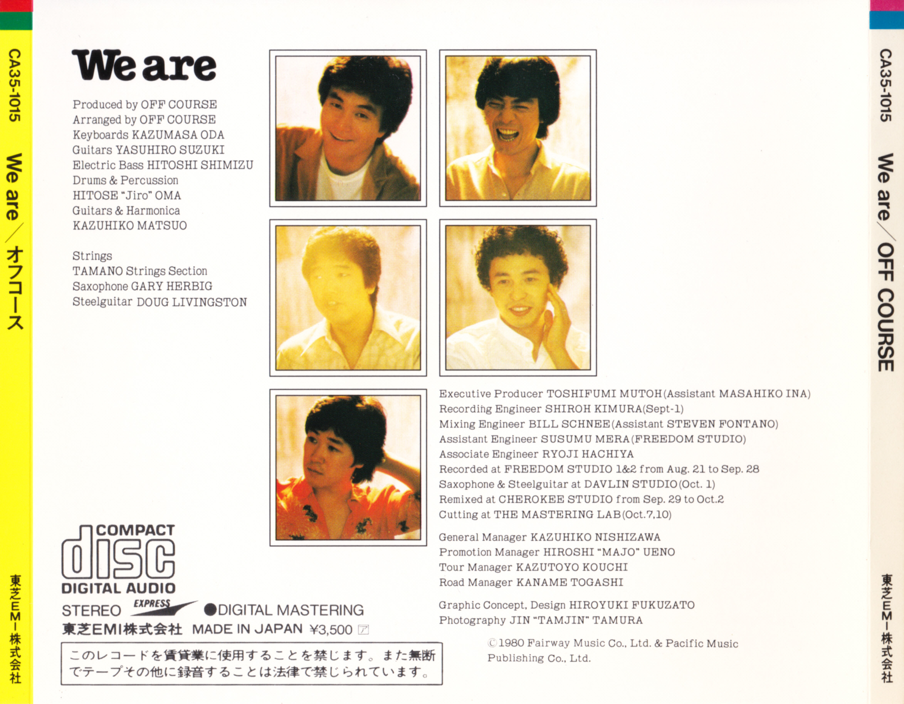](images/Off-Course-1980-We-Are-CA35-1015-2.jpg)

### Over (CA35-1021)

- 9thアルバム
- 発売日: 1983年9月1日
- 備考: 自分が持っているものは、マトリクスが「CA35-1021 1B1」(かっこいいフォント)、刻印なしです。
「xBx」のようなマトリクス(例えば1B1、1B2、2B1、2B3など)は1985年以降のCDによくみられます。
刻印が入っていないので、CBSソニーではなく東芝EMIの工場でプレスされたものです。
発売時期は1984年後半〜85年だと思います。
- 入手のしやすさ: 大ヒットした作品なので、結構な頻度でオークションに登場します。
「I Love You」「We Are」「Over」と、ヒット作から順番にCD化していったのだと思います。

[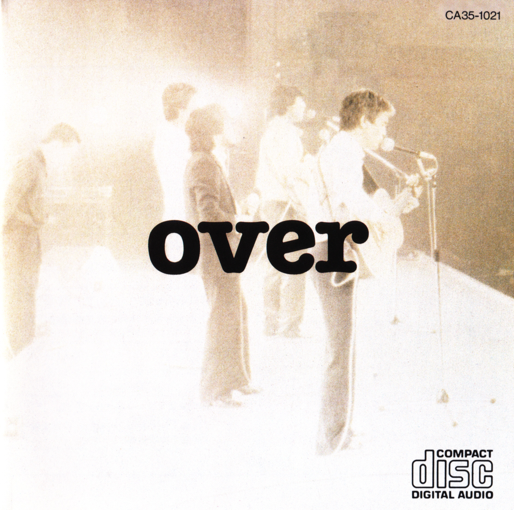](images/Off-Course-1981-Over-CA35-1021-0.jpg)
[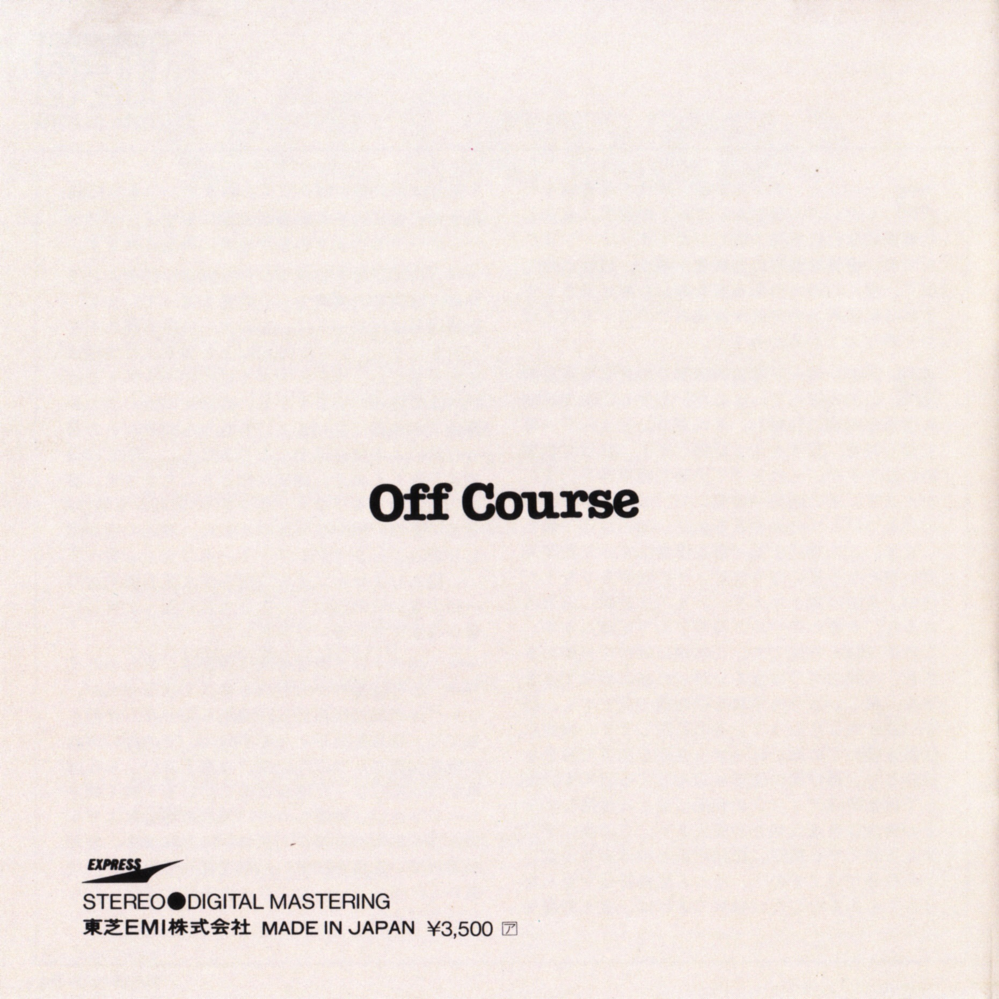](images/Off-Course-1981-Over-CA35-1021-1.jpg)

[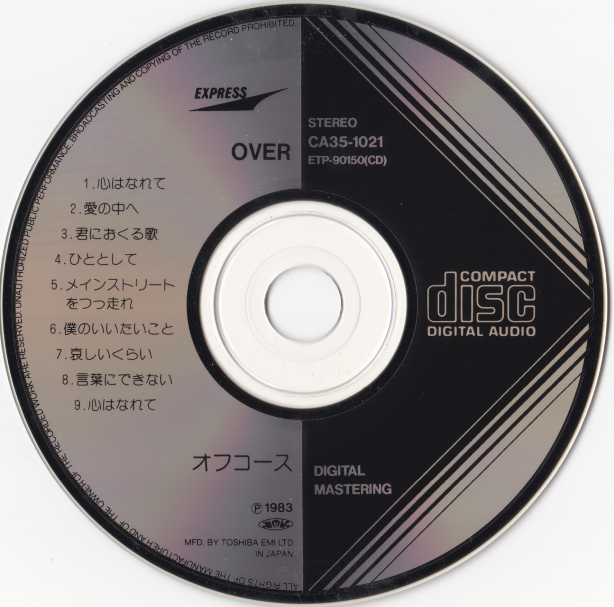](images/Off-Course-1981-Over-CA35-1021-3.jpg)

### From Me To You -Off Course Instruments II (CA35-1025)

- 非公式インストゥルメンタルアルバム (第二弾)
- 発売日: 1983年9月1日
- 備考: 未所持。
- 入手のしやすさ: ごく稀にオークションでみかけますが、高額なので手が出せません。

### ワインの匂い (CA35-1032)

- 3rdアルバム
- 発売日: 1983年10月21日
- 備考: 自分が持っているものは、マトリクスが「CA35-1032 11」(かっこいいフォント)、そして「CSR COMPACT DISC」の刻印付きです。
マトリクスが「11」なので最初のプレスです。
- 入手のしやすさ: 初期の70年代の作品は、入手の難易度が一気に上がります。
定価を上回る値段で入手しました。

[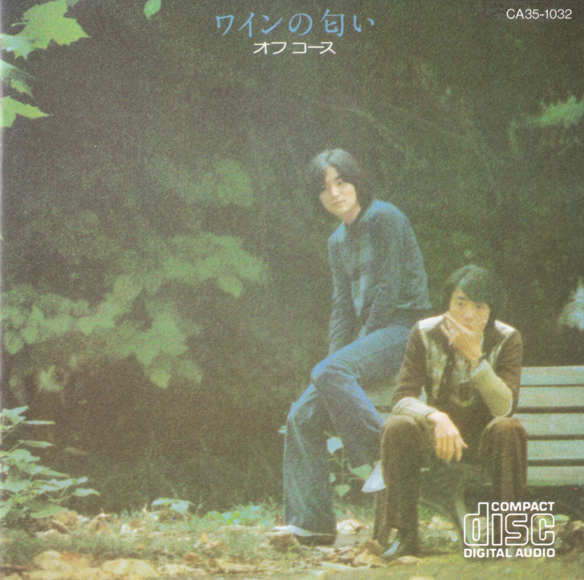](images/Off-Course-1975-Wine-No-Nioi-CA35-1032-0.jpg)

### この道をゆけば / オフ・コース・ラウンド2 (CA35-1033)

- 2ndアルバム
- 発売日: 1983年10月21日
- 備考: 自分が持っているものは、マトリクスが「CA35-1033 31A1」(かっこいいフォント)、そして「CSR COMPACT DISC」の刻印付きです。
1984年に発売されたものだと思います。
- 入手のしやすさ: 初期の70年代の作品は、入手の難易度が一気に上がります。
駿河屋の入荷待ちリストに登録しており、入荷通知のメールが届いた瞬間に購入しました。
入手できたのは運が良かったです。
オークションにも稀に出現します。

[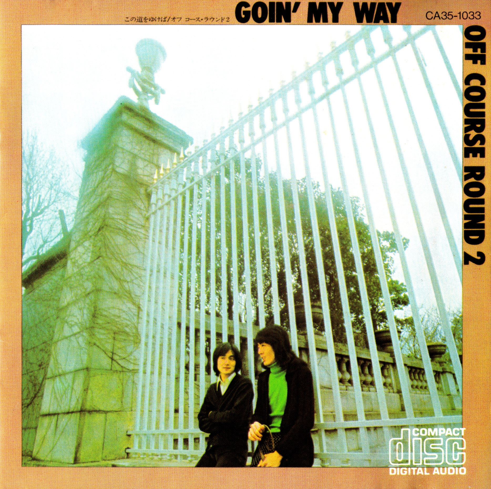](images/Off-Course-1974-Konomichi-O-Yukeba-CA35-1033-0.jpg)

### Made In Love -Off Course Instruments III (CA35-1034)

- 非公式インストゥルメンタルアルバム (第三弾)
- 発売日: 1983年10月21日
- 備考: 未所持。
- 入手のしやすさ: ごく稀にオークションでみかけますが、高額なので手が出せません。

### 僕の贈りもの (CA35-1040)

- 1stアルバム
- 発売日: 1983年11月21日
- 備考: 自分が持っているものは、マトリクスが「CA35-1040 11」(かっこいいフォント)、そして「CSR COMPACT DISC」の刻印付きです。
マトリクスが「11」なので最初のプレスです。
- 入手のしやすさ: 初期の70年代の作品は、入手の難易度が一気に上がります。
オークションでみたことが一度もありません。
入手できたのは運が良かったです。

### Song Is Love (CA35-1041)

- 4thアルバム
- 発売日: 1983年11月21日
- 備考: 自分が持っているものは、マトリクスが「CA35-1041 11」(かっこいいフォント)、そして「CSR COMPACT DISC」の刻印付きです。
マトリクスが「11」なので最初のプレスです。
- 入手のしやすさ: オークションでみかけます。
「ひとりで生きてゆければ」「青春」など、オフコース屈指の名曲を収録していることもあり、70年代の作品のなかでは最も入手しやすいです。

### Junktion (CA35-1042)

- 5thアルバム
- 発売日: 1983年11月21日
- 備考: 自分が持っているものは、マトリクスが「CA35-1042 11A1」(かっこいいフォント)、そして「CSR COMPACT DISC」の刻印付きです。
1984年に発売されたものだと思います。
- 入手のしやすさ: オークションでみかけるので、入手は不可能ではないと思います。

### Sincerely (CA35-1043)

- 鈴木康博1stソロアルバム
- 発売日: 1983年11月21日
- 備考: 自分が持っているものは、マトリクスが「CA35-1043-1 1A1」(幅広いフォント)です。
おそらく最初のプレスです。
- 入手のしやすさ: オークションでみかけるので、入手は不可能ではないと思います。

[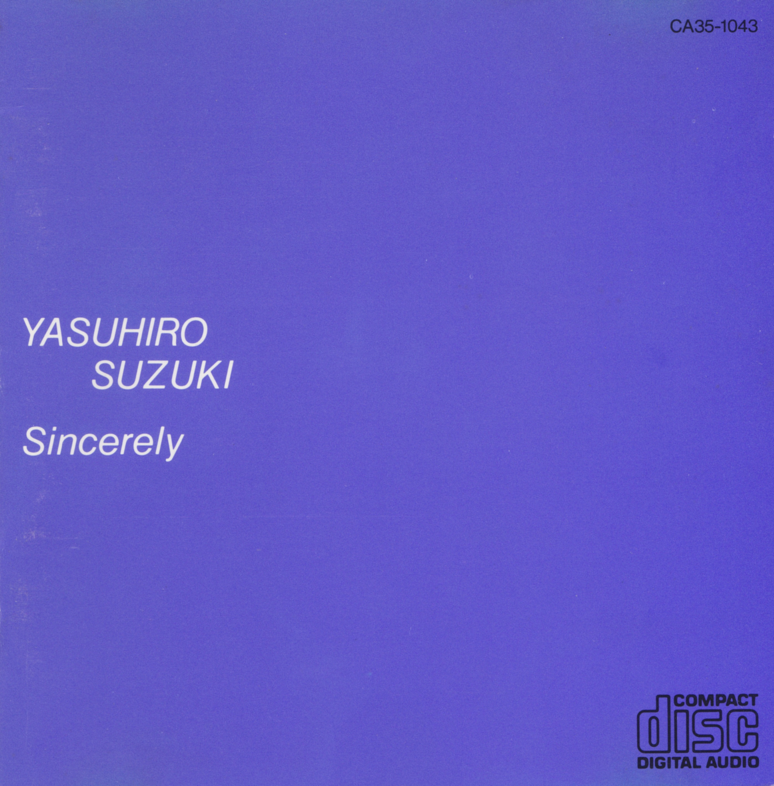](images/Yasuhiro-Suzuki-1983-Sincerely-CA35-1043-0.jpg)
[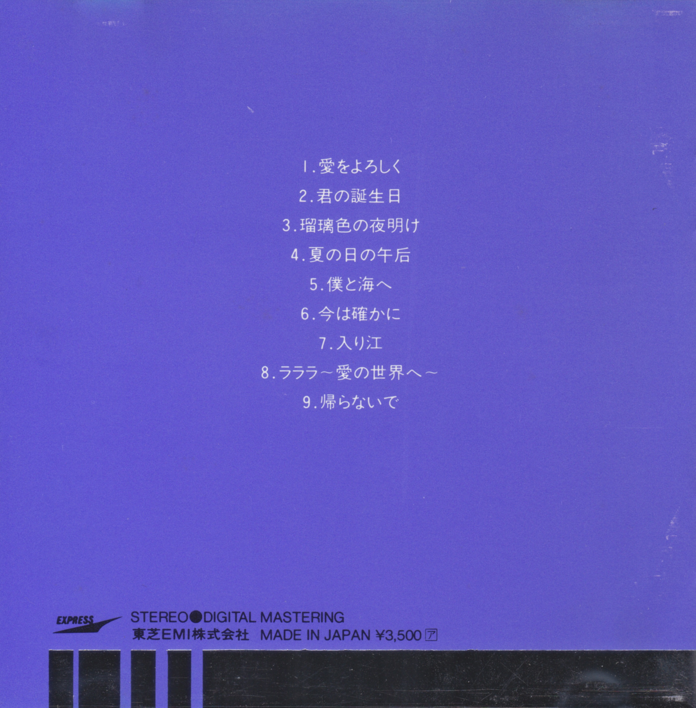](images/Yasuhiro-Suzuki-1983-Sincerely-CA35-1043-1.jpg)
[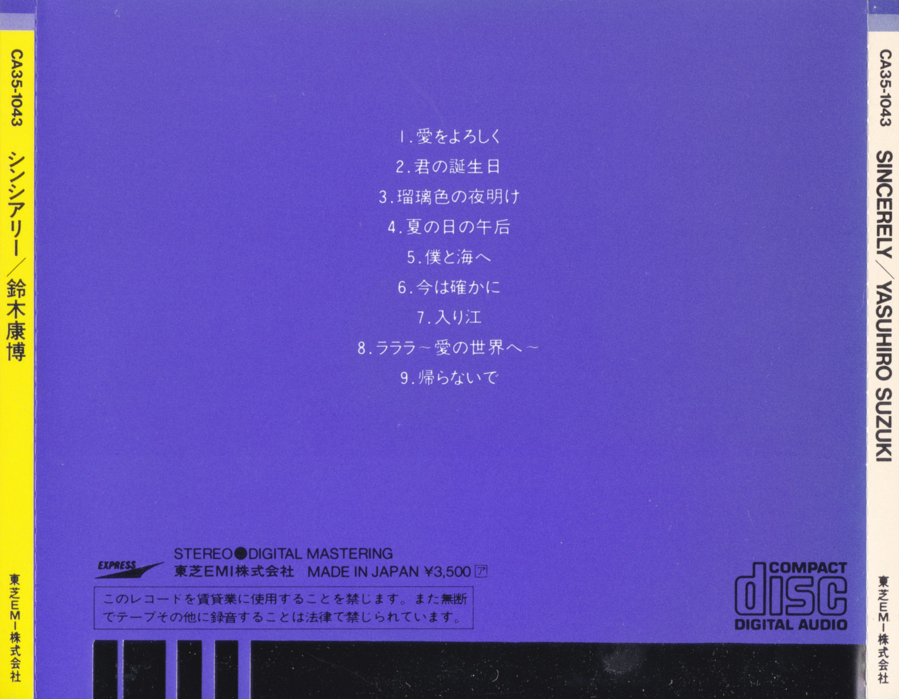](images/Yasuhiro-Suzuki-1983-Sincerely-CA35-1043-2.jpg)

### Fairway (CA35-1056)

- 6thアルバム
- 発売日: 1983年12月21日
- 備考: 未所持
- 入手のしやすさ: 「Song Is Love」や「Junktion」よりもヒットしているはずですが、なぜか目撃頻度が低いです。

### Three And Two (CA35-1057)

- 7thアルバム
- 発売日: 1983年12月21日
- 備考: 自分が持っているものは、マトリクスが「CA35-1057 11」(かっこいいフォント)、そして「CSR COMPACT DISC」の刻印付きです。
マトリクスが「11」なので最初のプレスです。
- 入手のしやすさ: 「Song Is Love」や「Junktion」よりもヒットしているはずですが、「Fairway」と同様、なぜか目撃頻度が低いです。

[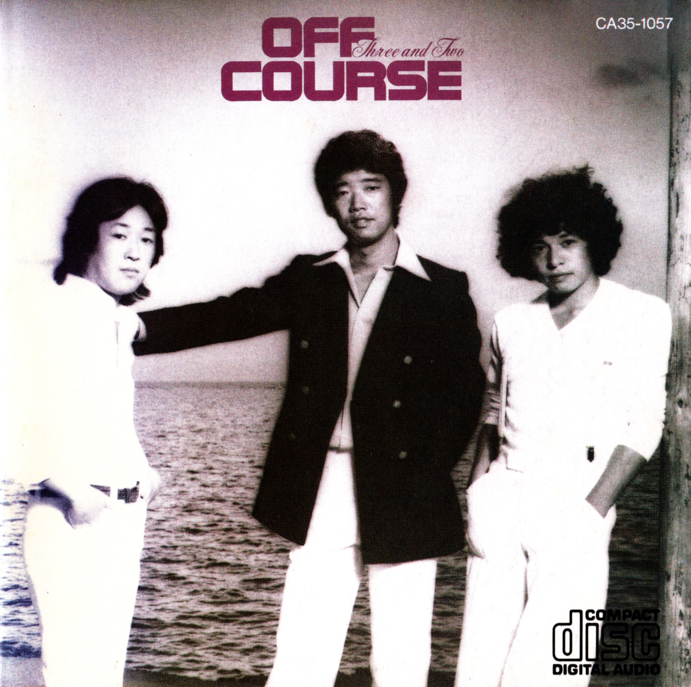](images/Off-Course-1979-Three-And-Two-CA35-1057-0.jpg)

[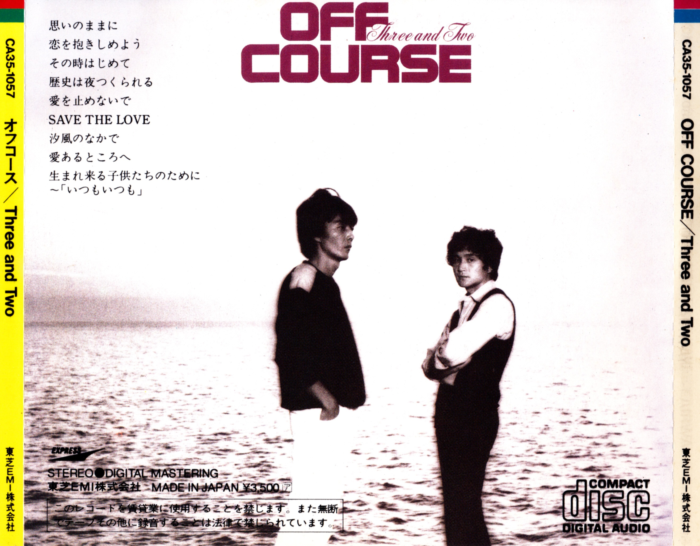](images/Off-Course-1979-Three-And-Two-CA35-1057-2.jpg)

### Next Sound Track (CA35-1058)

- サウンドトラック
- 発売日: 1983年12月21日
- 備考: 自分が持っているものは、マトリクスが「CA35-1058 11A1」(かっこいいフォント)、そして「CSR COMPACT DISC」の刻印付きです。
1984年に発売されたものだと思います。
- 入手のしやすさ: ヒットした作品なので、オークションではよくみかけます。

[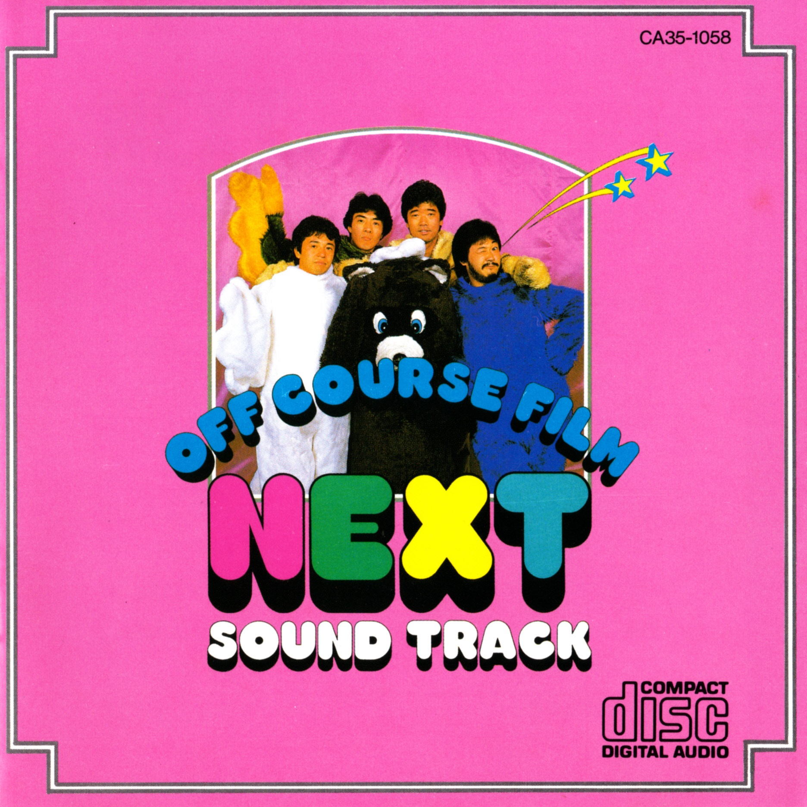](images/Off-Course-1982-Next-CA35-1058-0.jpg)
[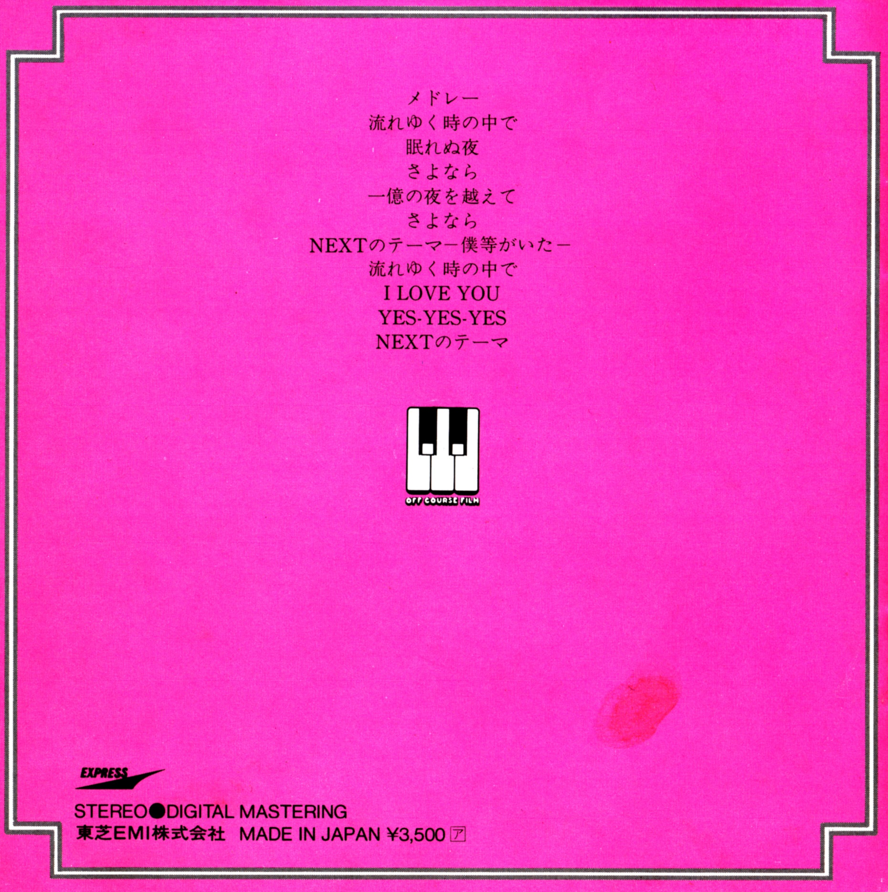](images/Off-Course-1982-Next-CA35-1058-1.jpg)
[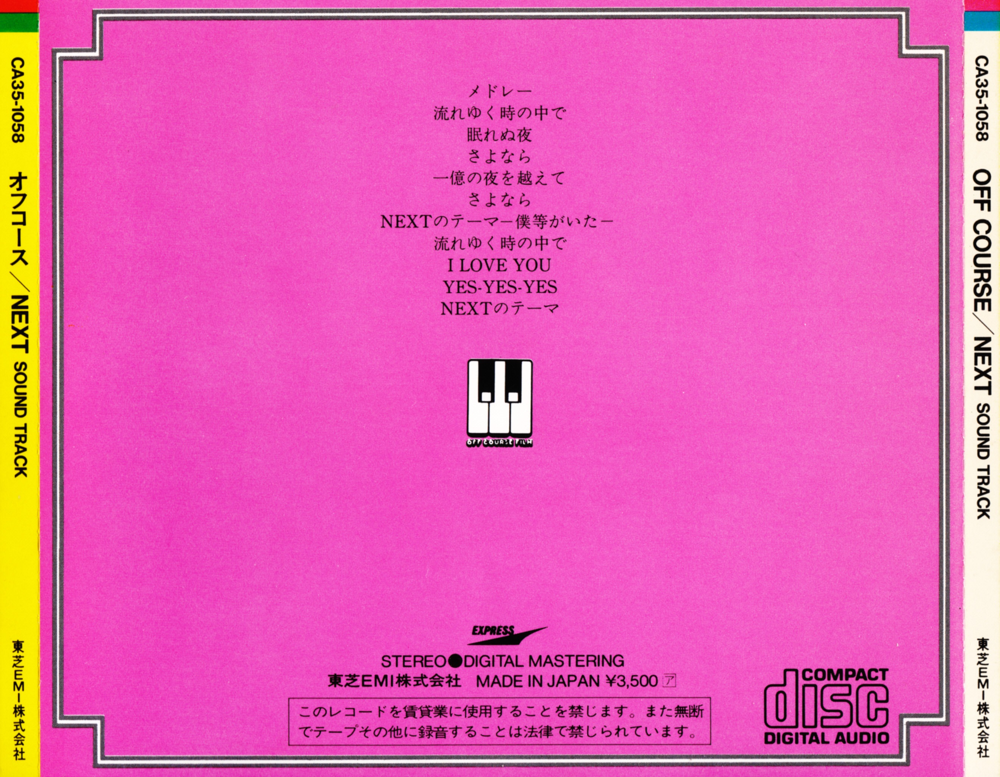](images/Off-Course-1982-Next-CA35-1058-2.jpg)
[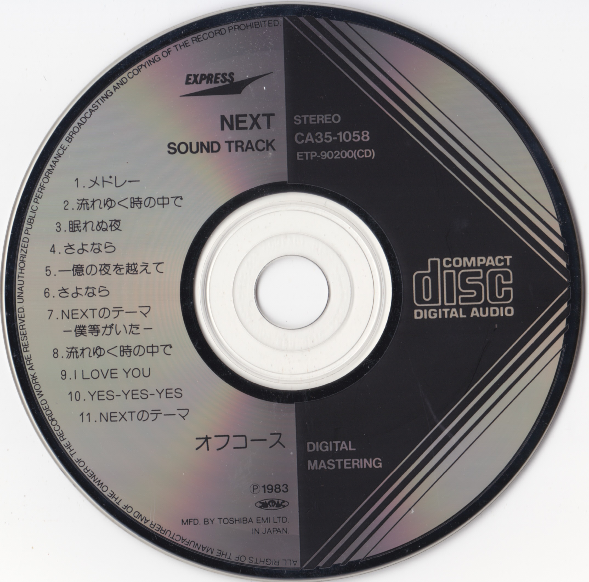](images/Off-Course-1982-Next-CA35-1058-3.jpg)

### Yes-Yes-Yes オフコースA面コレクション (CA35-1063)

- 非公式ベストアルバム
- 発売日: 1984年2月21日
- 備考: 自分が持っているものは、マトリクスが「CA35-1063 2B1」(かっこいいフォント)、刻印なしです。
発売時期は1984年後半〜85年だと思います。
- 入手のしやすさ: 「Selection 1978-81」と同様、オークションではよくみかけます。

[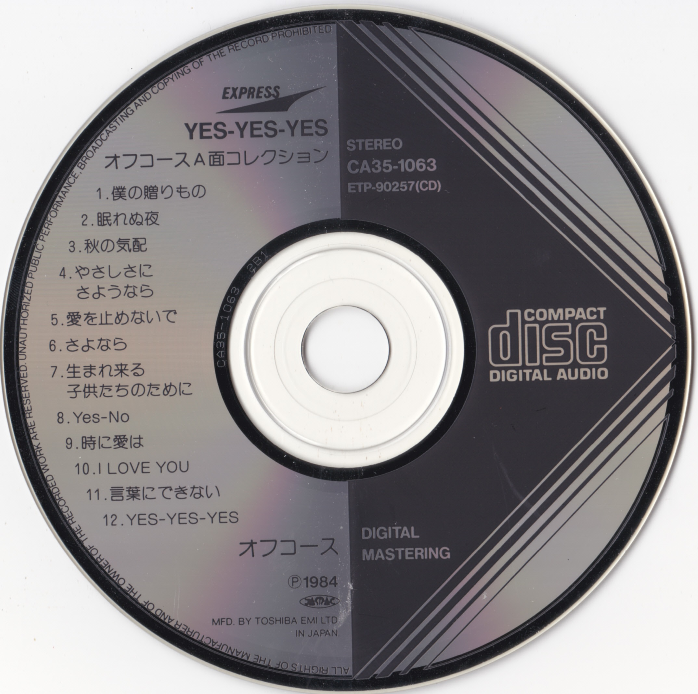](images/Off-Course-1983-Yes-Yes-Yes-CA35-1063-3.jpg)

