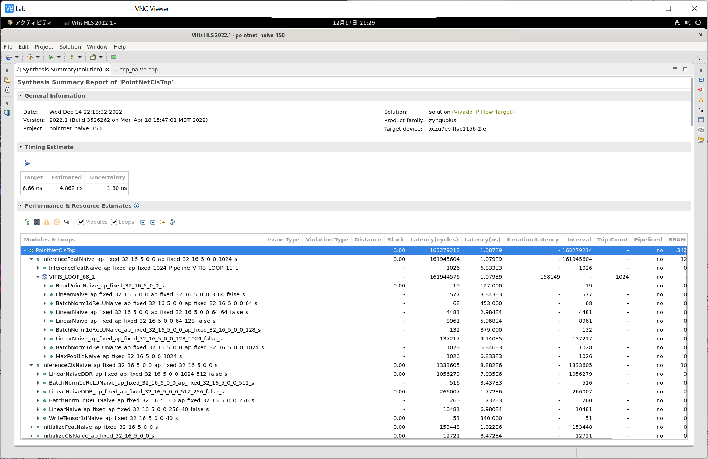
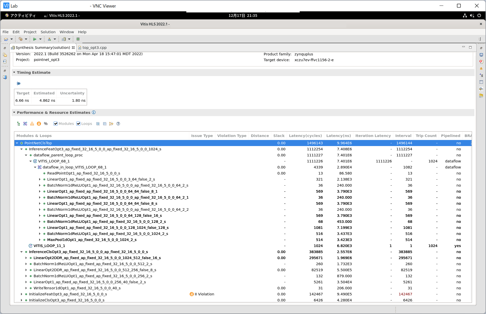
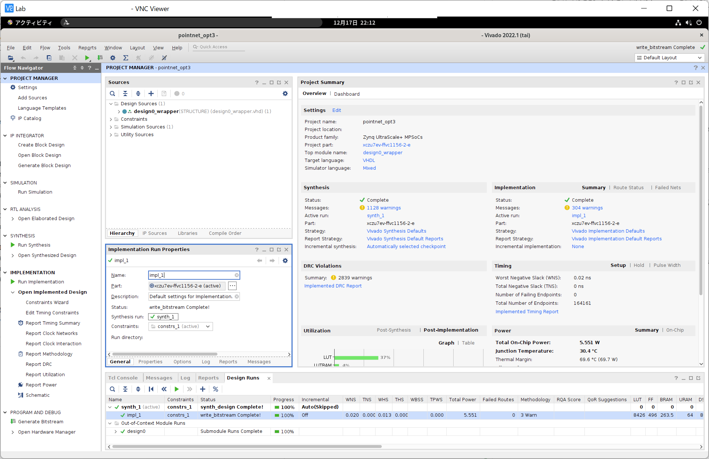
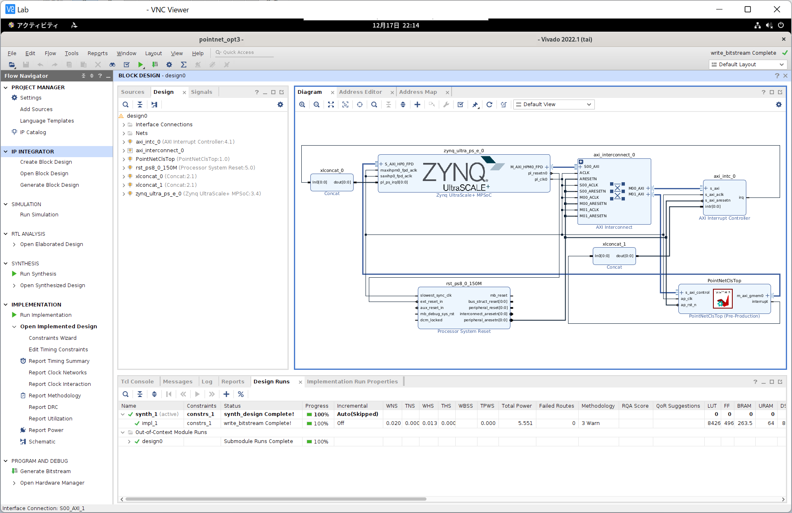
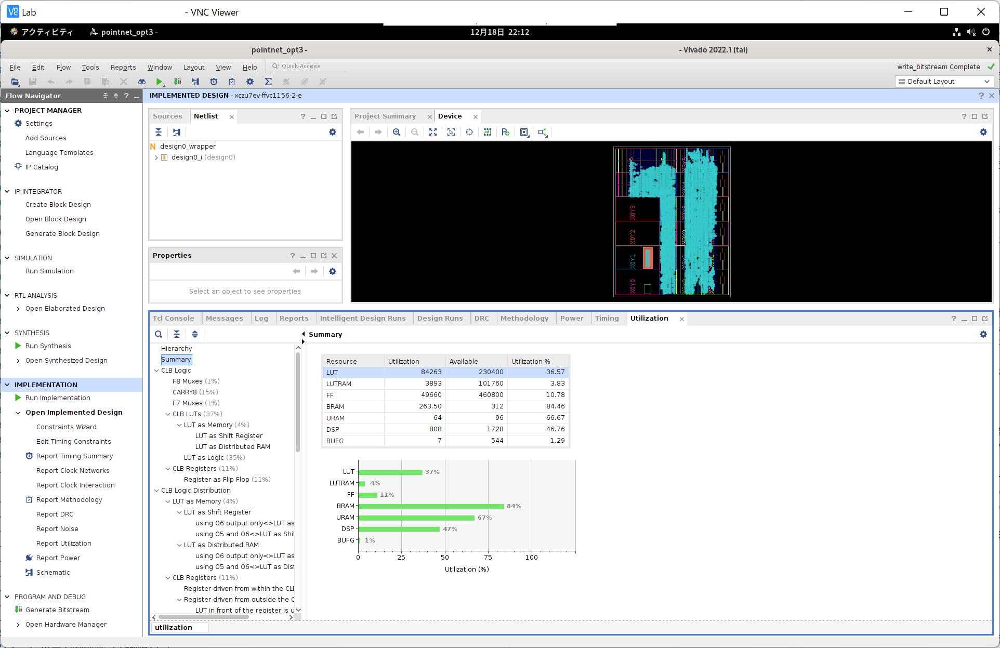

---
title: 点群処理のFPGA高速化
author: SternGerlach
---

<!--
 pandoc -s -f markdown -t html5 --mathjax --css style.css point-cloud-classification.md -o point-cloud-classification.html
-->

[ホームに戻る](./index.html)

# このページについて

このページは、[慶應理工アドベントカレンダー2022](https://adventar.org/calendars/7773)の22日目の記事です。
去年の記事は[こちら](./scan-matching-branch-and-bound.html)と[こちら](./scan-matching-branch-and-bound-impl.html)です。

早速余談ですが、1983年12月22日は、Yellow Magic Orchestra (YMO) が行った最後の国内ツアーの最終日で、開催場所は日本武道館でした。
今日は、その散開ツアーからちょうど39年目の記念すべき日です。
1984年2月22日発売の「アフター・サーヴィス」や、1992年11月21日発売の「コンプリート・サーヴィス」に音源が収録されているので、みなさん是非聴いてみてください。
また余談ですが、普段は(研究そっちのけで)CDを集めています。
70年代から80年代にかけてのアーティストが好きです。
最近は、専らオフコースを聴いています。
オフコースの旧規格盤のコレクションは[こちら](./off-course-ca35-series.html)にあります。
また、コレクションは[こちら](./cds.html)と[こちら](./toshiba-emi.html)にまとめてあります。
暇なときにご覧ください。

もう一つ余談。
今年聴いたなかで最も良かったアルバム。

1. チューリップ「Halo」(1983年 / VICL-62399 / 2007年盤)
    - 特によかった曲: 🥇「丘に吹く風」🥈「愛を抱きしめて」🥉「輝く星」「想い出のランドスケープ」「コスモスの咲く郷」「星空の伝言」「セルリアン・ブルー」
2. オフコース「この道をゆけば オフ・コース・ラウンド2」(1974年 / CA35-1033 / 1983年盤)
    - 特によかった曲: 🥇「はたちの頃」🥈「別れの情景(1)」🥉「首輪のない犬」「あの角をまがれば」「日曜日のたいくつ」
3. オフコース「I Love You」(1982年 / CA35-1002 / 1982年盤)
    - 特によかった曲: 🥇「哀しき街」🥈「決して彼等のようではなく」🥉「Yes-Yes-Yes」「愛のゆくえ」
4. オフコース「ワインの匂い」(1975年 / CA35-1032 / 1983年盤)
    - 特によかった曲: 🥇「幻想」🥈「老人のつぶやき」🥉「憂き世に」「雨よ激しく」「倖せなんて」「ワインの匂い」「眠れぬ夜」
5. オフコース「Song Is Love」(1976年 / CA35-1041 / 1983年盤)
    - 特によかった曲: 🥇「冬が来るまえに」🥈「青空と人生と」🥉「歌を捧げて」「青春」「ひとりで生きてゆければ」
6. チューリップ「New Tune」(1985年 / 35FD-1005 / 1985年盤)
    - 特によかった曲: 🥇「もっと幸せに素直になれたら」🥈「ロベリア」🥉「Our Song」「ふたつめのクリスマス」「そんな男になれたら」
7. 大滝詠一「Each Time」(1984年 / 35DH 78 / 1984年盤)
    - 特によかった曲: 🥇「Bachelor Girl」🥈「ペパーミント・ブルー」🥉「魔法の瞳」「恋のナックルボール」
8. 麗美「"R"」(1984年 / 35C31-7250 / 1984年盤)
    - 特によかった曲: 🥇「星のクライマー」🥈「風は明日へ」🥉「空が一面海に見えた日」「恋の一時間は孤独の千年」「青春のリグレット」「ポニーテイル」
9. ハイ・ファイ・セット「Sweet Locomotion」(1986年 / 32DH 393 / 1986年盤)
    - 特によかった曲: 🥇「ひときれの恋」🥈「たった一枚のフォトグラフ」🥉「Elevator Town」「Do You Remember Me?」
10. 和久井映見「Flora」(1990年 / PSCR-1006 / 1990年盤)
    - 特によかった曲: 🥇「マイ・ロンリィ・グッバイ・クラブ」🥈「偶然の旅人」🥉「夢で会いましょう」「神様がいない土曜日」
11. 鈴木康博「Sincerely」(1983年 / CA35-1043 / 1983年盤)
    - 特によかった曲: 🥇「瑠璃色の夜明け」🥈「僕と海へ」🥉「ラララ ～愛の世界へ～」「入り江」「君の誕生日」
12. 岡田有希子「ヴィーナス誕生」(1986年 / D32A0164 / 1986年盤)
    - 特によかった曲: 🥇「ヴィーナス誕生」🥈「銀河のバカンス」🥉「眠れぬ夜のAquarius」「Wonder Trip Lover」「Spring Accident」
13. 尾崎亜美「Kids」(1986年 / D32A0235 / 1986年盤)
    - 特によかった曲: 🥇「流れ星が好き」🥈「シャイネスボーイ」🥉「St.Valentine's Day Rhapsody」「Com'on Mamy」
14. 久保田早紀「夜の底は柔らかな幻」(1984年 / DYCL-17 / 2005年盤)
    - 特によかった曲: 🥇「ピアニッシモで...」🥈「寒い絵葉書」🥉「月の浜辺ボタンがひとつ」「メランコリーのテーブルクロス」
15. 薬師丸ひろ子「花図鑑」(1986年 / CA32-1260 / 1986年盤)
    - 特によかった曲: 🥇「紅い花、青い花」🥈「寒椿、咲いた」🥉「ローズ・ティーはいかが?」「哀しみの種」「透明なチューリップ」「麦わら帽子のアン」

イントロが良い曲 (おまけ)。

1. チューリップ「Shooting Star」(1981年)
2. 井上鑑「Karsavina ～ニジンスキーの翼」(1983年)
3. 井上鑑「Running Fence -Ode A Christo」(1982年)

今年は、点群処理 (点群分類タスク) 向けニューラルネットのFPGA高速化を試してみます。
LeNetやResNetなど、画像処理向けニューラルネットのFPGA高速化も面白いのですが、既にたくさんの素晴らしい記事が出ているのでやめました。
音楽の話も、誰にも通じないし、ウケないと思ったのでやめました。
コンピュータで閲覧されることをお勧めします。

# ニューラルネットの準備

点群の分類、セグメンテーション、レジストレーションなど、様々なタスクに対応した代表的なモデルとして、2017年にCVPRで発表されたPointNetが挙げられます。
PointNetは、MLPとMaxプーリング層からなる、シンプルかつ強力なモデルです。
分類タスク向けのPointNetの構造を、以下に示します。

[](point-cloud-classification-images/pointnet-layers.svg)

モデルは、点群からの特徴抽出と、特徴に基づく分類の、2つの部分に分けられます (図のFeature extractionとClassification)。

図の左端に示すように、$N$個の点を含む、3次元の点群$\mathcal{P} = \left\{ \boldsymbol{p}_1, \ldots, \boldsymbol{p}_N \right\} \in \mathbb{R}^{N \times 3}$が入力です。
MLPを用いて、各点$\boldsymbol{p}_i \in \mathbb{R}^3$に対して、1024次元のローカルな特徴$\boldsymbol{\psi}_i \in \mathbb{R}^{1024}$を計算します。
全ての点に対してローカルな特徴量$\boldsymbol{\Psi} = \left\{ \boldsymbol{\psi}_1, \ldots, \boldsymbol{\psi}_N \right\} \in \mathbb{R}^{N \times 1024}$を計算したら、それらをMaxプーリング層により集約して、点群全体を表すグローバルな特徴量$\boldsymbol{\phi} \in \mathbb{R}^{1024}$を得ます ($\boldsymbol{\phi} \gets \max(\boldsymbol{\psi}_1, \ldots, \boldsymbol{\psi}_N)$)。

分類用のネットワークは、この特徴量$\boldsymbol{\phi}$を入力として、各物体のクラスに対するロジット (スコア)を出力します。
物体のクラス数を$K$とすれば、出力は$K$次元のベクトルとなります。

図のInput TransformおよびFeature Transformは、点群の特徴に対してアフィン変換を施し、剛体変換に対して不変な特徴量を得るためのネットワークですが、実装が面倒なので取り除きます(**最適化その1: モデルの簡略化**)。
従って、今回FPGA上に実装するPointNetは、以下のようになります。

画像認識向けのモデルとは異なり、畳み込み層がありません。
また、MLPは、全結合層、ReLU活性化層、バッチ正規化層をまとめたものとします。

[](point-cloud-classification-images/pointnet-layers2.svg)

PyTorchによるモデルの定義は、次のようになります (`net/model.py`)。
ソースコード全体は[こちらのリポジトリ](https://github.com/sterngerlach/advent_2022_point_cloud_classification)に置かれているので、適宜ご参照ください。

```Python
class PointNetFeat(torch.nn.Module):
    def __init__(self):
        super().__init__()

        self.conv1 = torch.nn.Conv1d(3, 64, 1)
        self.conv2 = torch.nn.Conv1d(64, 64, 1)
        self.conv3 = torch.nn.Conv1d(64, 64, 1)
        self.conv4 = torch.nn.Conv1d(64, 128, 1)
        self.conv5 = torch.nn.Conv1d(128, 1024, 1)
        self.bn1 = torch.nn.BatchNorm1d(64)
        self.bn2 = torch.nn.BatchNorm1d(64)
        self.bn3 = torch.nn.BatchNorm1d(64)
        self.bn4 = torch.nn.BatchNorm1d(128)
        self.bn5 = torch.nn.BatchNorm1d(1024)

    def forward(self, x: torch.Tensor):
        # `x` is of size [B, N, 3]
        N = x.shape[1]
        # `x` is of size [B, 3, N]
        x = x.transpose(1, 2)

        # `x` is of size [B, 1024, N]
        x = F.relu(self.bn1(self.conv1(x)))
        x = F.relu(self.bn2(self.conv2(x)))
        x = F.relu(self.bn3(self.conv3(x)))
        x = F.relu(self.bn4(self.conv4(x)))
        x = F.relu(self.bn5(self.conv5(x)))

        # `x` is of size [B, 1024]
        x = torch.max(x, dim=2)[0]

        return x

class PointNetCls(torch.nn.Module):
    def __init__(self, num_classes: int):
        super().__init__()

        # Feature extraction
        self.feat = PointNetFeat()

        # Classification network
        self.fc1 = torch.nn.Linear(1024, 512)
        self.fc2 = torch.nn.Linear(512, 256)
        self.fc3 = torch.nn.Linear(256, num_classes)
        self.bn1 = torch.nn.BatchNorm1d(512)
        self.bn2 = torch.nn.BatchNorm1d(256)

    def forward(self, x):
        # `x` is of size [B, N, 3]
        # `x` is of size [B, 1024]
        x = self.feat(x)

        # `x` is of size [B, `num_classes`]
        x = F.relu(self.bn1(self.fc1(x)))
        x = F.relu(self.bn2(self.fc2(x)))
        x = self.fc3(x)

        return x
```

さて、このモデルをそのまま実装する場合、次のような問題があります。
特徴抽出部分 (図のFeature extraction)に注目します。
図中の灰色の四角に示すように、$N$個全ての点に対する中間結果や、ローカルな特徴量$\boldsymbol{\Psi}$を、どこかに保持しておく必要があります。
大容量のメモリを搭載したGPUであれば、これでも問題ありませんが、FPGA内部のオンチップメモリ (BlockRAM) は非常に容量が少ないので、全ての点に対する中間結果を保持しようとすると、オンチップメモリがあっという間に枯渇するでしょう。
言い換えると、搭載されているオンチップメモリの容量によって、点の個数$N$が制限されてしまいます。
これは避けたいものです。
オンチップメモリの代わりに、容量の大きなDRAM上に置くこともできますが、データへのアクセス時間は長くなります。
全ての層の中間結果をDRAMに置くと、データ転送のオーバーヘッドが増加して、性能に悪影響を及ぼします。
層の中間結果は、オンチップバッファに置きたいものです。

そこで、全ての点$\mathcal{P}$に対して、ローカルな特徴量$\boldsymbol{\Psi}$を一気に計算するのではなく、1つずつの点$\boldsymbol{p}$に対して順にローカルな特徴量$\boldsymbol{\psi}$を計算しましょう。
一気に計算するのと比べて計算効率は落ちますが、1つの点に対する中間結果やローカルな特徴量だけを保持すればよいので、オンチップバッファの消費を大きく削減できます。

以前は (PyTorchなどのフレームワークを使う場合は)、特徴抽出は次のように行われていました。

1. 全ての点$\mathcal{P}$に対して、ローカルな特徴量を$\boldsymbol{\Psi}$をまとめて計算する ($(N, 64)$や$(N, 1024)$のバッファが必要)。
2. Maxプーリング層により、ローカルな特徴量$\boldsymbol{\Psi}$を集約して、グローバルな特徴量$\boldsymbol{\phi}$を得る ($\boldsymbol{\phi} \gets \max(\boldsymbol{\psi}_1, \ldots, \boldsymbol{\psi}_N)$)。
3. グローバルな特徴量$\boldsymbol{\phi}$をMLPに入力し、各クラスに対するロジット($K$次元のベクトル)を得る。

これを、次のように変更します(**最適化その2: 計算順序の変更**)。

1. グローバルな特徴量$\boldsymbol{\phi}$を、$\boldsymbol{0}$で初期化する。
1. 各点$\boldsymbol{p}_i \ (i = 1, \ldots, N)$に対して、以下の処理を行う。
    1. MLPの順伝播により、ローカルな特徴量$\boldsymbol{\psi}_i$を得る ($(1, 64)$や$(1, 1024)$のバッファがあればよい)。
    2. $\boldsymbol{\phi}$と$\boldsymbol{\psi}_i$との、要素ごとの$\max$をとることで、$\boldsymbol{\phi}$を更新する ($\boldsymbol{\phi} \gets \max(\boldsymbol{\phi}, \boldsymbol{\psi}_i)$)。
3. グローバルな特徴量$\boldsymbol{\phi}$をMLPに入力し、各クラスに対するロジット($K$次元のベクトル)を得る。

全ての点に対するローカルな特徴量$\boldsymbol{\Psi}$を集約するのではなく、各点$\boldsymbol{p}_i$に対するローカルな特徴量$\boldsymbol{\psi}_i$を使って、グローバルな特徴量$\boldsymbol{\phi}$を逐次的に更新していきます。
これは近似ではないので、全く同じ結果となります。

最終的に、今回FPGA上に実装するPointNetは、以下のようになります。

[](point-cloud-classification-images/pointnet-layers3.svg)

# 高位合成による実装

今回は、高位合成 (HLS: High-Level Synthesis)を用いて、上記に示すPointNetの専用回路 (**IPコア**) を記述します。
ニューラルネットの推論を実現する別の手段として、行列演算や畳み込み演算用の、巨大かつ汎用的な演算回路をFPGA上に実装し、それに繰り返しデータを与えることも考えられます。

高位合成は、C/C++による動作レベル (Behavior Level) の回路記述を、Verilog HDLやSystemVerilogによるレジスタ転送レベル (RTL: Register Transfer Level) の回路記述に変換するための技術です。
Verilog HDLを直接記述するのに比べて、遥かに楽で、ストレスが少なく、生産性が向上します。
但し、C/C++で記述するとはいっても、通常のソフトウェア開発とは全く様相が異なります。
`malloc()`や`new`はもちろんのこと、これらに依存する`std::vector`などの便利なデータ型も使えないので、固定長の配列に置き換えてどうにかします。
ニューラルネットはサイズが固定で、一般には決まった動作をするので、FPGA上に実装しやすいです。

高位合成用のツールとして、Xilinx社のVitis HLS 2022.1を利用します。
また実装対象のFPGAとして、Xilinx ZCU104 Evaluation Board (XCZU7EV-2FFVC1156)を使います。
Xilinx ZCU104には、FPGAのほかに、クアッドコア ARM Cortex-A53 CPU (1.2GHz)と2GBのDRAMも搭載されており、Linuxが動作します。

早速、PointNetのIPコアを示します (適宜GitHubのリポジトリをご覧ください)。
高位合成ツールのバックエンドがGCC 6.2ですので、C++14やC++17の一部機能が利用できます。
但し、ツールのバグを踏むかもしれないので、あまり凝った機能は使わないようにしています。

```C++
// Size of the PointNet classification network
// Refer to net/model.py for details

// Size of the feature extraction network
constexpr const int kFeatDims0 = 3;
constexpr const int kFeatDims1 = 64;
constexpr const int kFeatDims2 = 64;
constexpr const int kFeatDims3 = 64;
constexpr const int kFeatDims4 = 128;
constexpr const int kFeatDims5 = 1024;

// Size of the classification network
// ModelNet40 has 40 object classes
constexpr const int kClsDims0 = kFeatDims5;
constexpr const int kClsDims1 = 512;
constexpr const int kClsDims2 = 256;
constexpr const int kClsDims3 = 40;

// Top function
void PointNetClsTop(const int op_mode,
                    const float* point_cloud,
                    const int num_points,
                    float* out_logits,
                    const float* feat_params1,
                    const float* feat_params2,
                    const float* feat_params3,
                    const float* feat_params4,
                    const float* feat_params5,
                    const float* cls_params1,
                    const float* cls_params2,
                    const float* cls_params3)
{
#pragma HLS INTERFACE m_axi port=point_cloud offset=slave bundle=gmem0
#pragma HLS INTERFACE m_axi port=out_logits offset=slave bundle=gmem0
#pragma HLS INTERFACE m_axi port=feat_params1 offset=slave bundle=gmem0
#pragma HLS INTERFACE m_axi port=feat_params2 offset=slave bundle=gmem0
#pragma HLS INTERFACE m_axi port=feat_params3 offset=slave bundle=gmem0
#pragma HLS INTERFACE m_axi port=feat_params4 offset=slave bundle=gmem0
#pragma HLS INTERFACE m_axi port=feat_params5 offset=slave bundle=gmem0
#pragma HLS INTERFACE m_axi port=cls_params1 offset=slave bundle=gmem0
#pragma HLS INTERFACE m_axi port=cls_params2 offset=slave bundle=gmem0
#pragma HLS INTERFACE m_axi port=cls_params3 offset=slave bundle=gmem0

#pragma HLS INTERFACE s_axilite port=op_mode bundle=control
#pragma HLS INTERFACE s_axilite port=point_cloud bundle=control
#pragma HLS INTERFACE s_axilite port=num_points bundle=control
#pragma HLS INTERFACE s_axilite port=out_logits bundle=control
#pragma HLS INTERFACE s_axilite port=feat_params1 bundle=control
#pragma HLS INTERFACE s_axilite port=feat_params2 bundle=control
#pragma HLS INTERFACE s_axilite port=feat_params3 bundle=control
#pragma HLS INTERFACE s_axilite port=feat_params4 bundle=control
#pragma HLS INTERFACE s_axilite port=feat_params5 bundle=control
#pragma HLS INTERFACE s_axilite port=cls_params1 bundle=control
#pragma HLS INTERFACE s_axilite port=cls_params2 bundle=control
#pragma HLS INTERFACE s_axilite port=cls_params3 bundle=control
#pragma HLS INTERFACE s_axilite port=return bundle=control

  // Parameters for feature extraction
  LinearParams<param_t, kFeatDims0, kFeatDims1> feat_conv1;
  LinearParams<param_t, kFeatDims1, kFeatDims2> feat_conv2;
  LinearParams<param_t, kFeatDims2, kFeatDims3> feat_conv3;
  LinearParams<param_t, kFeatDims3, kFeatDims4> feat_conv4;
  LinearParams<param_t, kFeatDims4, kFeatDims5> feat_conv5;
  BatchNorm1dParams<param_t, kFeatDims1> feat_bn1;
  BatchNorm1dParams<param_t, kFeatDims2> feat_bn2;
  BatchNorm1dParams<param_t, kFeatDims3> feat_bn3;
  BatchNorm1dParams<param_t, kFeatDims4> feat_bn4;
  BatchNorm1dParams<param_t, kFeatDims5> feat_bn5;

  // Parameters for classification network
  // LinearParams<param_t, kClsDims0, kClsDims1> cls_fc1;
  // LinearParams<param_t, kClsDims1, kClsDims2> cls_fc2;
  LinearParams<param_t, kClsDims2, kClsDims3> cls_fc3;
  BatchNorm1dParams<param_t, kClsDims1> cls_bn1;
  BatchNorm1dParams<param_t, kClsDims2> cls_bn2;

  // Extracted feature
  value_t feature[kFeatDims5];

  if (op_mode == kModeInitWeights) {
    // Initialize the PointNet feature extraction network
    InitializeFeatNaive<param_t>(
      &feat_conv1, &feat_conv2, &feat_conv3, &feat_conv4, &feat_conv5,
      &feat_bn1, &feat_bn2, &feat_bn3, &feat_bn4, &feat_bn5,
      feat_params1, feat_params2, feat_params3, feat_params4, feat_params5);
    // Initialize the classification network
    InitializeClsNaive<param_t>(
      &cls_fc3, &cls_bn1, &cls_bn2,
      cls_params1, cls_params2, cls_params3);
  } else if (op_mode == kModeInference) {
    // Run the PointNet feature extraction
    InferenceFeatNaive<value_t, param_t, 1024>(
      point_cloud, num_points, feature,
      &feat_conv1, &feat_conv2, &feat_conv3, &feat_conv4, &feat_conv5,
      &feat_bn1, &feat_bn2, &feat_bn3, &feat_bn4, &feat_bn5);

    // Run the classification
    InferenceClsNaive<value_t, param_t>(
      feature, out_logits,
      &cls_fc3, &cls_bn1, &cls_bn2,
      cls_params1, cls_params2, cls_params3);
  }
}
```

上記を高位合成すると、次のようなIPコアが作られます。

[](point-cloud-classification-images/pointnet-ip-core.svg)

このIPコアを別のIPコアと組み合わせることで (後述)、次のようなブロックデザインができます。

[](point-cloud-classification-images/board-design.svg)

このブロックデザインに対して、論理合成および配置配線することで、回路情報を表すビットストリーム (Bitstream) を生成します。
ビットストリームをFPGAにロードすることで、PointNetの専用回路が使えるようになります。

## 入出力ポート

`PointNetClsTop`が、IPコアを表す最上位の関数です。
トップ関数 (Top function) とよばれます。
関数の引数は、IPコアの入出力ポートとなり、別のIPコアに接続されます (上のブロックデザインをご覧ください)。
HLSでは、関数そのものが回路 (Verilog HDLにおけるモジュール) になります。
関数の再帰呼び出しはできません。

特徴抽出用のネットワークには5つのMLP、またクラス分類用のネットワークには3つのMLPが含まれます。
これらのパラメータは、ソフトウェア側から操作できるように、DRAM上のバッファに置かれます。
また、点群$\mathcal{P}$や、モデルの出力(ロジット)も同様に、DRAMバッファに置かれます。

`feat_params1`から`feat_params5`までと、`cls_params1`から`cls_params3`までの8つのポートは、DRAMバッファ上のパラメータを、IPコア側から読み取るために使います。
`point_cloud`は点群の読み出し、`out_logits`はロジットの書き込みのために使います。
`op_mode`は回路の動作モード、`num_points`は点の個数$N$を設定するための制御レジスタです。

`#pragma HLS`から始まる行は、高位合成ツールに対して、C/C++からRTLに変換する際のヒントを与えます (必ずしも守ってくれるとは限りません)。
パイプライン化、データフロー最適化などはC/C++では記述できませんが、このような**HLSプラグマ**を適切な場所に置くことで、高位合成ツールが自動的にこれらの最適化を施してくれます。

`#pragma HLS INLINE off`とすると、その関数がインライン展開されなくなります (必ず、1つのモジュールとして作られる)。
大きな関数であれば、自動的にインライン展開されることはありませんが、念のため付与しています。
以下のような状況では、関数`B`をインライン展開しない方がいいと思います。
同時に使われないのにも関わらず、関数`A`の内部に`B`のコピーが3つ作られて、リソースの無駄遣いとなります。
関数`B`のインライン化を抑制して、`B`を1つだけ作り、それを使い回した方がいいでしょう。
```C++
void B(const float x_in[10], float y_out[10])
{
#pragma HLS INLINE

  // 何らかの処理
}

void A(const float x_in[10], float y_out[10])
{
  float x0[10];
  float x1[10];
  B(x_in, x0);
  B(x0, x1);
  B(x1, y_out);
}
```

`#pragma HLS INTERFACE m_axi`と、`#pragma HLS INTERFACE s_axilite`の記述が目立ちますが、入出力ポート (例えば`feat_params1`) に対してこの2つのHLSプラグマを記述すると、IPコア側からDRAMバッファを読み書きできるようになります。
読み書きの際には、AXIとよばれるプロトコルを使用しますが、`#pragma HLS INTERFACE m_axi`によってそれを指定できます (IPコア側がマスターになります)。

ソフトウェア側からは、各ポートに対して、バッファの物理アドレスを割り当てて、ポートとバッファを紐づけます。
各ポートには、物理アドレスを設定するための制御レジスタを作成する必要があり、`#pragma HLS INTERFACE s_axilite`によってそれを実現できます (IPコア側からみるとスレーブです)。
`op_mode`、`num_points`に対してもレジスタを作成します。
`port=return`としている行は、IPコア用の制御レジスタを作成し、CPU側からIPコアの動作を開始したり、状態 (アイドル状態なのか動作中か) を読み取ったりするために必要です。
これらのレジスタは、ソフトウェア側から、メモリマップトI/OおよびAXI-Liteプロトコルによって読み書きされます。

各入出力ポートからは、PyTorchのモデルで定義した、各層のパラメータが読み出されます (一次元の配列として、全てのパラメータが連結されます)。

- `feat_params1`: `PointNetFeat::conv1` + `PointNetFeat::bn1`のパラメータ
- `feat_params2`: `PointNetFeat::conv2` + `PointNetFeat::bn2`のパラメータ
- `feat_params3`: `PointNetFeat::conv3` + `PointNetFeat::bn3`のパラメータ
- `feat_params4`: `PointNetFeat::conv4` + `PointNetFeat::bn4`のパラメータ
- `feat_params5`: `PointNetFeat::conv5` + `PointNetFeat::bn5`のパラメータ
- `cls_params1`: `PointNetCls::fc1` + `PointNetCls::bn1`のパラメータ
- `cls_params2`: `PointNetCls::fc2` + `PointNetCls::bn2`のパラメータ
- `cls_params3`: `PointNetCls::fc3`のパラメータ

```C++
void PointNetClsTop(const int op_mode,
                    const float* point_cloud,
                    const int num_points,
                    float* out_logits,
                    const float* feat_params1,
                    const float* feat_params2,
                    const float* feat_params3,
                    const float* feat_params4,
                    const float* feat_params5,
                    const float* cls_params1,
                    const float* cls_params2,
                    const float* cls_params3)
{
  // ...
}
```

## 各層のパラメータと処理

`torch.nn.Conv1d`および`torch.nn.Linear`のパラメータとしては、重みとバイアスが挙げられます。
`Conv1d`とありますが、カーネルサイズは1なので、`Linear`と動作が同じになります。
以後、`Conv1d`と`Linear`を同一視します。
入力と出力の次元数を$\mathrm{InDims}$、$\mathrm{OutDims}$とすると、重みとバイアスのサイズは$(\mathrm{OutDims}, \mathrm{InDims})$、$(\mathrm{OutDims})$となります。
入力$\boldsymbol{x} \in \mathbb{R}^{\mathrm{InDims}}$、重み$\boldsymbol{W} \in \mathbb{R}^{\mathrm{OutDims} \times \mathrm{InDims}}$、バイアス$\boldsymbol{b} \in \mathbb{R}^{\mathrm{OutDims}}$があるとき、出力$\boldsymbol{y} \in \mathbb{R}^{\mathrm{OutDims}}$は次のように計算されます。
$$
  \boldsymbol{y} = \boldsymbol{W} \boldsymbol{x} + \boldsymbol{b}
$$

`torch.nn.BatchNorm1d`のパラメータとしては、平均、標準偏差、重み、バイアスの4つが挙げられます。
入出力の次元を$\mathrm{Dims}$とすると、これら4つのパラメータのサイズは$(\mathrm{Dims})$です。
平均、標準偏差、重み、バイアス$\boldsymbol{\mu}, \boldsymbol{\sigma}, \boldsymbol{w}, \boldsymbol{b} \in \mathbb{R}^{\mathrm{Dims}}$があるとき、入力$\boldsymbol{x} \in \mathbb{R}^{\mathrm{Dims}}$に対して出力$\boldsymbol{y} \in \mathbb{R}^{\mathrm{Dims}}$は次のように計算されます。
$$
  y_i = \frac{x_i - \mu_i}{\sqrt{\sigma_i^2 + \varepsilon}} \cdot w_i + b_i \quad (i = 1, \ldots, \mathrm{Dims})
$$
$\varepsilon$は、ゼロ除算を防ぐための小さな正の値です。
$x_i$は、$\boldsymbol{x}$の第$i$要素です (他も同様)。
上記をみると、$w_i / \sqrt{\sigma_i^2 + \varepsilon}$の部分を先に計算できることが分かります。
$\boldsymbol{w}$と$\boldsymbol{\sigma}$の両方を使う場合と比べて、除算および平方根の計算を省略できます。
また、オンチップバッファの使用量を削減できます。
細かい話にみえますが、リソース制約の大きなFPGA上に実装する場合は重要です。
バッチ正規化の計算は以下のようにします。
$$
  y_i = \left( x_i - \mu_i \right) \cdot s_i + b_i \quad (i = 1, \ldots, \mathrm{Dims})
$$
上記の$s_i$を、ここでは**スケール**と呼ぶことにします。
パラメータは、平均$\boldsymbol{\mu}$、バイアス$\boldsymbol{b}$、スケール$\boldsymbol{s} \in \mathbb{R}^{\mathrm{Dims}}$の3つになります。
$\boldsymbol{s}$の計算は、モデルの初期化時にソフトウェア上で行うことにします。

バッチ正規化の後にReLU活性化が計算されます。
各層を別々に実装するよりも、まとめてしまった方が効率がよいので、バッチ正規化とReLU活性化を次のようにまとめます (**最適化その3: 計算の簡略化**)。
$$
  y_i = \max \left( 0, \left( x_i - \mu_i \right) \cdot s_i + b_i \right) \quad (i = 1, \ldots, \mathrm{Dims})
$$

最後にMaxプーリング層ですが、先述の通り、各点に対するローカル特徴量$\boldsymbol{\psi}_i \in \mathbb{R}^{1024}$と、現在のグローバル特徴量$\boldsymbol{\phi} \in \mathbb{R}^{1024}$との、要素ごとの$\max$に置き換えました。
Maxプーリング層の計算は次のようになります。
$$
  \phi_i = \max \left( \phi_i, \psi_i \right) \quad (i = 1, \ldots, 1024)
$$

さて、ソースコードの`LinearParams<T, InDims_, OutDims_>`構造体と、`BatchNorm1dParams<T, Dims_>`構造体は、全結合層 (`Conv1d`および`Linear`) と、バッチ正規化層 (`BatchNorm1d`) のパラメータをそれぞれまとめたものです。

```C++
// Parameters for fully-connected layers
template <typename T, int InDims_, int OutDims_>
struct LinearParams
{
  enum
  {
    InDims = InDims_,
    OutDims = OutDims_,
  };

  T weight[OutDims][InDims];
  T bias[OutDims];
};

// Parameters for 1D batch normalization layers
template <typename T, int Dims_>
struct BatchNorm1dParams
{
  enum
  {
    Dims = Dims_,
  };

  // `scale` is obtained by multiplying weights and reciprocal of the
  // square root of the standard deviation (to reduce the computational cost)
  T scale[Dims];
  T bias[Dims];
  T mean[Dims];
};
```

`PointNetClsTop`内では、PyTorchで定義されたモデルの各層に対応して、以下のようなパラメータが宣言されます。

- `feat_conv1`: `PointNetFeat::conv1`の重み、バイアス
- `feat_conv2`: `PointNetFeat::conv2`の重み、バイアス
- `feat_conv3`: `PointNetFeat::conv3`の重み、バイアス
- `feat_conv4`: `PointNetFeat::conv4`の重み、バイアス
- `feat_conv5`: `PointNetFeat::conv5`の重み、バイアス
- `feat_bn1`: `PointNetFeat::bn1`の平均、バイアス、スケール
- `feat_bn2`: `PointNetFeat::bn2`の平均、バイアス、スケール
- `feat_bn3`: `PointNetFeat::bn3`の平均、バイアス、スケール
- `feat_bn4`: `PointNetFeat::bn4`の平均、バイアス、スケール
- `feat_bn5`: `PointNetFeat::bn5`の平均、バイアス、スケール
- `cls_fc3`: `PointNetCls::fc3`の重み、バイアス
- `cls_bn1`: `PointNetCls::bn1`の平均、バイアス、スケール
- `cls_bn2`: `PointNetCls::bn2`の平均、バイアス、スケール

特徴抽出ネットワークの全ての層のパラメータは、推論を開始する前に予め、オンチップメモリ上に置いておきます。
一方、分類ネットワークの全結合層2つ (`PointNetCls::fc1`、`PointNetCls::fc2`) のパラメータは、オンチップメモリ上には置かないようにします。
パラメータサイズが大きく、オンチップメモリが不足するためです。
これらの層については、推論時にDRAMバッファから読み出します。
言い換えると、パラメータの一部をDRAMバッファから取り出して、出力の一部を計算することを繰り返します。
一部のパラメータを保持するために、小さなオンチップバッファを用意すればよくなります。

特徴抽出ネットワークについては、$N$個全ての点に対して特徴抽出を行うために、$N$回の順伝播が起こります。
推論時間のなかで占める割合が大きいので、1回の順伝播に要する計算時間をうまく短縮できれば、全体の推論時間の大幅な短縮につながります (**アムダールの法則**)。
一方、分類ネットワークの順伝播は1度だけで、推論時間のなかではそれほど重要ではありません。
パラメータをオンチップメモリに事前に格納するのと比べて、推論時にDRAMバッファから読み出すと、層の計算時間は伸びてしまいますが、推論時間に与える影響はそれほど大きくありません。

## データ型

Vitis HLSでは、任意精度の**固定**小数点数型`ap_fixed`が用意されています。
単精度浮動小数点数`float`や、半精度浮動小数点数`half`も利用できます。
ここではリソース消費を抑えるために、固定小数点数を使います。

デフォルトのオーバーフローモード (`ap_o_mode::AP_WRAP`) では、値がオーバーフローしたときに折り返します。
これだと、最大値から急に最小値になったりして危なっかしいので、最大値あるいは最小値に留まり続けるように、飽和モード (`ap_o_mode::AP_SAT`) に変更しています。
飽和モードを使う固定小数点数型を、`ap_fixed_sat`として定義しました。

ニューラルネットの入出力とパラメータとでビット幅を変えるために、入出力用とパラメータ用に別々の型を用意しました (`param_t`および`value_t`)。
パラメータの値域に合わせて、ビット幅を削減できるかもしれません。
ビット幅の削減や量子化、小数点型のフォーマットなどは、それ自体が立派な研究分野となっています。

```C++
// Value types
template <int _AP_W, int _AP_I>
using ap_fixed_sat = ap_fixed<
  _AP_W, _AP_I, ap_q_mode::AP_TRN, ap_o_mode::AP_SAT, 0>;

// Data type for values (layer inputs, outputs, and intermediate results)
using value_t = ap_fixed_sat<kValueBitWidth, kValueIntWidth>;
// Data type for network parameters
using param_t = ap_fixed_sat<kParamBitWidth, kParamIntWidth>;
```

## 動作モード

さて、ここで示すIPコアには、2つの**動作モード** (Operation mode) が用意されています。

- 重み初期化モード (`kModeInitWeights`): 重みをDRAMバッファから読み取って、オンチップバッファに格納する。
- 推論モード (`kModeInference`): 入力点群から、各クラスのロジットを計算する。

これらを順に説明します。

### 重み初期化モード

特徴抽出ネットワークの全パラメータと、分類ネットワークのパラメータの一部を、DRAMバッファから読み取って、オンチップバッファに格納します。
以下に示す、`InitializeFeatNaive`および`InitializeClsNaive`を利用します。
それぞれ、特徴抽出ネットワークと、分類ネットワークのための関数です。

```C++
// Naive implementation of the parameter initialization
// `T` is the type for parameters
template <typename T>
void InitializeFeatNaive(LinearParams<T, kFeatDims0, kFeatDims1>* conv1,
                         LinearParams<T, kFeatDims1, kFeatDims2>* conv2,
                         LinearParams<T, kFeatDims2, kFeatDims3>* conv3,
                         LinearParams<T, kFeatDims3, kFeatDims4>* conv4,
                         LinearParams<T, kFeatDims4, kFeatDims5>* conv5,
                         BatchNorm1dParams<T, kFeatDims1>* bn1,
                         BatchNorm1dParams<T, kFeatDims2>* bn2,
                         BatchNorm1dParams<T, kFeatDims3>* bn3,
                         BatchNorm1dParams<T, kFeatDims4>* bn4,
                         BatchNorm1dParams<T, kFeatDims5>* bn5,
                         const float* params1,
                         const float* params2,
                         const float* params3,
                         const float* params4,
                         const float* params5)
{
#pragma HLS INLINE off

  ReadBlockParamsNaive<T, kFeatDims0, kFeatDims1>(conv1, bn1, params1);
  ReadBlockParamsNaive<T, kFeatDims1, kFeatDims2>(conv2, bn2, params2);
  ReadBlockParamsNaive<T, kFeatDims2, kFeatDims3>(conv3, bn3, params3);
  ReadBlockParamsNaive<T, kFeatDims3, kFeatDims4>(conv4, bn4, params4);
  ReadBlockParamsNaive<T, kFeatDims4, kFeatDims5>(conv5, bn5, params5);
}

// Naive implementation of the parameter initialization
// `T` is the type for parameters
template <typename T>
void InitializeClsNaive(LinearParams<T, kClsDims2, kClsDims3>* fc3,
                        BatchNorm1dParams<T, kClsDims1>* bn1,
                        BatchNorm1dParams<T, kClsDims2>* bn2,
                        const float* params1,
                        const float* params2,
                        const float* params3)
{
#pragma HLS INLINE off

  ReadBatchNorm1dParamsNaive<T, kClsDims1>(
    bn1, params1, kClsDims0 * kClsDims1 + kClsDims1);
  ReadBatchNorm1dParamsNaive<T, kClsDims2>(
    bn2, params2, kClsDims1 * kClsDims2 + kClsDims2);
  ReadLinearParamsNaive<T, kClsDims2, kClsDims3>(
    fc3, params3, 0);
}
```

これらの関数のなかでは、`ReadBlockParamsNaive`、`ReadLinearParamsNaive`、そして`ReadBatchNorm1dParamsNaive`の3つの関数を呼び出しています。
各関数は次のような動作です (詳細はソースコードをご参照ください)。
DRAMバッファ上には`float`型で置かれていますが、これを固定小数点数型に直す処理も含まれます。

- `ReadLinearParamsNaive<T, InDims, OutDims>`: DRAMバッファから、全結合層 (`Conv1d`および`Linear`) の重みとバイアスを読み取る。
重みのサイズは`(OutDims, InDims)`、バイアスのサイズは`(OutDims)`である。
2つのパラメータは、1次元の配列として連結されているとする (配列のサイズは`OutDims * InDims + OutDims`)。
- `ReadBatchNorm1dParamsNaive<T, Dims>`: DRAMバッファから、バッチ正規化層 (`BatchNorm1d`) のスケール、バイアス、平均を読み取る。
パラメータのサイズは`(Dims)`である。
3つのパラメータは、1次元の配列として連結されているとする (配列のサイズは`3 * Dims`)。
- `ReadBlockParamsNaive<T, InDims, OutDims`: DRAMバッファから、全結合層およびバッチ正規化層のパラメータ5つを読み取る。
5つのパラメータは、1次元の配列として連結されているとする (配列のサイズは`OutDims * InDims + 4 * OutDims`)。

### 推論モード

入力点群から、各クラスのロジットを計算します。
以下に示す、`InferenceFeatNaive`および`InferenceClsNaive`を利用します。
それぞれ、特徴抽出ネットワークと、分類ネットワークの処理です。

```C++
// Naive implementation of the PointNet feature extraction
// `T` is the type for layer input, output, and intermediate results
// `U` is the type for parameters
// `N` is the expected number of input points (e.g., 1024)
template <typename T, typename U, int N>
void InferenceFeatNaive(const float* point_cloud,
                        const int num_points,
                        T feature[kFeatDims5],
                        const LinearParams<U, kFeatDims0, kFeatDims1>* conv1,
                        const LinearParams<U, kFeatDims1, kFeatDims2>* conv2,
                        const LinearParams<U, kFeatDims2, kFeatDims3>* conv3,
                        const LinearParams<U, kFeatDims3, kFeatDims4>* conv4,
                        const LinearParams<U, kFeatDims4, kFeatDims5>* conv5,
                        const BatchNorm1dParams<U, kFeatDims1>* bn1,
                        const BatchNorm1dParams<U, kFeatDims2>* bn2,
                        const BatchNorm1dParams<U, kFeatDims3>* bn3,
                        const BatchNorm1dParams<U, kFeatDims4>* bn4,
                        const BatchNorm1dParams<U, kFeatDims5>* bn5)
{
#pragma HLS INLINE off

  // Zero-initialize the output feature
  VectorNdSetZero<T, kFeatDims5>(feature);

  // Compute the feature
  for (int i = 0; i < num_points; ++i) {
#pragma HLS LOOP_TRIPCOUNT min=N max=N avg=N
#pragma HLS LOOP_FLATTEN off

    // Input, output, and intermediate results
    T x0[kFeatDims0];
    T x1[kFeatDims1];
    T x2[kFeatDims1];
    T x3[kFeatDims2];
    T x4[kFeatDims2];
    T x5[kFeatDims3];
    T x6[kFeatDims3];
    T x7[kFeatDims4];
    T x8[kFeatDims4];
    T x9[kFeatDims5];
    T x10[kFeatDims5];

    // Read a point from a DDR memory
    ReadPointNaive<T>(point_cloud, i, x0);

    // Compute a point feature
    LinearNaive<T, U, kFeatDims0, kFeatDims1, false>(
      x0, x1, conv1->weight, conv1->bias);
    BatchNorm1dReLUNaive<T, U, kFeatDims1>(
      x1, x2, bn1->scale, bn1->bias, bn1->mean);
    LinearNaive<T, U, kFeatDims1, kFeatDims2, false>(
      x2, x3, conv2->weight, conv2->bias);
    BatchNorm1dReLUNaive<T, U, kFeatDims2>(
      x3, x4, bn2->scale, bn2->bias, bn2->mean);
    LinearNaive<T, U, kFeatDims2, kFeatDims3, false>(
      x4, x5, conv3->weight, conv3->bias);
    BatchNorm1dReLUNaive<T, U, kFeatDims3>(
      x5, x6, bn3->scale, bn3->bias, bn3->mean);
    LinearNaive<T, U, kFeatDims3, kFeatDims4, false>(
      x6, x7, conv4->weight, conv4->bias);
    BatchNorm1dReLUNaive<T, U, kFeatDims4>(
      x7, x8, bn4->scale, bn4->bias, bn4->mean);
    LinearNaive<T, U, kFeatDims4, kFeatDims5, false>(
      x8, x9, conv5->weight, conv5->bias);
    BatchNorm1dReLUNaive<T, U, kFeatDims5>(
      x9, x10, bn5->scale, bn5->bias, bn5->mean);

    // Update the output feature
    MaxPool1dNaive<T, kFeatDims5>(x10, feature);
  }
}

// Naive implementation of the classification network
// `T` is the type for layer input, output, and intermediate results
// `U` is the type for parameters
template <typename T, typename U>
void InferenceClsNaive(const T feature[kFeatDims5],
                       float* out_logits,
                       const LinearParams<U, kClsDims2, kClsDims3>* fc3,
                       const BatchNorm1dParams<U, kClsDims1>* bn1,
                       const BatchNorm1dParams<U, kClsDims2>* bn2,
                       const float* params1,
                       const float* params2,
                       const float* params3)
{
#pragma HLS INLINE off

  static_assert(kFeatDims5 == kClsDims0,
                "Feature dimension should be equal to the input dimension");

  // Input, output, and intermediate results
  T x0[kClsDims1];
  T x1[kClsDims1];
  T x2[kClsDims2];
  T x3[kClsDims2];
  T x4[kClsDims3];

  // Compute logits
  LinearNaiveDDR<T, U, kClsDims0, kClsDims1, false>(
    feature, x0, params1, 0);
  BatchNorm1dReLUNaive<T, U, kClsDims1>(
    x0, x1, bn1->scale, bn1->bias, bn1->mean);
  LinearNaiveDDR<T, U, kClsDims1, kClsDims2, false>(
    x1, x2, params2, 0);
  BatchNorm1dReLUNaive<T, U, kClsDims2>(
    x2, x3, bn2->scale, bn2->bias, bn2->mean);
  LinearNaive<T, U, kClsDims2, kClsDims3, false>(
    x3, x4, fc3->weight, fc3->bias);

  // Write the result
  WriteTensor1dNaive<T, kClsDims3>(out_logits, x4, 0);
}
```

`InferenceFeatNaive`では、DRAMに置かれた点群データ (`point_cloud`) から、1つずつ点を読み取ります。
各点 (`x0`) に対してローカルな特徴量 (`x10`) を計算し、現在のグローバル特徴量 (`feature`) を更新する処理を、点の個数 (`num_points`) だけ繰り返します。
`InferenceClsNaive`は、点群全体を表すグローバル特徴量 (`feature`) を受け取って、各クラスに対するロジット (`x4`) を計算し、それをDRAMバッファ (`out_logits`) に書き戻します。

`ReadPointNaive`は、$i$番目の点$\boldsymbol{p}_i$を、DRAMバッファから読み取るものです。
`LinearNaive`、`BatchNorm1dReLUNaive`、`MaxPool1dNaive`は、名前の通り、全結合層 (`Conv1d`)、バッチ正規化層とReLU活性化、Maxプーリング層に対応します (先程の計算式を参照)。
オンチップバッファからパラメータを読み出して、層の出力を計算します。
`LinearNaiveDDR`も全結合層の関数ですが、DRAMバッファからパラメータを少しずつ取り出しつつ、出力を計算します。
これらの関数を以下に示します。
HLSプラグマを除けば、ソフトウェア実装と大体同じであることが分かります。
行数は多いですが、処理内容は単純です。

```C++
// Naive implementation of the fully-connected layer
// `T` is the type for values
// `TParam` is the type for weight and bias
// `InDims` is the number of input dimensions
// `OutDims` is the number of output dimensions
// `ApplyReLU` is the flag to apply ReLU activation
template <typename T, typename TParam,
          int InDims, int OutDims, bool ApplyReLU>
void LinearNaive(const T x[InDims],
                 T y[OutDims],
                 const TParam weight[OutDims][InDims],
                 const TParam bias[OutDims])
{
#pragma HLS INLINE off

  for (int i = 0; i < OutDims; ++i) {
#pragma HLS PIPELINE off
    T val = bias[i];

    for (int j = 0; j < InDims; ++j) {
#pragma HLS PIPELINE
      val += x[j] * weight[i][j];
    }

    if (ApplyReLU)
      y[i] = val > T(0) ? val : T(0);
    else
      y[i] = val;
  }
}

// Naive implementation of the fully-connected layer
// Weight and bias parameters are stored on the DDR memory
template <typename T, typename TParam,
          int InDims, int OutDims, bool ApplyReLU>
void LinearNaiveDDR(const T x[InDims],
                    T y[OutDims],
                    const float* params,
                    const int offset)
{
  // `params` contains weight parameters of size (`OutDims`, `InDims`) and
  // bias parameters of size (`OutDims`) in a contiguous buffer

#pragma HLS INLINE off

  constexpr const int OffsetToBias = OutDims * InDims;

  TParam bias[OutDims];

  // Copy the bias parameters in advance
  for (int i = 0; i < OutDims; ++i) {
#pragma HLS PIPELINE II=1
    bias[i] = TParam(params[offset + OffsetToBias + i]);
  }

  for (int i = 0; i < OutDims; ++i) {
#pragma HLS PIPELINE off
    T val = bias[i];

    TParam weight[InDims];

    for (int j = 0; j < InDims; ++j) {
#pragma HLS PIPELINE II=1
      weight[j] = TParam(params[offset + i * InDims + j]);
    }

    for (int j = 0; j < InDims; ++j) {
#pragma HLS PIPELINE
      val += x[j] * weight[j];
    }

    if (ApplyReLU)
      y[i] = val > T(0) ? val : T(0);
    else
      y[i] = val;
  }
}

// Naive implementation of the 1D batch normalization and ReLU activation
// `T` is the type for values
// `TParam` is the type for parameters
// `Dims` is the number of input and output dimensions
template <typename T, typename TParam, int Dims>
void BatchNorm1dReLUNaive(const T x[Dims],
                          T y[Dims],
                          const TParam scale[Dims],
                          const TParam bias[Dims],
                          const TParam mean[Dims])
{
#pragma HLS INLINE off

  for (int i = 0; i < Dims; ++i) {
#pragma HLS PIPELINE
    // Batch normalization with the learned parameters
    T val = (x[i] - mean[i]) * scale[i] + bias[i];
    // ReLU activation
    y[i] = val > T(0) ? val : T(0);
  }
}

// Naive implementation of the 1D max-pooling layer
// `T` is the type for values
// `Dims` is the number of input and output dimensions
// `y` must be properly initialized
template <typename T, int Dims>
void MaxPool1dNaive(const T x[Dims], T y[Dims])
{
  // `x` is of size (1, `Dims`)
  // `y` is of size (1, `Dims`)

#pragma HLS INLINE off

  for (int i = 0; i < Dims; ++i) {
#pragma HLS PIPELINE
    y[i] = x[i] > y[i] ? x[i] : y[i];
  }
}
```

`LinearNaiveDDR`では、全結合層のバイアス項 `bias`と、出力1要素分の計算に必要な重み `weight`だけをオンチップメモリ上に保持します。
入出力の次元を$\mathrm{InDims}, \mathrm{OutDims}$とすれば、`bias`のサイズは$\mathrm{OutDims}$、`weight`のサイズは$\mathrm{InDims}$となります。

上記の関数のループには`#pragma HLS PIPELINE`が付加されており、ループ内部の処理が自動的にパイプライン化されます (**最適化その4: ループのパイプライン化**)。
`#pragma HLS PIPELINE off`とすると、このパイプライン化が抑制されます。
パイプライン化による効果を、以下の図に示します。

[](point-cloud-classification-images/pipelined-execution.svg)

ループをパイプライン化しない場合は、ループの各イテレーションを順に実行します (図の上部)。
一方、パイプライン化では、ループ内部の処理を分割 (図の場合は4分割) し、それぞれの処理を時間的にオーバーラップさせます (図の下部)。
複数のイテレーションを同時に実行するので、ループの実行時間を短縮できます。
ループの実行時間は、最も時間の掛かる処理 (図の場合は処理3) によって決まります。
イテレーションの処理を、なるべく均等に分割することで、パイプライン化の効果が増します。
上記のソースコードのように、最内ループにパイプライン化を適用すると、処理時間を大きく削減できます。
2重ループのうち外側のループにパイプライン化を適用すると、内側のループは全て展開されて、1重ループに直されるので、リソース消費が大幅に増えてしまいます。
外側のループには、パイプライン化を適用しない方がいいと思います。

上記のIPコアは、`hls/src/top_naive.cpp`にあります。

## 並列化 (データ並列性の活用)

このIPコアも正しく動作するのですが、明らかにナイーブな (全く工夫していない素朴な) 実装です。
データ並列性 (Data parallelism) を活かして、各層の計算を並列化してみましょう (**最適化その5: データ並列性**)。

全結合層の計算をもう一度みてみます。
$$
  \boldsymbol{y} = \boldsymbol{W} \boldsymbol{x} + \boldsymbol{b}
$$
出力$\boldsymbol{y}$の各要素$y_i$は次のように計算されます。
$$
  y_i = \sum_j W_{i, j} x_j + b_i
$$
$B$個の出力要素$y_i, y_{i + 1}, \ldots, y_{i + B - 1}$の間には依存がないので (それぞれの要素は互いに依存せず独立に計算できるので)、並列に計算してみましょう。
$$
  \begin{eqnarray}
    y_i &=& \sum_j W_{i, j} x_j + b_i \\
    y_{i + 1} &=& \sum_j W_{i + 1, j} x_j + b_{i + 1} \\
    &\vdots& \\
    y_{i + B - 1} &=& \sum_j W_{i + B - 1, j} x_j + b_{i + B - 1}
  \end{eqnarray}
$$
$W_{i, j} x_j, W_{i + 1, j} x_j, \ldots, W_{i + B - 1, j} x_j$の$B$個の積を並列化するわけです。
言い換えると、$j$ (入力次元) に関するループはそのままにして、$i$ (出力次元) に関するループを並列化することになります。
$B$個の出力を並列に計算するので、$B$倍の高速化が期待できます (リソース消費も$B$倍になります)。

バッチ正規化とReLU活性化についても同様に、複数の出力要素$y_i, y_{i + 1}, \ldots, y_{i + B - 1}$を並列に計算します。
$$
  \begin{eqnarray}
    y_i &=& \max \left( 0, \left( x_i - \mu_i \right) \cdot s_i + b_i \right) \\
    y_{i + 1} &=& \max \left( 0, \left( x_{i + 1} - \mu_{i + 1} \right) \cdot s_{i + 1} + b_{i + 1} \right) \\
    &\vdots& \\
    y_{i + B - 1} &=& \max \left( 0, \left( x_{i + B - 1} - \mu_{i + B - 1} \right) \cdot s_{i + B - 1} + b_{i + B - 1} \right)
  \end{eqnarray}
$$

Maxプーリングについても全く同じで、複数の出力要素$\phi_i, \phi_{i + 1}, \ldots, \phi_{i + B - 1}$を並列に計算します。
$$
  \begin{eqnarray}
    \phi_i &=& \max \left( \phi_i, \psi_i \right) \\
    \phi_{i + 1} &=& \max \left( \phi_{i + 1}, \psi_{i + 1} \right) \\
    &\vdots& \\
    \phi_{i + B - 1} &=& \max \left( \phi_{i + B - 1}, \psi_{i + B - 1} \right)
  \end{eqnarray}
$$

`LinearNaive`、`LinearNaiveDDR`、`BatchNorm1dReLUNaive`、`MaxPool1dNaive`が、各層のナイーブな実装でした。
並列化したバージョン `LinearOpt1`、`LinearOpt1DDR`、`BatchNorm1dReLUOpt1`、`MaxPool1dOpt1`に置き換えます (名前を`Naive`から`Opt1`にします)。
テンプレート引数として`B`が追加されています (`B`並列)。

```C++
// Parallel implementation of the fully-connected layer
// Matrix-vector multiplication is parallelized along the output dimension
// `T` is the type for values
// `TParam` is the type for weight and bias
// `InDims` is the number of input dimensions
// `OutDims` is the number of output dimensions
// `ApplyReLU` is the flag to apply ReLU activation
// `B` is the block size for the output dimension
template <typename T, typename TParam,
          int InDims, int OutDims, bool ApplyReLU, int B>
void LinearOpt1(const T x[InDims],
                T y[OutDims],
                const TParam weight[OutDims][InDims],
                const TParam bias[OutDims])
{
#pragma HLS INLINE off

  // `OutDims` must be a multiple of `B`
  static_assert(OutDims % B == 0, "`OutDims` must be a multiple of `B`");

  for (int i0 = 0; i0 < OutDims; i0 += B) {
#pragma HLS PIPELINE off
    T vals[B];
#pragma HLS ARRAY_PARTITION variable=vals type=complete dim=1

    for (int j = 0; j < InDims; ++j) {
#pragma HLS PIPELINE
      for (int i1 = 0; i1 < B; ++i1) {
#pragma HLS UNROLL
        int i = i0 + i1;
        T last = (j == 0) ? T(bias[i]) : vals[i1];
        vals[i1] = last + x[j] * weight[i][j];
      }
    }

    for (int i1 = 0; i1 < B; ++i1) {
#pragma HLS UNROLL
      int i = i0 + i1;
      if (ApplyReLU)
        y[i] = vals[i1] > T(0) ? vals[i1] : T(0);
      else
        y[i] = vals[i1];
    }
  }
}

// Parallel implementation of the fully-connected layer
// Weight and bias parameters are stored on the DDR memory
// Matrix-vector multiplication is parallelized along the output dimension
template <typename T, typename TParam,
          int InDims, int OutDims, bool ApplyReLU, int B>
void LinearOpt1DDR(const T x[InDims],
                   T y[OutDims],
                   const float* params,
                   const int offset)
{
  // `params` contains weight parameters of size (`OutDims`, `InDims`) and
  // bias parameters of size (`OutDims`) in a contiguous buffer

#pragma HLS INLINE off

  // `OutDims` must be a multiple of `B`
  static_assert(OutDims % B == 0, "`OutDims` must be a multiple of `B`");
  // `B` must be larger than 1
  static_assert(B > 1, "`B` must be larger than 1");

  constexpr const int BHalf = B / 2;
  constexpr const int OffsetToBias = OutDims * InDims;

  TParam bias[OutDims];
#pragma HLS ARRAY_PARTITION variable=bias type=cyclic factor=BHalf dim=1

  // Copy the bias parameters in advance
  for (int i = 0; i < OutDims; ++i) {
#pragma HLS PIPELINE II=1
    bias[i] = TParam(params[offset + OffsetToBias + i]);
  }

  for (int i0 = 0; i0 < OutDims; i0 += B) {
#pragma HLS PIPELINE off
    T vals[B];
#pragma HLS ARRAY_PARTITION variable=vals type=complete dim=1
    TParam weight[B][InDims];
#pragma HLS ARRAY_PARTITION variable=weight type=cyclic factor=BHalf dim=1

    // Copy the weight parameters for `B` outputs
    const int offset0 = offset + i0 * InDims;
    for (int i1 = 0; i1 < B; ++i1) {
      for (int j = 0; j < InDims; ++j) {
#pragma HLS PIPELINE II=1
        weight[i1][j] = TParam(params[offset0 + i1 * InDims + j]);
      }
    }

    for (int j = 0; j < InDims; ++j) {
#pragma HLS PIPELINE
      for (int i1 = 0; i1 < B; ++i1) {
#pragma HLS UNROLL
        int i = i0 + i1;
        if (i < OutDims) {
          T last = (j == 0) ? T(bias[i]) : vals[i1];
          vals[i1] = last + x[j] * weight[i1][j];
        }
      }
    }

    for (int i1 = 0; i1 < B; ++i1) {
#pragma HLS UNROLL
      int i = i0 + i1;
      if (i < OutDims) {
        if (ApplyReLU)
          y[i] = vals[i1] > T(0) ? vals[i1] : T(0);
        else
          y[i] = vals[i1];
      }
    }
  }
}

// Parallel implementation of the 1D batch normalization and ReLU activation
// `T` is the type for values
// `TParam` is the type for parameters
// `Dims` is the number of input and output dimensions
// `B` is the block size for the output dimension
template <typename T, typename TParam, int Dims, int B>
void BatchNorm1dReLUOpt1(const T x[Dims],
                         T y[Dims],
                         const TParam scale[Dims],
                         const TParam bias[Dims],
                         const TParam mean[Dims])
{
  // `scale` is the multiplication of the weight and reciprocal of the
  // standard deviation (to reduce the on-chip memory consumption)

#pragma HLS INLINE off

  static_assert(Dims % B == 0, "`Dims` must be a multiple of `B`");

  for (int i0 = 0; i0 < Dims; i0 += B) {
#pragma HLS PIPELINE
    for (int i1 = 0; i1 < B; ++i1) {
#pragma HLS UNROLL
      int i = i0 + i1;
      // Batch normalization with the learned parameters
      T val = (x[i] - mean[i]) * scale[i] + bias[i];
      // ReLU activation
      y[i] = val > T(0) ? val : T(0);
    }
  }
}

// Parallel implementation of the 1D max-pooling layer
// `T` is the type for values
// `Dims` is the number of input and output dimensions
// `B` is the block size for the output dimension
// `y` must be properly initialized
template <typename T, int Dims, int B>
void MaxPool1dOpt1(const T x[Dims], T y[Dims])
{
#pragma HLS INLINE off

  static_assert(Dims % B == 0, "`Dims` must be a multiple of `B`");

  for (int i0 = 0; i0 < Dims; i0 += B) {
#pragma HLS PIPELINE
    for (int i1 = 0; i1 < B; ++i1) {
#pragma HLS UNROLL
      int i = i0 + i1;
      y[i] = x[i] > y[i] ? x[i] : y[i];
    }
  }
}
```

`LinearOpt1`と`LinearNaive`を比べてみると、`j` (入力次元) のループはそのままで、`i` (出力次元) に関するループが、`i0`と`i1`の2つに分割されています。
`i0`は`B`刻み、`i1`は`i0`から`i0 + B - 1`まで1つずつ増えてゆきます。
`i1`に関するループはアンローリング (`#pragma HLS UNROLL`) されているので、ループの中身が完全に展開されます。
`i1`のループ自体は無くなって、`i0`から`i0 + B - 1`までの処理が並列に実行されます。
最初のループに注目してみましょう。

```C++
    for (int j = 0; j < InDims; ++j) {
#pragma HLS PIPELINE
      for (int i1 = 0; i1 < B; ++i1) {
#pragma HLS UNROLL
        int i = i0 + i1;
        T last = (j == 0) ? T(bias[i]) : vals[i1];
        vals[i1] = last + x[j] * weight[i][j];
      }
    }
```

```C++
    for (int j = 0; j < InDims; ++j) {
  #pragma HLS PIPELINE
      T last0 = (j == 0) ? T(bias[i0 + 0]) : vals[0];
      T last1 = (j == 0) ? T(bias[i0 + 1]) : vals[1];
      // ...
      T lastB1 = (j == 0) ? T(bias[i0 + B - 1]) : vals[B - 1];

      vals[0] = last0 + x[j] * weight[i0 + 0][j];
      vals[1] = last1 + x[j] * weight[i0 + 1][j];
      // ...
      vals[B - 1] = lastB1 + x[j] * weight[i0 + B - 1][j];
    }
```

並列処理のために、`vals`という、サイズ`B`の一時配列を新たに用意しています。
この配列には、出力`y[i0]`から`y[i0 + B - 1]`までの計算結果を保持します。
`vals`の各要素は、バイアス項`bias[i0]`から`bias[i0 + B - 1]`で初期化されます。
その後、`j`のループによって、`x[j] * weight[i0][j]`から`x[j] * weight[i0 + B - 1][j]`が、`vals`の各要素に順に加算されます。
上記の計算式と対応していることが分かります。

ループを展開すると、`vals[0]`から`vals[B - 1]`までの全要素、それから`bias[i0]`から`bias[i0 + B - 1]`まで、そして`weight[i0][j]`から`weight[i0 + B - 1][j]`までの`B`個の要素に、1サイクルでアクセスする必要があります。
これを実現するためには、配列`bias`、`vals`、`weight`のポート数を`B`以上にする必要があります。

`vals`については、`#pragma HLS ARRAY_PARTITION type=complete`を使って、配列を個々の要素に完全に分解しています。
分割しない場合はポートが2つしかないので、同時に2つの要素を読み出す (あるいは1要素を読み出して、別の1要素へ書き込む) ことしかできません。
完全に分割すると、配列の全ての要素を同時に読み書きできるようになります。
なお、完全に分割すると、オンチップメモリ (BlockRAM) ではなく、フリップフロップ (FF) を使って配列が実装されます。

`B`個の要素をもつ配列`vals`を、完全に分割すると、次のようになります。

[](point-cloud-classification-images/complete-partition.svg)

`LinearOpt1`内には記述されていませんが、`weight`と`bias`については、別の場所で、`vals`と同様のHLSプラグマを指定する必要があります。
`weight`と`bias`から、1サイクルで`B`個の**連続した**要素 (`bias[i0]`から`bias[i0 + B - 1]`まで、そして`weight[i0][j]`から`weight[i0 + B - 1][j]`まで) を読み出すためには、次のように**サイクリック分割**します。
`weight`は2次元配列ですが、最初の次元に対して分割したいので、`dim=1`を指定します。
オンチップメモリ (BlockRAM) 1つにつきポートが2つ付いており、1サイクルで2要素の読み出し (あるいは1つの書き出しと1つの読み出し) ができます。
`B`個の要素を1サイクルで読み出すためには、配列を`BHalf = B / 2`個に分割すればよいです。
```C++
  constexpr const int BHalf = B / 2;
  TParam weight[OutDims][InDims];
#pragma HLS ARRAY_PARTITION variable=weight type=cyclic factor=BHalf dim=1
  TParam bias[OutDims];
#pragma HLS ARRAY_PARTITION variable=bias type=cyclic factor=BHalf dim=1
```

簡単な例として、2次元配列`w[8][4]`を、最初の次元で4つにサイクリック分割 (`factor=4 dim=1`) すれば、次のようになります。
4分割するとポート数が8つに増えるので、8つの連続した要素 (例えば`w[0][j]`から`w[7][j]`まで) をまとめて読み出せるようになります。

サイクリック分割では、分割されたそれぞれの配列に対して順に、先頭の要素から (`w[0][0]`、`w[1][0]`、`w[2][0]`の順に) 詰めていきます。
全ての配列に要素が入ったら、また最初の配列に戻って、要素を順に詰めていきます。
これを繰り返すと図のような配置になります。
連続する要素 (`w[0][0]`、`w[1][0]`、`w[2][0]`、`w[3][0]`など) が別々の配列に格納されるので、これらを一度に取り出すことができます。
ループアンローリングと、配列のサイクリック分割を組み合わせることで、配列の連続する要素に対する並列処理を、容易に実現できます。
このことから、`#pragma HLS UNROLL`と`#pragma HLS ARRAY_PARTITION`は、セットで使う場面が多いと思います。
アンローリング係数と、配列の分割数は揃える必要があります。
係数`B`でアンローリングしたら、配列は`B / 2`個 (`B`個でもよい) にサイクリック分割しないと、`B`並列になりません。
また、ループをアンローリングしたのに、配列を一切分割しなければ、並列処理になりません。

[](point-cloud-classification-images/cyclic-partition.svg)

最初の次元で2つにサイクリック分割 (`factor=2 dim=1`) すれば、次のようになります。
2分割するとポート数が4つに増えるので、4つの連続した要素 (例えば`w[0][j]`から`w[3][j]`、あるいは`w[4][j]`から`w[7][j]`まで) をまとめて読み出せます。

[](point-cloud-classification-images/cyclic-partition3.svg)

2番目の次元で2つにサイクリック分割 (`factor=2 dim=2`) すれば、次のようになります。
今度は、2番目の次元について、4つの連続した要素 (例えば`w[i][0]`から`w[i][3]`まで) に1サイクルでアクセスできます。

[](point-cloud-classification-images/cyclic-partition2.svg)

これらを考えると、`weight`と`bias`については上記のプラグマを使えばよいと分かります。

さて、2つ目のループに注目してみましょう。
1つ目のループで計算された`B`個の要素を、出力`y`に書き込む部分です。

```C++
    for (int i1 = 0; i1 < B; ++i1) {
#pragma HLS UNROLL
      int i = i0 + i1;
      if (ApplyReLU)
        y[i] = vals[i1] > T(0) ? vals[i1] : T(0);
      else
        y[i] = vals[i1];
    }
```

このループもアンローリングされて、次のようになります。

```C++
    if (ApplyReLU) {
      y[i0 + 0] = vals[0] > T(0) ? vals[0] : T(0);
      y[i0 + 1] = vals[1] > T(0) ? vals[1] : T(0);
      // ...
      y[i0 + B - 1] = vals[B - 1] > T(0) ? vals[B - 1] : T(0);
    } else {
      y[i0 + 0] = vals[0];
      y[i0 + 1] = vals[1];
      // ...
      y[i0 + B - 1] = vals[B - 1];
    }
```

出力`y[i0]`から`y[i0 + B - 1]`までの、連続する`B`個の要素に1サイクルでアクセスする必要があります。
`LinearOpt1`内には記載されませんが、配列`y`も、次のようにサイクリック分割すればよいです。
```C++
  constexpr const int BHalf = B / 2;
  T y[OutDims];
#pragma HLS ARRAY_PARTITION variable=y type=cyclic factor=BHalf dim=1
```

なお、入力`x`については、ループの各イテレーションで1つの要素にしかアクセスしないため、分割する必要はありません。
`LinearOpt1`を使って、全結合層の処理を`B`並列で実行するには、引数である重み`weight`、バイアス`bias`、出力`y`を、出力の次元で`B / 2`個に分割しなければなりません (`B`が2であれば分割の必要はない)。

以上が`LinearOpt1`の主な変更点です。
`LinearOpt1DDR`についても、`B`個の出力を並列に計算するために、同様の変更がなされています。
全結合層のバイアス項`bias`と、出力の`B`要素分を計算するために必要な重み`weight`を、DRAMバッファからオンチップバッファ上に転送しています。
`LinearNaiveDDR`とは異なり、重みを保持するバッファ`weight`は、2次元配列となっています。
`B`個の必要な要素を取り出すために、`bias`と`weight`は`BHalf = B / 2`個に分割されています。

`BatchNorm1dReLUOpt1`と`MaxPool1dOpt1`についても、`i` (出力次元) に関するループが、`i0`と`i1`の2つに分割されています。
`i1`のループはアンローリングされ、`B`個の出力が並列に計算されます。
`BatchNorm1dReLUOpt1`を使って、バッチ正規化とReLU活性化を`B`並列で実行するには、関数の入力`x`、出力`y`と、バッチ正規化層のパラメータ (スケール`scale`、バイアス`bias`、平均`mean`) を`B / 2`個に分割します。
`MaxPool1dOpt1`についても同様で、`B`並列でMaxプーリングを行うために、関数の入力`x`と`y`を`B / 2`個に分割します (`x`は各点に対するローカル特徴量で、`y`は点群全体を表すグローバルな特徴量)。

各層を`B`並列で動作させるための、配列の分割のルールを次にまとめます。
2並列の場合は、分割の必要がないことが分かります。

- `LinearOpt1`: 重み`weight`、バイアス`bias`、出力`y`を、出力の次元で`B / 2`個に分割 (入力`x`は分割の必要なし)
- `LinearOpt1DDR`: 出力`y`を`B / 2`個に分割 (入力`x`は分割の必要なし)
- `BatchNorm1dReLUOpt1`: 入力`x`と出力`y`、パラメータ (スケール`scale`、バイアス`bias`、平均`mean`) を、`B / 2`個に分割
- `MaxPool1dOpt1`: 入力`x`と出力`y`を、`B / 2`個に分割

これらの並列化されたバージョンを使って、特徴抽出ネットワークと、分類ネットワークの推論処理を次のように書き換えます。
`InferenceFeatNaive`と`InferenceClsNaive`から、それぞれ`InferenceFeatOpt1`と`InferenceClsOpt1`になります。
関数の引数は変更しません。
なお、`InitializeFeatNaive`と`InitializeClsNaive` (重みの初期化関数) は、そのまま使うことにします (関数名だけ、`InitializeFeatOpt1`、`InitializeClsOpt1`としました)。

```C++
// Parallel implementation of the PointNet feature extraction
// `T` is the type for layer input, output, and intermediate results
// `U` is the type for parameters
// `N` is the expected number of input points (e.g., 1024)
template <typename T, typename U, int N>
void InferenceFeatOpt1(const float* point_cloud,
                       const int num_points,
                       T feature[kFeatDims5],
                       const LinearParams<U, kFeatDims0, kFeatDims1>* conv1,
                       const LinearParams<U, kFeatDims1, kFeatDims2>* conv2,
                       const LinearParams<U, kFeatDims2, kFeatDims3>* conv3,
                       const LinearParams<U, kFeatDims3, kFeatDims4>* conv4,
                       const LinearParams<U, kFeatDims4, kFeatDims5>* conv5,
                       const BatchNorm1dParams<U, kFeatDims1>* bn1,
                       const BatchNorm1dParams<U, kFeatDims2>* bn2,
                       const BatchNorm1dParams<U, kFeatDims3>* bn3,
                       const BatchNorm1dParams<U, kFeatDims4>* bn4,
                       const BatchNorm1dParams<U, kFeatDims5>* bn5)
{
#pragma HLS INLINE off

  // Zero-initialize the output feature
  VectorNdSetZero<T, kFeatDims5>(feature);

  // Compute the feature
  for (int i = 0; i < num_points; ++i) {
#pragma HLS LOOP_TRIPCOUNT min=N max=N avg=N
#pragma HLS LOOP_FLATTEN off

    // Input, output, and intermediate results
    T x0[kFeatDims0];
    T x1[kFeatDims1];
    T x2[kFeatDims1];
    T x3[kFeatDims2];
    T x4[kFeatDims2];
    T x5[kFeatDims3];
    T x6[kFeatDims3];
    T x7[kFeatDims4];
    T x8[kFeatDims4];
    T x9[kFeatDims5];
    T x10[kFeatDims5];

#pragma HLS ARRAY_PARTITION variable=x3 type=cyclic factor=4 dim=1
#pragma HLS ARRAY_PARTITION variable=x5 type=cyclic factor=4 dim=1
#pragma HLS ARRAY_PARTITION variable=x7 type=cyclic factor=8 dim=1
#pragma HLS ARRAY_PARTITION variable=x9 type=cyclic factor=64 dim=1

    // Read a point from a DDR memory
    ReadPointNaive<T>(point_cloud, i, x0);

    // Compute a point feature
    LinearOpt1<T, U, kFeatDims0, kFeatDims1, false, 2>(
      x0, x1, conv1->weight, conv1->bias);
    BatchNorm1dReLUOpt1<T, U, kFeatDims1, 2>(
      x1, x2, bn1->scale, bn1->bias, bn1->mean);
    LinearOpt1<T, U, kFeatDims1, kFeatDims2, false, 8>(
      x2, x3, conv2->weight, conv2->bias);
    BatchNorm1dReLUOpt1<T, U, kFeatDims2, 2>(
      x3, x4, bn2->scale, bn2->bias, bn2->mean);
    LinearOpt1<T, U, kFeatDims2, kFeatDims3, false, 8>(
      x4, x5, conv3->weight, conv3->bias);
    BatchNorm1dReLUOpt1<T, U, kFeatDims3, 2>(
      x5, x6, bn3->scale, bn3->bias, bn3->mean);
    LinearOpt1<T, U, kFeatDims3, kFeatDims4, false, 16>(
      x6, x7, conv4->weight, conv4->bias);
    BatchNorm1dReLUOpt1<T, U, kFeatDims4, 2>(
      x7, x8, bn4->scale, bn4->bias, bn4->mean);
    LinearOpt1<T, U, kFeatDims4, kFeatDims5, false, 128>(
      x8, x9, conv5->weight, conv5->bias);
    BatchNorm1dReLUOpt1<T, U, kFeatDims5, 2>(
      x9, x10, bn5->scale, bn5->bias, bn5->mean);

    // Update the output feature
    MaxPool1dOpt1<T, kFeatDims5, 2>(x10, feature);
  }
}

// Parallel implementation of the classification network
// `T` is the type for layer input, output, and intermediate results
// `U` is the type for parameters
template <typename T, typename U>
void InferenceClsOpt1(const T feature[kFeatDims5],
                      float* out_logits,
                      const LinearParams<U, kClsDims2, kClsDims3>* fc3,
                      const BatchNorm1dParams<U, kClsDims1>* bn1,
                      const BatchNorm1dParams<U, kClsDims2>* bn2,
                      const float* params1,
                      const float* params2,
                      const float* params3)
{
#pragma HLS INLINE off

  static_assert(kFeatDims5 == kClsDims0,
                "Feature dimension should be equal to the input dimension");

  // Input, output, and intermediate results
  T x0[kClsDims1];
  T x1[kClsDims1];
  T x2[kClsDims2];
  T x3[kClsDims2];
  T x4[kClsDims3];

#pragma HLS ARRAY_PARTITION variable=x0 type=cyclic factor=8 dim=1
#pragma HLS ARRAY_PARTITION variable=x2 type=cyclic factor=4 dim=1

  // Compute logits
  LinearOpt1DDR<T, U, kClsDims0, kClsDims1, false, 16>(
    feature, x0, params1, 0);
  BatchNorm1dReLUOpt1<T, U, kClsDims1, 2>(
    x0, x1, bn1->scale, bn1->bias, bn1->mean);
  LinearOpt1DDR<T, U, kClsDims1, kClsDims2, false, 8>(
    x1, x2, params2, 0);
  BatchNorm1dReLUOpt1<T, U, kClsDims2, 2>(
    x2, x3, bn2->scale, bn2->bias, bn2->mean);
  LinearOpt1<T, U, kClsDims2, kClsDims3, false, 2>(
    x3, x4, fc3->weight, fc3->bias);

  // Write the result
  WriteTensor1dNaive<T, kClsDims3>(out_logits, x4, 0);
}
```

各層の関数を呼び出す際に、テンプレート引数に並列化度も指定しています。
例えば、特徴抽出ネットワークの4番目の全結合層 (PyTorchのモデルにおける`PointNetFeat::conv4`) は16並列、最後の全結合層 (`PointNetFeat::conv5`) は128並列で実行されます。
一方、バッチ正規化層とMaxプーリングは、2並列で実行されています。
各層の並列度をどのように決定したのかについては、後述します。

続いて、IPコアの最上位関数`PointNetClsTop`を以下に示します。

```C++
void PointNetClsTop(const int op_mode,
                    const float* point_cloud,
                    const int num_points,
                    float* out_logits,
                    const float* feat_params1,
                    const float* feat_params2,
                    const float* feat_params3,
                    const float* feat_params4,
                    const float* feat_params5,
                    const float* cls_params1,
                    const float* cls_params2,
                    const float* cls_params3)
{
#pragma HLS INTERFACE m_axi port=point_cloud offset=slave bundle=gmem0
#pragma HLS INTERFACE m_axi port=out_logits offset=slave bundle=gmem0
#pragma HLS INTERFACE m_axi port=feat_params1 offset=slave bundle=gmem0
#pragma HLS INTERFACE m_axi port=feat_params2 offset=slave bundle=gmem0
#pragma HLS INTERFACE m_axi port=feat_params3 offset=slave bundle=gmem0
#pragma HLS INTERFACE m_axi port=feat_params4 offset=slave bundle=gmem0
#pragma HLS INTERFACE m_axi port=feat_params5 offset=slave bundle=gmem0
#pragma HLS INTERFACE m_axi port=cls_params1 offset=slave bundle=gmem0
#pragma HLS INTERFACE m_axi port=cls_params2 offset=slave bundle=gmem0
#pragma HLS INTERFACE m_axi port=cls_params3 offset=slave bundle=gmem0

#pragma HLS INTERFACE s_axilite port=op_mode bundle=control
#pragma HLS INTERFACE s_axilite port=point_cloud bundle=control
#pragma HLS INTERFACE s_axilite port=num_points bundle=control
#pragma HLS INTERFACE s_axilite port=out_logits bundle=control
#pragma HLS INTERFACE s_axilite port=feat_params1 bundle=control
#pragma HLS INTERFACE s_axilite port=feat_params2 bundle=control
#pragma HLS INTERFACE s_axilite port=feat_params3 bundle=control
#pragma HLS INTERFACE s_axilite port=feat_params4 bundle=control
#pragma HLS INTERFACE s_axilite port=feat_params5 bundle=control
#pragma HLS INTERFACE s_axilite port=cls_params1 bundle=control
#pragma HLS INTERFACE s_axilite port=cls_params2 bundle=control
#pragma HLS INTERFACE s_axilite port=cls_params3 bundle=control
#pragma HLS INTERFACE s_axilite port=return bundle=control

  // Parameters for feature extraction
  LinearParams<param_t, kFeatDims0, kFeatDims1> feat_conv1;
  LinearParams<param_t, kFeatDims1, kFeatDims2> feat_conv2;
  LinearParams<param_t, kFeatDims2, kFeatDims3> feat_conv3;
  LinearParams<param_t, kFeatDims3, kFeatDims4> feat_conv4;
  LinearParams<param_t, kFeatDims4, kFeatDims5> feat_conv5;
  BatchNorm1dParams<param_t, kFeatDims1> feat_bn1;
  BatchNorm1dParams<param_t, kFeatDims2> feat_bn2;
  BatchNorm1dParams<param_t, kFeatDims3> feat_bn3;
  BatchNorm1dParams<param_t, kFeatDims4> feat_bn4;
  BatchNorm1dParams<param_t, kFeatDims5> feat_bn5;

#pragma HLS ARRAY_PARTITION variable=feat_conv2.weight type=cyclic factor=4 dim=1
#pragma HLS ARRAY_PARTITION variable=feat_conv2.bias type=cyclic factor=4 dim=1
#pragma HLS ARRAY_PARTITION variable=feat_conv3.weight type=cyclic factor=4 dim=1
#pragma HLS ARRAY_PARTITION variable=feat_conv3.bias type=cyclic factor=4 dim=1
#pragma HLS ARRAY_PARTITION variable=feat_conv4.weight type=cyclic factor=8 dim=1
#pragma HLS ARRAY_PARTITION variable=feat_conv4.bias type=cyclic factor=8 dim=1
#pragma HLS ARRAY_PARTITION variable=feat_conv5.weight type=cyclic factor=64 dim=1
#pragma HLS ARRAY_PARTITION variable=feat_conv5.bias type=cyclic factor=64 dim=1

  // Parameters for classification network
  // LinearParams<param_t, kClsDims0, kClsDims1> cls_fc1;
  // LinearParams<param_t, kClsDims1, kClsDims2> cls_fc2;
  LinearParams<param_t, kClsDims2, kClsDims3> cls_fc3;
  BatchNorm1dParams<param_t, kClsDims1> cls_bn1;
  BatchNorm1dParams<param_t, kClsDims2> cls_bn2;

  // Extracted feature
  value_t feature[kFeatDims5];

  if (op_mode == kModeInitWeights) {
    // Initialize the PointNet feature extraction network
    InitializeFeatOpt1<param_t>(
      &feat_conv1, &feat_conv2, &feat_conv3, &feat_conv4, &feat_conv5,
      &feat_bn1, &feat_bn2, &feat_bn3, &feat_bn4, &feat_bn5,
      feat_params1, feat_params2, feat_params3, feat_params4, feat_params5);
    // Initialize the classification network
    InitializeClsOpt1<param_t>(
      &cls_fc3, &cls_bn1, &cls_bn2,
      cls_params1, cls_params2, cls_params3);
  } else if (op_mode == kModeInference) {
    // Run the PointNet feature extraction
    InferenceFeatOpt1<value_t, param_t, 1024>(
      point_cloud, num_points, feature,
      &feat_conv1, &feat_conv2, &feat_conv3, &feat_conv4, &feat_conv5,
      &feat_bn1, &feat_bn2, &feat_bn3, &feat_bn4, &feat_bn5);

    // Run the classification
    InferenceClsOpt1<value_t, param_t>(
      feature, out_logits,
      &cls_fc3, &cls_bn1, &cls_bn2,
      cls_params1, cls_params2, cls_params3);
  }
}
```

関数の入出力ポートについては全く同一です。
以前のバージョンと比較すると、層の入出力やパラメータを保持するバッファ (`feat_conv5.weight`、`feat_conv5.bias`、`x3`、`x5`など) を分割するために、`#pragma HLS ARRAY_PARTITION`が追加されていることが分かります。
配列の分割数 (`factor`) については、上述のルールに則っています。
例えば、`InferenceFeatOpt1`と`PointNetClsTop`をみると、特徴抽出ネットワークの最後の全結合層を128並列で実行したいので、出力用のバッファ`x10`と、全結合層の2つのパラメータ`feat_conv5.weight`、`feat_conv5.bias`を64分割しています (記述する場所が散らばっているのが難点です)。
同様に、`InferenceClsOpt1`と`PointNetClsTop`をみると、分類ネットワークの最初の全結合層は16並列で実行されるので、出力用のバッファ`x0`は8分割しています。
バッチ正規化層とMaxプーリングは2並列なので、配列を分割する必要はありません。

先述のように、配列を分割するとポート数が増えて、一度に多くの要素を読み出せるようになりますが、貴重なオンチップメモリの消費も増えます。
オンチップメモリの消費を抑えつつ、なるべく並列度を上げる必要があります。
推論時間の短縮に最も効果がある部分 (例えば特徴抽出ネットワークの最後の全結合層) の並列度を上げて、効果があまりない部分 (例えばバッチ正規化層) の並列度は下げています。

ここで、各層の実行サイクル数を比較してみます (動作周波数は150MHz)。
特徴抽出ネットワークについては次のようになりました。

| 層 | `InferenceFeatNaive` | `InferenceFeatOpt1` |
| :-- | :-- | :-- |
| 全結合層1 (`PointNetFeat::conv1`) | 577 (3.843us) | 321 (2.138us) |
| バッチ正規化層 + ReLU (`PointNetFeat::bn1`) | 68 (0.453us) | 36 (0.240us) |
| 全結合層2 (`PointNetFeat::conv2`) | 4,481 (29.84us) | 569 (3.790us) |
| バッチ正規化層 + ReLU (`PointNetFeat::bn2`) | 68 (0.453us) | 36 (0.240us) |
| 全結合層3 (`PointNetFeat::conv3`) | 4,481 (29.84us) | 569 (3.790us) |
| バッチ正規化層 + ReLU (`PointNetFeat::bn3`) | 68 (0.453us) | 36 (0.240us) |
| 全結合層4 (`PointNetFeat::conv4`) | 8,961 (59.68us) | 569 (3.790us) |
| バッチ正規化層 + ReLU (`PointNetFeat::bn4`) | 132 (0.879us) | 68 (0.453us) |
| 全結合層5 (`PointNetFeat::conv5`) | 137,217 (914.0us) | 1,081 (7.199us) |
| バッチ正規化層 + ReLU (`PointNetFeat::bn5`) | 1,028 (6.846us) | 516 (3.437us) |
| Maxプーリング層 | 1,026 (6.833us) | 514 (3.423us) |
| 全体 (1回分) | 158,149 (1.053ms) | 4,357 (29.02us) |
| 全体 (1024回分) | 161,945,604 (1.079s) | 4,462,596 (29.72ms) |

特徴抽出ネットワークに関しては、やはり最後の全結合層がボトルネックとなっています。
128並列にすることで、実行時間を126.9倍 (137,217サイクルから1,081サイクル) 削減できています。
4つ目の全結合層についても、16並列にすることで、実行時間が15.75倍 (8,961サイクルから569サイクル) 短くなりました。
全結合層やバッチ正規化層、Maxプーリング層にみられるデータ並列性を活かして、推論時間を短縮できました。
また分類ネットワークについては次のようになりました。

| 層 | `InferenceClsNaive` | `InferenceClsOpt1` |
| :-- | :-- | :-- |
| 全結合層1 (`PointNetCls::fc1`) | 1,056,279 (7.035ms) | 558,071 (3.717ms) |
| バッチ正規化層 + ReLU (`PointNetCls::bn1`) | 516 (3.437us) | 260 (1.732us) |
| 全結合層2 (`PointNetCls::fc2`) | 266,007 (1.772ms) | 148,183 (987.0us) |
| バッチ正規化層 + ReLU (`PointNetCls::bn2`) | 260 (1.732us) | 132 (0.879us) |
| 全結合層3 (`PointNetCls::fc3`) | 10,481 (69.80us) | 5,261 (35.04us) |
| 全体 | 1,333,605 (8.882ms) | 711,969 (4.742ms) |

最初の全結合層は16並列で実行するようにしましたが、実行時間は1.89倍 (1,056,279サイクルから558,071サイクル) しか短くなっていません。
前述のように、分類ネットワークの最初の全結合層2つでは、パラメータをオンチップバッファに置くのではなく、DRAMバッファから必要な部分だけを転送しています。
行列の積や加算は16並列で実行されるのですが、データ転送部分の実行時間は短縮されないので、このような結果になっています。
2つ目の全結合層に関しても同様に、8並列を指定したのですが、実行時間は1.80倍 (266,007サイクルから148,183サイクル) の削減に留まっています。

現在の実装では、入出力ポートの幅は32ビットで、1サイクルにつき`float`のデータを1つずつ転送しています。
入出力ポートの幅を広げて、1サイクルで複数のデータを転送すれば、データ転送の実行時間を短縮できます。
後ほど、ポート幅を32ビットから64ビットに広げて、1サイクルで`float`のデータを2つずつ転送するように、改善します。

IPコアの動作モードには2つありますが、このうち重みの初期化モードについては、全く手を加えていません。
重みの初期化は、IPコアの利用開始前に一度だけ行われ、ネットワークの推論時間とは全く関係ないためです。

以上で推論の並列化が済みました。
詳しくは`hls/src/top_opt1.cpp`をご参照ください。

## 並列化その2 (タスク並列性の活用)

各層の計算は並列化できましたが、特徴抽出ネットワークの部分には、まだ高速化の余地が残されています。
特徴抽出ネットワークの推論処理を、もう一度みてみましょう。

```C++
  // Compute the feature
  for (int i = 0; i < num_points; ++i) {
#pragma HLS LOOP_TRIPCOUNT min=N max=N avg=N
#pragma HLS LOOP_FLATTEN off

    // ...

    // Read a point from a DDR memory
    ReadPointNaive<T>(point_cloud, i, x0);

    // Compute a point feature
    LinearOpt1<T, U, kFeatDims0, kFeatDims1, false, 2>(
      x0, x1, conv1->weight, conv1->bias);
    BatchNorm1dReLUOpt1<T, U, kFeatDims1, 2>(
      x1, x2, bn1->scale, bn1->bias, bn1->mean);
    LinearOpt1<T, U, kFeatDims1, kFeatDims2, false, 8>(
      x2, x3, conv2->weight, conv2->bias);
    BatchNorm1dReLUOpt1<T, U, kFeatDims2, 2>(
      x3, x4, bn2->scale, bn2->bias, bn2->mean);
    LinearOpt1<T, U, kFeatDims2, kFeatDims3, false, 8>(
      x4, x5, conv3->weight, conv3->bias);
    BatchNorm1dReLUOpt1<T, U, kFeatDims3, 2>(
      x5, x6, bn3->scale, bn3->bias, bn3->mean);
    LinearOpt1<T, U, kFeatDims3, kFeatDims4, false, 16>(
      x6, x7, conv4->weight, conv4->bias);
    BatchNorm1dReLUOpt1<T, U, kFeatDims4, 2>(
      x7, x8, bn4->scale, bn4->bias, bn4->mean);
    LinearOpt1<T, U, kFeatDims4, kFeatDims5, false, 128>(
      x8, x9, conv5->weight, conv5->bias);
    BatchNorm1dReLUOpt1<T, U, kFeatDims5, 2>(
      x9, x10, bn5->scale, bn5->bias, bn5->mean);

    // Update the output feature
    MaxPool1dOpt1<T, kFeatDims5, 2>(x10, feature);
  }
```

ループの内部をみると、最初に、DRAMに置かれた点群`point_cloud`から`i`番目の点を取ってきて、オンチップバッファ`x0`に格納しています。
続いて、この`x0`がバケツリレーのように、複数の関数に渡されていきます。
例えば、最初の全結合層によって`x0`から`x1`、バッチ正規化層によって`x1`から`x2`、次の全結合層によって`x2`から`x3`が計算されています。
ある層の関数 (例えば`LinearOpt1(x4, x5)`) は、その一つ前の関数の出力 (`x4`) を入力として受け取り、出力 (`x5`) を次の関数に引き渡します。
全ての関数が、入出力を介して、数珠つなぎのようになっています。
関数の実行の流れを図にすると、次のようになります。

[](point-cloud-classification-images/dataflow-optimization-before.svg)

先程のパイプライン化と同様に、複数の点について処理を並列化できます。

[](point-cloud-classification-images/dataflow-optimization-after.svg)

例えば、1つ目の点に対して、最後の全結合層を計算している間に、2つ目の点に対して、その一つ前のバッチ正規化層を計算するというように、複数の点に対する処理を時間的にオーバーラップさせます。
以前は、ループ内の処理をパイプライン化して、ループの複数のイテレーションを並列に実行しました。
そして、パイプラインの各ステージは、主に乗算や加算でした。
ここでは、各ステージは一つの関数 (タスク) に対応するので、より粗粒度なパイプライン化といえます。
このようなタスクレベルのパイプライン化は、Vitis HLSでは**データフロー最適化** (Dataflow optimization) とよばれています (**最適化その6: データフロー最適化**)。
データフロー最適化を適用するには、いろいろな条件がありますが、今回の場合は大丈夫です。

以前述べたように、パイプラインの各ステージの実行サイクル数をなるべく均等に揃えることで、パイプラインの効果が増します。
各層の計算時間を、なるべく均一にしたいということです。
計算時間は、上の表にまとめられています。
データ並列性を利用する前は、実行サイクル数 (特に全結合層) には、かなりのばらつきがありました。
全結合層5つだけ抜き出してみると、577、4,481、4,481、8,961、137,217となっています。
それぞれの層を、2、8、8、16、128並列で実行することで (`InferenceFeatOpt1`を参照)、321、569、569、569、1,081サイクルに削減され、ばらつきもかなり抑えられました。
最後の全結合層を256並列にすれば、さらに均等になりますが、回路が複雑になり過ぎるのでやめました。

パイプラインは最も時間の長いステージによって性能が制限されます。
今回の場合は、最後の全結合層 (1,081サイクル) によって性能が決まります。
他のステージは、1,081サイクル以下であれば、何サイクルであろうとも性能に影響を与えません。
リソース消費を抑えるため、他のステージに関しては、1,081サイクルを超えない範囲で、なるべく並列度を落としました。

特徴抽出ネットワークに関してはこのように、データフロー最適化を予め考慮したうえで、各層の並列度を指定しました。
分類ネットワークの並列度は、何となく決めています。

データフロー最適化を施した実装を、次に示します。
`InferenceFeatOpt1`から、`InferenceFeatOpt2`としました。

```C++
// Parallel implementation of the PointNet feature extraction
// `T` is the type for layer input, output, and intermediate results
// `U` is the type for parameters
// `N` is the expected number of input points (e.g., 1024)
template <typename T, typename U, int N>
void InferenceFeatOpt2(...)
{
#pragma HLS INLINE off

  // Zero-initialize the output feature
  VectorNdSetZero<T, kFeatDims5>(feature);

  // Compute the feature
  for (int i = 0; i < num_points; ++i) {
#pragma HLS LOOP_TRIPCOUNT min=N max=N avg=N
#pragma HLS LOOP_FLATTEN off
#pragma HLS DATAFLOW

#pragma HLS STABLE variable=point_cloud
#pragma HLS STABLE variable=num_points
#pragma HLS STABLE variable=feature
#pragma HLS STABLE variable=conv1
#pragma HLS STABLE variable=conv2
#pragma HLS STABLE variable=conv3
#pragma HLS STABLE variable=conv4
#pragma HLS STABLE variable=conv5
#pragma HLS STABLE variable=bn1
#pragma HLS STABLE variable=bn2
#pragma HLS STABLE variable=bn3
#pragma HLS STABLE variable=bn4
#pragma HLS STABLE variable=bn5

    // Input, output, and intermediate results
    // ...

    // Read a point from a DDR memory
    ReadPointNaive<T>(point_cloud, i, x0);

    // Compute a point feature
    LinearOpt1<T, U, kFeatDims0, kFeatDims1, false, 2>(
      x0, x1, conv1->weight, conv1->bias);
    BatchNorm1dReLUOpt1<T, U, kFeatDims1, 2>(
      x1, x2, bn1->scale, bn1->bias, bn1->mean);
    LinearOpt1<T, U, kFeatDims1, kFeatDims2, false, 8>(
      x2, x3, conv2->weight, conv2->bias);
    BatchNorm1dReLUOpt1<T, U, kFeatDims2, 2>(
      x3, x4, bn2->scale, bn2->bias, bn2->mean);
    LinearOpt1<T, U, kFeatDims2, kFeatDims3, false, 8>(
      x4, x5, conv3->weight, conv3->bias);
    BatchNorm1dReLUOpt1<T, U, kFeatDims3, 2>(
      x5, x6, bn3->scale, bn3->bias, bn3->mean);
    LinearOpt1<T, U, kFeatDims3, kFeatDims4, false, 16>(
      x6, x7, conv4->weight, conv4->bias);
    BatchNorm1dReLUOpt1<T, U, kFeatDims4, 2>(
      x7, x8, bn4->scale, bn4->bias, bn4->mean);
    LinearOpt1<T, U, kFeatDims4, kFeatDims5, false, 128>(
      x8, x9, conv5->weight, conv5->bias);
    BatchNorm1dReLUOpt1<T, U, kFeatDims5, 2>(
      x9, x10, bn5->scale, bn5->bias, bn5->mean);

    // Update the output feature
    MaxPool1dOpt1<T, kFeatDims5, 2>(x10, feature);
  }
}
```

`InferenceFeatOpt1`と異なるのはHLSプラグマの部分だけです。
ループの先頭部分には`#pragma HLS DATAFLOW`の記述があり、ループの中身をデータフロー最適化するように指示します。
`#pragma HLS STABLE`の部分は、ループの各イテレーションを開始するにあたって、その変数について同期をとる必要がない、ということを示します。
各層のパラメータや点群など、ループの実行中は変化しない変数に付与しています。
この記述がないと、データフロー最適化がうまく機能しません。

この2種類のHLSプラグマを挿入するだけで、データフロー最適化をいとも簡単に実現できます。
高位合成ツールは素晴らしいと思います。
`PointNetClsTop` (トップ関数) や分類ネットワークの推論 (`InferenceClsOpt1`) については以前と全く同じであるため、ここでは割愛します。

データフロー最適化による効果をみてみます。
`InferenceFeatOpt1`では、1つの点に対する順伝播に4,357サイクル (29.02us) 要していましたが、`InferenceFeatOpt2`でも4,344サイクル (28.93us) で、ほぼ変わりません。
一方、1,024個の点に対する処理時間をみてみると、`InferenceFeatOpt1`では4,462,596サイクル (29.72ms) でしたが、`InferenceFeatOpt2`では1,112,259サイクル (7.408ms) に削減されています。
パイプライン化しても、各入力データに対する計算時間 (レイテンシ) は変化しませんが、単位時間あたりに処理可能なデータ数 (スループット) は改善するので、それに伴って全体の性能も向上するということです。

これでデータフロー最適化は終わりです。
詳しくは`hls/src/top_opt2.cpp`をご覧ください。

## 入出力ポート幅の拡張

分類ネットワークの全結合層部分では、積和演算を並列化したにもかかわらず、全体の処理時間はそれほど短縮されませんでした。
DRAMからオンチップバッファへのパラメータ転送のサイクル数が、変化していないためです。
そこで最後の最適化として、入出力ポートのビット幅を32から64に広げて、1サイクルにつき2つの`float`データを転送できるように、実装を修正してみましょう (**最適化その7: データ転送**)。

最初に、IPコアの最上位関数`PointNetClsTop`から修正します。
修正前は、次のようになっていました。
```C++
void PointNetClsTop(const int op_mode,
                    const float* point_cloud,
                    const int num_points,
                    float* out_logits,
                    const float* feat_params1,
                    const float* feat_params2,
                    const float* feat_params3,
                    const float* feat_params4,
                    const float* feat_params5,
                    const float* cls_params1,
                    const float* cls_params2,
                    const float* cls_params3)
{
  // ...
}
```

これを、次のように64ビット幅にします。
```C++
void PointNetClsTop(const int op_mode,
                    const ap_uint<64>* point_cloud,
                    const int num_points,
                    ap_uint<64>* out_logits,
                    const ap_uint<64>* feat_params1,
                    const ap_uint<64>* feat_params2,
                    const ap_uint<64>* feat_params3,
                    const ap_uint<64>* feat_params4,
                    const ap_uint<64>* feat_params5,
                    const ap_uint<64>* cls_params1,
                    const ap_uint<64>* cls_params2,
                    const ap_uint<64>* cls_params3)
{
  // ...
}
```

`ap_uint`は、Vitis HLSで提供されている、任意ビット長の符号なし整数型です。
ここでは64ビットとしています。
1サイクルにつきデータを2つずつ読み取らなければいけないので、データ転送に関する部分を全て修正します。
DRAMからパラメータを取り出して、オンチップバッファに格納する、重み初期化関数`InitializeFeatOpt1`、`InitializeClsOpt1`も次のように直して、新たに`InitializeFeatOpt3`、`InitializeClsOpt3`とします。
単に、関数の引数を`float*`から`ap_uint<64>*`に変更しただけです。
```C++
// Parallel implementation of the parameter initialization
// `T` is the type for parameters
template <typename T>
void InitializeFeatOpt3(LinearParams<T, kFeatDims0, kFeatDims1>* conv1,
                        LinearParams<T, kFeatDims1, kFeatDims2>* conv2,
                        LinearParams<T, kFeatDims2, kFeatDims3>* conv3,
                        LinearParams<T, kFeatDims3, kFeatDims4>* conv4,
                        LinearParams<T, kFeatDims4, kFeatDims5>* conv5,
                        BatchNorm1dParams<T, kFeatDims1>* bn1,
                        BatchNorm1dParams<T, kFeatDims2>* bn2,
                        BatchNorm1dParams<T, kFeatDims3>* bn3,
                        BatchNorm1dParams<T, kFeatDims4>* bn4,
                        BatchNorm1dParams<T, kFeatDims5>* bn5,
                        const ap_uint<64>* params1,
                        const ap_uint<64>* params2,
                        const ap_uint<64>* params3,
                        const ap_uint<64>* params4,
                        const ap_uint<64>* params5)
{
#pragma HLS INLINE off

  ReadBlockParamsOpt2<T, kFeatDims0, kFeatDims1>(conv1, bn1, params1);
  ReadBlockParamsOpt1<T, kFeatDims1, kFeatDims2>(conv2, bn2, params2);
  ReadBlockParamsOpt1<T, kFeatDims2, kFeatDims3>(conv3, bn3, params3);
  ReadBlockParamsOpt1<T, kFeatDims3, kFeatDims4>(conv4, bn4, params4);
  ReadBlockParamsOpt1<T, kFeatDims4, kFeatDims5>(conv5, bn5, params5);
}

// Parallel implementation of the parameter initialization
// `T` is the type for parameters
template <typename T>
void InitializeClsOpt3(LinearParams<T, kClsDims2, kClsDims3>* fc3,
                       BatchNorm1dParams<T, kClsDims1>* bn1,
                       BatchNorm1dParams<T, kClsDims2>* bn2,
                       const ap_uint<64>* params1,
                       const ap_uint<64>* params2,
                       const ap_uint<64>* params3)
{
#pragma HLS INLINE off

  ReadBatchNorm1dParamsOpt1<T, kClsDims1>(
    bn1, params1, kClsDims0 * kClsDims1 + kClsDims1);
  ReadBatchNorm1dParamsOpt1<T, kClsDims2>(
    bn2, params2, kClsDims1 * kClsDims2 + kClsDims2);
  ReadLinearParamsOpt1<T, kClsDims2, kClsDims3>(
    fc3, params3, 0);
}
```

最初の実装では`ReadLinearParamsNaive`、`ReadBatchNorm1dParamsNaive`、`ReadBlockParamsNaive`を使っていましたが、ここでは新たに`ReadLinearParamsOpt1`、`ReadBatchNorm1dParamsOpt1`、`ReadBlockParamsOpt1`、`ReadBlockParamsOpt2`の4種類を使っています。
詳しく中身をみてみましょう。
```C++
// Parallel implementation of the parameter initialization
// Read the parameters for a linear layer from a DDR memory and
// store them to BRAM buffers
// `T` is the type for parameters
// `InDims` is the number of input dimensions
// `OutDims` is the number of output dimensions
template <typename T, int InDims, int OutDims>
void ReadLinearParamsOpt1(LinearParams<T, InDims, OutDims>* linear,
                          const ap_uint<64>* params,
                          const int offset)
{
#pragma HLS INLINE
  // `params` contains weight parameters of size (`OutDims`, `InDims`) and
  // bias parameters of size (`OutDims`) in a contiguous buffer

  static_assert(InDims % 2 == 0, "`InDims` must be a multiple of 2");
  static_assert(OutDims % 2 == 0, "`OutDims` must be a multiple of 2");
  assert(offset % 2 == 0);

  ReadTensor2dOpt1<T, OutDims, InDims>(linear->weight, params, offset);
  ReadTensor1dOpt1<T, OutDims>(linear->bias, params,
                               offset + InDims * OutDims);
}

// Parallel implementation of the parameter initialization
// Read the parameters for a 1D batch normalization layer from a DDR memory and
// store them to BRAM buffers
// `T` is the type for parameters
// `Dims` is the number of input and output dimensions
template <typename T, int Dims>
void ReadBatchNorm1dParamsOpt1(BatchNorm1dParams<T, Dims>* bn,
                               const ap_uint<64>* params,
                               const int offset)
{
#pragma HLS INLINE
  // `params` contains scale parameters of size (`Dims`),
  // bias of size (`Dims`), and mean of size (`Dims`) in a contiguous buffer

  static_assert(Dims % 2 == 0, "`Dims` must be a multiple of 2");
  assert(offset % 2 == 0);

  ReadTensor1dOpt1<T, Dims>(bn->scale, params, offset);
  ReadTensor1dOpt1<T, Dims>(bn->bias, params, offset + Dims);
  ReadTensor1dOpt1<T, Dims>(bn->mean, params, offset + Dims * 2);
}

// Parallel implementation of the parameter initialization
// Read the parameters for a linear and 1D batch normalization layer
// from a DDR memory and store them to BRAM buffers
// `T` is the type for parameters
// `InDims` is the number of input dimensions
// `OutDims` is the number of output dimensions
template <typename T, int InDims, int OutDims>
void ReadBlockParamsOpt1(LinearParams<T, InDims, OutDims>* linear,
                         BatchNorm1dParams<T, OutDims>* bn,
                         const ap_uint<64>* params)
{
#pragma HLS INLINE

  static_assert(InDims % 2 == 0, "`InDims` must be a multiple of 2");
  static_assert(OutDims % 2 == 0, "`OutDims` must be a multiple of 2");

  ReadTensor2dOpt1<T, OutDims, InDims>(linear->weight, params, 0);
  ReadTensor1dOpt1<T, OutDims>(linear->bias, params, InDims * OutDims);
  ReadTensor1dOpt1<T, OutDims>(bn->scale, params,
                               InDims * OutDims + OutDims);
  ReadTensor1dOpt1<T, OutDims>(bn->bias, params,
                               InDims * OutDims + OutDims * 2);
  ReadTensor1dOpt1<T, OutDims>(bn->mean, params,
                               InDims * OutDims + OutDims * 3);
}

// Parallel implementation of the parameter initialization
// Read the parameters for a linear and 1D batch normalization layer
// from a DDR memory and store them to BRAM buffers
// `T` is the type for parameters
// `InDims` is the number of input dimensions
// `OutDims` is the number of output dimensions
template <typename T, int InDims, int OutDims>
void ReadBlockParamsOpt2(LinearParams<T, InDims, OutDims>* linear,
                         BatchNorm1dParams<T, OutDims>* bn,
                         const ap_uint<64>* params)
{
#pragma HLS INLINE

  static_assert(InDims == 3, "`InDims` must be 3");
  static_assert(OutDims % 2 == 0, "`OutDims` must be a multiple of 2");

  ReadTensor2dOpt2<T, OutDims, InDims>(linear->weight, params, 0);
  ReadTensor1dOpt1<T, OutDims>(linear->bias, params, InDims * OutDims);
  ReadTensor1dOpt1<T, OutDims>(bn->scale, params,
                               InDims * OutDims + OutDims);
  ReadTensor1dOpt1<T, OutDims>(bn->bias, params,
                               InDims * OutDims + OutDims * 2);
  ReadTensor1dOpt1<T, OutDims>(bn->mean, params,
                               InDims * OutDims + OutDims * 3);
}
```

基本的には元のナイーブな実装と同じですが、引数の型が`float*`から`ap_uint<64>*`に変わっています。
関数の中身も単純で、指定したオフセットから、指定したサイズのパラメータを読み取ることを繰り返すだけです。
例えばバッチ正規化層のパラメータを読み取るときは、スケール、バイアス、平均の順に読み取ります。
DRAMバッファ上には予め、正しい位置にこの順で並べておく必要があります。
中で使われている関数`ReadTensor1dOpt1`、`ReadTensor2dOpt1`、`ReadTensor2dOpt2`は次の通りです。
```C++
union conv32_t
{
  std::uint32_t u32;
  int i32;
  float f;
};

// Interpret float as std::uint32_t
inline std::uint32_t FloatToU32(const float f)
{
  conv32_t conv;
  conv.f = f;
  return conv.u32;
}

// Interpret std::uint32_t as float
inline float U32ToFloat(const std::uint32_t u32)
{
  conv32_t conv;
  conv.u32 = u32;
  return conv.f;
}

// Read a 1D tensor from a DDR memory
template <typename T, int D0>
void ReadTensor1dNaive(T tensor[D0],
                       const float* src,
                       const int offset)
{
#pragma HLS INLINE off

  for (int i = 0; i < D0; ++i) {
#pragma HLS PIPELINE II=1
    tensor[i] = T(src[offset + i]);
  }
}

// Read a 1D tensor from a DDR memory
template <typename T, int D0>
void ReadTensor1dOpt1(T tensor[D0],
                      const ap_uint<64>* src,
                      const int offset)
{
#pragma HLS INLINE off

  static_assert(D0 % 2 == 0, "`D0` must be a multiple of 2");
  assert(offset % 2 == 0);

  constexpr const int D0Over2 = D0 / 2;
  const int offset2 = offset / 2;

  for (int i = 0; i < D0Over2; ++i) {
#pragma HLS PIPELINE II=1
    const ap_uint<64> tensor_data = src[offset2 + i];
    tensor[i * 2 + 0] = T(U32ToFloat(tensor_data.range(31, 0)));
    tensor[i * 2 + 1] = T(U32ToFloat(tensor_data.range(63, 32)));
  }
}

// Read a 2D tensor from a DDR memory
template <typename T, int D0, int D1>
void ReadTensor2dNaive(T tensor[D0][D1],
                       const float* src,
                       const int offset)
{
#pragma HLS INLINE off

  for (int i = 0; i < D0; ++i) {
    for (int j = 0; j < D1; ++j) {
#pragma HLS PIPELINE II=1
      const int idx = i * D1 + j;
      tensor[i][j] = T(src[offset + idx]);
    }
  }
}

// Read a 2D tensor from a DDR memory
template <typename T, int D0, int D1>
void ReadTensor2dOpt1(T tensor[D0][D1],
                      const ap_uint<64>* src,
                      const int offset)
{
#pragma HLS INLINE off

  static_assert(D1 % 2 == 0, "`D1` must be a multiple of 2");
  assert(offset % 2 == 0);

  constexpr const int D1Over2 = D1 / 2;
  const int offset2 = offset / 2;

  for (int i = 0; i < D0; ++i) {
    for (int j = 0; j < D1Over2; ++j) {
#pragma HLS PIPELINE II=1
      const int idx = i * D1Over2 + j;
      const ap_uint<64> tensor_data = src[offset2 + idx];
      tensor[i][j * 2 + 0] = T(U32ToFloat(tensor_data.range(31, 0)));
      tensor[i][j * 2 + 1] = T(U32ToFloat(tensor_data.range(63, 32)));
    }
  }
}

// Read a 2D tensor of size (`D0`, 3) from a DDR memory
template <typename T, int D0, int D1>
void ReadTensor2dOpt2(T tensor[D0][D1],
                      const ap_uint<64>* src,
                      const int offset)
{
#pragma HLS INLINE off

  static_assert(D0 % 2 == 0, "`D0` must be a multiple of 2");
  static_assert(D1 == 3, "`D1` must be 3");
  assert(offset % 2 == 0);

  constexpr const int Iter = D0 * D1 / (2 * 3);
  const int offset2 = offset / 2;

  for (int i = 0; i < Iter; ++i) {
#pragma HLS PIPELINE
    const int src_idx = i * 3;
    const int dst_idx = i * 2;
    const ap_uint<64> tensor_data0 = src[offset2 + src_idx + 0];
    const ap_uint<64> tensor_data1 = src[offset2 + src_idx + 1];
    const ap_uint<64> tensor_data2 = src[offset2 + src_idx + 2];
    tensor[dst_idx + 0][0] = T(U32ToFloat(tensor_data0.range(31, 0)));
    tensor[dst_idx + 0][1] = T(U32ToFloat(tensor_data0.range(63, 32)));
    tensor[dst_idx + 0][2] = T(U32ToFloat(tensor_data1.range(31, 0)));
    tensor[dst_idx + 1][0] = T(U32ToFloat(tensor_data1.range(63, 32)));
    tensor[dst_idx + 1][1] = T(U32ToFloat(tensor_data2.range(31, 0)));
    tensor[dst_idx + 1][2] = T(U32ToFloat(tensor_data2.range(63, 32)));
  }
}
```

比較できるように、データを1つずつ読み取る、元のナイーブな実装も載せました。
各関数の動作をまとめます。

- `ReadTensor1dOpt1<T, D0>(tensor, src, offset)`: 指定されたDRAMバッファ`src`の、`float`で`offset`個分だけずらした場所から (`src`に`4 * offset`バイト分だけ足したアドレスから)、`D0`個分の`float`を2つずつ読み取る。
読み取ったデータは`float`から`T`型にキャストして、指定された1次元のオンチップバッファ`tensor` (サイズ`(D0)`)に2つずつ格納する。
1サイクルで2つずつ読み取るため、サイズ`D0`は偶数と仮定している。
- `ReadTensor2dOpt1<T, D0, D1>(tensor, src, offset)`: 指定されたDRAMバッファ`src`からデータを2つずつ読み取って、2次元のオンチップバッファ`tensor` (サイズ`(D0, D1)`)に格納する。
1サイクルで2つずつ読み取るため、サイズ`D1`は偶数と仮定している。
- `ReadTensor2dOpt2<T, D0, D1>(tensor, src, offset)`: `D1`が3である場合の専用の実装。
3サイクル掛けて、指定されたDRAMバッファ`src`からデータを6つ読み取った後、オンチップバッファ`tensor`に格納していく。
実装を簡略化するため、サイズに関しては、`D1`は3、`D0`は偶数であることを仮定している (要素数が偶数)。

`ReadTensor2dOpt2`および`ReadBlockParamsOpt2`は、特徴抽出ネットワークにおける最初の全結合層の重みを転送するために使われています (`InitializeFeatOpt3`を参照)。
最初の全結合層は、3次元の点の座標を64次元の特徴に変換するので、重みのサイズは`(64, 3)`となります。
データを2つずつ読み取りたいのに、2番目の次元が奇数で、実装上の都合が悪いので、専用の関数を用意したわけです。
`ReadTensor2dOpt2`では、重みを6つずつ読み取ることで対処しています。
別の対処法としては、重みのバッファサイズを`(64, 3)`から`(64, 4)`に広げることが考えられます (4番目の次元は単に使わない)。

`ReadBlockParamsOpt1`と`ReadBlockParamsOpt2`の違いは、`ReadTensor2dOpt1`と`ReadTensor2dOpt2`のどちらを使っているかだけです。
2つの関数は、C++17に用意された`if constexpr`文を使えば、1つにまとめられると思いますが、今回はC++14までの機能を使っているので、別々にしています。

`ap_uint`型には`range()`という便利なメソッドが用意されており、指定したビットの部分を自由に取り出せます。
`range(31, 0)`で下位32ビット、`range(63, 32)`で上位32ビットを取り出しています。

`U32ToFloat()`、`FloatToU32()`は、ビット表現を維持したまま、別の型に解釈するための関数です (`float`と符号なし32ビット整数)。
`tensor_data.range(31, 0)`は32ビットの符号なし整数型 (`unsigned int`や`ap_uint<32>`) ですが、実際には`float`のデータが入っているので、`U32ToFloat()`を使って`float`に解釈し直しています。
2つの関数は、共用体を使って実現しています。
C++20であれば、`std::bit_cast`で同等の処理ができます。

特徴抽出ネットワークの推論に着目します (`InferenceFeatOpt2`を参照)。
`i`番目の点をDRAMバッファから読み取る`ReadPointNaive`も、64ビット幅に合わせて書き直します。
修正後のバージョンを`ReadPointOpt1`としました。

```C++
// Read a point from a DDR memory
template <typename T>
void ReadPointNaive(const float* point_cloud,
                    const int idx,
                    T x[3])
{
#pragma HLS INLINE off

  for (int i = 0; i < 3; ++i) {
#pragma HLS PIPELINE II=1
    x[i] = T(point_cloud[idx * 3 + i]);
  }
}

// Read a point from a DDR memory
template <typename T>
void ReadPointOpt1(const ap_uint<64>* point_cloud,
                   const int idx,
                   T x[3])
{
#pragma HLS INLINE off

  const ap_uint<64> point_data0 = point_cloud[idx * 2 + 0];
  const ap_uint<64> point_data1 = point_cloud[idx * 2 + 1];
  x[0] = T(U32ToFloat(point_data0.range(31, 0)));
  x[1] = T(U32ToFloat(point_data0.range(63, 32)));
  x[2] = T(U32ToFloat(point_data1.range(31, 0)));
}
```

`ReadPointNaive`では、DRAMバッファ`point_cloud`のサイズが$(N, 3)$であることを想定していました。
一方`ReadPointOpt1`では、実装を簡単にするため、バッファサイズが$(N, 4)$であるとします (4番目の次元については使わない)。
`i`番目の点を読み取るときは、バッファの`idx * 2 + 0`番目と`idx * 2 + 1`番目を参照すればよいです。

最後に、分類ネットワークの推論を直します (`InferenceClsOpt1`を参照)。
点群の特徴量から、物体の各クラスに対するロジットを計算し、`WriteTensor1dNaive`によりDRAMバッファに書き込んでいます。
`WriteTensor1dNaive`を、64ビット幅に合わせて書き直します。
修正後のバージョンを`WriteTensor1dOpt1`としました。

```C++
// Write a 1D tensor to a DDR memory
template <typename T, int D0>
void WriteTensor1dNaive(float* dst,
                        const T tensor[D0],
                        const int offset)
{
#pragma HLS INLINE off

  for (int i = 0; i < D0; ++i) {
#pragma HLS PIPELINE II=1
    dst[offset + i] = static_cast<float>(tensor[i]);
  }
}

// Write a 1D tensor to a DDR memory
template <typename T, int D0>
void WriteTensor1dOpt1(ap_uint<64>* dst,
                       const T tensor[D0],
                       const int offset)
{
#pragma HLS INLINE off

  static_assert(D0 % 2 == 0, "`D0` must be a multiple of 2");
  assert(offset % 2 == 0);

  constexpr const int D0Over2 = D0 / 2;
  const int offset2 = offset / 2;

  for (int i = 0; i < D0Over2; ++i) {
#pragma HLS PIPELINE II=1
    ap_uint<64> tensor_data;
    tensor_data.range(31, 0) = FloatToU32(
      static_cast<float>(tensor[i * 2 + 0]));
    tensor_data.range(63, 32) = FloatToU32(
      static_cast<float>(tensor[i * 2 + 1]));
    dst[offset2 + i] = tensor_data;
  }
}
```

オンチップバッファ`tensor`に置かれたサイズ`(D0)`のデータを、1サイクルに2つずつ、DRAMに書き戻しています。
実装を簡単にするため、`D0`は偶数であると仮定します。
2つのデータは`T`型ですが、ソフトウェア側から利用しやすいように`float`に直し、更に`FloatToU32`を使って、ビット表現を維持したまま32ビットの符号なし整数型に再解釈しています。
これら2つを、`ap_uint<64>`型の上位32ビットと下位32ビットに詰めて、DRAMバッファに書き戻しています。

最初の2つの全結合層 (`LinearOpt1DDR`) も直して、新たに`LinearOpt2DDR`を作ります。
重みとバイアスの転送部分を変更します。
転送に要するサイクル数が半分ほどになるので、分類ネットワークの推論時間の削減が期待されます。
実装を簡単にするため、入出力の次元がいずれも偶数であることを前提としています。
```C++
// Parallel implementation of the fully-connected layer
// Weight and bias parameters are stored on the DDR memory
// Matrix-vector multiplication is parallelized along the output dimension
// `T` is the type for values
// `TParam` is the type for weight and bias
// `InDims` is the number of input dimensions
// `OutDims` is the number of output dimensions
// `ApplyReLU` is the flag to apply ReLU activation
// `B` is the block size for the output dimension
template <typename T, typename TParam,
          int InDims, int OutDims, bool ApplyReLU, int B>
void LinearOpt2DDR(const T x[InDims],
                   T y[OutDims],
                   const ap_uint<64>* params,
                   const int offset)
{
  // `x` is of size (1, `InDims`)
  // `y` is of size (1, `OutDims`)
  // `params` contains weight parameters of size (`OutDims`, `InDims`) and
  // bias parameters of size (`OutDims`) in a contiguous buffer

#pragma HLS INLINE off

  // `OutDims` must be a multiple of `B`
  static_assert(OutDims % B == 0, "`OutDims` must be a multiple of `B`");
  // `B` must be larger than 1
  static_assert(B > 1, "`B` must be larger than 1");
  // `InDims` must be a multiple of 2
  static_assert(InDims % 2 == 0, "`InDims` must be a multiple of 2");
  // `OutDims` must be a multiple of 2
  static_assert(OutDims % 2 == 0, "`OutDims` must be a multiple of 2");
  // `offset` must be a multiple of 2
  assert(offset % 2 == 0);

  constexpr const int BHalf = B / 2;
  constexpr const int OffsetToBias = OutDims * InDims / 2;
  constexpr const int InDims2 = InDims / 2;
  constexpr const int OutDims2 = OutDims / 2;
  const int offset2 = offset / 2;

  TParam bias[OutDims];
#pragma HLS ARRAY_PARTITION variable=bias type=cyclic factor=BHalf dim=1

  // Copy the bias parameters in advance
  for (int i = 0; i < OutDims2; ++i) {
#pragma HLS PIPELINE II=1
    const ap_uint<64> bias_data = params[offset2 + OffsetToBias + i];
    bias[i * 2 + 0] = TParam(U32ToFloat(bias_data.range(31, 0)));
    bias[i * 2 + 1] = TParam(U32ToFloat(bias_data.range(63, 32)));
  }

  for (int i0 = 0; i0 < OutDims; i0 += B) {
#pragma HLS PIPELINE off
    T vals[B];
#pragma HLS ARRAY_PARTITION variable=vals type=complete dim=1
    TParam weight[B][InDims];
#pragma HLS ARRAY_PARTITION variable=weight type=cyclic factor=BHalf dim=1

    // Copy the weight parameters for `B` outputs
    const int offset0 = offset2 + i0 * InDims2;
    for (int i1 = 0; i1 < B; ++i1) {
      for (int j = 0; j < InDims2; ++j) {
#pragma HLS PIPELINE
        const ap_uint<64> weight_data = params[offset0 + i1 * InDims2 + j];
        weight[i1][j * 2 + 0] = TParam(
          U32ToFloat(weight_data.range(31, 0)));
        weight[i1][j * 2 + 1] = TParam(
          U32ToFloat(weight_data.range(63, 32)));
      }
    }

    for (int j = 0; j < InDims; ++j) {
#pragma HLS PIPELINE
      for (int i1 = 0; i1 < B; ++i1) {
#pragma HLS UNROLL
        int i = i0 + i1;
        if (i < OutDims) {
          T last = (j == 0) ? T(bias[i]) : vals[i1];
          vals[i1] = last + x[j] * weight[i1][j];
        }
      }
    }

    for (int i1 = 0; i1 < B; ++i1) {
#pragma HLS UNROLL
      int i = i0 + i1;
      if (i < OutDims) {
        if (ApplyReLU)
          y[i] = vals[i1] > T(0) ? vals[i1] : T(0);
        else
          y[i] = vals[i1];
      }
    }
  }
}
```

2つのネットワークについて、データの入出力に関連する部分を修正しました。
`InferenceFeatOpt2`と`InferenceClsOpt1`に対して、修正を施したものを`InferenceFeatOpt3`、`InferenceClsOpt3`とします。
`InferenceFeatOpt3`では、点群データを読み取る際に、`ReadPointNaive`の代わりに`ReadPointOpt1`を使っています (他は同じ)。
また`InferenceClsOpt3`では、ロジットを書き込む際に、`WriteTensor1dNaive`ではなく`WriteTensor1dOpt1`を使い、最初の2つの全結合層については、`LinearOpt1DDR`の代わりに`LinearOpt2DDR`を使っています。
```C++
template <typename T, typename U, int N>
void InferenceFeatOpt3(...)
{
#pragma HLS INLINE off

  // Zero-initialize the output feature
  VectorNdSetZero<T, kFeatDims5>(feature);

  // Compute the feature
  for (int i = 0; i < num_points; ++i) {
    // ...

    // Read a point from a DDR memory
    ReadPointOpt1<T>(point_cloud, i, x0);

    // Compute a point feature
    // ...

    // Update the output feature
    MaxPool1dOpt1<T, kFeatDims5, 2>(x10, feature);
  }
}

template <typename T, typename U>
void InferenceClsOpt3(...)
{
#pragma HLS INLINE off

  // ...

  // Compute logits
  LinearOpt2DDR<T, U, kClsDims0, kClsDims1, false, 16>(
    feature, x0, params1, 0);
  BatchNorm1dReLUOpt1<T, U, kClsDims1, 2>(
    x0, x1, bn1->scale, bn1->bias, bn1->mean);
  LinearOpt2DDR<T, U, kClsDims1, kClsDims2, false, 8>(
    x1, x2, params2, 0);
  BatchNorm1dReLUOpt1<T, U, kClsDims2, 2>(
    x2, x3, bn2->scale, bn2->bias, bn2->mean);
  LinearOpt1<T, U, kClsDims2, kClsDims3, false, 2>(
    x3, x4, fc3->weight, fc3->bias);

  // Write the result
  WriteTensor1dOpt1<T, kClsDims3>(out_logits, x4, 0);
}
```

入出力ポート幅によって、どの程度実行時間を削減できたでしょうか。
特徴抽出ネットワーク`InferenceFeatOpt2`の実行サイクル数は1,112,259 (7.408ms)、新たに用意した`InferenceFeatOpt3`は1,112,254 (7.408ms) でした。
ほぼ一緒です。
分類ネットワークに関しては、ポート幅32ビット用の`InferenceClsOpt1`は711,969サイクル (4.742ms) でしたが、64ビット用の`InferenceClsOpt3`では383,885サイクル (2.557ms) に削減されました。
ポート幅を2倍に広げたことで、分類ネットワークの推論時間を1.85倍短縮できたわけです。

当初のナイーブ実装 (`InferenceFeatNaive` + `InferenceClsNaive`) と、ここに示す実装 (`InferenceFeatOpt3` + `InferenceClsOpt3`) とで、実行サイクル数はどの程度変化したでしょうか。
上がナイーブ実装、下が最適化済みの実装での結果です。
ナイーブ実装では、推論に163,279,213サイクル (1.087s) 要していますが、最適化によって1,496,143サイクル (9.964ms) にまで削減されています。
およそ109倍の差ですね。

[](point-cloud-classification-images/pointnet-naive-clock-cycles.png)

[](point-cloud-classification-images/pointnet-opt3-clock-cycles.png)

以上で、高位合成の実装ができあがりました。
`hls/src/top_opt3.cpp`をご覧ください。

## ビットストリームの準備

高位合成の実装ができたので、Vitis HLSでコンパイルし、IPコアを作成します。
今回は、以下のような環境で作業しています (試す人はいないと思いますが書いておきます)。

- Ubuntu 20.04.5 LTS
- Intel(R) Xeon(R) E-2186G CPU @ 3.80GHz
- 64GB DRAM
- Vivado ML Edition 2022.1 (インストール場所は`/tools/Xilinx`以下)
- CMake 3.16.3

また、対象のFPGAボードは、Xilinx ZCU104 Evaluation Board (XCZU7EV-2FFVC1156)です。

今回用意したGitHubリポジトリでは、以下のように`make`するだけで、自動的にIPコアを作成できます。
TclスクリプトとCMakeを組み合わせて実現されています。
上のスクリーンショットのように、Vitis HLSにはGUIが用意されていますが、Tclスクリプトを使えばコマンドライン上でのバッチ処理が可能です。
適当な場所にリポジトリをクローンしたら、`hls`ディレクトリに移って、作業用のディレクトリを準備します。
続いてCMakeプロジェクトを構成し、所望のIPコアを`make`で作成します。

```
# 予めVivadoとVitis HLSを使えるようにsourceする
> source /tools/Xilinx/Vivado/2022.1/settings64.sh

# GitHubリポジトリのクローン
> git clone git@github.com:sterngerlach/advent_2022_point_cloud_classification.git
> cd advent_2022_point_cloud_classification

# 作業用ディレクトリの準備
> cd hls
> mkdir build
> mkdir work

> cd build

# CMakeプロジェクトを構成
# settings64.shによってCMakeが書き換えられるので、システムのCMakeを使う
> /usr/bin/cmake ..

# ナイーブ実装からIPコアを作成
# workディレクトリ内に作られる
> make pointnet_naive_150_csynth_export

# データ並列性を活用した (ループアンローリングと配列の分割を済ませた) IPコアを作成
> make pointnet_opt1_csynth_export

# データフロー最適化を済ませたIPコアを作成
> make pointnet_opt2_csynth_export

# 入出力のポート幅を64ビットに広げたIPコアを作成
> make pointnet_opt3_csynth_export
```

IPコアを作成したら、GUIを起動して、合成結果をみてみましょう (上のスクリーンショットのような画面が開きます)。

```
> cd hls/work

# ナイーブ実装用のVitis HLSプロジェクトをGUIで開く
> vitis_hls -p pointnet_naive_150

# 他も同様
> vitis_hls -p pointnet_opt1
> vitis_hls -p pointnet_opt2
> vitis_hls -p pointnet_opt3
```

Vitis HLSを使うのはここまでで、これ以降は、Vivadoを使った作業に移ります。
続いて、このIPコアを、別のIPコアと組み合わせて、ボードデザインを用意します。
今回は、ボードデザインの作成については省略します。
最初に、`vivado`ディレクトリに移って、作業用のディレクトリを準備します。
続いてCMakeプロジェクトを構成し、所望のボードデザインを`make`で作成します。

```
# 作業用ディレクトリの準備
> cd vivado
> mkdir build
> mkdir work
> mkdir bitstream

> cd build

# CMakeプロジェクトを構成
# settings64.shによってCMakeが書き換えられるので、システムのCMakeを使う
# Vitis HLSによるIPコアの合成が終わっていないとエラー
> /usr/bin/cmake ..

# ナイーブ実装のIPコアから、ボードデザインを作成
> make pointnet_naive_150_create

# 最適化済みのIPコアから、ボードデザインを作成
> make pointnet_opt1_create
> make pointnet_opt2_create
> make pointnet_opt3_create
```

ボードデザインを作成したら、GUIを起動して、ブロック図をみてみましょう。

```
> cd vivado/work
> vivado -project pointnet_naive_150/pointnet_naive_150.xpr
> vivado -project pointnet_opt1/pointnet_opt1.xpr
> vivado -project pointnet_opt2/pointnet_opt2.xpr
> vivado -project pointnet_opt3/pointnet_opt3.xpr
```

[](point-cloud-classification-images/pointnet-opt3-vivado.png)

左側のFlow Navigatorから、「Open Block Design」を選択すると、ブロック図を表示できます。

[](point-cloud-classification-images/pointnet-opt3-vivado2.png)

ブロック図を拡大したものが以下です。

[](point-cloud-classification-images/board-design.svg)

ボードデザインに対して、論理合成と配置配線を行い、回路情報をまとめたビットストリーム (Bitstream) を作成しましょう。
マシンのスペックにもよりますが、こちらの環境では、1つのボードデザインの論理合成と配置配線に、30分以上掛かりました (8コアを使った場合)。
今回のGitHubリポジトリには、ビットストリームも入れてあるので、この作業は必要ありません (試してみても大丈夫です)。

```
> cd vivado/build
> make pointnet_naive_150_impl && make pointnet_naive_150_copy_bitstream
> make pointnet_opt1_impl && make pointnet_opt1_copy_bitstream
> make pointnet_opt2_impl && make pointnet_opt2_copy_bitstream
> make pointnet_opt3_impl && make pointnet_opt3_copy_bitstream
```

もう一度GUIを起動して、合成済みの回路をみてみましょう。
左側のFlow Navigatorから、「Open Implemented Design」を選択します。
個人的には、ニューヨークのマンハッタンのようにみえて、美しいと思います。
GUI上で、リソースの使用率 (Utilization) や、電力消費の見積もり (Power)、タイミング (Timing) などを確認できます。

[](point-cloud-classification-images/pointnet-opt3-vivado3.png)

`vivado/bitstream`ディレクトリ以下に、生成されたビットストリームがコピーされます。
ビットストリーム (拡張子`.bit`) の他に、Hardware Handoffファイル (拡張子`.hwh`) もあります。
Handoffファイルには、回路のメタデータが含まれます。
FPGAボードにビットストリームをロードするためには、2つのファイルがセットで必要になります。
ビットストリームを読み直せば、動かす回路を何度でも切り替えられるというのが、ASICに対するFPGAの大きな利点です。
さて、これらのファイルを`scp`などでFPGAボード上に転送すれば、回路を動かす準備が整います。

```
> cd vivado/bitstream
> ls
-rw-rw-r-- 1 x x  19M Dec 14 23:34 pointnet_naive_150.bit
-rw-rw-r-- 1 x x 363K Dec 14 23:34 pointnet_naive_150.hwh
-rw-rw-r-- 1 x x  19M Dec 15 00:01 pointnet_opt1.bit
-rw-rw-r-- 1 x x 363K Dec 15 00:01 pointnet_opt1.hwh
-rw-rw-r-- 1 x x  19M Dec 14 23:20 pointnet_opt2.bit
-rw-rw-r-- 1 x x 363K Dec 14 23:20 pointnet_opt2.hwh
-rw-rw-r-- 1 x x  19M Dec 15 18:07 pointnet_opt3.bit
-rw-rw-r-- 1 x x 363K Dec 15 18:07 pointnet_opt3.hwh
```

## 回路を動かす

ビットストリームを用意できたので、いよいよ回路を動かしてみます。
今回使用するFPGAボード、Xilinx ZCU104 Evaluation Kitは、SoC (System-on-Chip) とよばれています。
FPGAの他に、クアッドコア ARM Cortex-A53 CPU (1.2GHz)、2GBのDRAMや、様々な周辺回路が統合されていて、Linuxが動作します。
ここではOSとして、Ubuntu 20.04をベースとしたPynq Linux 2.7を使います。
Pynq Linuxには`pynq`とよばれるPythonのライブラリが付属しており、PythonからFPGA関連の処理を簡単に行えます。

以下を試すためには、Pynq Linux上に、PyTorch 1.11.0や、TorchVision 0.12.0、NumPy、SciPy、H5py、Tqdmなどのライブラリを予めインストールする必要がありますが、ここでは説明が長くなってしまうため割愛します。
基本的には`pip`コマンドでインストールできます。
なお、Xilinx ZCU104、Pynq Linux 2.7用にビルドされたPyTorch 1.11.0、TorchVision 0.12.0のWheelファイルは、[こちらのリポジトリ](https://github.com/sterngerlach/pytorch-pynq-builds)に置いてあります。
ここまで苦労して、なぜFPGA上で機械学習モデルを動かそうとするのか、たまに自問自答することがあります。

これ以降はC/C++ではなく、Pythonのコードを書いていきます。

最初に、PyTorchのモデルの定義を再掲します (`net/model.py`)。
何の捻りもなく、シンプルですね。
```Python
class PointNetFeat(torch.nn.Module):
    def __init__(self):
        super().__init__()

        self.conv1 = torch.nn.Conv1d(3, 64, 1)
        self.conv2 = torch.nn.Conv1d(64, 64, 1)
        self.conv3 = torch.nn.Conv1d(64, 64, 1)
        self.conv4 = torch.nn.Conv1d(64, 128, 1)
        self.conv5 = torch.nn.Conv1d(128, 1024, 1)
        self.bn1 = torch.nn.BatchNorm1d(64)
        self.bn2 = torch.nn.BatchNorm1d(64)
        self.bn3 = torch.nn.BatchNorm1d(64)
        self.bn4 = torch.nn.BatchNorm1d(128)
        self.bn5 = torch.nn.BatchNorm1d(1024)

    def forward(self, x: torch.Tensor):
        # `x` is of size [B, N, 3]
        N = x.shape[1]
        # `x` is of size [B, 3, N]
        x = x.transpose(1, 2)

        # `x` is of size [B, 1024, N]
        x = F.relu(self.bn1(self.conv1(x)))
        x = F.relu(self.bn2(self.conv2(x)))
        x = F.relu(self.bn3(self.conv3(x)))
        x = F.relu(self.bn4(self.conv4(x)))
        x = F.relu(self.bn5(self.conv5(x)))

        # `x` is of size [B, 1024]
        x = torch.max(x, dim=2)[0]

        return x

class PointNetCls(torch.nn.Module):
    def __init__(self, num_classes: int):
        super().__init__()

        # Feature extraction
        self.feat = PointNetFeat()

        # Classification network
        self.fc1 = torch.nn.Linear(1024, 512)
        self.fc2 = torch.nn.Linear(512, 256)
        self.fc3 = torch.nn.Linear(256, num_classes)
        self.bn1 = torch.nn.BatchNorm1d(512)
        self.bn2 = torch.nn.BatchNorm1d(256)

    def forward(self, x):
        # `x` is of size [B, N, 3]
        # `x` is of size [B, 1024]
        x = self.feat(x)

        # `x` is of size [B, `num_classes`]
        x = F.relu(self.bn1(self.fc1(x)))
        x = F.relu(self.bn2(self.fc2(x)))
        x = self.fc3(x)

        return x
```

次に、FPGAで高速化されたモデルを示します (`host/model_zcu104.py`)。
モデルの名前は`PointNetClsZCU104`です。
上記のCPU版のモデル (`PointNetCls`) と、使い勝手が同じになるようにしました。
```Python
from net.model import PointNetCls

# Split the 64-bit address
def split_address(addr: int) -> Tuple[int, int]:
    mask = (1 << 32) - 1
    return addr & mask, addr >> 32

# Allocate a contiguous buffer for torch.nn.Conv1d (torch.nn.Linear)
def allocate_linear_buffer(in_dims: int, out_dims: int) \
    -> pynq.buffer.PynqBuffer:
    buf_size = in_dims * out_dims + out_dims
    return pynq.allocate(shape=(buf_size,), dtype=np.float32, cacheable=False)

# Allocate a contiguous buffer for a block with torch.nn.Conv1d
# (torch.nn.Linear) and torch.nn.BatchNorm1d
def allocate_block_buffer(in_dims: int, out_dims: int) \
    -> pynq.buffer.PynqBuffer:
    buf_size = 0
    buf_size += in_dims * out_dims + out_dims
    buf_size += out_dims * 3
    return pynq.allocate(shape=(buf_size,), dtype=np.float32, cacheable=False)

# Write the torch.nn.Conv1d parameters to the contiguous buffer
def write_conv1d_params(buf: pynq.buffer.PynqBuffer,
                        layer: torch.nn.Conv1d,
                        offset: int = 0) -> int:
    if layer.kernel_size != (1,):
        raise RuntimeError(f"Kernel size should be 1")

    weight_size = layer.out_channels * layer.in_channels
    bias_size = layer.out_channels

    buf[offset:offset+weight_size] = layer.weight.data.view(-1)
    offset += weight_size
    buf[offset:offset+bias_size] = layer.bias.data.view(-1)
    offset += bias_size

    return offset

# Write the torch.nn.Linear parameters to the contiguous buffer
def write_linear_params(buf: pynq.buffer.PynqBuffer,
                        layer: torch.nn.Linear,
                        offset: int = 0) -> int:
    weight_size = layer.out_features * layer.in_features
    bias_size = layer.out_features

    buf[offset:offset+weight_size] = layer.weight.data.view(-1)
    offset += weight_size
    buf[offset:offset+bias_size] = layer.bias.data.view(-1)
    offset += bias_size

    return offset

# Write the torch.nn.BatchNorm1d parameters to the contiguous buffer
def write_batchnorm1d_params(buf: pynq.buffer.PynqBuffer,
                             layer: torch.nn.BatchNorm1d,
                             offset: int = 0) -> int:
    dims = layer.num_features

    # `scale` is the multiplication of the weight and reciprocal of the
    # standard deviation (to reduce the on-chip memory consumption)
    std_inv = torch.sqrt(layer.running_var.data + layer.eps)
    std_inv = torch.reciprocal(std_inv)
    scale = std_inv * layer.weight.data

    buf[offset:offset+dims] = scale.data.view(-1)
    offset += dims
    buf[offset:offset+dims] = layer.bias.data.view(-1)
    offset += dims
    buf[offset:offset+dims] = layer.running_mean.data.view(-1)
    offset += dims

    return offset

# Write the block (torch.nn.Conv1d and torch.nn.BatchNorm1d) parameters
# to the contiguous buffer
def write_conv_batchnorm1d_params(buf: pynq.buffer.PynqBuffer,
                                  conv: torch.nn.Conv1d,
                                  bn: torch.nn.BatchNorm1d):
    offset = 0
    offset = write_conv1d_params(buf, conv, offset)
    offset = write_batchnorm1d_params(buf, bn, offset)

# Write the block (torch.nn.Linear and torch.nn.BatchNorm1d) parameters
# to the contiguous buffer
def write_linear_batchnorm1d_params(buf: pynq.buffer.PynqBuffer,
                                    linear: torch.nn.Linear,
                                    bn: torch.nn.BatchNorm1d):
    offset = 0
    offset = write_linear_params(buf, linear, offset)
    offset = write_batchnorm1d_params(buf, bn, offset)

class PointNetClsZCU104(torch.nn.Module):
    # Operation modes (refer to hls/src/op_modes.hpp)
    MODE_INIT_WEIGHTS = 100
    MODE_INFERENCE = 101

    def __init__(self, model_cpu: PointNetCls,
                 overlay_path: str, num_points: int):
        super().__init__()

        # Load an overlay
        self.overlay = self.load_overlay(overlay_path)
        # Get the IP core module
        self.net_ip: pynq.DefaultIP = self.overlay.PointNetClsTop
        # Get the control registers of the IP core
        self.registers = self.net_ip.register_map

        # Check the data width of the AXI master interface
        net_ip_params = self.overlay.ip_dict["PointNetClsTop"]["parameters"]
        self.axi_m_addr_width = int(net_ip_params["C_M_AXI_GMEM0_ADDR_WIDTH"])
        self.axi_m_data_width = int(net_ip_params["C_M_AXI_GMEM0_DATA_WIDTH"])

        # Allocate buffers for PointNet feature extraction network
        self.buf_feat_params1 = allocate_block_buffer(3, 64)
        self.buf_feat_params2 = allocate_block_buffer(64, 64)
        self.buf_feat_params3 = allocate_block_buffer(64, 64)
        self.buf_feat_params4 = allocate_block_buffer(64, 128)
        self.buf_feat_params5 = allocate_block_buffer(128, 1024)

        # Allocate buffers for classification network
        self.buf_cls_params1 = allocate_block_buffer(1024, 512)
        self.buf_cls_params2 = allocate_block_buffer(512, 256)
        self.buf_cls_params3 = allocate_linear_buffer(256, 40)

        # Allocate a buffer for point cloud
        self.num_points = num_points
        if self.axi_m_data_width == 32:
            self.buf_point_cloud: pynq.buffer.PynqBuffer = pynq.allocate(
                shape=(self.num_points, 3), dtype=np.float32, cacheable=False)
        elif self.axi_m_data_width == 64:
            self.buf_point_cloud: pynq.buffer.PynqBuffer = pynq.allocate(
                shape=(self.num_points, 4), dtype=np.float32, cacheable=False)
        else:
            raise RuntimeError(f"Unexpected data width for AXI master")

        # Allocate a buffer for output logits
        self.buf_out_logits: pynq.buffer.PynqBuffer = pynq.allocate(
            shape=(40,), dtype=np.float32, cacheable=False)

        # Copy parameters for PointNet feature extraction network
        write_conv_batchnorm1d_params(self.buf_feat_params1,
            model_cpu.feat.conv1, model_cpu.feat.bn1)
        write_conv_batchnorm1d_params(self.buf_feat_params2,
            model_cpu.feat.conv2, model_cpu.feat.bn2)
        write_conv_batchnorm1d_params(self.buf_feat_params3,
            model_cpu.feat.conv3, model_cpu.feat.bn3)
        write_conv_batchnorm1d_params(self.buf_feat_params4,
            model_cpu.feat.conv4, model_cpu.feat.bn4)
        write_conv_batchnorm1d_params(self.buf_feat_params5,
            model_cpu.feat.conv5, model_cpu.feat.bn5)

        # Copy parameters for classification network
        write_linear_batchnorm1d_params(self.buf_cls_params1,
            model_cpu.fc1, model_cpu.bn1)
        write_linear_batchnorm1d_params(self.buf_cls_params2,
            model_cpu.fc2, model_cpu.bn2)
        write_linear_params(self.buf_cls_params3, model_cpu.fc3)

        # Set the physical addresses of the buffers
        self.registers.point_cloud_1, self.registers.point_cloud_2 = \
            split_address(self.buf_point_cloud.device_address)
        self.registers.out_logits_1, self.registers.out_logits_2 = \
            split_address(self.buf_out_logits.device_address)
        self.registers.feat_params1_1, self.registers.feat_params1_2 = \
            split_address(self.buf_feat_params1.device_address)
        self.registers.feat_params2_1, self.registers.feat_params2_2 = \
            split_address(self.buf_feat_params2.device_address)
        self.registers.feat_params3_1, self.registers.feat_params3_2 = \
            split_address(self.buf_feat_params3.device_address)
        self.registers.feat_params4_1, self.registers.feat_params4_2 = \
            split_address(self.buf_feat_params4.device_address)
        self.registers.feat_params5_1, self.registers.feat_params5_2 = \
            split_address(self.buf_feat_params5.device_address)
        self.registers.cls_params1_1, self.registers.cls_params1_2 = \
            split_address(self.buf_cls_params1.device_address)
        self.registers.cls_params2_1, self.registers.cls_params2_2 = \
            split_address(self.buf_cls_params2.device_address)
        self.registers.cls_params3_1, self.registers.cls_params3_2 = \
            split_address(self.buf_cls_params3.device_address)

        # Synchronize the buffers
        self.buf_feat_params1.sync_to_device()
        self.buf_feat_params2.sync_to_device()
        self.buf_feat_params3.sync_to_device()
        self.buf_feat_params4.sync_to_device()
        self.buf_feat_params5.sync_to_device()
        self.buf_cls_params1.sync_to_device()
        self.buf_cls_params2.sync_to_device()
        self.buf_cls_params3.sync_to_device()

        # Initialize the weights (transfer the weights to the on-chip buffers)
        self.registers.op_mode = PointNetClsZCU104.MODE_INIT_WEIGHTS
        self.registers.CTRL.AP_START = 1
        self.wait_for_ip()

    def load_overlay(self, overlay_path):
        overlay = pynq.Overlay(overlay_path)

        if not overlay.is_loaded():
            raise RuntimeError(f"Unable to load overlay: {overlay_path}")

        return overlay

    def wait_for_ip(self):
        while self.registers.CTRL.AP_DONE == 0:
            pass

    def forward(self, x: torch.Tensor):
        # `x` is of size [B, N, 3]
        if x.ndim != 3 or x.shape[2] != 3:
            raise RuntimeError(f"Unexpected shape of the input: {x.shape}")

        batch_size = x.shape[0]
        num_points = x.shape[1]

        # Reallocate the buffer for point cloud if necessary
        if num_points > self.num_points:
            self.num_points = num_points
            self.buf_point_cloud.freebuffer()
            if self.axi_m_data_width == 32:
                self.buf_point_cloud: pynq.buffer.PynqBuffer = pynq.allocate(
                    shape=(self.num_points, 3),
                    dtype=np.float32, cacheable=False)
            elif self.axi_m_data_width == 64:
                self.buf_point_cloud: pynq.buffer.PynqBuffer = pynq.allocate(
                    shape=(self.num_points, 4),
                    dtype=np.float32, cacheable=False)
            else:
                raise RuntimeError(f"Unexpected data width for AXI master")
            self.registers.point_cloud_1, self.registers.point_cloud_2 = \
                split_address(self.buf_point_cloud.device_address)

        # Allocate the Tensor for output
        out = torch.empty(size=(batch_size, 40),
                          dtype=x.dtype, device=x.device)

        # Run the inference
        self.registers.op_mode = PointNetClsZCU104.MODE_INFERENCE
        self.registers.num_points = num_points

        for i in range(batch_size):
            # Copy the input point cloud
            self.buf_point_cloud[:num_points, :3] = x[i].view(-1, 3)
            self.buf_point_cloud.sync_to_device()

            # Run the inference
            self.registers.CTRL.AP_START = 1
            self.wait_for_ip()

            # Copy the output logits
            self.buf_out_logits.sync_from_device()
            out[i, :] = torch.from_numpy(self.buf_out_logits)

        return out
```

### IPコアの初期化

`PointNetClsZCU104`クラスのコンストラクタで、以下のような手順で初期化し、IPコアを使えるようにします。
この手順で行う必要はありません。
各手順について、順番に説明します。
詳しくは、[Pynqの公式ドキュメント](https://pynq.readthedocs.io/en/latest/)をご覧ください。

1. ビットストリームのロード (`load_overlay`)
2. DRAMバッファの確保 (`allocate_block_buffer`、`pynq.allocate`)
3. DRAMバッファへのパラメータのコピー (`write_conv_batchnorm1d_params`、`write_linear_batchnorm1d_params`、`write_linear_params`)
4. DRAMバッファの物理アドレスを、ポートのレジスタに対して設定
5. DRAMバッファの内容を同期 (`sync_to_device`)
6. 重み初期化モードで、IPコアを動作させ、DRAMバッファに置かれたパラメータをオンチップバッファ上にコピー
7. IPコアの動作終了を待機 (`wait_for_ip`)

ビットストリームを操作するためのクラスは`pynq.Overlay`であり、ファイルパスを与えて、指定したビットストリームをロードします。
拡張子が`.bit`のビットストリームの他に、`.hwh`のHandoffファイルも必要です。
ビットストリームが`path/to/X.bit`であれば、対応するHandoffが`path/to/X.hwh`になければエラーとなります。
`pynq.Overlay`クラスのインスタンス`self.overlay`を起点として、FPGAに対する様々な処理を行っていきます。

オーバーレイ (ビットストリーム) をロードしたら、自作のIPコア`PointNetClsTop`を取り出して、`self.net_ip`に格納します。
IPコアのプロパティ名は、ボードデザインにおける各IPの名前と対応しています ([こちらの画像](point-cloud-classification-images/board-design.svg)を参照。)
例えば、割込みコントローラ (AXI Interrupt Controller) には、`axi_intc_0`プロパティを通じてアクセスできます。
IPコアを操作するためのクラスは、デフォルトでは`pynq.DefaultIP`となっています。
このクラスを継承して、自作のIPコアをより便利に使えるように、様々なメソッドを追加することも可能です。
さらに、IPコアの制御レジスタにアクセスするためのインタフェース`register_map` (`pynq.registers.RegisterMap`のサブクラス) を取り出して、`self.registers`に格納します。

次の3行で、IPコアの入出力ポートのアドレス幅とデータ幅を調べて、`self.axi_m_addr_width`および`self.axi_m_data_width`に格納します。
前者は64、後者は32または64です (入出力ポートの型を`ap_uint<64>*`とした場合は64、`float*`のままであれば32)。
前述の通り、ポート幅が32ビットであれば、点群バッファのサイズは$(N, 3)$でよいのですが、64ビットの場合は、データを2つずつ読み取る関係上、バッファサイズを$(N, 4)$にする必要があります。
`self.axi_m_data_width`を参照すれば、点群バッファのサイズを決定できます。

続いて、パラメータや入出力を保持するためのDRAMバッファを確保します。
このバッファは少し特殊なもので、LinuxカーネルのCMA (Contiguous Memory Allocator) という機能により確保されます。
通常の`malloc()`や`new`を使ってバッファを確保すると、そのバッファへの仮想アドレスしか分かりません。
一方、FPGA側からは、物理アドレスを使用してバッファにアクセスするので、仮想アドレスだけでなく、物理アドレスも予め知っておく必要があります。

`allocate_linear_buffer`関数は、その名の通り、全結合層 (入力次元`in_dims`、出力次元`out_dims`) のパラメータ用のバッファを確保します。
最初に、全結合層の重み (`in_dims * out_dims`) とバイアス (`out_dims`) の要素数を足して、バッファサイズを決定します。
続いて、`pynq.allocate`関数を呼び出して、指定したサイズおよびデータ型`np.float32` (`float`) の、1次元のバッファを確保します。
このバッファはDRAMの特殊な領域に置かれて、メモリ上で連続していることが保証されます。
`allocate_block_buffer`関数は、全結合層とバッチ正規化層のパラメータを保持するためのバッファを確保します。
全パラメータの要素数を足し合わせてサイズを決定し、`pynq.allocate`関数を使って、1次元のバッファを確保します。
これらのバッファは`pynq.buffer.PynqBuffer`クラスのインスタンスですが、NumPy配列 (`np.ndarray`) と同じように利用できます。
例えば、`torch.from_numpy`関数により、PyTorchのテンソルに変換できます。

特徴抽出ネットワーク (`buf_feat_params1`から`buf_feat_params5`) と、分類ネットワーク (`buf_cls_params1`から`buf_cls_params3`) のパラメータ用のバッファを確保します。
その後、入力 (点群) と出力 (ロジット) 用のバッファも確保します。
入力については上述の通り、ポートのビット幅が64であれば`(self.num_points, 4)`、32であれば`(self.num_points, 3)`とします。

DRAMバッファを確保し終えたら、次はモデルのパラメータをバッファへコピーします。
モデルは`PointNetCls`クラスのインスタンスで、コンストラクタの引数`model_cpu`として渡されます。
`write_conv1d_params`、`write_linear_params`は、それぞれ`torch.nn.Conv1d`、`torch.nn.Linear`のパラメータのコピーに使われます。
`write_conv1d_params`では、カーネルサイズが1である (それゆえ全結合層`torch.nn.Linear`と動作が同じである) ことを前提とします。
重みとバイアスの順で、指定された1次元のDRAMバッファに並べてゆきます。
IPコア側の期待通りにデータが配置されるように、細心の注意を払う必要があります。
これら2つの関数は、高位合成の実装における、`ReadLinearParamsNaive`や`ReadLinearParamsOpt1`と適合するように作られています。

`write_batchnorm1d_params`は、`torch.nn.BatchNorm1d`のパラメータを、指定されたDRAMバッファにコピーします。
IPコア側では、`ReadBatchNorm1dParamsNaive`や`ReadBatchNorm1dParamsOpt1`に示すように、スケール、バイアス、平均の順で、パラメータが並ぶことを期待しています。
バッチ正規化層の分散と重みから、スケールを計算しています (計算式については先述)。

`write_conv_batchnorm1d_params`と`write_linear_batchnorm1d_params`は、全結合層 (`torch.nn.Conv1d`、`torch.nn.Linear`) とバッチ正規化層 (`torch.nn.BatchNorm1d`) のパラメータを、指定されたDRAMバッファにコピーします。
全結合層の重み、バイアス、それからバッチ正規化層のスケール、バイアス、平均を、この順で並べる必要があります。
IPコア側の`ReadBlockParamsNaive`、`ReadBlockParamsOpt1`、`ReadBlockParamsOpt2`と対応することが分かります。
モデルのパラメータはPyTorchのテンソルですが、そのままDRAMバッファ (`pynq.buffer.PynqBuffer`) に代入できます。

パラメータを無事にコピーできたので、DRAMバッファの物理アドレスを設定します。
IPコアのトップ関数`PointNetClsTop`は次のように宣言されていました (`float*`の代わりに`ap_uint<64>*`もあり)。
```C++
void PointNetClsTop(const int op_mode,
                    const float* point_cloud,
                    const int num_points,
                    float* out_logits,
                    const float* feat_params1,
                    const float* feat_params2,
                    const float* feat_params3,
                    const float* feat_params4,
                    const float* feat_params5,
                    const float* cls_params1,
                    const float* cls_params2,
                    const float* cls_params3)
{
#pragma HLS INTERFACE m_axi port=point_cloud offset=slave bundle=gmem0
#pragma HLS INTERFACE m_axi port=out_logits offset=slave bundle=gmem0
#pragma HLS INTERFACE m_axi port=feat_params1 offset=slave bundle=gmem0
// ...
#pragma HLS INTERFACE m_axi port=cls_params3 offset=slave bundle=gmem0

#pragma HLS INTERFACE s_axilite port=op_mode bundle=control
#pragma HLS INTERFACE s_axilite port=point_cloud bundle=control
#pragma HLS INTERFACE s_axilite port=num_points bundle=control
#pragma HLS INTERFACE s_axilite port=out_logits bundle=control
#pragma HLS INTERFACE s_axilite port=feat_params1 bundle=control
// ...
#pragma HLS INTERFACE s_axilite port=cls_params3 bundle=control
#pragma HLS INTERFACE s_axilite port=return bundle=control
}
```

`op_mode`と`num_points`を除く、DRAMバッファ用の入出力ポートについて、`#pragma HLS INTERFACE m_axi`と`#pragma HLS INTERFACE s_axilite`の記述がみられます。
この2つのHLSプラグマを付与すると、各ポートに対して、DRAMバッファの物理アドレスを指定するための、制御レジスタが作成されます。
アドレスは64ビットですが、制御レジスタのデータ幅は32ビットなので、上位32ビットと下位32ビット用に、2つの制御レジスタが用意されます。
例えば、`point_cloud`ポートについては、`point_cloud_1` (下位32ビット) と、`point_cloud_2` (上位32ビット) の、2つです。
DRAMバッファの物理アドレスを設定すれば、ポートとDRAMバッファとが紐づけられ、FPGA側からバッファにアクセスできるようになります。
Pynqライブラリを使うと、普通に値を代入しているようにみえますが、実際には、メモリマップトI/Oで実現されています。
言い換えると、各制御レジスタには専用のアドレスが割り振られており、そのアドレスに対して読み書きしています。
制御レジスタへのアクセスには、先ほどの`self.registers`を利用します。

`op_mode`と`num_points`についても、`#pragma HLS INTERFACE s_axilite`の記述があるので、この2つ (動作モードと点の個数) を設定するための制御レジスタが用意されます。

ここまで済んだら、`sync_to_device`メソッドによりDRAMバッファの内容を同期させて、FPGA側から正しく読めるようにします。

最後に、動作モード`op_mode`を**重み初期化**に設定し、制御レジスタのうち`CTRL.AP_START`を1にすることで、IPコアの動作を開始します。
重み初期化モードでは、DRAMバッファからパラメータを読み出して、オンチップバッファに格納します。
`#pragma HLS INTERFACE s_axilite port=return bundle=control`の記述があるおかげで、ソフトウェア側からIPコアを制御するための`CTRL`レジスタが用意されます。
IPコアの動作を開始したら、`wait_for_ip`メソッドを呼んで、動作終了 (パラメータの転送完了) を待機します。
`wait_for_ip`メソッド内では、`CTRL`レジスタの`AP_DONE`が1になるまで、ビジーウェイトします。
以上で初期化がおしまいです。

### 推論

初期化には様々な工程があって面倒ですが、推論は比較的簡単です。
PyTorchの通常のモジュールと同じく、`forward`メソッドに推論処理を記述します。
入力点群`x`は、サイズが$(B, N, 3)$のバッチであるとします ($B$はバッチサイズ、$N$は点の個数)。
今回のIPコアは、バッチデータを扱うようには作っていないので、バッチ内の各サンプルを1つずつ処理することになります。
出力`out`は、物体のクラス数を$K$とすると、サイズが$(B, K)$となります。
今回はModelNet40とよばれるデータセットを使うので、クラス数は$K = 40$です。

最初に、点群のサイズ$N$が、点群用に確保してある現在のDRAMバッファよりも大きければ、DRAMバッファを確保し直します。
続いて、バッチ内の各サンプルに対して推論処理を行って、物体の各クラスに対するロジット (スコア) を計算します。
点群用のDRAMバッファ`buf_point_cloud`に点群データをコピーして、FPGA側から正しく読み出せるように、バッファを同期します。
ソフトウェア側からは、入出力ポートの幅 (32か64かどうか) はそれほど意識する必要がありません。
2つの制御レジスタ (動作モード`op_mode`と点の個数`num_points`) は、予め設定しておきます。

`CTRL`レジスタの`AP_START`を1にすることで、**推論**モードでのIPコアの動作を開始します。
`wait_for_ip`メソッドにより動作の終了を待機します。
モデルの出力であるロジットは、IPコア側からDRAMバッファ`buf_out_logits`に書き込まれているので、それをPyTorchのテンソルに変換したうえで、出力用のテンソル`out`に改めて書き込みます。
以上が推論処理の説明でした。

このように、IPコアの実装だけでなく、それを実際に使うためのドライバも用意する必要があるので、手間が掛かりますね。
今回は、Pynqライブラリを使ったので、FPGAに関する処理は、比較的容易に記述できました。
また、CPU・GPU版のモデルと同じように使いたいので、PyTorchのモジュール (`torch.nn.Module`) としてドライバを作成しました。
Pythonの代わりにC++を使うことも、もちろん可能です。
その場合は、ビットストリームのロード ([例えばこちら](https://github.com/sterngerlach/my-lidar-graph-slam-v2/blob/b271f4f13050f2f7aced3feb3c37253f287ee006/src/my_lidar_graph_slam/hw/bitstream_loader.cpp))、メモリマップトI/Oの準備 ([例えばこちら](https://github.com/sterngerlach/my-lidar-graph-slam-v2/blob/b271f4f13050f2f7aced3feb3c37253f287ee006/src/my_lidar_graph_slam/hw/mmio.cpp))、DRAMバッファの確保 ([例えばこちら](https://github.com/sterngerlach/my-lidar-graph-slam-v2/blob/b271f4f13050f2f7aced3feb3c37253f287ee006/src/my_lidar_graph_slam/hw/cma_memory.cpp))などを、C++で記述することになります (Pynqライブラリをそのまま移植したのを覚えています)。

# 評価

## 推論時間の比較

ようやく、IPコアを使った評価に入りました。
最初に、推論時間を比較してみましょう。
以下のソースコードを利用します (`host/time_zcu104.py`)。
```Python
def main():
    # Parse the command-line arguments
    args = parse_command_line()

    # Create a PointNet classification model
    model = PointNetCls(num_classes=40)
    # Create an FPGA model
    model_zcu104 = PointNetClsZCU104(model, args.bitstream, args.num_points)

    model.eval()
    model_zcu104.eval()

    # Test the output
    # Create a random input point cloud
    point_cloud = torch.rand(size=(1, args.num_points, 3))
    out_cpu = model(point_cloud)
    out_zcu104 = model_zcu104(point_cloud)

    print(f"Output (CPU):\n{out_cpu}")
    print(f"Output (FPGA):\n{out_zcu104}")

    # Measure the inference times
    times_cpu = []
    times_zcu104 = []

    for _ in range(args.runs):
        # Create a random input point cloud
        point_cloud = torch.rand(size=(1, args.num_points, 3))

        t0 = time.monotonic()
        model(point_cloud)
        elapsed_cpu = (time.monotonic() - t0) * 1e3

        t0 = time.monotonic()
        model_zcu104(point_cloud)
        elapsed_zcu104 = (time.monotonic() - t0) * 1e3

        times_cpu.append(elapsed_cpu)
        times_zcu104.append(elapsed_zcu104)

    time_avg_cpu = np.mean(times_cpu)
    time_std_cpu = np.std(times_cpu)
    time_avg_zcu104 = np.mean(times_zcu104)
    time_std_zcu104 = np.std(times_zcu104)
    speedup_factor = time_avg_cpu / time_avg_zcu104

    print(f"Inference time (CPU): " \
          f"mean: {time_avg_cpu:.3f}ms, " \
          f"std: {time_std_cpu:.3f}ms")
    print(f"Inference time (FPGA): " \
          f"mean: {time_avg_zcu104:.3f}ms, " \
          f"std: {time_std_zcu104:.3f}ms")
    print(f"Speedup: {speedup_factor:.3f}x")
```

ここでは精度は気にしないので、学習済みのモデルをロードする処理は省かれています。
但し、CPU版のモデル`PointNetCls`と、FPGA版のモデル`PointNetClsZCU104`とで、パラメータを揃える必要はあります。
また、CPU版のモデルは`eval`モードで動作させます。
バッチ正規化層の挙動が訓練モードになり、バッチ数が1のときにエラーとなります。
また、訓練済みのパラメータではなく、入力のバッチから平均や標準偏差が計算されるので、FPGA版のモデルと出力結果が合わなくなります。
指定された回数`args.runs`だけ、推論時間の計測を行い、平均と標準偏差、また高速化率を算出します。
また最初に、双方のモデルの出力が合っているかどうか (大体近い値が出力されるか) を確認しています (本当は、IPコアの作成時にもテストします)。

FPGAボード上で以下のコマンドを実行します。
```
> cd advent_2022_point_cloud_classification/host

# ナイーブ実装 (動作周波数150MHz)
> sudo XILINX_XRT=/usr ./time_zcu104.sh ../vivado/bitstream/pointnet_naive_150.bit

# データ並列性を活用した (ループアンローリングと配列の分割を済ませた) 実装 (動作周波数150MHz)
> sudo XILINX_XRT=/usr ./time_zcu104.sh ../vivado/bitstream/pointnet_opt1.bit

# データフロー最適化を済ませた実装 (動作周波数150MHz)
> sudo XILINX_XRT=/usr ./time_zcu104.sh ../vivado/bitstream/pointnet_opt2.bit

# 入出力のポート幅を64ビットに広げた実装 (動作周波数150MHz)
> sudo XILINX_XRT=/usr ./time_zcu104.sh ../vivado/bitstream/pointnet_opt3.bit
```

ナイーブな実装でテストした場合の出力例を以下に示します。
```
$ sudo XILINX_XRT=/usr ./time_zcu104.sh ../vivado/bitstream/pointnet_naive_150.bit
Output (CPU):
tensor([[-0.0594, -0.0272,  0.0115, -0.0481, -0.0529,  0.0449, -0.0634, -0.0328,
          0.0348, -0.0071, -0.0228,  0.0412,  0.0128, -0.0175, -0.0086, -0.0023,
         -0.0192, -0.0101, -0.0072,  0.0520, -0.0106, -0.0110,  0.0113,  0.0499,
         -0.0563, -0.0523, -0.0711, -0.0104, -0.0048, -0.0404,  0.0375,  0.0089,
          0.0326, -0.0408, -0.0302, -0.0041,  0.0534, -0.0349,  0.0380, -0.0020]],
       grad_fn=<AddmmBackward0>)
Output (FPGA):
tensor([[-0.0592, -0.0274,  0.0114, -0.0491, -0.0527,  0.0446, -0.0632, -0.0335,
          0.0337, -0.0071, -0.0258,  0.0399,  0.0119, -0.0170, -0.0091, -0.0030,
         -0.0216, -0.0112, -0.0106,  0.0522, -0.0111, -0.0130,  0.0114,  0.0487,
         -0.0571, -0.0523, -0.0714, -0.0103, -0.0058, -0.0389,  0.0383,  0.0068,
          0.0306, -0.0421, -0.0314, -0.0052,  0.0539, -0.0360,  0.0399, -0.0031]])
Inference time (CPU): mean: 369.048ms, std: 1.086ms
Inference time (FPGA): mean: 1071.358ms, std: 0.023ms
Speedup: 0.344x
```

CPU版のモデルでは`float`を使いますが、FPGA版のモデルでは固定小数点数 (`ap_fixed`) を使っているので、同じモデルパラメータと入力を与えても、出力結果には多少のずれが生じます (ここでは、固定小数点数のビット幅を32ビット、整数部を16ビット、小数部を16ビットに設定しています)。
しかし、CPU版とFPGA版のモデルで、大体似たような出力が得られています (小数第2位くらいまでは合っています)。
クラス分類問題であれば、これで問題ないと思います。
推論時間をみると、ナイーブな実装では、CPU版のモデルよりも3倍程度遅いことが分かります。

各実装に対する推論時間をまとめます。

| 実装 | 推論時間の平均 (ms) | 標準偏差 (ms) | 高速化率 (ソフトウェア比) | 高速化率 (ナイーブ実装比) |
| :-- | :-- | :-- | :-- | :-- |
| CPU版 | 369.0 | 1.086 | **1.0x** | 2.904x |
| ナイーブ (100MHz) | 1606.4 | 0.041 | 0.230x | 0.667x |
| ナイーブ (150MHz) | 1071.4 | 0.023 | 0.344x | **1.0x** |
| ナイーブ (200MHz) | 872.05 | 0.077 | 0.423x | 1.223x |
| ナイーブ (250MHz) | 665.33 | 0.073 | 0.555x | 1.610x |
| データ並列性 (150MHz) | 34.60 | 0.027 | 10.66x | 30.97x |
| データフロー最適化 (150MHz) | 12.93 | 0.016 | 28.54x | 82.86x |
| ポート幅拡張 (150MHz) | **10.80** | **0.012** | **34.17x** | **99.20x** |

ナイーブな実装 (150MHz) は、CPUに比べて性能がたったの0.344倍でした。
ナイーブな実装のままでは、動作周波数を250MHzまで上げても、依然としてCPUよりも遅いです。
データ並列性の利用によって、推論時間は30.97倍も短縮され、CPUに比べて10.66倍高速になりました。
Vitis HLSにより出力されたクロックサイクル数をみると、ナイーブな実装 (150MHz) では161,945,604 (1.079s)、並列化後の実装では4,462,596 (29.72ms)となっています。
実際には、前者は1.071s、後者は34.60msなので、大体合っているといえます。
特徴抽出ネットワークにおけるデータフロー最適化の活用によって、推論時間はさらに2.68倍短縮され、CPUに比べて28.54倍、当初のナイーブな実装に比べて82.86倍も高速になりました。
さらにポート幅を32ビットから64ビットに拡張することで、主に分類ネットワークが高速化されました。
推論時間は1.20倍短縮され、CPUに比べて34.17倍、当初のナイーブな実装と比べると99.20倍の高速化となりました。
このように、各種最適化を施すことで、着実に高速化できていることが分かります。
しかも、基本的には、各種HLSプラグマを挿入するだけよいので、非常に楽です。

## 精度

つぎにモデルの分類精度をみてみましょう。
ここではModelNet40データセットの、テストデータを利用します。
データセットは[こちら](https://shapenet.cs.stanford.edu/media/modelnet40_ply_hdf5_2048.zip)からダウンロードできます。
各サンプルは、飛行機、自動車、ラップトップ、人間など、単一の物体を表すCADモデルから得られた、2048個の点をもつ点群です。
以下のソースコードを利用します (`host/test_zcu104.py`)。
データセットの処理や、モデルの訓練については、GitHubのリポジトリを参照してください。
```Python
def test(args: argparse.Namespace,
         model: torch.nn.Module,
         model_zcu104: torch.nn.Module,
         test_loader: torch.utils.data.DataLoader):
    print(f"Testing PointNet ...")

    # model.eval()
    model_zcu104.eval()

    # test_loss_total = 0.0
    # correct = 0
    test_loss_total_zcu104 = 0.0
    correct_zcu104 = 0

    with torch.no_grad():
        for i, batch in enumerate(test_loader):
            if i % 5 == 0:
                print(f"Testing batch {i} ...")

            data, target = batch["points"], batch["label"]

            # out = model(data)
            # pred = out.argmax(dim=1, keepdim=True)
            # loss = F.cross_entropy(out, target)
            # correct += pred.eq(target.view_as(pred)).sum().item()
            # test_loss_total += loss.item() * len(data)

            out_zcu104 = model_zcu104(data)
            pred_zcu104 = out_zcu104.argmax(dim=1, keepdim=True)
            loss_zcu104 = F.cross_entropy(out_zcu104, target)
            correct_zcu104 += pred_zcu104.eq(
                target.view_as(pred_zcu104)).sum().item()
            test_loss_total_zcu104 += loss_zcu104.item() * len(data)

    # test_loss_avg = test_loss_total / len(test_loader.dataset)
    # test_acc = correct * 1e2 / len(test_loader.dataset)
    test_loss_avg_zcu104 = test_loss_total_zcu104 / len(test_loader.dataset)
    test_acc_zcu104 = correct_zcu104 * 1e2 / len(test_loader.dataset)

    # print(f"Test result (CPU): " \
    #       f"loss: {test_loss_avg:.6f}, " \
    #       f"accuracy: {test_acc:.3f}%, " \
    #       f"correct: {correct}")
    print(f"Test result (FPGA): " \
          f"loss: {test_loss_avg_zcu104:.6f}, " \
          f"accuracy: {test_acc_zcu104:.3f}%, " \
          f"correct: {correct_zcu104}, " \
          f"total: {len(test_loader.dataset)}")
```

FPGAボード上で以下のコマンドを実行します。
```
> cd advent_2022_point_cloud_classification/host

# データ並列性を活用した (ループアンローリングと配列の分割を済ませた) 実装 (動作周波数150MHz)
> sudo XILINX_XRT=/usr ./test_zcu104.sh ../vivado/bitstream/pointnet_opt1.bit

# データフロー最適化を済ませた実装 (動作周波数150MHz)
> sudo XILINX_XRT=/usr ./test_zcu104.sh ../vivado/bitstream/pointnet_opt2.bit

# 入出力のポート幅を64ビットに広げた実装 (動作周波数150MHz)
> sudo XILINX_XRT=/usr ./test_zcu104.sh ../vivado/bitstream/pointnet_opt3.bit
```

出力結果の例を以下に示します。
```
> sudo XILINX_XRT=/usr ./test_zcu104.sh ../vivado/bitstream/pointnet_opt1.bit
Testing batch 0 ....
Testing batch 5 ...
...
Testing batch 2445 ...
Testing batch 2450 ...
Testing batch 2455 ...
Testing batch 2460 ...
Testing batch 2465 ...
Test result (FPGA): loss: 0.375841, accuracy: 89.506%, correct: 2209, total: 2468
```

各実装に対する精度をまとめます。
全部で2,468個のテストサンプルがあります。
ナイーブ実装に関しては、時間が掛かりすぎるので省略しています。

| 実装 | 正解数 | 精度 |
| :-- | :-- | :-- |
| CPU版 | 2209 | 89.506% |
| データ並列性 (150MHz) | 2209 | 89.506% |
| データフロー最適化 (150MHz) | 2209 | 89.506% |
| ポート幅拡張 (150MHz) | 2209 | 89.506% |

いずれのIPコアも、CPU上で動かした場合と全く同じ精度が得られています。
`float`の代わりに固定小数点数`ap_fixed`を使っていますが、いまのところは精度低下はみられません。

## リソース消費

各種IPコアの、リソース消費を調べてみましょう。
リソース消費は、LUT (ルックアップテーブル)、FF (フリップフロップ)、BRAM (BlockRAM)、URAM (UltraRAM)、DSP (Digital Signal Processor)の5つに分類されます。

[](point-cloud-classification-images/pointnet-opt3-vivado4.png)

リソース消費を表にまとめます。

| 実装 | LUT | FF | BRAM (36Kb) | URAM | DSP |
| :-- | :-- | :-- | :-- | :-- | :-- |
| 合計 | 230,400 | 460,800 | 312 | 96 | 1,728 |
| ナイーブ (100MHz) | 22,378 (9.71%) | 11,045 (2.40%) | 149.5 (47.92%) | 2 (2.08%) | 48 (2.78%) |
| ナイーブ (150MHz) | 22,140 (9.61%) | 12,428 (2.70%) | 161.5 (51.76%) | 2 (2.08%) | 48 (2.78%) |
| ナイーブ (200MHz) | 21,344 (9.26%) | 13,616 (2.95%) | 149.5 (47.92%) | 2 (2.08%) | 48 (2.78%) |
| ナイーブ (250MHz) | 20,663 (8.97%) | 14,713 (3.19%) | 149.5 (47.92%) | 2 (2.08%) | 20 (1.16%) |
| データ並列性 (150MHz) | 58,223 (25.27%) | 42,755 (9.28%) | 287.5 (92.15%) | 0 (0.00%) | 768 (44.44%) |
| データフロー最適化 (150MHz) | 136,408 (59.20%) | 48,940 (10.62%) | 310.5 (99.52%) | 0 (0.00%) | 808 (46.76%) |
| ポート幅拡張 (150MHz) | 84,263 (36.57%) | 49,660 (10.78%) | 263.5 (84.46%) | 64 (66.67%) | 808 (46.76%) |

データ並列性を活用すると、複数の積和演算を並列に行う必要があるため、DSPの消費が大幅に増加していることが分かります。
一方、データフロー最適化を用いても、リソース消費はそれほど増えていません (ただし、BRAMが不足して、LUTをLUTRAMとして使っているので、LUTの消費は増加しています)。
データフロー最適化によって、リソース消費の増加を抑えつつ、回路の性能を改善できます。
ポート幅を拡張しても、URAM以外のリソース消費はあまり変わっていません (BRAMが不足してエラーになったので、オンチップバッファの一部をURAMで実装しています)。

今回は20万円程度するFPGAボード、Xilinx ZCU104 Evaluation Kitを使いました。
このボードのFPGAチップ (XCZU7EV-2FFVC1156) には、BRAMだけでなくURAMも提供されているので、比較的大きなオンチップバッファ (数MB程度) を作成できます。
URAM (UltraRAM) はBRAM (BlockRAM) に比べて個数が少ないですが (BRAMが312個に対してURAMは96個)、1個あたりの容量は大きいので、粗粒度だといえます。
低価格のFPGAボードだと、URAMが提供されていないので、BRAMを大切に使う必要があります。
個人的には、BRAMが一番最初に枯渇することが多いです (FPGAに慣れていない初心者なので、うまく実装できません)。

## 値のビット幅削減

いままでは、層の入出力やモデルのパラメータを表現するのに、32ビットの固定小数点数 (整数部と小数部が16ビットずつ) を使っていました。
精度をある程度保ったまま、ビット数 (リソース消費) を抑えられるでしょうか。
ここでは、以下のビット数の組み合わせで、IPコア (動作周波数150MHz) を作ってみましょう。
IPコアは、データ並列性を活用、データフロー最適化を施し、さらにポート幅を拡張したバージョンです。
これらのビット数は何となく決めました。
モデルのパラメータの方は、層の入出力に比べて値域が狭いので、よりビット数を削減できるかもしれません。

| 名前 | 層の入出力 (`value_t`) | モデルのパラメータ (`param_t`) |
| :-- | :-- | :-- |
| 28-28 | 28ビット (整数部14 + 小数部14) | 28ビット (整数部10 + 小数部18) |
| 28-24 | 28ビット (整数部14 + 小数部14) | 24ビット (整数部8 + 小数部16) |
| 24-24 | 24ビット (整数部12 + 小数部12) | 24ビット (整数部8 + 小数部16) |
| 24-20 | 24ビット (整数部12 + 小数部12) | 20ビット (整数部6 + 小数部14) |
| 24-16 | 24ビット (整数部12 + 小数部12) | 16ビット (整数部4 + 小数部12) |
| 20-20 | 20ビット (整数部10 + 小数部10) | 20ビット (整数部6 + 小数部14) |
| 20-16 | 20ビット (整数部10 + 小数部10) | 16ビット (整数部4 + 小数部12) |

各実装における精度をまとめます。

| 実装 | 正解数 | 精度 |
| :-- | :-- | :-- |
| CPU版 | 2209 | 89.506% |
| ポート幅拡張 (150MHz) | 2209 | 89.506% |
| ポート幅拡張 (150MHz、28-28) | 2206 | 89.384% |
| ポート幅拡張 (150MHz、28-24) | 2206 | 89.384% |
| ポート幅拡張 (150MHz、24-24) | 2200 | 89.141% |
| ポート幅拡張 (150MHz、24-20) | 550 | 22.285% |
| ポート幅拡張 (150MHz、24-16) | 121 | 4.903% |
| ポート幅拡張 (150MHz、20-20) | 448 | 18.152% |
| ポート幅拡張 (150MHz、20-16) | 122 | 4.903% |

また、リソース消費を以下にまとめます。

| 実装 | LUT | FF | BRAM (36Kb) | URAM | DSP |
| :-- | :-- | :-- | :-- | :-- | :-- |
| 合計 | 230,400 | 460,800 | 312 | 96 | 1,728 |
| ポート幅拡張 (150MHz) | 84,263 (36.57%) | 49,660 (10.78%) | 263.5 (84.46%) | 64 (66.67%) | 808 (46.76%) |
| ポート幅拡張 (150MHz、28-28) | 74,342 (32.27%) | 47,267 (10.26%) | 261.5 (83.81%) | 64 (66.67%) | 808 (46.76%) |
| ポート幅拡張 (150MHz、28-24) | 63,749 (27.67%) | 39,139 (8.49%) | 257 (82.37%) | 64 (66.67%) | 404 (23.38%) |
| ポート幅拡張 (150MHz、24-24) | 59,970 (26.03%) | 36,240 (7.86%) | 257 (82.37%) | 64 (66.67%) | 404 (23.38%) |
| ポート幅拡張 (150MHz、24-20) | 75,997 (32.98%) | 40,762 (8.85%) | 259 (83.01%) | 64 (66.67%) | 202 (11.69%) |

ビット数を削減しても、推論時間は変わりませんでした。
ビット数の削減に応じて、実装を少し直す必要がありそうです。

上記の結果をみると、重みのビット数を24ビットから20ビットに削減した途端に、分類精度が一気に低下していることが分かります (ここまでの急激な低下には驚きました)。
層の入出力とモデルのパラメータをいずれも24ビットに設定したIPコアが、最もリソース効率がよいといえます。
リソース消費をみると、ビット数を削減することで回路の複雑さが徐々に下がってゆき、それに伴ってLUTやFFの使用量が漸減しています。
28ビットから24ビットに落とすと、積和演算に必要なDSPブロックの数が半減していることが分かります。
24ビットから20ビットにすると、DSPの使用量はさらに半減しています (その分LUTとFFが増加しています)。
BRAMやURAMについては、ビット数をもう少し減らさないと、消費量が減らないようです (オンチップメモリの不足が頭痛の種になります)。

# おわりに

今回は、FPGAを用いて、点群の分類タスクを高速化しました。
分類タスクには、軽量かつシンプルなPointNetを利用しました。
FPGAのリソース消費を抑えるため、モデルを簡略化し、また計算順序を変更しました。
続いて、Xilinx社の高位合成ツールVitis HLS 2022.1を使って、PointNet用のカスタムIPコアを作成しました。
パイプライン化、層の計算の並列化 (ループのアンローリングと配列の分割)、データフロー最適化などを使って、IPコアの実装を少しずつ改善していきました。

IPコアを他のIPコアと繋ぎ合わせてボードデザインを作成し、Xilinx Vivado 2022.1により論理合成・配置配線を行って、FPGAに書き込み可能なビットストリームを作成しました。
ビットストリームをロードして高速に推論するためのドライバを、Pynqライブラリにより記述しました。
ModelNet40データセットを使用し、Xilinx ZCU104 Evaluation Kit上で、推論時間、リソース消費、分類精度の3つの観点から評価を行いました。
また、複数のボードデザインでの性能を比較することで、各種最適化による効果を調べました。
ビット数を削減し、リソース効率を改善することも試みました。

高位合成ツールを使うことで、Verilog HDLなしで、C/C++だけで、高効率なIPコアを作成できました。
しかしそれでも、PyTorchなどの深層学習ライブラリを使うのと比べて、ソースコードの記述量は何倍も多くなりました。
内部で行われている処理の流れをよく観察して、全て理解しないと、それを高速化するIPコアも作成できません。
リソース制約、データ転送など、考えなくてはならない事柄も多いです。
作業工程が多くて大変ですが、自作のIPコアが正しく動作した (ソフトウェア実装と同じような出力が得られた) ときや、実装を高速化できたときの歓びは、そのぶん大きいと思います。
有難うございました。

GPUって便利だなあと思うことしきりです。
