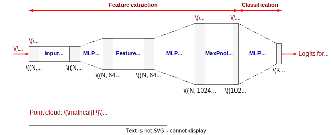
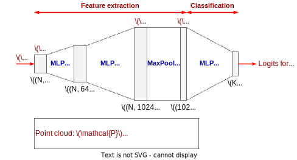
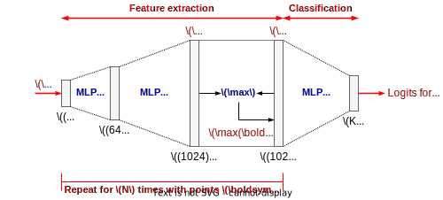
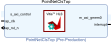
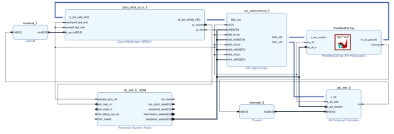

---
title: 点群処理のFPGA高速化
author: SternGerlach
---

<!--
 pandoc -s -f markdown -t html5 --mathjax --css style.css point-cloud-classification.md -o point-cloud-classification.html
-->

[ホームに戻る](./index.html)

# このページについて

このページは、[慶應理工アドベントカレンダー2022](https://adventar.org/calendars/7773)の22日目の記事です。
去年の記事は[こちら](./scan-matching-branch-and-bound.html)と[こちら](./scan-matching-branch-and-bound-impl.html)です。

早速余談ですが、1983年12月22日は、Yellow Magic Orchestra (YMO) が行った最後の国内ツアーの最終日で、開催場所は日本武道館でした。
今日は、その散開ツアーからちょうど39年目の記念すべき日です。
1984年2月22日発売の「アフター・サーヴィス」や、1992年11月21日発売の「コンプリート・サーヴィス」に音源が収録されているので、みなさん是非聴いてみてください。
また余談ですが、普段は(研究そっちのけで)CDを集めています。
70年代から80年代にかけてのアーティストが好きです。
最近は、専らオフコースを聴いています。
オフコースの旧規格盤のコレクションは[こちら](./off-course-ca35-series.html)にあります。
また、コレクションは[こちら](./cds.html)と[こちら](./toshiba-emi.html)にまとめてあります。
暇なときにご覧ください。

今年は、点群処理 (点群分類タスク) 向けニューラルネットのFPGA高速化を試してみます。
LeNetやResNetなど、画像処理向けニューラルネットのFPGA高速化も面白いのですが、既にたくさんの素晴らしい記事が出ているのでやめました。

## ニューラルネットの準備

点群の分類、セグメンテーション、レジストレーションなど、様々なタスクに対応した代表的なモデルとして、2017年にCVPRで発表されたPointNetが挙げられます。
PointNetは、MLPとMaxプーリング層からなる、シンプルかつ強力なモデルです。
分類タスク向けのPointNetの構造を、以下に示します。

[](point-cloud-classification-images/pointnet-layers.svg)

モデルは、点群からの特徴抽出と、特徴に基づく分類の、2つの部分に分けられます (図のFeature extractionとClassification)。

図の左端に示すように、$N$個の点を含む、3次元の点群$\mathcal{P} = \left\{ \boldsymbol{p}_1, \ldots, \boldsymbol{p}_N \right\} \in \mathbb{R}^{N \times 3}$が入力です。
MLPを用いて、各点$\boldsymbol{p}_i \in \mathbb{R}^3$に対して、1024次元のローカルな特徴$\boldsymbol{\psi}_i \in \mathbb{R}^{1024}$を計算します。
全ての点に対してローカルな特徴量$\boldsymbol{\Psi} = \left\{ \boldsymbol{\psi}_1, \ldots, \boldsymbol{\psi}_N \right\} \in \mathbb{R}^{N \times 1024}$を計算したら、それらをMaxプーリング層により集約して、点群全体を表すグローバルな特徴量$\boldsymbol{\phi} \in \mathbb{R}^{1024}$を得ます ($\boldsymbol{\phi} \gets \max(\boldsymbol{\psi}_1, \ldots, \boldsymbol{\psi}_N)$)。

分類用のネットワークは、この特徴量$\boldsymbol{\phi}$を入力として、各物体のクラスに対するロジット (スコア)を出力します。
物体のクラス数を$K$とすれば、出力は$K$次元のベクトルとなります。

図のInput TransformおよびFeature Transformは、点群の特徴に対してアフィン変換を施し、剛体変換に対して不変な特徴量を得るためのネットワークですが、実装が面倒なので取り除きます(**最適化その1: モデルの簡略化**)。
従って、今回FPGA上に実装するPointNetは、以下のようになります。

画像認識向けのモデルとは異なり、畳み込み層がありません。
また、MLPは、全結合層、ReLU活性化層、バッチ正規化層をまとめたものとします。

[](point-cloud-classification-images/pointnet-layers2.svg)

PyTorchによるモデルの定義は、次のようになります (`net/model.py`)。
ソースコード全体は[こちらのリポジトリ](https://github.com/sterngerlach/advent_2022_point_cloud_classification)に置かれているので、適宜ご参照ください。

```Python
class PointNetFeat(torch.nn.Module):
    def __init__(self):
        super().__init__()

        self.conv1 = torch.nn.Conv1d(3, 64, 1)
        self.conv2 = torch.nn.Conv1d(64, 64, 1)
        self.conv3 = torch.nn.Conv1d(64, 64, 1)
        self.conv4 = torch.nn.Conv1d(64, 128, 1)
        self.conv5 = torch.nn.Conv1d(128, 1024, 1)
        self.bn1 = torch.nn.BatchNorm1d(64)
        self.bn2 = torch.nn.BatchNorm1d(64)
        self.bn3 = torch.nn.BatchNorm1d(64)
        self.bn4 = torch.nn.BatchNorm1d(128)
        self.bn5 = torch.nn.BatchNorm1d(1024)

    def forward(self, x: torch.Tensor):
        # `x` is of size [B, N, 3]
        N = x.shape[1]
        # `x` is of size [B, 3, N]
        x = x.transpose(1, 2)

        # `x` is of size [B, 1024, N]
        x = F.relu(self.bn1(self.conv1(x)))
        x = F.relu(self.bn2(self.conv2(x)))
        x = F.relu(self.bn3(self.conv3(x)))
        x = F.relu(self.bn4(self.conv4(x)))
        x = F.relu(self.bn5(self.conv5(x)))

        # `x` is of size [B, 1024]
        x = torch.max(x, dim=2)[0]

        return x

class PointNetCls(torch.nn.Module):
    def __init__(self, num_classes: int):
        super().__init__()

        # Feature extraction
        self.feat = PointNetFeat()

        # Classification network
        self.fc1 = torch.nn.Linear(1024, 512)
        self.fc2 = torch.nn.Linear(512, 256)
        self.fc3 = torch.nn.Linear(256, num_classes)
        self.bn1 = torch.nn.BatchNorm1d(512)
        self.bn2 = torch.nn.BatchNorm1d(256)

    def forward(self, x):
        # `x` is of size [B, N, 3]
        # `x` is of size [B, 1024]
        x = self.feat(x)

        # `x` is of size [B, `num_classes`]
        x = F.relu(self.bn1(self.fc1(x)))
        x = F.relu(self.bn2(self.fc2(x)))
        x = self.fc3(x)

        return x
```

さて、このモデルをそのまま実装する場合、次のような問題があります。
特徴抽出部分 (図のFeature extraction)に注目します。
図中の灰色の四角に示すように、$N$個全ての点に対する中間結果や、ローカルな特徴量$\boldsymbol{\Psi}$を、どこかに保持しておく必要があります。
大容量のメモリを搭載したGPUであれば、これでも問題ありませんが、FPGA内部のオンチップメモリ (BlockRAM) は非常に容量が少ないので、全ての点に対する中間結果を保持しようとすると、オンチップメモリがあっという間に枯渇するでしょう。
言い換えると、搭載されているオンチップメモリの容量によって、点の個数$N$が制限されてしまいます。
これは避けたいものです。
オンチップメモリの代わりに、容量の大きなDRAM上に置くこともできますが、データへのアクセス時間は長くなります。
全ての層の中間結果をDRAMに置くと、データ転送のオーバーヘッドが増加して、性能に悪影響を及ぼします。
層の中間結果は、オンチップバッファに置きたいものです。

そこで、全ての点$\mathcal{P}$に対して、ローカルな特徴量$\boldsymbol{\Psi}$を一気に計算するのではなく、1つずつの点$\boldsymbol{p}$に対して順にローカルな特徴量$\boldsymbol{\psi}$を計算しましょう。
一気に計算するのと比べて計算効率は落ちますが、1つの点に対する中間結果やローカルな特徴量だけを保持すればよいので、オンチップバッファの消費を大きく削減できます。

以前は (PyTorchなどのフレームワークを使う場合は)、特徴抽出は次のように行われていました。

1. 全ての点$\mathcal{P}$に対して、ローカルな特徴量を$\boldsymbol{\Psi}$をまとめて計算する ($(N, 64)$や$(N, 1024)$のバッファが必要)。
2. Maxプーリング層により、ローカルな特徴量$\boldsymbol{\Psi}$を集約して、グローバルな特徴量$\boldsymbol{\phi}$を得る ($\boldsymbol{\phi} \gets \max(\boldsymbol{\psi}_1, \ldots, \boldsymbol{\psi}_N)$)。
3. グローバルな特徴量$\boldsymbol{\phi}$をMLPに入力し、各クラスに対するロジット($K$次元のベクトル)を得る。

これを、次のように変更します(**最適化その2: 計算順序の変更**)。

1. グローバルな特徴量$\boldsymbol{\phi}$を、$\boldsymbol{0}$で初期化する。
1. 各点$\boldsymbol{p}_i \ (i = 1, \ldots, N)$に対して、以下の処理を行う。
    1. MLPの順伝播により、ローカルな特徴量$\boldsymbol{\psi}_i$を得る ($(1, 64)$や$(1, 1024)$のバッファがあればよい)。
    2. $\boldsymbol{\phi}$と$\boldsymbol{\psi}_i$との、要素ごとの$\max$をとることで、$\boldsymbol{\phi}$を更新する ($\boldsymbol{\phi} \gets \max(\boldsymbol{\phi}, \boldsymbol{\psi}_i)$)。
3. グローバルな特徴量$\boldsymbol{\phi}$をMLPに入力し、各クラスに対するロジット($K$次元のベクトル)を得る。

全ての点に対するローカルな特徴量$\boldsymbol{\Psi}$を集約するのではなく、各点$\boldsymbol{p}_i$に対するローカルな特徴量$\boldsymbol{\psi}_i$を使って、グローバルな特徴量$\boldsymbol{\phi}$を逐次的に更新していきます。
これは近似ではないので、全く同じ結果となります。

最終的に、今回FPGA上に実装するPointNetは、以下のようになります。

[](point-cloud-classification-images/pointnet-layers3.svg)

## 高位合成による実装

今回は、高位合成 (HLS: High-Level Synthesis)を用いて、上記に示すPointNetの専用回路 (**IPコア**) を記述します。
ニューラルネットの推論を実現する別の手段として、行列演算や畳み込み演算用の、巨大かつ汎用的な演算回路をFPGA上に実装し、それに繰り返しデータを与えることも考えられます。

高位合成は、C/C++による動作レベル (Behavior Level) の回路記述を、Verilog HDLやSystemVerilogによるレジスタ転送レベル (RTL: Register Transfer Level) の回路記述に変換するための技術です。
Verilog HDLを直接記述するのに比べて、遥かに楽で、ストレスが少なく、生産性が向上します。
但し、C/C++で記述するとはいっても、通常のソフトウェア開発とは全く様相が異なります。
`malloc()`や`new`はもちろんのこと、これらに依存する`std::vector`などの便利なデータ型も使えないので、固定長の配列に置き換えてどうにかします。
ニューラルネットはサイズが固定で、一般には決まった動作をするので、FPGA上に実装しやすいです。

高位合成用のツールとして、Xilinx社のVitis HLS 2022.1を利用します。
また実装対象のFPGAとして、Xilinx ZCU104 Evaluation Board (XCZU7EV-2FFVC1156)を使います。
Xilinx ZCU104には、FPGAのほかに、クアッドコア ARM Cortex-A53 CPU (1.2GHz)と2GBのDRAMも搭載されており、Linuxが動作します。

早速、PointNetのIPコアを示します (適宜GitHubのリポジトリをご覧ください)。
高位合成ツールのバックエンドがGCC 6.2ですので、C++14やC++17の一部機能が利用できます。
但し、ツールのバグを踏むかもしれないので、あまり凝った機能は使わないようにしています。

```C++
void PointNetClsTop(const int op_mode,
                    const float* point_cloud,
                    const int num_points,
                    float* out_logits,
                    const float* feat_params1,
                    const float* feat_params2,
                    const float* feat_params3,
                    const float* feat_params4,
                    const float* feat_params5,
                    const float* cls_params1,
                    const float* cls_params2,
                    const float* cls_params3)
{
#pragma HLS INTERFACE m_axi port=point_cloud offset=slave bundle=gmem0
#pragma HLS INTERFACE m_axi port=out_logits offset=slave bundle=gmem0
#pragma HLS INTERFACE m_axi port=feat_params1 offset=slave bundle=gmem0
#pragma HLS INTERFACE m_axi port=feat_params2 offset=slave bundle=gmem0
#pragma HLS INTERFACE m_axi port=feat_params3 offset=slave bundle=gmem0
#pragma HLS INTERFACE m_axi port=feat_params4 offset=slave bundle=gmem0
#pragma HLS INTERFACE m_axi port=feat_params5 offset=slave bundle=gmem0
#pragma HLS INTERFACE m_axi port=cls_params1 offset=slave bundle=gmem0
#pragma HLS INTERFACE m_axi port=cls_params2 offset=slave bundle=gmem0
#pragma HLS INTERFACE m_axi port=cls_params3 offset=slave bundle=gmem0

#pragma HLS INTERFACE s_axilite port=op_mode bundle=control
#pragma HLS INTERFACE s_axilite port=point_cloud bundle=control
#pragma HLS INTERFACE s_axilite port=num_points bundle=control
#pragma HLS INTERFACE s_axilite port=out_logits bundle=control
#pragma HLS INTERFACE s_axilite port=feat_params1 bundle=control
#pragma HLS INTERFACE s_axilite port=feat_params2 bundle=control
#pragma HLS INTERFACE s_axilite port=feat_params3 bundle=control
#pragma HLS INTERFACE s_axilite port=feat_params4 bundle=control
#pragma HLS INTERFACE s_axilite port=feat_params5 bundle=control
#pragma HLS INTERFACE s_axilite port=cls_params1 bundle=control
#pragma HLS INTERFACE s_axilite port=cls_params2 bundle=control
#pragma HLS INTERFACE s_axilite port=cls_params3 bundle=control
#pragma HLS INTERFACE s_axilite port=return bundle=control

  // Parameters for feature extraction
  LinearParams<param_t, kFeatDims0, kFeatDims1> feat_conv1;
  LinearParams<param_t, kFeatDims1, kFeatDims2> feat_conv2;
  LinearParams<param_t, kFeatDims2, kFeatDims3> feat_conv3;
  LinearParams<param_t, kFeatDims3, kFeatDims4> feat_conv4;
  LinearParams<param_t, kFeatDims4, kFeatDims5> feat_conv5;
  BatchNorm1dParams<param_t, kFeatDims1> feat_bn1;
  BatchNorm1dParams<param_t, kFeatDims2> feat_bn2;
  BatchNorm1dParams<param_t, kFeatDims3> feat_bn3;
  BatchNorm1dParams<param_t, kFeatDims4> feat_bn4;
  BatchNorm1dParams<param_t, kFeatDims5> feat_bn5;

  // Parameters for classification network
  // LinearParams<param_t, kClsDims0, kClsDims1> cls_fc1;
  // LinearParams<param_t, kClsDims1, kClsDims2> cls_fc2;
  LinearParams<param_t, kClsDims2, kClsDims3> cls_fc3;
  BatchNorm1dParams<param_t, kClsDims1> cls_bn1;
  BatchNorm1dParams<param_t, kClsDims2> cls_bn2;

  // Extracted feature
  value_t feature[kFeatDims5];

  if (op_mode == kModeInitWeights) {
    // Initialize the PointNet feature extraction network
    InitializeFeatNaive<param_t>(
      &feat_conv1, &feat_conv2, &feat_conv3, &feat_conv4, &feat_conv5,
      &feat_bn1, &feat_bn2, &feat_bn3, &feat_bn4, &feat_bn5,
      feat_params1, feat_params2, feat_params3, feat_params4, feat_params5);
    // Initialize the classification network
    InitializeClsNaive<param_t>(
      &cls_fc3, &cls_bn1, &cls_bn2,
      cls_params1, cls_params2, cls_params3);
  } else if (op_mode == kModeInference) {
    // Run the PointNet feature extraction
    InferenceFeatNaive<value_t, param_t, 1024>(
      point_cloud, num_points, feature,
      &feat_conv1, &feat_conv2, &feat_conv3, &feat_conv4, &feat_conv5,
      &feat_bn1, &feat_bn2, &feat_bn3, &feat_bn4, &feat_bn5);

    // Run the classification
    InferenceClsNaive<value_t, param_t>(
      feature, out_logits,
      &cls_fc3, &cls_bn1, &cls_bn2,
      cls_params1, cls_params2, cls_params3);
  }
}
```

上記を高位合成すると、次のようなIPコアが作られます。

[](point-cloud-classification-images/pointnet-ip-core.svg)

このIPコアを別のIPコアと組み合わせることで (後述)、次のようなブロックデザインができます。

[](point-cloud-classification-images/board-design.svg)

このブロックデザインに対して、論理合成および配置配線することで、回路情報を表すビットストリーム (Bitstream) を生成します。
ビットストリームをFPGAにロードすることで、PointNetの専用回路が使えるようになります。

### 入出力ポート

`PointNetClsTop`関数が、IPコアを表す最上位の関数です。
関数の引数は、IPコアの入出力ポートとなり、別のIPコアに接続されます (上のブロックデザインをご覧ください)。
HLSでは、関数そのものが回路 (Verilog HDLにおけるモジュール) になります。
関数の再帰呼び出しはできません。

特徴抽出用のネットワークには5つのMLP、またクラス分類用のネットワークには3つのMLPが含まれます。
これらのパラメータは、ソフトウェア側から操作できるように、DRAM上のバッファに置かれます。
また、点群$\mathcal{P}$や、モデルの出力(ロジット)も同様に、DRAMバッファに置かれます。

`feat_params1`から`feat_params5`までと、`cls_params1`から`cls_params3`までの8つのポートは、DRAMバッファ上のパラメータを、IPコア側から読み取るために使います。
`point_cloud`は点群の読み出し、`out_logits`はロジットの書き込みのために使います。
`op_mode`は回路の動作モード、`num_points`は点の個数$N$を設定するための制御レジスタです。

`#pragma HLS`から始まる行は、高位合成ツールに対して、C/C++からRTLに変換する際のヒントを与えます (必ずしも守ってくれるとは限りません)。
パイプライン化、データフロー最適化などはC/C++では記述できませんが、このような**HLSプラグマ**を適切な場所に置くことで、高位合成ツールが自動的にこれらの最適化を施してくれます。

`#pragma HLS INLINE off`とすると、その関数がインライン展開されなくなります (必ず、1つのモジュールとして作られる)。
大きな関数であれば、自動的にインライン展開されることはありませんが、念のため付与しています。
以下のような状況では、関数`B`をインライン展開しない方がいいと思います。
同時に使われないのにも関わらず、関数`A`の内部に`B`のコピーが3つ作られて、リソースの無駄遣いとなります。
関数`B`のインライン化を抑制して、`B`を1つだけ作り、それを使い回した方がいいでしょう。
```C++
void B(const float x_in[10], float y_out[10])
{
#pragma HLS INLINE

  // 何らかの処理
}

void A(const float x_in[10], float y_out[10])
{
  float x0[10];
  float x1[10];
  B(x_in, x0);
  B(x0, x1);
  B(x1, y_out);
}
```

`#pragma HLS INTERFACE m_axi`と、`#pragma HLS INTERFACE s_axilite`の記述が目立ちますが、入出力ポート (例えば`feat_params1`) に対してこの2つのHLSプラグマを記述すると、IPコア側からDRAMバッファを読み書きできるようになります。
読み書きの際には、AXIとよばれるプロトコルを使用しますが、`#pragma HLS INTERFACE m_axi`によってそれを指定できます (IPコア側がマスターになります)。

ソフトウェア側からは、各ポートに対して、バッファの物理アドレスを割り当てて、ポートとバッファを紐づけます。
各ポートには、物理アドレスを設定するための制御レジスタを作成する必要があり、`#pragma HLS INTERFACE s_axilite`によってそれを実現できます (IPコア側からみるとスレーブです)。
`op_mode`、`num_points`に対してもレジスタを作成します。
`port=return`としている行は、IPコア用の制御レジスタを作成し、CPU側からIPコアの動作を開始したり、状態 (アイドル状態なのか動作中か) を読み取ったりするために必要です。
これらのレジスタは、ソフトウェア側から、メモリマップトI/OおよびAXI-Liteプロトコルによって読み書きされます。

各入出力ポートからは、PyTorchのモデルで定義した、各層のパラメータが読み出されます (一次元の配列として、全てのパラメータが連結されます)。

- `feat_params1`: `PointNetFeat::conv1` + `PointNetFeat::bn1`のパラメータ
- `feat_params2`: `PointNetFeat::conv2` + `PointNetFeat::bn2`のパラメータ
- `feat_params3`: `PointNetFeat::conv3` + `PointNetFeat::bn3`のパラメータ
- `feat_params4`: `PointNetFeat::conv4` + `PointNetFeat::bn4`のパラメータ
- `feat_params5`: `PointNetFeat::conv5` + `PointNetFeat::bn5`のパラメータ
- `cls_params1`: `PointNetCls::fc1` + `PointNetCls::bn1`のパラメータ
- `cls_params2`: `PointNetCls::fc2` + `PointNetCls::bn2`のパラメータ
- `cls_params3`: `PointNetCls::fc3`のパラメータ

```C++
void PointNetClsTop(const int op_mode,
                    const float* point_cloud,
                    const int num_points,
                    float* out_logits,
                    const float* feat_params1,
                    const float* feat_params2,
                    const float* feat_params3,
                    const float* feat_params4,
                    const float* feat_params5,
                    const float* cls_params1,
                    const float* cls_params2,
                    const float* cls_params3)
{
  // ...
}
```

### 各層のパラメータと処理

`torch.nn.Conv1d`および`torch.nn.Linear`のパラメータとしては、重みとバイアスが挙げられます。
`Conv1d`とありますが、カーネルサイズは1なので、`Linear`と動作が同じになります。
以後、`Conv1d`と`Linear`を同一視します。
入力と出力の次元数を$\mathrm{InDims}$、$\mathrm{OutDims}$とすると、重みとバイアスのサイズは$(\mathrm{OutDims}, \mathrm{InDims})$、$(\mathrm{OutDims})$となります。
入力$\boldsymbol{x} \in \mathbb{R}^{\mathrm{InDims}}$、重み$\boldsymbol{W} \in \mathbb{R}^{\mathrm{OutDims} \times \mathrm{InDims}}$、バイアス$\boldsymbol{b} \in \mathbb{R}^{\mathrm{OutDims}}$があるとき、出力$\boldsymbol{y} \in \mathbb{R}^{\mathrm{OutDims}}$は次のように計算されます。
$$
  \boldsymbol{y} = \boldsymbol{W} \boldsymbol{x} + \boldsymbol{b}
$$

`torch.nn.BatchNorm1d`のパラメータとしては、平均、標準偏差、重み、バイアスの4つが挙げられます。
入出力の次元を$\mathrm{Dims}$とすると、これら4つのパラメータのサイズは$(\mathrm{Dims})$です。
平均、標準偏差、重み、バイアス$\boldsymbol{\mu}, \boldsymbol{\sigma}, \boldsymbol{w}, \boldsymbol{b} \in \mathbb{R}^{\mathrm{Dims}}$があるとき、入力$\boldsymbol{x} \in \mathbb{R}^{\mathrm{Dims}}$に対して出力$\boldsymbol{y} \in \mathbb{R}^{\mathrm{Dims}}$は次のように計算されます。
$$
  y_i = \frac{x_i - \mu_i}{\sqrt{\sigma_i^2 + \varepsilon}} \cdot w_i + b_i \quad (i = 1, \ldots, \mathrm{Dims})
$$
$\varepsilon$は、ゼロ除算を防ぐための小さな正の値です。
$x_i$は、$\boldsymbol{x}$の第$i$要素です (他も同様)。
上記をみると、$w_i / \sqrt{\sigma_i^2 + \varepsilon}$の部分を先に計算できることが分かります。
$\boldsymbol{w}$と$\boldsymbol{\sigma}$の両方を使う場合と比べて、除算および平方根の計算を省略できます。
また、オンチップバッファの使用量を削減できます。
細かい話にみえますが、リソース制約の大きなFPGA上に実装する場合は重要です。
バッチ正規化の計算は以下のようにします。
$$
  y_i = \left( x_i - \mu_i \right) \cdot s_i + b_i \quad (i = 1, \ldots, \mathrm{Dims})
$$
上記の$s_i$を、ここでは**スケール**と呼ぶことにします。
パラメータは、平均$\boldsymbol{\mu}$、バイアス$\boldsymbol{b}$、スケール$\boldsymbol{s} \in \mathbb{R}^{\mathrm{Dims}}$の3つになります。
$\boldsymbol{s}$の計算は、モデルの初期化時にソフトウェア上で行うことにします。

バッチ正規化の後にReLU活性化が計算されます。
各層を別々に実装するよりも、まとめてしまった方が効率がよいので、バッチ正規化とReLU活性化を次のようにまとめます (**最適化その3: 計算の簡略化**)。
$$
  y_i = \max \left( 0, \left( x_i - \mu_i \right) \cdot s_i + b_i \right) \quad (i = 1, \ldots, \mathrm{Dims})
$$

最後にMaxプーリング層ですが、先述の通り、各点に対するローカル特徴量$\boldsymbol{\psi}_i \in \mathbb{R}^{1024}$と、現在のグローバル特徴量$\boldsymbol{\phi} \in \mathbb{R}^{1024}$との、要素ごとの$\max$に置き換えました。
Maxプーリング層の計算は次のようになります。
$$
  \phi_i = \max \left( \phi_i, \psi_i \right) \quad (i = 1, \ldots, 1024)
$$

さて、ソースコードの`LinearParams<T, InDims_, OutDims_>`構造体と、`BatchNorm1dParams<T, Dims_>`構造体は、全結合層 (`Conv1d`および`Linear`) と、バッチ正規化層 (`BatchNorm1d`) のパラメータをそれぞれまとめたものです。

```C++
// Parameters for fully-connected layers
template <typename T, int InDims_, int OutDims_>
struct LinearParams
{
  enum
  {
    InDims = InDims_,
    OutDims = OutDims_,
  };

  T weight[OutDims][InDims];
  T bias[OutDims];
};

// Parameters for 1D batch normalization layers
template <typename T, int Dims_>
struct BatchNorm1dParams
{
  enum
  {
    Dims = Dims_,
  };

  // `scale` is obtained by multiplying weights and reciprocal of the
  // square root of the standard deviation (to reduce the computational cost)
  T scale[Dims];
  T bias[Dims];
  T mean[Dims];
};
```

`PointNetClsTop`関数内では、PyTorchで定義されたモデルの各層に対応して、以下のようなパラメータが宣言されます。

- `feat_conv1`: `PointNetFeat::conv1`の重み、バイアス
- `feat_conv2`: `PointNetFeat::conv2`の重み、バイアス
- `feat_conv3`: `PointNetFeat::conv3`の重み、バイアス
- `feat_conv4`: `PointNetFeat::conv4`の重み、バイアス
- `feat_conv5`: `PointNetFeat::conv5`の重み、バイアス
- `feat_bn1`: `PointNetFeat::bn1`の平均、バイアス、スケール
- `feat_bn2`: `PointNetFeat::bn2`の平均、バイアス、スケール
- `feat_bn3`: `PointNetFeat::bn3`の平均、バイアス、スケール
- `feat_bn4`: `PointNetFeat::bn4`の平均、バイアス、スケール
- `feat_bn5`: `PointNetFeat::bn5`の平均、バイアス、スケール
- `cls_fc3`: `PointNetCls::fc3`の重み、バイアス
- `cls_bn1`: `PointNetCls::bn1`の平均、バイアス、スケール
- `cls_bn2`: `PointNetCls::bn2`の平均、バイアス、スケール

特徴抽出ネットワークの全ての層のパラメータは、推論を開始する前に予め、オンチップメモリ上に置いておきます。
一方、分類ネットワークの全結合層2つ (`PointNetCls::fc1`、`PointNetCls::fc2`) のパラメータは、オンチップメモリ上には置かないようにします。
パラメータサイズが大きく、オンチップメモリが不足するためです。
これらの層については、推論時にDRAMバッファから読み出します。
言い換えると、パラメータの一部をDRAMバッファから取り出して、出力の一部を計算することを繰り返します。
一部のパラメータを保持するために、小さなオンチップバッファを用意すればよくなります。

特徴抽出ネットワークについては、$N$個全ての点に対して特徴抽出を行うために、$N$回の順伝播が起こります。
推論時間のなかで占める割合が大きいので、1回の順伝播に要する計算時間をうまく短縮できれば、全体の推論時間の大幅な短縮につながります (**アムダールの法則**)。
一方、分類ネットワークの順伝播は1度だけで、推論時間のなかではそれほど重要ではありません。
パラメータをオンチップメモリに事前に格納するのと比べて、推論時にDRAMバッファから読み出すと、層の計算時間は伸びてしまいますが、推論時間に与える影響はそれほど大きくありません。

### データ型

Vitis HLSでは、任意精度の**固定**小数点数型`ap_fixed`が用意されています。
単精度浮動小数点数`float`や、半精度浮動小数点数`half`も利用できます。
ここではリソース消費を抑えるために、固定小数点数を使います。

デフォルトのオーバーフローモード (`ap_o_mode::AP_WRAP`) では、値がオーバーフローしたときに折り返します。
これだと、最大値から急に最小値になったりして危なっかしいので、最大値あるいは最小値に留まり続けるように、飽和モード (`ap_o_mode::AP_SAT`) に変更しています。
飽和モードを使う固定小数点数型を、`ap_fixed_sat`として定義しました。

ニューラルネットの入出力とパラメータとでビット幅を変えるために、入出力用とパラメータ用に別々の型を用意しました (`param_t`および`value_t`)。
パラメータの値域に合わせて、ビット幅を削減できるかもしれません。
ビット幅の削減や量子化、小数点型のフォーマットなどは、それ自体が立派な研究分野となっています。

```C++
// Value types
template <int _AP_W, int _AP_I>
using ap_fixed_sat = ap_fixed<
  _AP_W, _AP_I, ap_q_mode::AP_TRN, ap_o_mode::AP_SAT, 0>;

// Data type for values (layer inputs, outputs, and intermediate results)
using value_t = ap_fixed_sat<kValueBitWidth, kValueIntWidth>;
// Data type for network parameters
using param_t = ap_fixed_sat<kParamBitWidth, kParamIntWidth>;
```

### 動作モード

さて、ここで示すIPコアには、2つの**動作モード** (Operation mode) が用意されています。

- 重み初期化モード (`kModeInitWeights`): 重みをDRAMバッファから読み取って、オンチップバッファに格納する。
- 推論モード (`kModeInference`): 入力点群から、各クラスのロジットを計算する。

これらを順に説明します。

### 重み初期化モード

特徴抽出ネットワークの全パラメータと、分類ネットワークのパラメータの一部を、DRAMバッファから読み取って、オンチップバッファに格納します。
以下に示す、`InitializeFeatNaive`および`InitializeClsNaive`関数を利用します。
それぞれ、特徴抽出ネットワークと、分類ネットワークのための関数です。

```C++
// Naive implementation of the parameter initialization
// `T` is the type for parameters
template <typename T>
void InitializeFeatNaive(LinearParams<T, kFeatDims0, kFeatDims1>* conv1,
                         LinearParams<T, kFeatDims1, kFeatDims2>* conv2,
                         LinearParams<T, kFeatDims2, kFeatDims3>* conv3,
                         LinearParams<T, kFeatDims3, kFeatDims4>* conv4,
                         LinearParams<T, kFeatDims4, kFeatDims5>* conv5,
                         BatchNorm1dParams<T, kFeatDims1>* bn1,
                         BatchNorm1dParams<T, kFeatDims2>* bn2,
                         BatchNorm1dParams<T, kFeatDims3>* bn3,
                         BatchNorm1dParams<T, kFeatDims4>* bn4,
                         BatchNorm1dParams<T, kFeatDims5>* bn5,
                         const float* params1,
                         const float* params2,
                         const float* params3,
                         const float* params4,
                         const float* params5)
{
#pragma HLS INLINE off

  ReadBlockParamsNaive<T, kFeatDims0, kFeatDims1>(conv1, bn1, params1);
  ReadBlockParamsNaive<T, kFeatDims1, kFeatDims2>(conv2, bn2, params2);
  ReadBlockParamsNaive<T, kFeatDims2, kFeatDims3>(conv3, bn3, params3);
  ReadBlockParamsNaive<T, kFeatDims3, kFeatDims4>(conv4, bn4, params4);
  ReadBlockParamsNaive<T, kFeatDims4, kFeatDims5>(conv5, bn5, params5);
}

// Naive implementation of the parameter initialization
// `T` is the type for parameters
template <typename T>
void InitializeClsNaive(LinearParams<T, kClsDims2, kClsDims3>* fc3,
                        BatchNorm1dParams<T, kClsDims1>* bn1,
                        BatchNorm1dParams<T, kClsDims2>* bn2,
                        const float* params1,
                        const float* params2,
                        const float* params3)
{
#pragma HLS INLINE off

  ReadBatchNorm1dParamsNaive<T, kClsDims1>(
    bn1, params1, kClsDims0 * kClsDims1 + kClsDims1);
  ReadBatchNorm1dParamsNaive<T, kClsDims2>(
    bn2, params2, kClsDims1 * kClsDims2 + kClsDims2);
  ReadLinearParamsNaive<T, kClsDims2, kClsDims3>(
    fc3, params3, 0);
}
```

これらの関数のなかでは、`ReadBlockParamsNaive`、`ReadLinearParamsNaive`、そして`ReadBatchNorm1dParamsNaive`の3つの関数を呼び出しています。
各関数は次のような動作です (詳細はソースコードをご参照ください)。
DRAMバッファ上には`float`型で置かれていますが、これを固定小数点数型に直す処理も含まれます。

- `ReadLinearParamsNaive<T, InDims, OutDims>`: DRAMバッファから、全結合層 (`Conv1d`および`Linear`) の重みとバイアスを読み取る。
重みのサイズは`(OutDims, InDims)`、バイアスのサイズは`(OutDims)`である。
2つのパラメータは、1次元の配列として連結されているとする (配列のサイズは`OutDims * InDims + OutDims`)。
- `ReadBatchNorm1dParamsNaive<T, Dims>`: DRAMバッファから、バッチ正規化層 (`BatchNorm1d`) のスケール、バイアス、平均を読み取る。
パラメータのサイズは`(Dims)`である。
3つのパラメータは、1次元の配列として連結されているとする (配列のサイズは`3 * Dims`)。
- `ReadBlockParamsNaive<T, InDims, OutDims`: DRAMバッファから、全結合層およびバッチ正規化層のパラメータ5つを読み取る。
5つのパラメータは、1次元の配列として連結されているとする (配列のサイズは`OutDims * InDims + 4 * OutDims`)。

### 推論モード

入力点群から、各クラスのロジットを計算します。
以下に示す、`InferenceFeatNaive`および`InferenceClsNaive`関数を利用します。
それぞれ、特徴抽出ネットワークと、分類ネットワークの処理です。

```C++
// Naive implementation of the PointNet feature extraction
// `T` is the type for layer input, output, and intermediate results
// `U` is the type for parameters
// `N` is the expected number of input points (e.g., 1024)
template <typename T, typename U, int N>
void InferenceFeatNaive(const float* point_cloud,
                        const int num_points,
                        T feature[kFeatDims5],
                        const LinearParams<U, kFeatDims0, kFeatDims1>* conv1,
                        const LinearParams<U, kFeatDims1, kFeatDims2>* conv2,
                        const LinearParams<U, kFeatDims2, kFeatDims3>* conv3,
                        const LinearParams<U, kFeatDims3, kFeatDims4>* conv4,
                        const LinearParams<U, kFeatDims4, kFeatDims5>* conv5,
                        const BatchNorm1dParams<U, kFeatDims1>* bn1,
                        const BatchNorm1dParams<U, kFeatDims2>* bn2,
                        const BatchNorm1dParams<U, kFeatDims3>* bn3,
                        const BatchNorm1dParams<U, kFeatDims4>* bn4,
                        const BatchNorm1dParams<U, kFeatDims5>* bn5)
{
#pragma HLS INLINE off

  // Zero-initialize the output feature
  VectorNdSetZero<T, kFeatDims5>(feature);

  // Compute the feature
  for (int i = 0; i < num_points; ++i) {
#pragma HLS LOOP_TRIPCOUNT min=N max=N avg=N
#pragma HLS LOOP_FLATTEN off

    // Input, output, and intermediate results
    T x0[kFeatDims0];
    T x1[kFeatDims1];
    T x2[kFeatDims1];
    T x3[kFeatDims2];
    T x4[kFeatDims2];
    T x5[kFeatDims3];
    T x6[kFeatDims3];
    T x7[kFeatDims4];
    T x8[kFeatDims4];
    T x9[kFeatDims5];
    T x10[kFeatDims5];

    // Read a point from a DDR memory
    ReadPointNaive<T>(point_cloud, i, x0);

    // Compute a point feature
    LinearNaive<T, U, kFeatDims0, kFeatDims1, false>(
      x0, x1, conv1->weight, conv1->bias);
    BatchNorm1dReLUNaive<T, U, kFeatDims1>(
      x1, x2, bn1->scale, bn1->bias, bn1->mean);
    LinearNaive<T, U, kFeatDims1, kFeatDims2, false>(
      x2, x3, conv2->weight, conv2->bias);
    BatchNorm1dReLUNaive<T, U, kFeatDims2>(
      x3, x4, bn2->scale, bn2->bias, bn2->mean);
    LinearNaive<T, U, kFeatDims2, kFeatDims3, false>(
      x4, x5, conv3->weight, conv3->bias);
    BatchNorm1dReLUNaive<T, U, kFeatDims3>(
      x5, x6, bn3->scale, bn3->bias, bn3->mean);
    LinearNaive<T, U, kFeatDims3, kFeatDims4, false>(
      x6, x7, conv4->weight, conv4->bias);
    BatchNorm1dReLUNaive<T, U, kFeatDims4>(
      x7, x8, bn4->scale, bn4->bias, bn4->mean);
    LinearNaive<T, U, kFeatDims4, kFeatDims5, false>(
      x8, x9, conv5->weight, conv5->bias);
    BatchNorm1dReLUNaive<T, U, kFeatDims5>(
      x9, x10, bn5->scale, bn5->bias, bn5->mean);

    // Update the output feature
    MaxPool1dNaive<T, kFeatDims5>(x10, feature);
  }
}

// Naive implementation of the classification network
// `T` is the type for layer input, output, and intermediate results
// `U` is the type for parameters
template <typename T, typename U>
void InferenceClsNaive(const T feature[kFeatDims5],
                       float* out_logits,
                       const LinearParams<U, kClsDims2, kClsDims3>* fc3,
                       const BatchNorm1dParams<T, kClsDims1>* bn1,
                       const BatchNorm1dParams<T, kClsDims2>* bn2,
                       const float* params1,
                       const float* params2,
                       const float* params3)
{
#pragma HLS INLINE off

  static_assert(kFeatDims5 == kClsDims0,
                "Feature dimension should be equal to the input dimension");

  // Input, output, and intermediate results
  T x0[kClsDims1];
  T x1[kClsDims1];
  T x2[kClsDims2];
  T x3[kClsDims2];
  T x4[kClsDims3];

  // Compute logits
  LinearNaiveDDR<T, U, kClsDims0, kClsDims1, false>(
    feature, x0, params1, 0);
  BatchNorm1dReLUNaive<T, U, kClsDims1>(
    x0, x1, bn1->scale, bn1->bias, bn1->mean);
  LinearNaiveDDR<T, U, kClsDims1, kClsDims2, false>(
    x1, x2, params2, 0);
  BatchNorm1dReLUNaive<T, U, kClsDims2>(
    x2, x3, bn2->scale, bn2->bias, bn2->mean);
  LinearNaive<T, U, kClsDims2, kClsDims3, false>(
    x3, x4, fc3->weight, fc3->bias);

  // Write the result
  WriteTensor1dNaive<T, kClsDims3>(out_logits, x4, 0);
}
```

`InferenceFeatNaive`関数では、DRAMに置かれた点群データ (`point_cloud`) から、1つずつ点を読み取ります。
各点 (`x0`) に対してローカルな特徴量 (`x10`) を計算し、現在のグローバル特徴量 (`feature`) を更新する処理を、点の個数 (`num_points`) だけ繰り返します。
`InferenceClsNaive`関数は、点群全体を表すグローバル特徴量 (`feature`) を受け取って、各クラスに対するロジット (`x4`) を計算し、それをDRAMバッファ (`out_logits`) に書き戻します。

`ReadPointNaive`関数は、$i$番目の点$\boldsymbol{p}_i$を、DRAMバッファから読み取るものです。
`LinearNaive`、`BatchNorm1dReLUNaive`、`MaxPool1dNaive`関数は、名前の通り、全結合層 (`Conv1d`)、バッチ正規化層とReLU活性化、Maxプーリング層に対応します (先程の計算式を参照)。
オンチップバッファからパラメータを読み出して、層の出力を計算します。
`LinearNaiveDDR`関数も全結合層の関数ですが、DRAMバッファからパラメータを少しずつ取り出しつつ、出力を計算します。
これらの関数を以下に示します。
HLSプラグマを除けば、ソフトウェア実装と大体同じであることが分かります。
行数は多いですが、処理内容は単純です。

```C++
// Naive implementation of the fully-connected layer
// `T` is the type for values
// `TParam` is the type for weight and bias
// `InDims` is the number of input dimensions
// `OutDims` is the number of output dimensions
// `ApplyReLU` is the flag to apply ReLU activation
template <typename T, typename TParam,
          int InDims, int OutDims, bool ApplyReLU>
void LinearNaive(const T x[InDims],
                 T y[OutDims],
                 const TParam weight[OutDims][InDims],
                 const TParam bias[OutDims])
{
#pragma HLS INLINE off

  for (int i = 0; i < OutDims; ++i) {
#pragma HLS PIPELINE off
    T val = bias[i];

    for (int j = 0; j < InDims; ++j) {
#pragma HLS PIPELINE
      val += x[j] * weight[i][j];
    }

    if (ApplyReLU)
      y[i] = val > T(0) ? val : T(0);
    else
      y[i] = val;
  }
}

// Naive implementation of the fully-connected layer
// Weight and bias parameters are stored on the DDR memory
template <typename T, typename TParam,
          int InDims, int OutDims, bool ApplyReLU>
void LinearNaiveDDR(const T x[InDims],
                    T y[OutDims],
                    const float* params,
                    const int offset)
{
  // `params` contains weight parameters of size (`OutDims`, `InDims`) and
  // bias parameters of size (`OutDims`) in a contiguous buffer

#pragma HLS INLINE off

  constexpr const int OffsetToBias = OutDims * InDims;

  TParam bias[OutDims];

  // Copy the bias parameters in advance
  for (int i = 0; i < OutDims; ++i) {
#pragma HLS PIPELINE II=1
    bias[i] = TParam(params[offset + OffsetToBias + i]);
  }

  for (int i = 0; i < OutDims; ++i) {
#pragma HLS PIPELINE off
    T val = bias[i];

    TParam weight[InDims];

    for (int j = 0; j < InDims; ++j) {
#pragma HLS PIPELINE II=1
      weight[j] = TParam(params[offset + i * InDims + j]);
    }

    for (int j = 0; j < InDims; ++j) {
#pragma HLS PIPELINE
      val += x[j] * weight[j];
    }

    if (ApplyReLU)
      y[i] = val > T(0) ? val : T(0);
    else
      y[i] = val;
  }
}

// Naive implementation of the 1D batch normalization and ReLU activation
// `T` is the type for values
// `TParam` is the type for parameters
// `Dims` is the number of input and output dimensions
template <typename T, typename TParam, int Dims>
void BatchNorm1dReLUNaive(const T x[Dims],
                          T y[Dims],
                          const TParam scale[Dims],
                          const TParam bias[Dims],
                          const TParam mean[Dims])
{
#pragma HLS INLINE off

  for (int i = 0; i < Dims; ++i) {
#pragma HLS PIPELINE
    // Batch normalization with the learned parameters
    T val = (x[i] - mean[i]) * scale[i] + bias[i];
    // ReLU activation
    y[i] = val > T(0) ? val : T(0);
  }
}

// Naive implementation of the 1D max-pooling layer
// `T` is the type for values
// `Dims` is the number of input and output dimensions
// `y` must be properly initialized
template <typename T, int Dims>
void MaxPool1dNaive(const T x[Dims], T y[Dims])
{
  // `x` is of size (1, `Dims`)
  // `y` is of size (1, `Dims`)

#pragma HLS INLINE off

  for (int i = 0; i < Dims; ++i) {
#pragma HLS PIPELINE
    y[i] = x[i] > y[i] ? x[i] : y[i];
  }
}
```

`LinearNaiveDDR`関数では、全結合層のバイアス項 `bias`と、出力1要素分の計算に必要な重み `weight`だけをオンチップメモリ上に保持します。
入出力の次元を$\mathrm{InDims}, \mathrm{OutDims}$とすれば、`bias`のサイズは$\mathrm{OutDims}$、`weight`のサイズは$\mathrm{InDims}$となります。

上記の関数のループには`#pragma HLS PIPELINE`が付加されており、ループ内部の処理が自動的にパイプライン化されます (**最適化その4: ループのパイプライン化**)。
`#pragma HLS PIPELINE off`とすると、このパイプライン化が抑制されます。
パイプライン化による効果を、以下の図に示します。

[](point-cloud-classification-images/pipelined-execution.svg)

ループをパイプライン化しない場合は、ループの各イテレーションを順に実行します (図の上部)。
一方、パイプライン化では、ループ内部の処理を分割 (図の場合は4分割) し、それぞれの処理を時間的にオーバーラップさせます (図の下部)。
複数のイテレーションを同時に実行するので、ループの実行時間を短縮できます。
ループの実行時間は、最も時間の掛かる処理 (図の場合は処理3) によって決まります。
イテレーションの処理を、なるべく均等に分割することで、パイプライン化の効果が増します。
上記のソースコードのように、最内ループにパイプライン化を適用すると、処理時間を大きく削減できます。
2重ループのうち外側のループにパイプライン化を適用すると、内側のループは全て展開されて、1重ループに直されるので、リソース消費が大幅に増えてしまいます。
外側のループには、パイプライン化を適用しない方がいいと思います。

上記のIPコアは、`hls/src/top_naive.cpp`にあります。

### 並列化 (データ並列性の活用)

このIPコアも正しく動作するのですが、明らかにナイーブな (全く工夫していない素朴な) 実装です。
データ並列性 (Data parallelism) を活かして、各層の計算を並列化してみましょう (**最適化その5: データ並列性**)。

全結合層の計算をもう一度みてみます。
$$
  \boldsymbol{y} = \boldsymbol{W} \boldsymbol{x} + \boldsymbol{b}
$$
出力$\boldsymbol{y}$の各要素$y_i$は次のように計算されます。
$$
  y_i = \sum_j W_{i, j} x_j + b_i
$$
$B$個の出力要素$y_i, y_{i + 1}, \ldots, y_{i + B - 1}$の間には依存がないので (それぞれの要素は互いに依存せず独立に計算できるので)、並列に計算してみましょう。
$$
  \begin{eqnarray}
    y_i &=& \sum_j W_{i, j} x_j + b_i \\
    y_{i + 1} &=& \sum_j W_{i + 1, j} x_j + b_{i + 1} \\
    &\vdots& \\
    y_{i + B - 1} &=& \sum_j W_{i + B - 1, j} x_j + b_{i + B - 1}
  \end{eqnarray}
$$
$W_{i, j} x_j, W_{i + 1, j} x_j, \ldots, W_{i + B - 1, j} x_j$の$B$個の積を並列化するわけです。
言い換えると、$j$ (入力次元) に関するループはそのままにして、$i$ (出力次元) に関するループを並列化することになります。
$B$個の出力を並列に計算するので、$B$倍の高速化が期待できます (リソース消費も$B$倍になります)。

バッチ正規化とReLU活性化についても同様に、複数の出力要素$y_i, y_{i + 1}, \ldots, y_{i + B - 1}$を並列に計算します。
$$
  \begin{eqnarray}
    y_i &=& \max \left( 0, \left( x_i - \mu_i \right) \cdot s_i + b_i \right) \\
    y_{i + 1} &=& \max \left( 0, \left( x_{i + 1} - \mu_{i + 1} \right) \cdot s_{i + 1} + b_{i + 1} \right) \\
    &\vdots& \\
    y_{i + B - 1} &=& \max \left( 0, \left( x_{i + B - 1} - \mu_{i + B - 1} \right) \cdot s_{i + B - 1} + b_{i + B - 1} \right)
  \end{eqnarray}
$$

Maxプーリングについても全く同じで、複数の出力要素$\phi_i, \phi_{i + 1}, \ldots, \phi_{i + B - 1}$を並列に計算します。
$$
  \begin{eqnarray}
    \phi_i &=& \max \left( \phi_i, \psi_i \right) \\
    \phi_{i + 1} &=& \max \left( \phi_{i + 1}, \psi_{i + 1} \right) \\
    &\vdots& \\
    \phi_{i + B - 1} &=& \max \left( \phi_{i + B - 1}, \psi_{i + B - 1} \right)
  \end{eqnarray}
$$

`LinearNaive`、`LinearNaiveDDR`、`BatchNorm1dReLUNaive`、`MaxPool1dNaive`が、各層のナイーブな実装でした。
並列化したバージョン `LinearOpt1`、`LinearOpt1DDR`、`BatchNorm1dReLUOpt1`、`MaxPool1dOpt1`に置き換えます (名前を`Naive`から`Opt1`にします)。

```C++
// Parallel implementation of the fully-connected layer
// Matrix-vector multiplication is parallelized along the output dimension
// `T` is the type for values
// `TParam` is the type for weight and bias
// `InDims` is the number of input dimensions
// `OutDims` is the number of output dimensions
// `ApplyReLU` is the flag to apply ReLU activation
// `B` is the block size for the output dimension
template <typename T, typename TParam,
          int InDims, int OutDims, bool ApplyReLU, int B>
void LinearOpt1(const T x[InDims],
                T y[OutDims],
                const TParam weight[OutDims][InDims],
                const TParam bias[OutDims])
{
#pragma HLS INLINE off

  // `OutDims` must be a multiple of `B`
  static_assert(OutDims % B == 0, "`OutDims` must be a multiple of `B`");

  for (int i0 = 0; i0 < OutDims; i0 += B) {
#pragma HLS PIPELINE off
    T vals[B];
#pragma HLS ARRAY_PARTITION variable=vals type=complete dim=1

    for (int j = 0; j < InDims; ++j) {
#pragma HLS PIPELINE
      for (int i1 = 0; i1 < B; ++i1) {
#pragma HLS UNROLL
        int i = i0 + i1;
        T last = (j == 0) ? T(bias[i]) : vals[i1];
        vals[i1] = last + x[j] * weight[i][j];
      }
    }

    for (int i1 = 0; i1 < B; ++i1) {
#pragma HLS UNROLL
      int i = i0 + i1;
      if (ApplyReLU)
        y[i] = vals[i1] > T(0) ? vals[i1] : T(0);
      else
        y[i] = vals[i1];
    }
  }
}

// Parallel implementation of the fully-connected layer
// Weight and bias parameters are stored on the DDR memory
// Matrix-vector multiplication is parallelized along the output dimension
template <typename T, typename TParam,
          int InDims, int OutDims, bool ApplyReLU, int B>
void LinearOpt1DDR(const T x[InDims],
                   T y[OutDims],
                   const float* params,
                   const int offset)
{
  // `params` contains weight parameters of size (`OutDims`, `InDims`) and
  // bias parameters of size (`OutDims`) in a contiguous buffer

#pragma HLS INLINE off

  // `OutDims` must be a multiple of `B`
  static_assert(OutDims % B == 0, "`OutDims` must be a multiple of `B`");
  // `B` must be larger than 1
  static_assert(B > 1, "`B` must be larger than 1");

  constexpr const int BHalf = B / 2;
  constexpr const int OffsetToBias = OutDims * InDims;

  TParam bias[OutDims];
#pragma HLS ARRAY_PARTITION variable=bias type=cyclic factor=BHalf dim=1

  // Copy the bias parameters in advance
  for (int i = 0; i < OutDims; ++i) {
#pragma HLS PIPELINE II=1
    bias[i] = TParam(params[offset + OffsetToBias + i]);
  }

  for (int i0 = 0; i0 < OutDims; i0 += B) {
#pragma HLS PIPELINE off
    T vals[B];
#pragma HLS ARRAY_PARTITION variable=vals type=complete dim=1
    TParam weight[B][InDims];
#pragma HLS ARRAY_PARTITION variable=weight type=cyclic factor=BHalf dim=1

    // Copy the weight parameters for `B` outputs
    const int offset0 = offset + i0 * InDims;
    for (int i1 = 0; i1 < B; ++i1) {
      for (int j = 0; j < InDims; ++j) {
#pragma HLS PIPELINE II=1
        weight[i1][j] = TParam(params[offset0 + i1 * InDims + j]);
      }
    }

    for (int j = 0; j < InDims; ++j) {
#pragma HLS PIPELINE
      for (int i1 = 0; i1 < B; ++i1) {
#pragma HLS UNROLL
        int i = i0 + i1;
        if (i < OutDims) {
          T last = (j == 0) ? T(bias[i]) : vals[i1];
          vals[i1] = last + x[j] * weight[i1][j];
        }
      }
    }

    for (int i1 = 0; i1 < B; ++i1) {
#pragma HLS UNROLL
      int i = i0 + i1;
      if (i < OutDims) {
        if (ApplyReLU)
          y[i] = vals[i1] > T(0) ? vals[i1] : T(0);
        else
          y[i] = vals[i1];
      }
    }
  }
}

// Parallel implementation of the 1D batch normalization and ReLU activation
// `T` is the type for values
// `TParam` is the type for parameters
// `Dims` is the number of input and output dimensions
// `B` is the block size for the output dimension
template <typename T, typename TParam, int Dims, int B>
void BatchNorm1dReLUOpt1(const T x[Dims],
                         T y[Dims],
                         const TParam scale[Dims],
                         const TParam bias[Dims],
                         const TParam mean[Dims])
{
  // `scale` is the multiplication of the weight and reciprocal of the
  // standard deviation (to reduce the on-chip memory consumption)

#pragma HLS INLINE off

  static_assert(Dims % B == 0, "`Dims` must be a multiple of `B`");

  for (int i0 = 0; i0 < Dims; i0 += B) {
#pragma HLS PIPELINE
    for (int i1 = 0; i1 < B; ++i1) {
#pragma HLS UNROLL
      int i = i0 + i1;
      // Batch normalization with the learned parameters
      T val = (x[i] - mean[i]) * scale[i] + bias[i];
      // ReLU activation
      y[i] = val > T(0) ? val : T(0);
    }
  }
}

// Parallel implementation of the 1D max-pooling layer
// `T` is the type for values
// `Dims` is the number of input and output dimensions
// `B` is the block size for the output dimension
// `y` must be properly initialized
template <typename T, int Dims, int B>
void MaxPool1dOpt1(const T x[Dims], T y[Dims])
{
#pragma HLS INLINE off

  static_assert(Dims % B == 0, "`Dims` must be a multiple of `B`");

  for (int i0 = 0; i0 < Dims; i0 += B) {
#pragma HLS PIPELINE
    for (int i1 = 0; i1 < B; ++i1) {
#pragma HLS UNROLL
      int i = i0 + i1;
      y[i] = x[i] > y[i] ? x[i] : y[i];
    }
  }
}
```

`LinearOpt1`関数を`LinearNaive`関数と比べてみると、`j` (入力次元) のループはそのままで、`i` (出力次元) に関するループが、`i0`と`i1`の2つに分割されています。
`i0`は`B`刻み、`i1`は`i0`から`i0 + B - 1`まで1つずつ増えてゆきます。
`i1`に関するループはアンローリング (`#pragma HLS UNROLL`) されているので、ループの中身が完全に展開されます。
`i1`のループ自体は無くなって、`i0`から`i0 + B - 1`までの処理が並列に実行されます。
最初のループに注目してみましょう。

```C++
    for (int j = 0; j < InDims; ++j) {
#pragma HLS PIPELINE
      for (int i1 = 0; i1 < B; ++i1) {
#pragma HLS UNROLL
        int i = i0 + i1;
        T last = (j == 0) ? T(bias[i]) : vals[i1];
        vals[i1] = last + x[j] * weight[i][j];
      }
    }
```

```C++
    for (int j = 0; j < InDims; ++j) {
  #pragma HLS PIPELINE
      T last0 = (j == 0) ? T(bias[i0 + 0]) : vals[0];
      T last1 = (j == 0) ? T(bias[i0 + 1]) : vals[1];
      // ...
      T lastB1 = (j == 0) ? T(bias[i0 + B - 1]) : vals[B - 1];

      vals[0] = last0 + x[j] * weight[i0 + 0][j];
      vals[1] = last1 + x[j] * weight[i0 + 1][j];
      // ...
      vals[B - 1] = lastB1 + x[j] * weight[i0 + B - 1][j];
    }
```

並列処理のために、`vals`という、サイズ`B`の一時配列を新たに用意しています。
この配列には、出力`y[i0]`から`y[i0 + B - 1]`までの計算結果を保持します。
`vals`の各要素は、バイアス項`bias[i0]`から`bias[i0 + B - 1]`で初期化されます。
その後、`j`のループによって、`x[j] * weight[i0][j]`から`x[j] * weight[i0 + B - 1][j]`が、`vals`の各要素に順に加算されます。
上記の計算式と対応していることが分かります。

ループを展開すると、`vals[0]`から`vals[B - 1]`までの全要素、それから`bias[i0]`から`bias[i0 + B - 1]`まで、そして`weight[i0][j]`から`weight[i0 + B - 1][j]`までの`B`個の要素に、1サイクルでアクセスする必要があります。
これを実現するためには、配列`bias`、`vals`、`weight`のポート数を`B`以上にする必要があります。

`vals`については、`#pragma HLS ARRAY_PARTITION type=complete`を使って、配列を個々の要素に完全に分解しています。
分割しない場合はポートが2つしかないので、同時に2つの要素を読み出す (あるいは1要素を読み出して、別の1要素へ書き込む) ことしかできません。
完全に分割すると、配列の全ての要素を同時に読み書きできるようになります。
なお、完全に分割すると、オンチップメモリ (BlockRAM) ではなく、フリップフロップ (FF) を使って配列が実装されます。

`B`個の要素をもつ配列`vals`を、完全に分割すると、次のようになります。

[](point-cloud-classification-images/complete-partition.svg)

`LinearOpt1`関数内には記述されていませんが、`weight`と`bias`については、別の場所で、`vals`と同様のHLSプラグマを指定する必要があります。
`weight`と`bias`から、1サイクルで`B`個の**連続した**要素 (`bias[i0]`から`bias[i0 + B - 1]`まで、そして`weight[i0][j]`から`weight[i0 + B - 1][j]`まで) を読み出すためには、次のように**サイクリック分割**します (今回の場合はブロック分割でも大丈夫です)。
`weight`は2次元配列ですが、最初の次元に対して分割したいので、`dim=1`を指定します。
オンチップメモリ (BlockRAM) 1つにつきポートが2つ付いており、1サイクルで2要素の読み出し (あるいは1つの書き出しと1つの読み出し) ができます。
`B`個の要素を1サイクルで読み出すためには、配列を`BHalf = B / 2`個に分割すればよいです。
```C++
  constexpr const int BHalf = B / 2;
  TParam weight[OutDims][InDims];
#pragma HLS ARRAY_PARTITION variable=weight type=cyclic factor=BHalf dim=1
  TParam bias[OutDims];
#pragma HLS ARRAY_PARTITION variable=bias type=cyclic factor=BHalf dim=1
```

簡単な例として、2次元配列`w[8][4]`を、最初の次元で4つにサイクリック分割 (`factor=4 dim=1`) すれば、次のようになります。
4分割するとポート数が8つに増えるので、8つの連続した要素 (例えば`w[0][j]`から`w[7][j]`まで) をまとめて読み出せるようになります。

サイクリック分割では、分割されたそれぞれの配列に対して順に、先頭の要素から (`w[0][0]`、`w[1][0]`、`w[2][0]`の順に) 詰めていきます。
全ての配列に要素が入ったら、また最初の配列に戻って、要素を順に詰めていきます。
これを繰り返すと図のような配置になります。
連続する要素 (`w[0][0]`、`w[1][0]`、`w[2][0]`、`w[3][0]`など) が別々の配列に格納されるので、これらを一度に取り出すことができます。
ループアンローリングと、配列のサイクリック分割を組み合わせることで、配列の連続する要素に対する並列処理を、容易に実現できます。
このことから、`#pragma HLS UNROLL`と`#pragma HLS ARRAY_PARTITION`は、セットで使う場面が多いと思います。
アンローリング係数と、配列の分割数は揃える必要があります。
係数`B`でアンローリングしたら、配列は`B / 2`個 (`B`個でもよい) にサイクリック分割しないと、`B`並列になりません。
また、ループをアンローリングしたのに、配列を一切分割しなければ、並列処理になりません。

[](point-cloud-classification-images/cyclic-partition.svg)

最初の次元で2つにサイクリック分割 (`factor=2 dim=1`) すれば、次のようになります。
2分割するとポート数が4つに増えるので、4つの連続した要素 (例えば`w[0][j]`から`w[3][j]`、あるいは`w[4][j]`から`w[7][j]`まで) をまとめて読み出せます。

[](point-cloud-classification-images/cyclic-partition3.svg)

2番目の次元で2つにサイクリック分割 (`factor=2 dim=2`) すれば、次のようになります。
今度は、2番目の次元について、4つの連続した要素 (例えば`w[i][0]`から`w[i][3]`まで) に1サイクルでアクセスできます。

[](point-cloud-classification-images/cyclic-partition2.svg)

これらを考えると、`weight`と`bias`については上記のプラグマを使えばよいと分かります。
