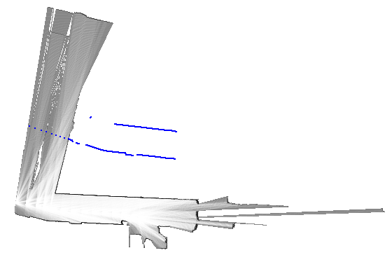
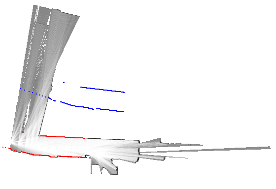
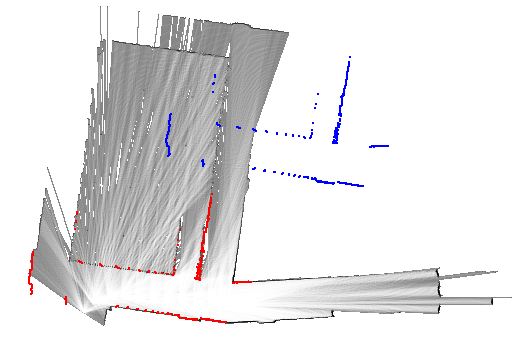
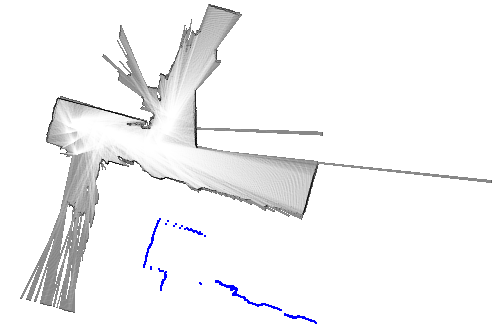

---
title:  分枝限定法によるスキャンマッチング(実装編)
author: SternGerlach
---

<!--
 pandoc -s --filter pandoc-crossref -M "crossrefYaml=./crossref_config.yaml" -f markdown -t html5 --mathjax --css style.css scan-matching-branch-and-bound-impl.md > scan-matching-branch-and-bound-impl.html
-->

[ホームに戻る](./index.html)

# このページについて

このページは、慶應理工アドベントカレンダー2021の15日目の記事です。

[こちらのページ](./scan-matching-branch-and-bound.html)の続きです。
分枝限定法によるスキャンマッチングのPythonによる実装を示します。
Pythonの実装は[GitHubのリポジトリ](https://github.com/sterngerlach/scan_matcher_2d_python)に置かれています(中の人が1から作っています)。

## 2次元の姿勢と位置

2次元の姿勢を`Pose2D`クラス、2次元の位置を`Point2D`クラスとして次のように定義します。
`Pose2D`クラスのソースコードは[こちら](https://github.com/sterngerlach/scan_matcher_2d_python/blob/master/pose_2d.py)、`Point2D`クラスのソースコードは[こちら](https://github.com/sterngerlach/scan_matcher_2d_python/blob/master/point_2d.py)を参照してください。

```py
class Point2D(object):
    def __init__(self) -> None:
        self.x = 0.0
        self.y = 0.0

    def __init__(self, x: float, y: float) -> None:
        self.x = x
        self.y = y
```

`project_point_2d()`関数は、ある姿勢のもとで、点の座標を変換します。
姿勢は引数`pose`、点の座標は引数`point`にそれぞれ指定します。
例えば、`pose`がロボットの姿勢(地図座標系からLiDAR座標系への座標変換)、`point`がLiDAR座標系におけるスキャン点の座標(直交座標)であれば、地図座標系におけるスキャン点の座標が返されます。

```py
class Pose2D(object):
    def __init__(self) -> None:
        self.x = 0.0
        self.y = 0.0
        self.theta = 0.0

    def __init__(self, x: float, y: float, theta: float) -> None:
        self.x = x
        self.y = y
        self.theta = theta

def project_point_2d(pose: Pose2D, point: Point2D) -> Point2D:
    """Project a 2D point using a 2D pose"""
    sin_theta = math.sin(pose.theta)
    cos_theta = math.cos(pose.theta)

    x = pose.x + cos_theta * point.x - sin_theta * point.y
    y = pose.y + sin_theta * point.x + cos_theta * point.y

    return Point2D(x, y)
```

## 占有格子地図の実装

占有格子地図(Occupancy Grid Map)の実装(`Grid2D`クラス)を示します。
`Grid2D`クラスのソースコードは[こちら](https://github.com/sterngerlach/scan_matcher_2d_python/blob/master/grid_2d.py)を参照してください。
重要な部分だけを以下に列挙します。

- 占有格子地図は、解像度、中心の座標、$x$と$y$方向の格子の数で定義されます。
解像度は`resolution()`メソッド、中心の座標は`center_pos()`メソッド、左下端($(0, 0)$番目の格子)の座標は`min_pos()`メソッド、$x$と$y$方向の格子の数は`num_of_cells_x()`、`num_of_cells_y()`メソッドからそれぞれ取得できます。
- 各格子の占有確率は、16ビットの整数(1から65535まで)に量子化したうえで、リストに格納されます。
格子は$x$と$y$の2つのインデックスで表せますが、`flat_index()`メソッドによって、リストにアクセスするための1次元のインデックスに変換できます。
分枝限定法によるスキャンマッチングの際は、占有確率の総和を取る必要があります。
占有確率が16ビット整数に量子化されているので、浮動小数点数の総和が整数の総和に置き換わって、多少の高速化を期待できます。
- `index_to_point()`メソッドは、指定された格子に対応する座標を返します。
`point_to_index()`メソッドはその逆で、指定された位置に対応する格子のインデックスを返します。
- `get_index_value()`と`get_index_probability()`メソッドは、指定された格子の占有確率を、16ビットの整数、あるいは浮動小数点数で返します。
- `compute_coarse_map()`関数は、[以前のページ](./scan-matching-branch-and-bound.html)における$\mathcal{M}_\mathrm{precomp}^h$を計算します。
引数`win_size`に$2^h$、`grid_map`に占有格子地図$\mathcal{M}$を指定します。
計算にあたっては、占有確率の比較が繰り返し必要です。
占有確率が16ビット整数に量子化されているので、浮動小数点数の比較が整数の比較に置き換わって、多少の高速化を期待できます。
$$
  \mathcal{M}_\mathrm{precomp}^h(i, j)
  = \max_{\substack{i \le i' < i + 2^h \\ j \le j' < j + 2^h}} \mathcal{M}(i', j')
$$
- ここでは使っていませんが、地図の更新に必要な各種メソッドも定義されているので、興味があれば読んでみてください。
格子がもつ占有確率の更新には、バイナリベイズフィルタを利用します。
また、LiDARセンサの中心と各スキャン点を結ぶ直線を考え、その直線上を通過する格子のインデックスを計算するために、ブレゼンハムのアルゴリズムを利用します。

```py
# coding: utf-8
# grid_2d.py

import math

from collections import deque
from typing import Callable, List, Tuple

from point_2d import Point2D
from pose_2d import Pose2D, project_point_2d
from util import bresenham

def probability_to_value(x: float) -> int:
    return int(x * 65536.0)

def value_to_probability(x: int) -> float:
    return float(x) / 65536.0

def probability_to_log_odds(x: float) -> float:
    return math.log(x / (1.0 - x))

def log_odds_to_probability(x: float) -> float:
    return 1.0 / (1.0 + math.exp(-x))

def probability_to_odds(x: float) -> float:
    return x / (1.0 - x)

def odds_to_probability(x: float) -> float:
    return x / (1.0 + x)

def log_odds_to_value(x: float) -> int:
    return probability_to_value(log_odds_to_probability(x))

def value_to_log_odds(x: int) -> float:
    return probability_to_log_odds(value_to_probability(x))

def probability_to_grayscale(x: float) -> int:
    return 255 - int(x * 255.0)

def value_to_grayscale(x: int) -> int:
    return 255 - (x >> 8)

class Grid2D(object):
    """Grid2D class represents a simple 2D grid map. Each grid cell contains
    a quantized occupancy probability, which is incrementally updated by
    Binary Bayes Filter."""

    VALUE_MIN = 1
    VALUE_MAX = 65535
    PROBABILITY_MIN = value_to_probability(VALUE_MIN)
    PROBABILITY_MAX = value_to_probability(VALUE_MAX)
    LOG_ODDS_MIN = probability_to_log_odds(PROBABILITY_MIN)
    LOG_ODDS_MAX = probability_to_log_odds(PROBABILITY_MAX)

    def __init__(self, resolution: float, center_x: float, center_y: float,
                 num_of_cells_x: int, num_of_cells_y: int,
                 log_odds_hit: float, log_odds_miss: float) -> None:
        assert num_of_cells_x > 0
        assert num_of_cells_y > 0
        assert Grid2D.LOG_ODDS_MIN <= log_odds_miss <= Grid2D.LOG_ODDS_MAX
        assert Grid2D.LOG_ODDS_MIN <= log_odds_hit <= Grid2D.LOG_ODDS_MAX

        self.__resolution = resolution
        self.__min_x = center_x - resolution * num_of_cells_x / 2.0
        self.__min_y = center_y - resolution * num_of_cells_y / 2.0
        self.__center_x = center_x
        self.__center_y = center_y
        self.__num_of_cells_x = num_of_cells_x
        self.__num_of_cells_y = num_of_cells_y
        self.__log_odds_miss = log_odds_miss
        self.__log_odds_hit = log_odds_hit

        num_of_cells = num_of_cells_x * num_of_cells_y
        self.__values = [Grid2D.VALUE_MIN for _ in range(num_of_cells)]

    def resolution(self) -> float:
        return self.__resolution

    def num_of_cells_x(self) -> int:
        return self.__num_of_cells_x

    def num_of_cells_y(self) -> int:
        return self.__num_of_cells_y

    def log_odds_miss(self) -> float:
        return self.__log_odds_miss

    def log_odds_hit(self) -> float:
        return self.__log_odds_hit

    def shape(self) -> Tuple[int, int]:
        return self.__num_of_cells_x, self.__num_of_cells_y

    def min_pos(self) -> Tuple[float, float]:
        return self.__min_x, self.__min_y

    def center_pos(self) -> Tuple[float, float]:
        return self.__center_x, self.__center_y

    def flat_index(self, x: int, y: int) -> int:
        return y * self.__num_of_cells_x + x

    def is_index_inside(self, x: int, y: int) -> bool:
        return 0 <= x < self.__num_of_cells_x and \
               0 <= y < self.__num_of_cells_y

    def is_point_inside(self, p: Point2D) -> bool:
        return self.is_index_inside(*self.point_to_index(p))

    def index_to_point(self, x: int, y: int) -> Point2D:
        """Compute the minimum coordinates in the map frame"""
        return Point2D(self.__min_x + x * self.__resolution,
                       self.__min_y + y * self.__resolution)

    def point_to_index(self, p: Point2D) -> Tuple[int, int]:
        """Compute the index from the coordinates in the map frame"""
        idx_x = int((p.x - self.__min_x) // self.__resolution)
        idx_y = int((p.y - self.__min_y) // self.__resolution)
        return idx_x if p.x >= self.__min_x else idx_x - 1, \
               idx_y if p.y >= self.__min_y else idx_y - 1

    def point_to_index_float(self, p: Point2D) -> Tuple[float, float]:
        """Compute the index in the floating point in the map frame"""
        idx_x = (p.x - self.__min_x) / self.__resolution
        idx_y = (p.y - self.__min_y) / self.__resolution
        return idx_x, idx_y

    def get_index_value(self, x: int, y: int) -> int:
        assert self.is_index_inside(x, y)
        return self.__values[self.flat_index(x, y)]

    def get_index_probability(self, x: int, y: int) -> float:
        assert self.is_index_inside(x, y)
        return value_to_probability(self.__values[self.flat_index(x, y)])

    def get_point_value(self, p: Point2D) -> int:
        return self.get_index_value(*self.point_to_index(p))

    def get_point_probability(self, p: Point2D) -> float:
        return self.get_index_probability(*self.point_to_index(p))

    def get_neighbor_probabilities(self, p: Point2D):
        x, y = self.point_to_index_float(p)
        x0, y0 = int(x), int(y)
        x1, y1 = x0 + 1, y0 + 1
        dx, dy = x - x0, y - y0

        x0_valid = 0 <= x0 < self.__num_of_cells_x
        x1_valid = 0 <= x1 < self.__num_of_cells_x
        y0_valid = 0 <= y0 < self.__num_of_cells_y
        y1_valid = 0 <= y1 < self.__num_of_cells_y

        m00 = self.get_index_probability(x0, y0) \
              if x0_valid and y0_valid else 0.5
        m01 = self.get_index_probability(x0, y1) \
              if x0_valid and y1_valid else 0.5
        m10 = self.get_index_probability(x1, y0) \
              if x1_valid and y0_valid else 0.5
        m11 = self.get_index_probability(x1, y1) \
              if x1_valid and y1_valid else 0.5

        interpolated = dy * (dx * m11 + (1.0 - dx) * m01) + \
                       (1.0 - dy) * (dx * m10 + (1.0 - dx) * m00)

        return (x0, y0), (dx, dy), (m00, m01, m10, m11), interpolated

    def get_interpolated_probability(self, p: Point2D) -> float:
        return self.get_neighbor_probabilities(p)[3]

    def set_index_value(self, x: int, y: int, value: int) -> None:
        assert self.is_index_inside(x, y)
        self.__values[self.flat_index(x, y)] = self.__clamp_value(value)

    def set_index_probability(self, x: int, y: int, value: float) -> None:
        assert self.is_index_inside(x, y)
        self.__values[self.flat_index(x, y)] = \
             self.__clamp_value(probability_to_value(value))

    def set_point_value(self, p: Point2D, value: int) -> None:
        self.set_index_value(*self.point_to_index(p), value)

    def set_point_probability(self, p: Point2D, value: float) -> None:
        self.set_index_probability(*self.point_to_index(p), value)

    def __update_index_log_odds(self, x: int, y: int, value: float) -> None:
        assert self.is_index_inside(x, y)
        idx = self.flat_index(x, y)
        log_odds = value_to_log_odds(self.__values[idx]) + value
        self.__values[idx] = self.__clamp_value(log_odds_to_value(log_odds))

    def update_index_hit(self, x: int, y: int) -> None:
        self.__update_index_log_odds(x, y, self.__log_odds_hit)

    def update_index_miss(self, x: int, y: int) -> None:
        self.__update_index_log_odds(x, y, self.__log_odds_miss)

    def update_point_hit(self, p: Point2D) -> None:
        self.update_index_hit(*self.point_to_index(p))

    def update_point_miss(self, p: Point2D) -> None:
        self.update_index_miss(*self.point_to_index(p))

    def update_from_scans(self, pose: Pose2D, scan: List[Point2D]) -> None:
        pose_idx = self.point_to_index(Point2D(pose.x, pose.y))
        points = [project_point_2d(pose, p) for p in scan]
        scan_indices = [self.point_to_index(p) for p in points]
        ray_indices = [bresenham(*pose_idx, *idx) for idx in scan_indices]
        # hit_indices = [indices[-1] for indices in ray_indices]

        for indices in ray_indices:
            for missed_idx in indices[:-1]:
                if self.is_index_inside(*missed_idx):
                    self.update_index_miss(*missed_idx)

            if self.is_index_inside(*indices[-1]):
                self.update_index_hit(*indices[-1])

    def __clamp_value(self, x: int) -> int:
        return max(Grid2D.VALUE_MIN, min(Grid2D.VALUE_MAX, x))

    def to_bytes(self) -> bytes:
        return bytes([value_to_grayscale(x) for x in self.__values])

def sliding_window_max(in_func: Callable[[int], int],
                       out_func: Callable[[int, int], None],
                       num_of_elements: int, win_size: int) -> None:
    idx_queue, idx_in, idx_out = deque(), 0, 0

    # Process the first `win_size` elements (first window)
    while idx_in < win_size:
        # Previous smaller elements are useless so remove them from `idx_queue`
        while idx_queue and in_func(idx_in) >= in_func(idx_queue[-1]):
            idx_queue.pop()
        idx_queue.append(idx_in)
        idx_in += 1

    # `idx_queue[0]` contains index of the maximum element in the first window
    # Process the rest of the elements here
    while idx_in < num_of_elements:
        # The element pointed by the `idx_queue[0]` is the maximum element of
        # the previous window
        out_func(idx_out, in_func(idx_queue[0]))
        idx_out += 1

        # Remove the elements that are out of the current window
        while idx_queue and idx_queue[0] <= idx_in - win_size:
            idx_queue.popleft()

        # Remove all elements smaller than the current element
        while idx_queue and in_func(idx_in) >= in_func(idx_queue[-1]):
            idx_queue.pop()

        # Append the current element to `idx_queue`
        idx_queue.append(idx_in)
        idx_in += 1

    # Repeat the last elements
    while idx_out < num_of_elements:
        out_func(idx_out, in_func(idx_queue[0]))
        idx_out += 1

def compute_coarse_map_slow(grid_map: Grid2D, win_size: int) -> Grid2D:
    num_of_cells = grid_map.num_of_cells_x() * grid_map.num_of_cells_y()
    buffer = [0 for _ in range(num_of_cells)]
    coarse_map = Grid2D(grid_map.resolution(), *grid_map.center_pos(),
                        grid_map.num_of_cells_x(), grid_map.num_of_cells_y(),
                        grid_map.log_odds_hit(), grid_map.log_odds_miss())

    def get_buffer(idx_x: int, idx_y: int) -> int:
        return buffer[idx_y * grid_map.num_of_cells_x() + idx_x]

    def set_buffer(idx_x: int, idx_y: int, value: int) -> None:
        buffer[idx_y * grid_map.num_of_cells_x() + idx_x] = value

    def set_coarse_map(idx_x: int, idx_y: int, value: int) -> None:
        coarse_map.set_index_value(idx_x, idx_y, value)

    # Sliding window maximum for y-axis
    for x in range(grid_map.num_of_cells_x()):
        in_func_row = lambda y: grid_map.get_index_value(x, y)
        out_func_row = lambda y, max_value: set_buffer(x, y, max_value)
        sliding_window_max(in_func_row, out_func_row, \
                           grid_map.num_of_cells_y(), win_size)

    # Sliding window maximum for x-axis
    for y in range(grid_map.num_of_cells_y()):
        in_func_col = lambda x: get_buffer(x, y)
        out_func_col = lambda x, max_value: set_coarse_map(x, y, max_value)
        sliding_window_max(in_func_col, out_func_col, \
                           grid_map.num_of_cells_x(), win_size)

    return coarse_map

def compute_coarse_map_fast(grid_map: Grid2D, win_size: int) -> Grid2D:
    num_of_cells_x = grid_map.num_of_cells_x()
    num_of_cells_y = grid_map.num_of_cells_y()
    num_of_cells = num_of_cells_x * num_of_cells_y
    buffer = [0 for _ in range(num_of_cells)]
    coarse_map = Grid2D(grid_map.resolution(), *grid_map.center_pos(),
                        grid_map.num_of_cells_x(), grid_map.num_of_cells_y(),
                        grid_map.log_odds_hit(), grid_map.log_odds_miss())

    # Sliding window maximum for y-axis
    for x in range(num_of_cells_x):
        idx_queue, idx_in, idx_out = deque(), 0, 0

        while idx_in < win_size:
            while idx_queue and grid_map.get_index_value(x, idx_in) >= \
                grid_map.get_index_value(x, idx_queue[-1]):
                idx_queue.pop()
            idx_queue.append(idx_in)
            idx_in += 1

        while idx_in < num_of_cells_y:
            buffer[idx_out * num_of_cells_x + x] = \
                grid_map.get_index_value(x, idx_queue[0])
            idx_out += 1

            while idx_queue and idx_queue[0] <= idx_in - win_size:
                idx_queue.popleft()
            while idx_queue and grid_map.get_index_value(x, idx_in) >= \
                grid_map.get_index_value(x, idx_queue[-1]):
                idx_queue.pop()

            idx_queue.append(idx_in)
            idx_in += 1

        while idx_out < num_of_cells_y:
            buffer[idx_out * num_of_cells_x + x] = \
                grid_map.get_index_value(x, idx_queue[0])
            idx_out += 1

    # Sliding window maximum for x-axis
    for y in range(num_of_cells_y):
        idx_queue, idx_in, idx_out = deque(), 0, 0
        idx_offset = y * num_of_cells_x

        while idx_in < win_size:
            while idx_queue and buffer[idx_offset + idx_in] >= \
                buffer[idx_offset + idx_queue[-1]]:
                idx_queue.pop()
            idx_queue.append(idx_in)
            idx_in += 1

        while idx_in < num_of_cells_x:
            coarse_map.set_index_value(
                idx_out, y, buffer[idx_offset + idx_queue[0]])
            idx_out += 1

            while idx_queue and idx_queue[0] <= idx_in - win_size:
                idx_queue.popleft()
            while idx_queue and buffer[idx_offset + idx_in] >= \
                buffer[idx_offset + idx_queue[-1]]:
                idx_queue.pop()

            idx_queue.append(idx_in)
            idx_in += 1

        while idx_out < num_of_cells_x:
            coarse_map.set_index_value(
                idx_out, y, buffer[idx_offset + idx_queue[0]])
            idx_out += 1

    return coarse_map

def compute_coarse_map(grid_map: Grid2D, win_size: int) -> Grid2D:
    return compute_coarse_map_fast(grid_map, win_size)
```

## 分枝限定法によるスキャンマッチングの実装

続いて、分枝限定法によるスキャンマッチングの実装(`ScanMatcherBranchBound`クラス)を示します。
`ScanMatcherBranchBound`クラスのソースコードは[こちら](https://github.com/sterngerlach/scan_matcher_2d_python/blob/master/scan_matcher_branch_bound.py)を参照してください。
アルゴリズムの説明は大変でしたが、実装自体は100行程度で済みます。

- コンストラクタでは、アルゴリズムの各種パラメータを初期化します。
探索領域のサイズ$2W_x, 2W_y, 2W_\theta$を`window_size_x`、`window_size_y`、`window_size_theta`の3つのメンバ、$\theta$方向のステップサイズの最小値$\delta_{\theta, \mathrm{min}}$を`min_step_theta`メンバ、ノードの最大の高さ$h_0$を`max_node_height`メンバ、$2^{h_0}$を`max_stride`メンバに格納します。
- `compute_step()`メソッドは、占有格子地図の解像度$r$と、スキャンデータ$\mathcal{S}$を基に、$x$、$y$、$\theta$方向のステップサイズ($r$および$\delta_\theta$)を計算します。
$$
  \delta_\theta = \max \left( \delta_{\theta, \mathrm{min}}, \arccos \left( 1 - \frac{r^2}{2 d_\mathrm{max}^2} \right) \right)
$$
$d_\mathrm{max}$は、LiDARセンサの中心から、スキャン点までの距離の最大値です。
スキャンデータ$\mathcal{S} = \left\{ (r_1, \theta_1), \ldots, (r_N, \theta_N) \right\}$について、$d_\mathrm{max} = \max_i r_i$となります。
- `compute_window()`メソッドは、探索領域のサイズ$W_x, W_y, W_\theta$とステップサイズ$r, \delta_\theta$を基に、各軸方向の解の候補数$w_x, w_y, w_\theta$を計算します。
$$
  w_x = \left\lceil \frac{W_x}{r} \right\rceil, \
  w_y = \left\lceil \frac{W_y}{r} \right\rceil, \
  w_\theta = \left\lceil \frac{W_\theta}{\delta_\theta} \right\rceil
$$
- `compute_score()`メソッドは、指定されたインデックスの格子がもつ占有確率を足し合わせて、スコアを計算します(詳細は後ほど説明します)。

`match_scan()`メソッドは、分枝限定法によるスキャンマッチングの本体です。
[以前のページ](./scan-matching-branch-and-bound.html)の末尾に示したアルゴリズムと照らし合わせて、ソースコードを詳しくみてみましょう。

- 引数`initial_pose`、`grid_map`、`scan`から、探索領域の中心に対応する姿勢$\mathbf{\xi}_0 = \left[ \xi_{0, x}, \xi_{0, y}, \xi_{0, \theta} \right]^\top$、占有格子地図$\mathcal{M}$(解像度$r$)、スキャンデータ$\mathcal{S}$を受け取ります。
[以前のページ](./scan-matching-branch-and-bound.html)では、スキャンデータは極座標形式(距離$r_i$と方向$\theta_i$)で表現していましたが、この実装では直交座標($x, y$)を用いています。
あるスキャンが極座標で$\mathbf{z}_i = (r_i, \theta_i)$のように表されるとき、$(r_i \cos \theta_i, r_i \sin \theta_i)$とすれば直交座標に変換できます。
また、直交座標で$\mathbf{z}_i = (x_i, y_i)$のように表されるとき、$(\sqrt{x_i^2 + y_i^2}, \arctan \cfrac{y_i}{x_i})$とすれば極座標に変換できます。

- 最初に、`compute_step()`メソッドと`compute_window()`メソッドを使って、ステップサイズ$r, \delta_\theta$と探索領域のサイズ$w_x, w_y, w_\theta$を計算します。
変数`step_x`、`step_y`、`step_theta`は、$r$, $r$, $\delta_\theta$に対応します。
また変数`win_x`、`win_y`、`win_theta`は、$w_x$、$w_y$、$w_\theta$に対応します。
スコアの最大値$s^*$と最適解$(j_x^*, j_y^*, j_\theta^*) \in \overline{\mathcal{W}}$は、変数`best_score`、`best_x`、`best_y`、`best_theta`にそれぞれ保持します。
[以前のページ](./scan-matching-branch-and-bound.html)では、次のように探索領域$\overline{\mathcal{W}}$を定義していました。
$$
  \overline{\mathcal{W}} = \left\{ 0, \ldots, 2w_x \right\}
  \times \left\{ 0, \ldots, 2w_y \right\}
  \times \left\{ 0, \ldots, 2w_\theta \right\}
$$
$$
  \mathcal{W} = \left\{ \mathcal{\xi}_0
  + \left[ r \left( -w_x + j_x \right), r \left( -w_y + j_y \right),
  \delta_\theta \left( -w_\theta + j_\theta \right) \right]^\top \mid
  \left( j_x, j_y, j_\theta \right) \in \overline{\mathcal{W}} \right\}
$$
このメソッド内では、以下の定義を採用しています(上記の$j_x, j_y, j_\theta$を、$j_x - w_x, j_y - w_y, j_\theta - w_\theta$に置き換えただけです)。
$$
  \overline{\mathcal{W}} = \left\{ -w_x, \ldots, w_x - 1\right\}
  \times \left\{ -w_y, \ldots, w_y - 1\right\}
  \times \left\{ -w_\theta, \ldots, w_\theta - 1\right\}
$$
$$
  \mathcal{W} = \left\{ \mathcal{\xi}_0
  + \left[ r j_x, r j_y, \delta_\theta j_\theta \right]^\top \mid
  \left( j_x, j_y, j_\theta \right) \in \overline{\mathcal{W}} \right\}
$$

- 続いて、`compute_coarse_map()`メソッドを使って、与えられた地図$\mathcal{M}$から、$h_0$個の地図$\mathcal{M}_\mathrm{precomp}^1, \ldots, \mathcal{M}_\mathrm{precomp}^{h_0}$を計算します。
元々の地図$\mathcal{M}$と、計算した地図$\mathcal{M}_\mathrm{precomp}^h$をまとめて、変数`grid_maps`に格納します。
$$
  \mathcal{M}_\mathrm{precomp}^h(i, j)
  = \max_{\substack{i \le i' < i + 2^h \\ j \le j' < j + 2^h}} \mathcal{M}(i', j')
$$

- その後、優先度付きキュー$\mathcal{C}$を作成します(ここでは優先度付きキューを用いましたが、単なるスタックで良いと思います)。
これは変数`node_queue`に対応します。
優先度付きキュー$\mathcal{C}$を、高さ$h_0$の一連のノード$\mathcal{C}_0$で初期化します(探索領域の定義が少し異なるので、それに応じて$\overline{\mathcal{W}}_0$と$\mathcal{C}_0$の定義も変えています)。
ソースコードは変数`x`、`y`、`t`の3重ループになっていますが、$\overline{\mathcal{W}}_{0, x}$、$\overline{\mathcal{W}}_{0, y}$、$\overline{\mathcal{W}}_{0, \theta}$の各要素を順に辿っているわけです。
$$
  \begin{eqnarray}
    \overline{\mathcal{W}}_{0, x} &=& \left\{ -w_x + 2^{h_0} j_x \mid
    j_x \in \mathbb{Z}, 0 \le 2^{h_0} j_x < 2 w_x \right\} \\
    \overline{\mathcal{W}}_{0, y} &=& \left\{ -w_y + 2^{h_0} j_y \mid
    j_y \in \mathbb{Z}, 0 \le 2^{h_0} j_y < 2 w_y \right\} \\
    \overline{\mathcal{W}}_{0, \theta} &=& \left\{ j_\theta \mid
    j_\theta \in \mathbb{Z}, -w_\theta \le j_\theta < w_\theta \right\} \\
    \mathcal{C}_0 &=& \overline{\mathcal{W}}_{0, x}
    \times \overline{\mathcal{W}}_{0, y}
    \times \overline{\mathcal{W}}_{0, \theta}
    \times \left\{ h_0 \right\}
  \end{eqnarray}
$$
各ノード$\mathbf{c} = \left( -w_x + 2^{h_0} j_x, -w_y + 2^{h_0} j_y, j_\theta, h_0 \right) \in \mathcal{C}_0$について、`append_node()`関数を呼び出します。
引数`x`、`y`、`t`は、$-w_x + 2^{h_0} j_x$、$-w_y + 2^{h_0} j_y$、$j_\theta$に対応します。
また引数`height`は$h_0$、引数`indices`は以下で定義するインデックス$\{ (I_{i, x}^0, I_{i, y}^0) \}$に対応します。
`append_node()`関数内では、スコアの上界$\overline{s}(\mathbf{c})$を次のような手順で計算し、変数`score`に格納します。
最初に、解の候補$(0, 0, j_\theta)$に対応する姿勢$\mathbf{\xi}(0, 0, j_\theta)$を計算し、変数`pose`に格納します。
$$
  \mathbf{\xi}(0, 0, j_\theta)
  = \mathbf{\xi}_0 + \left[ 0, 0, \delta_\theta j_\theta \right]^\top
  = \left[ \xi_{0, x}, \xi_{0, y},
  \xi_{0, \theta} + \delta_\theta j_\theta \right]^\top
$$
この姿勢$\mathbf{\xi}(0, 0, j_\theta)$を基に、スキャン点$\mathbf{z}_i = (r_i, \theta_i)$に対応する地図上の格子のインデックス$(I_{i, x}^0, I_{i, y}^0)$を計算し、変数`indices`に格納します。
$$
  \begin{eqnarray}
    I_{i, x}^0 &=& \left\lfloor \frac{\xi_{0, x} + r_i \cos \left(
    \xi_{0, \theta} + \delta_\theta j_\theta
    + \theta_i \right)}{r} \right\rfloor \\
    I_{i, y}^0 &=& \left\lfloor \frac{\xi_{0, y} + r_i \sin \left(
    \xi_{0, \theta} + \delta_\theta j_\theta
    + \theta_i \right)}{r} \right\rfloor
  \end{eqnarray}
$$
その後`compute_score()`メソッドを用いて、スコアの上界$\overline{s}(\mathbf{c})$を計算します。
`compute_score()`メソッドの引数`grid_map`は$\mathcal{M}_\mathrm{precomp}^{h_0}$、`indices`はインデックス$\{ (I_{i, x}^0, I_{i, y}^0) \}$、また`offset`は$(-w_x + 2^{h_0} j_x, -w_y + 2^{h_0} j_y)$にそれぞれ対応しています。
$$
  \overline{s}(\mathbf{c}) = \sum_{i = 1}^N
  \mathcal{M}_\mathrm{precomp}^{h_0}(I_{i, x}^0 - w_x + 2^{h_0} j_x,
  I_{i, y}^0 - w_y + 2^{h_0} j_y)
$$
スコアの上界$\overline{s}(\mathbf{c})$が最も高いノード$\mathbf{c} \in \mathcal{C}_0$が先頭に来るように、$\mathcal{C}_0$に含まれる全てのノードを優先度付きキュー$\mathcal{C}$に追加していきます。
優先度付きキューには、ノード$\mathbf{c}$の4つのパラメータ$(-w_x + 2^{h_0} j_x, -w_y + 2^{h_0} j_y, j_\theta, h_0)$(変数`x`、`y`、`theta`、`height`)のほかに、スコアの上界$\overline{s}(\mathbf{c})$(変数`score`)、そしてインデックス$\{ (I_{i, x}^0, I_{i, y}^0) \}$(変数`indices`)も追加しておきます。

- 優先度付きキュー$\mathcal{C}$(変数`node_queue`)が空になるまで、以下の処理を繰り返します。
  - $\mathcal{C}$の先頭から、ノード$\mathbf{c} = (c_x, c_y, c_\theta, h) \in \overline{\mathcal{W}}$とスコアの上界$\overline{s}(\mathbf{c})$、そしてインデックス$\{ (I_{i, x}^0, I_{i, y}^0) \}$を取得します。
  $(I_{i, x}^0, I_{i, y}^0)$は、姿勢$\mathbf{\xi}(0, 0, c_\theta)$のもとで計算した、スキャン点$\mathbf{z}_i = (r_i, \theta_i)$に対応する格子のインデックスです(上記の説明を確認してください)。
  $c_x, c_y, c_\theta, h$は変数`x`、`y`、`t`、`height`、上界$\overline{s}(\mathbf{c})$は変数`score`、またインデックス$\{ (I_{i, x}^0, I_{i, y}^0) \}$は変数`indices`に格納されます。

  - スコアの上界$\overline{s}(\mathbf{c})$が、現在の最大スコア$s^*$(変数`best_score`)以下であれば、現在のノード$\mathbf{c}$と、その子ノードの探索は不要です(**枝刈り**)。
  - 現在のノード$\mathbf{c}$が葉ノードである場合(高さ$h = 0$)は、現在の最大スコア$s^*$(変数`best_score`)を$\overline{s}(\mathbf{c})$、また最適解$(j_x^*, j_y^*, j_\theta^*)$(変数`best_x`、`best_y`、`best_theta`)を$(c_x, c_y, c_\theta)$で更新します。
  - 現在のノード$\mathbf{c}$が葉ノードでなければ、4つの子ノード$\mathbf{c}_1, \mathbf{c}_2, \mathbf{c}_3, \mathbf{c}_4$に分割します。
  $$
    \begin{eqnarray}
      \mathbf{c}_1 &=& (c_x, c_y, c_\theta, h - 1) \\
      \mathbf{c}_2 &=& (c_x + 2^{h - 1}, c_y, c_\theta, h - 1) \\
      \mathbf{c}_3 &=& (c_x, c_y + 2^{h - 1}, c_\theta, h - 1) \\
      \mathbf{c}_4 &=& (c_x + 2^{h - 1}, c_y + 2^{h - 1}, c_\theta, h - 1)
    \end{eqnarray}
  $$
  変数`new_x`、`new_y`、`new_height`、`s`は、$c_x, c_y, h - 1, 2^{h - 1}$にそれぞれ対応します。
  4つの子ノードに対して`append_node()`関数が順に呼び出されます。
  `append_node()`関数内では、スコアの上界$\overline{s}(\mathbf{c}_1), \overline{s}(\mathbf{c}_2), \overline{s}(\mathbf{c}_3), \overline{s}(\mathbf{c}_4)$を計算します。
  $$
    \begin{eqnarray}
      \overline{s}(\mathbf{c}_1)
      &=& \sum_{i = 1}^N \mathcal{M}_\mathrm{precomp}^{h - 1}(
      I_{i, x}^0 + c_x, I_{i, y}^0 + c_y) \\
      \overline{s}(\mathbf{c}_2)
      &=& \sum_{i = 1}^N \mathcal{M}_\mathrm{precomp}^{h - 1}(
      I_{i, x}^0 + c_x + 2^{h - 1}, I_{i, y}^0 + c_y) \\
      \overline{s}(\mathbf{c}_3)
      &=& \sum_{i = 1}^N \mathcal{M}_\mathrm{precomp}^{h - 1}(
      I_{i, x}^0 + c_x, I_{i, y}^0 + c_y + 2^{h - 1}) \\
      \overline{s}(\mathbf{c}_4)
      &=& \sum_{i = 1}^N \mathcal{M}_\mathrm{precomp}^{h - 1}(
      I_{i, x}^0 + c_x + 2^{h - 1}, I_{i, y}^0 + c_y + 2^{h - 1}) \\
      I_{i, x}^0 &=& \left\lfloor \frac{\xi_{0, x} + r_i \cos \left(
      \xi_{0, \theta} + \delta_\theta c_\theta
      + \theta_i \right)}{r} \right\rfloor \\
      I_{i, y}^0 &=& \left\lfloor \frac{\xi_{0, y} + r_i \sin \left(
      \xi_{0, \theta} + \delta_\theta c_\theta
      + \theta_i \right)}{r} \right\rfloor
    \end{eqnarray}
  $$
  4つの子ノードは、親ノード$\mathbf{c}$と同様の回転$c_\theta$を表しています。
  従って、スコアの上界の計算時にインデックス$\{ (I_{i, x}^0, I_{i, y}^0) \}$を再利用できます。
  LiDAR座標系から地図座標系への座標変換と、地図座標から格子のインデックスへの変換の2つを省略できます。
  上界の最も大きな子ノードが先頭に来るように、4つの子ノードを優先度付きキューに追加していきます(ノードの4つのパラメータに加えて、上界とインデックスも一緒に追加)。

- 上記の手続きによって最適解$(j_x^*, j_y^*, j_\theta^*) \in \overline{\mathcal{W}}$が得られたので、最適な姿勢$\mathbf{\xi}^* \in \mathcal{W}$を計算します(変数`best_pose`)。
$$
  \mathbf{\xi}^* = \left[ \xi_{0, x} + r j_x^*, \xi_{0, y} + r j_y^*,
  \xi_{0, \theta} + \delta_\theta j_\theta^* \right]^\top \in \mathcal{W}
$$

- スコアの最大値$s^*$、最適解$(j_x^*, j_y^*, j_\theta^*) \in \overline{\mathcal{W}}$、最適な姿勢$\mathbf{\xi}^* \in \mathcal{W}$などをまとめて返します。

```py
# coding: utf-8
# scan_matcher_branch_bound.py

import heapq
import math

from typing import Any, List, Tuple

from grid_2d import Grid2D, compute_coarse_map
from point_2d import Point2D
from pose_2d import Pose2D, project_point_2d, wrap_angle

class ScanMatcherBranchBound(object):
    """`ScanMatcherBranchBound` class implements branch-and-bound scan matching,
    which aligns a LiDAR scan and a 2D occupancy grid map. \n
    For more details, please refer to the following paper: \n
    Wolfgang Hess, Damon Kohler, Holger Rapp, and Daniel Andor.
    "Real-time Loop Closure in 2D LiDAR SLAM," in Proceedings of the IEEE
    International Conference on Robotics and Automation (ICRA), 2016.
    """

    class Result(object):
        def __init__(self, win: Tuple[int, int, int],
                     step: Tuple[float, float, float],
                     best: Tuple[int, int, int], best_score: float,
                     initial_pose: Pose2D, best_pose: Pose2D,
                     num_solutions: int, num_processed: int) -> None:
            self.win_x, self.win_y, self.win_theta = win
            self.step_x, self.step_y, self.step_theta = step
            self.best_x, self.best_y, self.best_theta = best
            self.best_score = best_score
            self.initial_pose = initial_pose
            self.best_pose = best_pose
            self.num_solutions = num_solutions
            self.num_processed = num_processed

        def dump(self) -> None:
            msg = "Statistics for branch-and-bound scan matcher\n" \
                  "Window size: ({}, {}, {})\n" \
                  "Step size: ({:.6f} m, {:.6f} m, {:.6f} rad)\n" \
                  "Best solution: ({}, {}, {})\n" \
                  "Best score: {}\n" \
                  "Initial pose: ({:.6f} m, {:.6f} m, {:.6f} rad)\n" \
                  "Final pose: ({:.6f} m, {:.6f} m, {:.6f} rad)\n" \
                  "# of possible solutions: {}\n" \
                  "# of solutions processed: {}\n"
            print(msg.format(self.win_x * 2, self.win_y * 2, self.win_theta * 2,
                             self.step_x, self.step_y, self.step_theta,
                             self.best_x, self.best_y, self.best_theta,
                             self.best_score,
                             self.initial_pose.x, self.initial_pose.y,
                             self.initial_pose.theta,
                             self.best_pose.x, self.best_pose.y,
                             self.best_pose.theta,
                             self.num_solutions, self.num_processed))

    def __init__(self, window_size_x: float, window_size_y: float,
                 window_size_theta: float, min_step_theta: float,
                 max_node_height: int) -> None:
        self.window_size_x = window_size_x
        self.window_size_y = window_size_y
        self.window_size_theta = window_size_theta
        self.min_step_theta = min_step_theta
        self.max_node_height = max_node_height
        self.max_stride = 1 << self.max_node_height

    def compute_step(self, grid_map: Grid2D, scan: List[Point2D]):
        ranges = [(p.x ** 2 + p.y ** 2) for p in scan]
        theta = grid_map.resolution() / max(ranges)

        step_x = grid_map.resolution()
        step_y = grid_map.resolution()
        step_theta = math.acos(1.0 - 0.5 * (theta ** 2))
        step_theta = max(step_theta, self.min_step_theta)

        return step_x, step_y, step_theta

    def compute_window(self, step_x: float, step_y: float, step_theta: float):
        return int(math.ceil(0.5 * self.window_size_x / step_x)), \
               int(math.ceil(0.5 * self.window_size_y / step_y)), \
               int(math.ceil(0.5 * self.window_size_theta / step_theta))

    def compute_score(self, grid_map: Grid2D, indices: List[Tuple[int, int]],
                      offset: Tuple[int, int]) -> int:
        score = 0
        for idx_base in indices:
            idx = (idx_base[0] + offset[0], idx_base[1] + offset[1])
            if grid_map.is_index_inside(*idx):
                score += grid_map.get_index_value(*idx)
        return score

    def match_scan(self, initial_pose: Pose2D, grid_map: Grid2D,
                   scan: List[Point2D]) -> Tuple[Pose2D, Any]:
        # Determine the search step and window size
        step = self.compute_step(grid_map, scan)
        win = self.compute_window(*step)
        step_x, step_y, step_theta = step
        win_x, win_y, win_theta = win
        best_x, best_y, best_theta, best_score = 0, 0, 0, 0

        num_solutions = (2 * win_x) * (2 * win_y) * (2 * win_theta)
        num_processed = 0

        # Compute coarse grid maps, which are analogous to image pyramids
        grid_maps = [grid_map]

        for i in range(self.max_node_height):
            grid_maps.append(compute_coarse_map(grid_map, 2 << i))

        # `node_queue` is a priority queue of nodes, where each node represents
        # a subregion in the 3D search window along x, y, and theta axes
        node_queue = []

        def append_node(x: int, y: int, theta: int,
                        height: int, indices: List[Tuple[int, int]]):
            score = self.compute_score(grid_maps[height], indices, (x, y))

            if score > best_score:
                # Store the negative score as a key, since `heapq.heappop()`
                # returns a node with the smallest key
                heapq.heappush(node_queue,
                    (-score, (x, y, theta, height, indices, score)))

        # Initialize a priority queue
        for t in range(-win_theta, win_theta):
            pose = Pose2D(initial_pose.x, initial_pose.y,
                          initial_pose.theta + t * step_theta)
            points = [project_point_2d(pose, p) for p in scan]
            indices = [grid_map.point_to_index(p) for p in points]

            for y in range(-win_y, win_y, self.max_stride):
                for x in range(-win_x, win_x, self.max_stride):
                    append_node(x, y, t, self.max_node_height, indices)

        while node_queue:
            # Get the node from the priority queue
            _, (x, y, t, height, indices, score) = heapq.heappop(node_queue)
            num_processed += 1

            if score <= best_score:
                # Skip the node if the score is below the best score so far
                continue

            if height == 0:
                # If the current node is a left, then update the solution
                best_x, best_y, best_theta, best_score = x, y, t, score
            else:
                # Otherwise, split the current node into four new nodes
                new_x, new_y, new_height = x, y, height - 1
                # Compute a new stride
                s = 1 << new_height
                append_node(new_x, new_y, t, new_height, indices)
                append_node(new_x + s, new_y, t, new_height, indices)
                append_node(new_x, new_y + s, t, new_height, indices)
                append_node(new_x + s, new_y + s, t, new_height, indices)

        best_pose = Pose2D(initial_pose.x + best_x * step_x,
                           initial_pose.y + best_y * step_y,
                           initial_pose.theta + best_theta * step_theta)
        best_pose.theta = wrap_angle(best_pose.theta)

        result = ScanMatcherBranchBound.Result(
            win, step, (best_x, best_y, best_theta), best_score,
            initial_pose, best_pose, num_solutions, num_processed)

        return best_pose, result
```

## 分枝限定法によるスキャンマッチングの動作例

その他の実装は[GitHubのリポジトリ](https://github.com/sterngerlach/scan_matcher_2d_python)を参照してください。
ここでは幾つかのデータセットを使った動作例を示します。
青色で示したスキャンは、姿勢の初期値を使って地図上に投影したものです(`match_scan()`メソッドの引数`initial_pose`)。
また赤色で示したスキャンは、姿勢の解を使って描画しています(`match_scan()`メソッドの変数`best_pose`)。

初期値と最適解がかなり大きく離れていますが、正しく動作していることが分かります。
ガウス・ニュートン法やレーベンバーグ・マーカート法などの、勾配を基にした逐次的なマッチング手法では、最適解への収束は期待できないでしょう。

- データセット7

[](slam-images/scan-matching-branch-and-bound/before-7.png)
[](slam-images/scan-matching-branch-and-bound/after-7.png)

- データセット8

[](slam-images/scan-matching-branch-and-bound/before-8.png)
[](slam-images/scan-matching-branch-and-bound/after-8.png)

- データセット18

[](slam-images/scan-matching-branch-and-bound/before-18.png)
[](slam-images/scan-matching-branch-and-bound/after-18.png)

- データセット25

[](slam-images/scan-matching-branch-and-bound/before-25.png)
[](slam-images/scan-matching-branch-and-bound/after-25.png)

- データセット32

[](slam-images/scan-matching-branch-and-bound/before-32.png)
[](slam-images/scan-matching-branch-and-bound/after-32.png)

データセット18の例では、探索範囲のサイズを$25 \mathrm{m} \times 25 \mathrm{m} \times 0.2 \mathrm{rad}$、ステップサイズを$0.05 \mathrm{m}, 0.0025 \mathrm{rad}$に設定しているので、20,000,000個もの解の候補が存在します。
しかし、分枝限定法で調べたノード数は11,252だったので(ノードの高さは最大6に設定)、解の候補のうちたったの0.056%を探索するだけで済んでいます。
言い換えると、全ての解の候補をしらみつぶしに調べる場合と比べて、1,777倍高速化されているということです。

これらを試すには、リポジトリ内の`main.py`を実行してください。
`main()`関数の先頭に書かれている変数`data_idx`は、データセットの番号(7、8、18、25、32のいずれか)を表します。
また変数`perturb_x`、`perturb_y`、`perturb_theta`は、初期値を最適解からどれだけ移動させるかを決定します。

