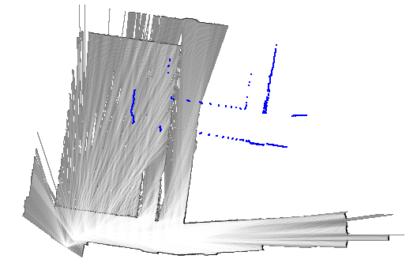
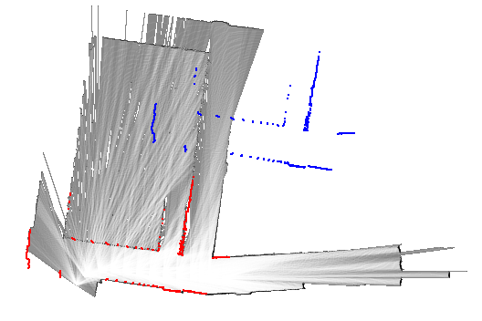
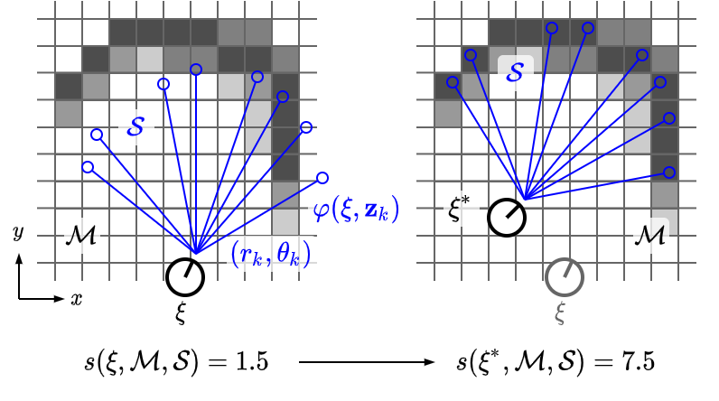

---
title:  分枝限定法によるスキャンマッチング(アルゴリズム編)
author: SternGerlach
---

<!--
 pandoc -s --filter pandoc-crossref -M "crossrefYaml=./crossref_config.yaml" -f markdown -t html5 --mathjax --css style.css scan-matching-branch-and-bound.md > scan-matching-branch-and-bound.html
-->

[ホームに戻る](./index.html)

# このページについて

このページは、[慶應理工アドベントカレンダー2021](https://adventar.org/calendars/6279)の15日目の記事です。
昨日の記事は[こちら](https://ainnooo.hatenablog.com/entry/2021/12/12/173242)、Linuxカーネルの機能XDP(eXpress Data Path)に関する記事です。

分枝限定法によるスキャンマッチングのアルゴリズムと、Pythonによる実装を示します。
アルゴリズムの説明は、[Google Cartographerの論文](https://ieeexplore.ieee.org/document/7487258)に概ね沿っています。
恐らく、日本語での解説はあまりないと思います。
Google Cartographerは2次元LiDAR SLAMにおける最先端の手法で、2016年に提案されたものです。
Pythonの実装は[GitHubのリポジトリ](https://github.com/sterngerlach/scan_matcher_2d_python)に置かれています(中の人が1から作っています)。

## スキャンマッチングとSLAM

皆さんは、2Dの占有格子地図(Occupancy Grid Map)と、2D LiDARから取得したスキャンデータを重ね合わせて、ロボットの現在の自己位置を推定したいと思ったことがあると思います。
このような重ね合わせ処理のことを、**スキャンマッチング**(Scan Matching)といいます。

例えば以下の図のように、青色で示したスキャンデータを、占有格子地図と重ね合わせるわけです。
重ね合わせた後のスキャンデータを赤色で示しています。
以下の図の1ピクセルは$5 \mathrm{cm}$で、当初の位置から横方向に$6.85 \mathrm{m}$(137ピクセル)、縦方向に$6.8 \mathrm{m}$(136ピクセル)だけ移動させています。

占有格子地図とは、環境(2次元の平面)を格子状に区切って、それぞれの格子に障害物が存在する確率(占有確率)を割り当てるものです。
例えば先程の図では、黒い格子ほど占有確率が1に近く、白い格子ほど占有確率が0に近くなります。

またLiDAR(Light Detection And Ranging)は、センサから周囲の環境に向けてレーザ光を照射し、その反射光を受光素子で検出することで、センサからみた障害物までの距離(Range, Distance)と方向(Angle, Bearing)を取得します。
レーザ光が障害物に当たって跳ね返り、センサの中心まで戻ってくるまでの時間(Time of Flight)を計測することで、障害物までの距離を計算できます。
LiDARセンサが回転しながら、あらゆる方向に対してレーザ光を照射するので、周囲の様々な障害物までの、距離と方向のペアが幾つも得られます。
LiDARセンサ1周分のデータをスキャンといい、周囲360度にある障害物(家具や壁など)の形状を反映した**点群**(Point Cloud)となります。

スキャン同士、スキャンと地図、地図同士など、重ね合わせの対象には幾つかの種類がありますが、Scan-to-scan Matching、Scan-to-map Matching、Map-to-map Matchingなどと呼んで区別します。
ここでは、**スキャンと占有格子地図の重ね合わせ**(Scan-to-map)を扱いますが、スキャン同士(Scan-to-scan)の場合と比べると誤差が小さいとされています。
ICP(Iterative Closest Point)とその派生は、スキャン同士のマッチング手法、NDT(Normal Distributions Transform)は、スキャンと地図のマッチング手法に分類できます(NDTは占有格子地図ではなく、各格子が正規分布を表す格子地図を使います)。

スキャンマッチングは、自己位置推定と地図構築、言い換えるとSLAM(Simultaneous Localization And Mapping)の核となる極めて重要な処理です。
SLAMでは、ロボットの自己位置(ロボットが辿った軌跡)と、環境地図(占有格子地図)の2つを推定しますが、これらの精度は、どのようなスキャンマッチングの手法を採用するかによって大きく左右されます。
各手法には長所と短所があるので、計算量、メモリ消費、精度などの様々な観点から、最適なものを1つ選んで用いたり、あるいは複数の手法を組み合わせて用いたりすることが重要です。

## 分枝限定法によるスキャンマッチング - 概要

2次元LiDAR SLAMの最先端であるGoogle Cartographerでは、**ループ検出**とよばれる処理に、分枝限定法(Branch-and-bound)ベースのスキャンマッチング手法を用いています。
ループ検出(Loop Detection)とは、ロボットが以前訪れた場所に、再び戻ってきたことを検出するための処理で、スキャンマッチングにより実現されます。

- SLAMでは通常、直近の幾つかのLiDARスキャンをもとに占有格子地図を作成し、最新のLiDARスキャンをこの地図とマッチングすることで、ロボットの現在位置を更新していきます。
しかし、上記のような、**直近の観測データ**と最新の観測データとのマッチングだけを繰り返していくと、ロボットの現在位置には誤差が累積していき、本来の正しい位置から大きく外れてしまいます。
ループ検出では、**古い観測データ**と最新の観測データとのマッチングを行います。
これによって、ある場所を訪れてから、再びそこを訪れるまでの間に溜まった誤差を一気に解消し、ロボットの現在位置を本来の正しい位置に戻すことができます。

ループ検出では、(以前その場所を訪れたときに取得した)古いスキャンを含む地図と、最新のスキャンとのマッチングを行います。
直近のスキャンと、最新のスキャンとのマッチングによって、ロボットの現在位置は一応得られています。
しかし、本来の位置からは大きくずれているので、ループ検出によって大幅に修正されるでしょう(上に示した図が良い例です)。
大幅に修正されるということは、初期値(図の青色のスキャン)と最適解(図の赤色のスキャン)とが離れているということです。

ガウス・ニュートン法(Gauss-Newton)やレーベンバーグ・マーカート法(Levenberg-Marquardt)、山登り法(Hill-Climbing)のような逐次的なマッチング手法では、初期値が最適解にある程度近いことが要求されます。
言い換えると、ロボットの現在位置が真値とかなり近く、誤差が少ない状態である(地図とスキャンとが既にある程度重なり合っている)ことが求められますが、ループ検出での前提とは異なります。
従って、逐次的なマッチング手法は利用できず、初期値に依存しない頑健な手法が求められます。
分枝限定法によるスキャンマッチングは、効率が良く、しかも頑健な手法であるため、ループ検出に利用できます。

## 分枝限定法によるスキャンマッチング - 下準備

今まではロボットの位置と書きましたが、平面上の位置($x$座標と$y$座標)に加えて、実際にはロボットの向き(回転角$\theta$)も考慮しなければなりません。
並進成分($x$、$y$)と回転成分($\theta$)とがセットになったものを、位置とは区別して**姿勢**(Pose)とよびます。
2次元の姿勢は、$x$、$y$、$\theta$(ヨー角)の3成分で表されますが、3次元の場合は、$x$、$y$、$z$、$\phi$(ロール角)、$\theta$(ピッチ角)、$\psi$(ヨー角)の6成分で表されます。
2次元の姿勢を、ここでは$\mathbf{\xi} = \left[ \xi_x, \xi_y, \xi_\theta \right]^\top$と表記します。

スキャンデータは、LiDARセンサの中心から、障害物までの距離$r$と方向$\theta$のセットです。
これを$\mathcal{S} = \left\{ \mathbf{z}_1, \ldots, \mathbf{z}_N \right\} = \left\{ \left( r_1, \theta_1 \right), \ldots, \left( r_N, \theta_N \right) \right\}$と表しましょう。
$r \ge 0$、$-\pi \le \theta < \pi$が成立するほか、$N$は、スキャンデータに含まれる点の個数です。
$\mathbf{z}_i = \left( r_i, \theta_i \right)$は、単一のスキャン点(距離と方向のペア)です。
距離と方向は、いずれもLiDARの中心を原点とした座標系(LiDAR座標系)で表されます。

占有格子地図を$\mathcal{M}$とします。
$\mathcal{M}$の$(i, j)$番目の格子に対応する占有確率(Occupancy Probability)は$\mathcal{M}(i, j)$で表します($0 \le \mathcal{M}(i, j) \le 1$)。
格子のサイズ(Resolution)を$r$とします。

ロボットの姿勢$\mathbf{\xi}$は、地図座標系からみたLiDAR座標系の姿勢(座標変換、剛体変換)として捉えられます。
各スキャン点$\mathbf{z}_i = (r_i, \theta_i)$はLiDAR座標系ですが、姿勢$\mathbf{\xi} = \left[ \xi_x, \xi_y, \xi_\theta \right]^\top$を使えば、地図座標系に変換できます(スキャン点が、地図上でどの位置に対応するのかが分かります)。
以下の式によって、スキャン点$\mathbf{z}_i$を地図上の座標$\mathbf{p}_i = \left[ p_{i, x}, p_{i, y} \right]^\top = \varphi(\mathbf{\xi}, \mathbf{z}_i) \in \mathbb{R}^2$に変換できます($\mathbf{z}_i$は極座標ですが、$\mathbf{p}_i = \varphi(\mathbf{\xi}, \mathbf{z}_i)$は直交座標とします)。
$$
  \mathbf{p}_i = \varphi(\mathbf{\xi}, \mathbf{z}_i)
  = \left[ \begin{array}{c} p_{i, x} \\ p_{i, y} \end{array} \right]
  = \left[ \begin{array}{c} \xi_x + r_i \cos(\xi_\theta + \theta_i) \\
  \xi_y + r_i \sin(\xi_\theta + \theta_i) \end{array} \right] \in \mathbb{R}^2
$$

地図上の点$\mathbf{p}_i = \varphi(\mathbf{\xi}, \mathbf{z}_i)$における占有確率を考えましょう。
点$\mathbf{p}_i$と対応する格子のインデックス$(i, j)$は、各座標$p_{i, x}$、$p_{i, y}$を、格子のサイズ$r$で割れば求められます。
$\lfloor x \rfloor$は床関数であり、$x$以下の最大の整数を返します。
$$
  (i, j) = \left( \left\lfloor \frac{p_{i, x}}{r} \right\rfloor, \
  \left\lfloor \frac{p_{i, y}}{r} \right\rfloor \right) \in \mathbb{Z}^2
$$
この$(i, j)$を用いれば、地図上の点$\mathbf{p}_i$における占有確率は$\mathcal{M}(i, j)$と書けます。
ここでは簡潔さのために、$\mathbf{p}_i$における占有確率を単に$\mathcal{M}(\mathbf{p}_i)$で表しましょう。

## 分枝限定法によるスキャンマッチング - 定式化

スキャンマッチングでは、スコア関数$s(\mathbf{\xi}; \mathcal{M}, \mathcal{S})$を、ロボットの姿勢$\mathbf{\xi}$について最大化することで、最適な姿勢$\mathbf{\xi}^*$を求めます。
$$
  \mathbf{\xi}^* = \arg \max_{\mathbf{\xi}} s(\mathbf{\xi}; \mathcal{M}, \mathcal{S})
$$
スコア関数$s(\mathbf{\xi}; \mathcal{M}, \mathcal{S})$は次のように定義できます(最小値は$0$、最大値は$N$)。
$$
  s(\mathbf{\xi}; \mathcal{M}, \mathcal{S})
  = \sum_{i = 1}^N \mathcal{M}(\mathbf{p}_i)
  = \sum_{i = 1}^N \mathcal{M}(\varphi(\mathbf{\xi}, \mathbf{z}_i))
$$

- ガウス・ニュートン法などの逐次的な(勾配を基にした)手法では、上記の最大化の代わりに、以下の二乗誤差の最小化を考えます(ここでは忘れましょう)。
$$
  \sum_{i = 1}^N \left( 1 - \mathcal{M}(\mathbf{p}_i) \right)^2
  = \sum_{i = 1}^N \left( 1 - \mathcal{M}(\varphi(\mathbf{\xi}, \mathbf{z}_i)) \right)^2
$$

- 姿勢$\mathbf{\xi}$が正しいとします。
その姿勢を使って、スキャン点$\mathbf{z}_i$と対応する地図上の座標$\mathbf{p}_i$を求めると、その点における占有確率$\mathcal{M}(\mathbf{p}_i)$は$1$に近いはずです。
なぜかといえば、スキャン点は障害物の存在を表しているためです(スキャン点が指し示している地図上の格子は、障害物に占有されているべき)。
従って、姿勢$\mathbf{\xi}$が正しければ、スキャン点に対応する占有確率は大きく、その結果としてスコアも高くなるはずです。

- 一方、姿勢$\mathbf{\xi}$が正しくないとすると、$\mathcal{M}(\mathbf{p}_i)$は本来であれば$1$に近いはずなのに、実際には$0$に近い($\mathbf{p}_i$は障害物を指し示しているはずなのに、地図上で確認すると何もないことになっていて矛盾する)といったことが頻繁に発生するので、スコアは低くなるでしょう。
従ってスコア$s(\mathbf{\xi}; \mathcal{M}, \mathcal{S})$は、姿勢$\mathbf{\xi}$のもとで、占有格子地図$\mathcal{M}$とLiDARスキャン$\mathcal{S}$とが、どの程度綺麗に重なり合うのかを表します。
このスコアを最大化すれば、最適な姿勢が得られるわけです。

姿勢の解$\mathbf{\xi}^*$の候補は無数にあります($x$、$y$成分は実数、$\theta$成分は$-\pi$から$\pi$までの間の何らかの実数)。
このままではどうしようもないので、適当な解の**探索領域**(Search Window)を考え、この領域のなかから、最適な解を1つ選ぶことにしましょう。
探索領域を$\mathcal{W}$で表すと、スキャンマッチングは次のように定式化されます。
$$
  \mathbf{\xi}^* = \mathop{\rm arg~max}\limits_{\mathbf{\xi} \in \mathcal{W}} \
  s(\mathbf{\xi}; \mathcal{M}, \mathcal{S})
$$

探索領域$\mathcal{W}$は、$x$、$y$、$\theta$の3次元方向に広がっており、適当な**ステップサイズ**で区切られているので、解の候補は離散値で表現されます。
従って、有限個の解の候補のなかから、最も良いものを1つ選ぶことになります。

ステップサイズは重要なパラメータで、探索領域をどれだけ細かく区切るのか(解の候補をどれだけ多く作り出すのか)を決定します。
ステップサイズを小さくとれば、探索領域$\mathcal{W}$のなかを細かく調べることになるから、解の精度は良くなりますが、そのぶん計算時間が掛かります。
ステップサイズを大きくしすぎると、解の候補が減るので計算時間は抑えられますが、最適解を見逃してしまうので、解の精度は悪くなるでしょう。

ステップサイズは、$x$と$y$の方向を$r$、$\theta$の方向を$\delta_\theta$とします。
$\delta_\theta$には適当な小さな値を設定します($0.001 \mathrm{rad}$程度)。
$x$と$y$の方向には$r$としたので、格子のサイズと同じ間隔で探索することになります。
占有格子地図を使ってスキャンマッチングを行う以上、どれだけ頑張っても、地図の解像度$r$を上回る精度は得られないはずなので、これで十分です($r$には$0.05 \mathrm{m}$がよく使用されます)。

探索領域$\mathcal{W}$の$x$、$y$、$\theta$方向のサイズ(半径)を、$W_x$、$W_y$、$W_\theta$とします($W_x$と$W_y$の単位は$\mathrm{m}$、$W_\theta$の単位は$\mathrm{rad}$)。
各方向の解の個数を$w_x$、$w_y$、$w_\theta$とすると、次のように計算できます。$\lceil x \rceil$は天井関数であり、$x$以上の最小の整数を返します。
$$
  w_x = \left\lceil \frac{W_x}{r} \right\rceil, \
  w_y = \left\lceil \frac{W_y}{r} \right\rceil, \
  w_\theta = \left\lceil \frac{W_\theta}{\delta_\theta} \right\rceil
$$

これを基に、探索領域$\mathcal{W}$を次のように書くことにしましょう。
$$
  \overline{\mathcal{W}} = \left\{ 0, \ldots, 2w_x \right\}
  \times \left\{ 0, \ldots, 2w_y \right\}
  \times \left\{ 0, \ldots, 2w_\theta \right\}
$$
$$
  \mathcal{W} = \left\{ \mathcal{\xi}_0
  + \left[ r \left( -w_x + j_x \right), r \left( -w_y + j_y \right),
  \delta_\theta \left( -w_\theta + j_\theta \right) \right]^\top \mid
  \left( j_x, j_y, j_\theta \right) \in \overline{\mathcal{W}} \right\}
$$

探索領域$\mathcal{W}$は$x$、$y$、$\theta$の方向に離散化されているので、$\mathcal{W}$に含まれる解の候補は、3つの整数の組$(j_x, j_y, j_\theta)$で表せます。
$j_x$は$0$以上$2w_x$以下、$j_y$は$0$以上$2w_y$以下、そして$j_\theta$は$0$以上$2w_\theta$以下の整数です。
探索領域の中心$(w_x, w_y, w_\theta)$に対応する姿勢を$\mathbf{\xi}_0$と表記します。
$(j_x, j_y, j_\theta)$と対応する姿勢は、$\mathbf{\xi}_0$に、$\left[ r \left( -w_x + j_x \right), r \left( -w_y + j_y \right), \delta_\theta \left( -w_\theta + j_\theta \right) \right]^\top$を加えれば求められます。

例えば、探索領域の端$(0, 0, 0)$に対応する姿勢(座標値が最小)は
$$
  \xi_0 + \left[ -r w_x, -r w_y, -\delta_\theta w_\theta \right]^\top
$$
もう一方の端$(2w_x, 2w_y, 2w_\theta)$に対応する姿勢(座標値が最大)は
$$
  \xi_0 + \left[ r w_x, r w_y, \delta_\theta w_\theta \right]^\top
$$
と書けます。
両者を比べることで、探索領域のサイズは$2r w_x, 2r w_y, 2 \delta_\theta w_\theta$、言い換えると$2 W_x, 2 W_y, 2 W_\theta$になることが分かります。
簡単のために、解の候補$(j_x, j_y, j_\theta)$に対応する姿勢を$\mathbf{\xi}(j_x, j_y, j_\theta)$とおきましょう。
$$
  \mathbf{\xi}(j_x, j_y, j_\theta) = \xi_0
  + \left[ r \left( -w_x + j_x \right), r \left( -w_y + j_y \right),
  \delta_\theta \left( -w_\theta + j_\theta \right) \right]^\top
$$

ここまでで、分枝限定法によるスキャンマッチングを定式化できました。
$$
  \mathbf{\xi}^* = \mathop{\rm arg~max}\limits_{\mathbf{\xi} \in \mathcal{W}} \
  s(\mathbf{\xi}; \mathcal{M}, \mathcal{S})
  = \mathop{\rm arg~max}\limits_{(j_x, j_y, j_\theta) \in \overline{\mathcal{W}}} \
  s(\mathbf{\xi}(j_x, j_y, j_\theta); \mathcal{M}, \mathcal{S})
$$

続いて、具体的なアルゴリズムを導出してみましょう。

## 分枝限定法によるスキャンマッチング - 導出

最初に考えつくのは力ずくな方法、言い換えると、探索領域$\mathcal{W}$内の全ての候補をしらみつぶしに調べていき、最もスコアが高くなった候補を最終的な解として返すものです。
この方法は最も単純ですが、計算時間が掛かりすぎて実用的ではありません。
解の候補は、全部で$(2 w_x + 1) \cdot (2 w_y + 1) \cdot (2 w_\theta + 1)$個あります。
$W_x = W_y = 5 \mathrm{m}$、$W_\theta = 0.25 \mathrm{rad}$、$r = 0.05 \mathrm{m}$、$\delta_\theta = 0.0025 \mathrm{rad}$とすると、$w_x = w_y = 100$、$w_\theta = 100$となりますから、解の候補は約800万になります。
1つ$0.1 \mathrm{ms}$で終わるとしても、全てを調べ尽くすのには800秒掛かります。
先程の例であれば、SLAMはリアルタイムに動作するので、1回のループ検出に800秒掛かるようでは全く使い物になりません。

そこで、**分枝限定法**(Branch and Bound)を使うことを考えましょう。

分枝限定法では、木構造を使って探索領域$\overline{\mathcal{W}}$を分割していきます。
各ノードを、4つの整数の組$\mathbf{c} = \left( c_x, c_y, c_\theta, h \right) \in \mathbb{Z}^4$で表現します。
ノード$\mathbf{c}$が表す探索領域を$\overline{\mathcal{W}}(\mathbf{c})$とすると、以下のようになります。
$$
  \begin{eqnarray}
    \overline{\overline{\mathcal{W}}}(\mathbf{c})
    &=& \overline{\overline{\mathcal{W}}}(c_x, c_y, c_\theta, h) \\
    &=& \left\{ c_x, \ldots, c_x + 2^h - 1 \right\}
    \times \left\{ c_y, \ldots, c_y + 2^h - 1 \right\}
    \times \left\{ c_\theta \right\} \\
    &=& \left\{ c_x \le j_x < c_x + 2^h, c_y \le j_y < c_y + 2^h \mid
    \left( j_x, j_y \right) \in \mathbb{Z}^2 \right\}
    \times \left\{ c_\theta \right\} \\
    \overline{\mathcal{W}}(\mathbf{c})
    &=& \overline{\overline{\mathcal{W}}}(\mathbf{c}) \cap \overline{\mathcal{W}} \\
    \mathcal{W}(\mathbf{c}) &=& \left\{
    \mathbf{\xi}(j_x, j_y, c_\theta) \mid
    c_x \le j_x < c_x + 2^h, c_y \le j_y < c_y + 2^h \right\}
  \end{eqnarray}
$$
このように定義した$\overline{\mathcal{W}}(\mathbf{c})$は、探索領域$\overline{\mathcal{W}}$の部分集合となります。
ノード$\mathbf{c}$は、ある決まった角度$c_\theta$をもつ、$(c_x, c_y)$から$(c_x + 2^h - 1, c_y + 2^h - 1)$までの、$2^h \times 2^h$個の解を表しています。
$h$は、ノード$\mathbf{c}$の高さです。
$\mathbf{c}$が末端の葉ノードであるとすると、高さは$h = 0$であるから
$$
  \overline{\mathcal{W}}(\mathbf{c}) = \overline{\mathcal{W}}(c_x, c_y, c_\theta, 0)
  = \left\{ \left( c_x, c_y, c_\theta \right) \right\}
$$
のようになって、ある単一の解$(c_x, c_y, c_\theta) \in \overline{\mathcal{W}}$を表すことが分かります。
根ノードは、全探索領域$\overline{\mathcal{W}}$に対応します。

あるノード$\mathbf{c}$(探索領域は$\overline{\mathcal{W}}(\mathbf{c})$)があるとします。
$\mathbf{c}$の子ノード$\mathbf{c}_1, \mathbf{c}_2, \ldots$がもつ探索領域$\overline{\mathcal{W}}(\mathbf{c}_1), \overline{\mathcal{W}}(\mathbf{c}_2), \ldots$は、$\overline{\mathcal{W}}(\mathbf{c})$の部分集合となります。
また、子ノードの探索領域$\overline{\mathcal{W}}(\mathbf{c}_1), \overline{\mathcal{W}}(\mathbf{c}_2), \ldots$を集めると、親ノードの探索領域$\overline{\mathcal{W}}(\mathbf{c})$に等しくなります。
これは、$\overline{\mathcal{W}}(\mathbf{c}) = \overline{\mathcal{W}}(\mathbf{c}_1) \cup \overline{\mathcal{W}}(\mathbf{c}_2) \cup \ldots$のように表現できます。
この条件を満たすように、ノード$\mathbf{c}$を複数の子ノード$\mathbf{c}_1, \mathbf{c}_2, \ldots$に分割する操作を**分枝**(Branching)とよびます。

分枝操作によってノードを作成し、それらを順に探索していきます。
あるノード$\mathbf{c}$が探索領域$\overline{\mathcal{W}}(\mathbf{c})$をもつとき、ノード内の候補がもつスコアが、$\overline{s}(\mathbf{c})$以下であるとします。
言い換えると、次の式のように書けるとします。
この$\overline{s}(\mathbf{c})$を、ノード$\mathbf{c}$のスコアの**上界**(Upper-bound)とよぶことにします。
上界$\overline{s}(\mathbf{c})$は、ノード$\mathbf{c}$内の候補を全て調べなくとも、簡単に計算できるとします。
$$
  \forall (j_x, j_y, j_\theta) \in \overline{\mathcal{W}}(\mathbf{c}) \quad
  s(\mathbf{\xi}(j_x, j_y, j_\theta); \mathcal{M}, \mathcal{S}) \le \overline{s}
$$
スコアの上界$\overline{s}$が、現在判明している最大値$s^*$以下である場合は、このノードを探索する必要はありません。
なぜなら、このノード内の全ての候補を調べても、$s^*$より良いスコアを持つ候補はみつからず、徒労に終わるからです。
あるノードのスコアの上界を計算することを**限定**(Bounding)、ノードを切り捨てる操作を**枝刈り**(Pruning)とよびます。
広い探索領域に対応するノードを枝刈りすれば、探索するノード数を大きく削減でき、アルゴリズムの効率化につながります。

ノードの探索は、**深さ優先探索**(Depth-first Search)の方針で進めていきます。
分枝操作によって子ノードを作成したら、各ノードに対してスコアの上界を計算し、最大の上界をもつ子ノードから順に探索していくわけです。
上界の大きなノードから探索することで、余計なノードの探索を省き、最適解に素早く到達できます。
ここで重要なのは、分枝限定法によって得られる解は、力ずくな方法によって得られる解と全く同一であることです。

---

さて、話が前後していますが、分枝はどのように行えばよいでしょうか。
高さ$h$のノード$\mathbf{c}$が、上式のような探索領域$\overline{\mathcal{W}}(\mathbf{c})$をもつとき、分枝によって新たに高さ$h - 1$のノードが作成されます。
探索領域$\overline{\mathcal{W}}(\mathbf{c})$は、$(c_x, c_y, c_\theta)$から$(c_x + 2^h - 1, c_y + 2^h - 1, c_\theta)$までの、$2^h \times 2^h$個の解の集合を表します。
子ノードは$2^{h - 1} \times 2^{h - 1}$個の解の集合を表し、親ノードの4分の1の探索領域をカバーするので、1つのノードから4つの子ノードが作成されることが分かります。
4つの子ノードの探索領域は次のように書けます。
$$
  \begin{eqnarray}
    && \overline{\mathcal{W}}(c_x, c_y, c_\theta, \color{red}{h - 1} \color{black})
    = \overline{\overline{\mathcal{W}}}(c_x, c_y, c_\theta,
    \color{red}{h - 1} \color{black}) \cap \overline{\mathcal{W}} \\
    && \overline{\mathcal{W}}(c_x + \color{red}{2^{h - 1}} \color{black},
    c_y, c_\theta, \color{red}{h - 1} \color{black})
    = \overline{\overline{\mathcal{W}}}(c_x + \color{red}{2^{h - 1}} \color{black},
    c_y, c_\theta, \color{red}{h - 1} \color{black}) \cap \overline{\mathcal{W}} \\
    && \overline{\mathcal{W}}(c_x, c_y + \color{red}{2^{h - 1}} \color{black},
    c_\theta, \color{red}{h - 1} \color{black})
    = \overline{\overline{\mathcal{W}}}(c_x, c_y + \color{red}{2^{h - 1}} \color{black},
    c_\theta, \color{red}{h - 1} \color{black}) \cap \overline{\mathcal{W}} \\
    && \overline{\mathcal{W}}(c_x + \color{red}{2^{h - 1}} \color{black},
    c_y + \color{red}{2^{h - 1}} \color{black},
    c_\theta, \color{red}{h - 1} \color{black})
    = \overline{\overline{\mathcal{W}}}(c_x + \color{red}{2^{h - 1}} \color{black},
    c_y + \color{red}{2^{h - 1}} \color{black},
    c_\theta, \color{red}{h - 1} \color{black}) \cap \overline{\mathcal{W}}
  \end{eqnarray}
$$
式は多いですが、$(c_x, c_y)$から始まる$2^h \times 2^h$の探索領域を、左上、右上、左下、右下の4つの領域に分割しているわけです。
それぞれ、$(c_x, c_y)$、$(c_x + 2^{h - 1}, c_y)$、$(c_x, c_y + 2^{h - 1})$、$(c_x + 2^{h - 1}, c_y + 2^{h - 1})$から始まる、$2^{h - 1} \times 2^{h - 1}$の領域になります。

根ノードは全探索領域$\overline{\mathcal{W}}$に対応します。
根ノード1つだけの状態から分枝限定法を始めても動作しますが、実際には、ある程度の個数の子ノードを作成しておいてから、分枝限定法を開始します。
言い換えると、探索木の高さを$h_0$に制限して、高さ$h_0$のノードを最初に作成するということです。
子ノードの集合を$\mathcal{C}_0$とすると、次のように書けます。
$$
  \begin{eqnarray}
    \overline{\mathcal{W}}_{0, x} &=& \left\{ 2^{h_0} j_x \mid
    j_x \in \mathbb{Z}, 0 \le 2^{h_0} j_x \le 2 w_x \right\} \\
    \overline{\mathcal{W}}_{0, y} &=& \left\{ 2^{h_0} j_y \mid
    j_y \in \mathbb{Z}, 0 \le 2^{h_0} j_y \le 2 w_y \right\} \\
    \overline{\mathcal{W}}_{0, \theta} &=& \left\{ j_\theta \mid
    j_\theta \in \mathbb{Z}, 0 \le j_\theta \le 2 w_\theta \right\} \\
    \mathcal{C}_0 &=& \overline{\mathcal{W}}_{0, x}
    \times \overline{\mathcal{W}}_{0, y}
    \times \overline{\mathcal{W}}_{0, \theta}
    \times \left\{ h_0 \right\}
  \end{eqnarray}
$$
探索領域$\overline{\mathcal{W}}$の定義を思い返すと、上記のノード群$\mathcal{C}_0$は、$\overline{\mathcal{W}}$全体を満遍なくカバーすることが分かります。
分枝限定法の初期状態では、ノード数は$\lceil 2w_x / 2^{h_0} \rceil \times \lceil 2w_y / 2^{h_0} \rceil \times \left( 2 w_\theta + 1 \right)$になります。
$\mathcal{C}_0$に含まれる各ノード$\mathbf{c} \in \mathcal{C}_0$について、スコアの上界$\overline{s}(\mathbf{c})$を調べて、上界が最も大きいノードから分枝を始めるわけです。

---

最後に、スコアの上界を計算する方法を考えましょう。
あるノード$\mathbf{c} = (c_x, c_y, c_\theta, h)$があるとします(探索領域は$\overline{\mathcal{W}}(\mathbf{c})$)。
ノード$\mathbf{c}$のスコアの**最大値**$s_\mathrm{max}(\mathbf{c})$は、次のように表せます。
$$
  s_\mathrm{max}(\mathbf{c}) = s_\mathrm{max}(c_x, c_y, c_\theta, h)
  = \max_{(j_x, j_y, j_\theta) \in \overline{\mathcal{W}}(\mathbf{c})}
  s(\mathbf{\xi}(j_x, j_y, j_\theta); \mathcal{M}, \mathcal{S})
$$
上式は、ノード内の全ての候補$(j_x, j_y, j_\theta) \in \overline{\mathcal{W}}(\mathbf{c})$についてスコアを調べ、そのなかで最大のものを取るということです。
この最大値を上界として用いてもいいのですが、最初に示した力ずくな方法になってしまいます。
最大値ではなくとも、**最大値以上**であることが保証されている(何らかの)上界を計算すれば、分枝限定法は動作します。
そこで、ノード内の全ての候補を調べることなしに、上界を求める方法を考えてみます。
最大値の式を手掛かりに、上界の計算式を導出してみましょう。
$$
  \begin{eqnarray}
    s_\mathrm{max}(\mathbf{c})
    &=& \max_{(j_x, j_y, j_\theta) \in \overline{\mathcal{W}}(\mathbf{c})}
    s(\mathbf{\xi}(j_x, j_y, j_\theta); \mathcal{M}, \mathcal{S}) \\
    &\le& \max_{(j_x, j_y, j_\theta) \in \overline{\overline{\mathcal{W}}}(\mathbf{c})}
    s(\mathbf{\xi}(j_x, j_y, j_\theta); \mathcal{M}, \mathcal{S}) \\
    &=& \max_{(j_x, j_y, j_\theta) \in \overline{\overline{\mathcal{W}}}(\mathbf{c})}
    \sum_{i = 1}^N \mathcal{M}(\varphi(\mathbf{\xi}(j_x, j_y, j_\theta), \mathbf{z}_i)) \\
    &\le& \sum_{i = 1}^N
    \max_{(j_x, j_y, j_\theta) \in \overline{\overline{\mathcal{W}}}(\mathbf{c})}
    \mathcal{M}(\varphi(\mathbf{\xi}(j_x, j_y, j_\theta), \mathbf{z}_i))
  \end{eqnarray}
$$
最初の式変形は、$\overline{\mathcal{W}}(\mathbf{c})$が$\overline{\overline{\mathcal{W}}}(\mathbf{c})$の部分集合である($\overline{\mathcal{W}}(\mathbf{c}) = \overline{\overline{\mathcal{W}}}(\mathbf{c}) \cap \overline{\mathcal{W}}$)ことから分かります。
$\overline{\overline{\mathcal{W}}}(\mathbf{c})$は$\overline{\mathcal{W}}(\mathbf{c})$よりも広い探索領域を表すので、$\overline{\mathcal{W}}(\mathbf{c})$のなかでとった最大値よりも、$\overline{\overline{\mathcal{W}}}(\mathbf{c})$のなかでとった最大値のほうが大きいはずです。
2番目の式変形では、スコア($s(\mathbf{\xi}; \mathcal{M}, \mathcal{S})$)の定義を代入しています。
最後の式変形では、総和$\sum$と最大値$\max$の順番を入れ替えています。
任意の$(j_x', j_y', j_\theta') \in \overline{\overline{\mathcal{W}}}(\mathbf{c})$および$1 \le i \le N$について、明らかに以下が成立します。
$$
  \mathcal{M}(\varphi(\mathbf{\xi}(j_x', j_y', j_\theta'), \mathbf{z}_i))
  \le \max_{(j_x, j_y, j_\theta) \in \overline{\overline{\mathcal{W}}}(\mathbf{c})}
  \mathcal{M}(\varphi(\mathbf{\xi}(j_x, j_y, j_\theta), \mathbf{z}_i))
$$
$i$に関する総和を取ると
$$
  \sum_{i = 1}^N \mathcal{M}(\varphi(\mathbf{\xi}(j_x', j_y', j_\theta'), \mathbf{z}_i))
  \le \sum_{i = 1}^N \max_{(j_x, j_y, j_\theta) \in \overline{\overline{\mathcal{W}}}(\mathbf{c})}
  \mathcal{M}(\varphi(\mathbf{\xi}(j_x, j_y, j_\theta), \mathbf{z}_i))
$$
上式が任意の$(j_x', j_y', j_\theta') \in \overline{\overline{\mathcal{W}}}(\mathbf{c})$について成り立つということは、左辺が最大になるような$(j_x', j_y', j_\theta')$に関しても成り立つことを意味するから、以下がいえます。
$$
  \max_{(j_x', j_y', j_\theta') \in \overline{\overline{\mathcal{W}}}(\mathbf{c})}
  \sum_{i = 1}^N \mathcal{M}(\varphi(\mathbf{\xi}(j_x', j_y', j_\theta'), \mathbf{z}_i))
  \le \sum_{i = 1}^N \max_{(j_x, j_y, j_\theta) \in \overline{\overline{\mathcal{W}}}(\mathbf{c})}
  \mathcal{M}(\varphi(\mathbf{\xi}(j_x, j_y, j_\theta), \mathbf{z}_i))
$$

既にお腹いっぱいかもしれませんが、上で得られた不等式を、もう少し詳しく調べてみましょう。
$$
  \begin{eqnarray}
    s_\mathrm{max}(\mathbf{c}) &\le& \sum_{i = 1}^N
    \max_{(j_x, j_y, j_\theta) \in \overline{\overline{\mathcal{W}}}(\mathbf{c})}
    \mathcal{M}(\varphi(\mathbf{\xi}(j_x, j_y, j_\theta), \mathbf{z}_i)) \\
    &=& \sum_{i = 1}^N
    \max_{\substack{c_x \le j_x < c_x + 2^h \\ c_y \le j_y < c_y + 2^h}}
    \mathcal{M}(\varphi(\mathbf{\xi}(j_x, j_y, c_\theta), \mathbf{z}_i))
  \end{eqnarray}
$$
上式のなかで$\varphi(\mathbf{\xi}(j_x, j_y, c_\theta), \mathbf{z}_i)$の部分に着目し、$\mathbf{p}_i = \left[ p_{i, x}, p_{i, y} \right]^\top$とおきます。
この項は、$i$番目のスキャンデータ(距離と方向のペア)$\mathbf{z}_i = \left( r_i, \theta_i \right)$を、姿勢$\mathbf{\xi}(j_x, j_y, c_\theta)$を使って、LiDAR座標系から地図座標系に変換したものです。
この項に$\mathbf{\xi}(j_x, j_y, j_\theta)$の定義を代入します。
また、$\mathbf{\xi}_0 = \left[ \xi_{0, x}, \xi_{0, y}, \xi_{0, \theta} \right]^\top$とします。
$$
  \begin{eqnarray}
    \mathbf{p}_i &=& \varphi(\mathbf{\xi}(j_x, j_y, c_\theta), \mathbf{z}_i) \\
    &=& \varphi(\mathbf{\xi}_0 + \left[
    r \left( -w_x + j_x \right), r \left( -w_y + j_y \right),
    \delta_\theta \left( -w_\theta + c_\theta \right) \right]^\top, \mathbf{z}_i) \\
    &=& \varphi(\left[ \xi_{0, x} + r \left( -w_x + j_x \right),
    \xi_{0, y} + r \left( -w_y + j_y \right),
    \xi_{0, \theta} + \delta_\theta \left( -w_\theta + c_\theta \right)
    \right]^\top, \mathbf{z}_i)
  \end{eqnarray}
$$
$\varphi$の定義から、$\mathbf{p}_i = \left[ p_{i, x}, p_{i, y} \right]^\top$の各要素が得られます。
$$
  \begin{eqnarray}
    && \varphi(\left[ \xi_{0, x} + r \left( -w_x + j_x \right),
    \xi_{0, y} + r \left( -w_y + j_y \right),
    \xi_{0, \theta} + \delta_\theta \left( -w_\theta + c_\theta \right)
    \right]^\top, \mathbf{z}_i) \\
    &=& \left[ \begin{array}{c}
    \xi_{0, x} + r \left( -w_x + j_x \right) + r_i \cos \left(
    \xi_{0, \theta} + \delta_\theta \left( -w_\theta + c_\theta \right) + \theta_i \right) \\
    \xi_{0, y} + r \left( -w_y + j_y \right) + r_i \sin \left(
    \xi_{0, \theta} + \delta_\theta \left( -w_\theta + c_\theta \right) + \theta_i \right)
    \end{array} \right]
  \end{eqnarray}
$$
$\mathcal{M}(\mathbf{p}_i) = \mathcal{M}(\varphi(\mathbf{\xi}(j_x, j_y, c_\theta), \mathbf{z}_i))$は、$\mathbf{p}_i$に対応する格子のインデックス$(I_{i, x}, I_{i, y})$を計算し、その格子がもつ占有確率$\mathcal{M}(I_{i, x}, I_{i, y})$を参照すれば分かります(定式化の部分の説明を思い出してください)。
$\mathbf{p}_i$に対応する格子のインデックス$(I_{i, x}, I_{i, y})$は次のように書けます。
$$
  \begin{eqnarray}
  (I_{i, x}, I_{i, y}) &=& \left( \left\lfloor \frac{p_{i, x}}{r} \right\rfloor, \
  \left\lfloor \frac{p_{i, y}}{r} \right\rfloor \right) \in \mathbb{Z}^2 \\
  &=& \bigg( \left\lfloor \frac{\xi_{0, x} + r_i \cos \left(
  \xi_{0, \theta} + \delta_\theta \left( -w_\theta + c_\theta \right) + \theta_i \right)}{r}
  \right\rfloor + \left( -w_x + j_x \right), \\
  && \quad \left\lfloor \frac{\xi_{0, y} + r_i \sin \left(
  \xi_{0, \theta} + \delta_\theta \left( -w_\theta + c_\theta \right) + \theta_i \right)}{r}
  \right\rfloor + \left( -w_y + j_y \right) \bigg) \\
  &=& \left( I_{i, x}^0 + j_x, I_{i, y}^0 + j_y \right)
  \end{eqnarray}
$$
ここで注目すべきは、$(j_x, j_y)$が変化すると、格子のインデックス$(I_{i, x}, I_{i, y})$も同じ量だけスライドするということです。
また$I_{i, x}^0, I_{i, y}^0$は、$j_x$と$j_y$には依存しません。

このインデックス表記を、先程の不等式に代入しましょう。
$$
  \begin{eqnarray}
    s_\mathrm{max}(\mathbf{c}) &\le& \sum_{i = 1}^N
    \max_{\substack{c_x \le j_x < c_x + 2^h \\ c_y \le j_y < c_y + 2^h}}
    \mathcal{M}(\varphi(\mathbf{\xi}(j_x, j_y, c_\theta), \mathbf{z}_i)) \\
    &=& \sum_{i = 1}^N
    \max_{\substack{c_x \le j_x < c_x + 2^h \\ c_y \le j_y < c_y + 2^h}}
    \mathcal{M}(I_{i, x}^0 + j_x, I_{i, y}^0 + j_y) \\
  \end{eqnarray}
$$

ここで、次のような占有格子地図$\mathcal{M}_\mathrm{precomp}^h$を新たに考えます。
$$
  \mathcal{M}_\mathrm{precomp}^h(i, j)
  = \max_{\substack{i \le i' < i + 2^h \\ j \le j' < j + 2^h}} \mathcal{M}(i', j')
$$
$\mathcal{M}_\mathrm{precomp}^h$の$(i, j)$番目の格子には、元々の地図$\mathcal{M}$の、$(i, j)$から$(i + 2^h - 1, j + 2^h - 1)$までの格子がもつ占有確率の、最大値が格納されています。
これを使うと、ノード$\mathbf{c}$に対応する上界$\overline{s}(\mathbf{c})$の式が得られます。
$$
  \begin{eqnarray}
    s_\mathrm{max}(\mathbf{c}) &\le& \sum_{i = 1}^N
    \max_{\substack{c_x \le j_x < c_x + 2^h \\ c_y \le j_y < c_y + 2^h}}
    \mathcal{M}(I_{i, x}^0 + j_x, I_{i, y}^0 + j_y) \\
    &=& \color{red} \sum_{i = 1}^N \mathcal{M}_\mathrm{precomp}^h(
    I_{i, x}^0 + c_x, I_{i, y}^0 + c_y) \\
    &=& \color{red} \overline{s}(\mathbf{c})
  \end{eqnarray}
$$
但し$I_{i, x}^0, I_{i, y}^0$は次のように定義されます。
$$
  \begin{eqnarray}
    I_{i, x}^0 &=& \left\lfloor \frac{\xi_{0, x} + r_i \cos \left(
    \xi_{0, \theta} + \delta_\theta \left( -w_\theta + c_\theta \right)
    + \theta_i \right)}{r} \right\rfloor - w_x \\
    I_{i, y}^0 &=& \left\lfloor \frac{\xi_{0, y} + r_i \sin \left(
    \xi_{0, \theta} + \delta_\theta \left( -w_\theta + c_\theta \right)
    + \theta_i \right)}{r} \right\rfloor - w_y
  \end{eqnarray}
$$

分枝限定法では、この上界を使うことにしましょう。
上界$\overline{s}(\mathbf{c})$を計算するためには、占有確率の局所的な最大値を集めた地図$\mathcal{M}_\mathrm{precomp}^h$を、事前に計算しておく必要があります。
ノードの高さは最大$h_0$なので、$\mathcal{M}_\mathrm{precomp}^1, \ldots, \mathcal{M}_\mathrm{precomp}^{h_0}$までの計$h_0$個の地図が必要です。
地図の全格子数を$n$とすると、計算量のオーダは$\mathcal{O}(n)$となります。

ここまでで、分枝と限定を行う方法が分かったので、スキャンマッチングのアルゴリズムをまとめましょう。

## 分枝限定法によるスキャンマッチング - アルゴリズム

最初に、アルゴリズムの入出力を整理します。
入力とパラメータは次の通りです。

- 探索領域のサイズ: $(W_x, W_y, W_\theta)$ ($W_x, W_y$は$\mathrm{m}$、$W_\theta$は$\mathrm{rad}$)
- $\theta$方向のステップサイズ: $\delta_\theta$ ($\mathrm{rad}$)
- ノードの高さ: $h_0$
- スキャンデータ: $\mathcal{S} = \left\{ \mathbf{z}_1, \ldots, \mathbf{z}_N \right\} = \left\{ (r_1, \theta_1), \ldots, (r_N, \theta_N) \right\}$
- 占有格子地図: $\mathcal{M}$ (解像度$r$)
- 探索領域の中心に対応する姿勢: $\mathbf{\xi}_0 = \left[ \xi_{0, x}, \xi_{0, y}, \xi_{0, \theta} \right]^\top$

出力は次の通りです。

- 最大のスコア: $s^*$
- スコアを最大化する姿勢: $\mathbf{\xi}^*$

アルゴリズムは以下のようにまとめられます。

- 探索領域のサイズ(半径)$w_x, w_y, w_\theta$を計算し、探索領域$\overline{\mathcal{W}}$と$\mathcal{W}$を定める。
$$
  w_x = \left\lceil \frac{W_x}{r} \right\rceil, \
  w_y = \left\lceil \frac{W_y}{r} \right\rceil, \
  w_\theta = \left\lceil \frac{W_\theta}{\delta_\theta} \right\rceil
$$
$$
  \begin{eqnarray}
    \overline{\mathcal{W}} &=& \left\{ 0, \ldots, 2w_x \right\}
    \times \left\{ 0, \ldots, 2w_y \right\}
    \times \left\{ 0, \ldots, 2w_\theta \right\} \\
    \mathcal{W} &=& \left\{ \mathcal{\xi}_0
    + \left[ r \left( -w_x + j_x \right), r \left( -w_y + j_y \right),
    \delta_\theta \left( -w_\theta + j_\theta \right) \right]^\top \mid
    \left( j_x, j_y, j_\theta \right) \in \overline{\mathcal{W}} \right\}
  \end{eqnarray}
$$

- 与えられた地図$\mathcal{M}$を基に、$h_0$個の地図$\mathcal{M}_\mathrm{precomp}^1, \ldots, \mathcal{M}_\mathrm{precomp}^{h_0}$を計算する。
$$
  \mathcal{M}_\mathrm{precomp}^h(i, j)
  = \max_{\substack{i \le i' < i + 2^h \\ j \le j' < j + 2^h}} \mathcal{M}(i', j')
$$

- 空のスタック(あるいは優先度付きキュー)$\mathcal{C}$を用意する。

- $\mathcal{C}$を$\mathcal{C}_0$で初期化する。
$\mathcal{C}_0$はノードの集合であり、次のように定義される。
$$
  \begin{eqnarray}
    \overline{\mathcal{W}}_{0, x} &=& \left\{ 2^{h_0} j_x \mid
    j_x \in \mathbb{Z}, 0 \le 2^{h_0} j_x \le 2 w_x \right\} \\
    \overline{\mathcal{W}}_{0, y} &=& \left\{ 2^{h_0} j_y \mid
    j_y \in \mathbb{Z}, 0 \le 2^{h_0} j_y \le 2 w_y \right\} \\
    \overline{\mathcal{W}}_{0, \theta} &=& \left\{ j_\theta \mid
    j_\theta \in \mathbb{Z}, 0 \le j_\theta \le 2 w_\theta \right\} \\
    \mathcal{C}_0 &=& \overline{\mathcal{W}}_{0, x}
    \times \overline{\mathcal{W}}_{0, y}
    \times \overline{\mathcal{W}}_{0, \theta}
    \times \left\{ h_0 \right\}
  \end{eqnarray}
$$
各ノード$\mathbf{c} = \left( 2^{h_0} j_x, 2^{h_0} j_y, j_\theta, h_0 \right) \in \mathcal{C}_0$について、$\mathcal{M}_\mathrm{precomp}^{h_0}$を使って、スコアの上界$\overline{s}(\mathbf{c})$を計算する。
上界$\overline{s}(\mathbf{c})$が最も高いノードが、$\mathcal{C}$の先頭に来るように、$\mathcal{C}_0$に含まれる全ノードを$\mathcal{C}$に追加していく(上界も一緒に追加)。
各$j_\theta$について$I_{i, x}^0, I_{i, y}^0$は一度だけ計算すればよい。
$$
  \begin{eqnarray}
    \overline{s}(\mathbf{c})
    &=& \sum_{i = 1}^N \mathcal{M}_\mathrm{precomp}^{h_0}(
    I_{i, x}^0 + 2^{h_0} j_x, I_{i, y}^0 + 2^{h_0} j_y) \\
    I_{i, x}^0 &=& \left\lfloor \frac{\xi_{0, x} + r_i \cos \left(
    \xi_{0, \theta} + \delta_\theta \left( -w_\theta + j_\theta \right)
    + \theta_i \right)}{r} \right\rfloor - w_x \\
    I_{i, y}^0 &=& \left\lfloor \frac{\xi_{0, y} + r_i \sin \left(
    \xi_{0, \theta} + \delta_\theta \left( -w_\theta + j_\theta \right)
    + \theta_i \right)}{r} \right\rfloor - w_y
  \end{eqnarray}
$$

- 最大のスコア$s^*$を$-\infty$で、また最適解$(j_x^*, j_y^*, j_\theta^*) \in \overline{\mathcal{W}}$を$(0, 0, 0)$で初期化する。

- キュー$\mathcal{C}$が空になるまで、以下を繰り返す。
  - $\mathcal{C}$の先頭から、ノード$\mathbf{c} = (c_x, c_y, c_\theta, h)$と上界$\overline{s}(\mathbf{c})$を取り出す。
  - **枝刈り**: 上界$\overline{s}(\mathbf{c})$が、現在の最大値$s^*$以下であれば、ノード$\mathbf{c}$と、その子ノードの探索は不要であるから、上に戻って次のノードを試す。
  - ノード$\mathbf{c}$の高さが$h = 0$、言い換えると葉ノードである場合は、現在の最大スコア$s^*$を$\overline{s}(\mathbf{c})$、また最適解$(j_x^*, j_y^*, j_\theta^*)$を$(c_x, c_y, c_\theta)$で更新し、上に戻る。
  - **分枝**: ノードが葉ノードでなければ、4つの子ノード$\mathbf{c}_1, \mathbf{c}_2, \mathbf{c}_3, \mathbf{c}_4$に分割する。
  $$
    \begin{eqnarray}
      \mathbf{c}_1 &=& (c_x, c_y, c_\theta, h - 1) \\
      \mathbf{c}_2 &=& (c_x + 2^{h - 1}, c_y, c_\theta, h - 1) \\
      \mathbf{c}_3 &=& (c_x, c_y + 2^{h - 1}, c_\theta, h - 1) \\
      \mathbf{c}_4 &=& (c_x + 2^{h - 1}, c_y + 2^{h - 1}, c_\theta, h - 1)
    \end{eqnarray}
  $$
  各ノード$\mathbf{c}_i$について上界$\overline{s}(\mathbf{c}_i)$を計算する(**限定**)。
  以下は$\mathbf{c}_3$の場合の計算式。
  $$
    \begin{eqnarray}
      \overline{s}(\mathbf{c}_3)
      &=& \sum_{i = 1}^N \mathcal{M}_\mathrm{precomp}^{h - 1}(
      I_{i, x}^0 + c_x + 2^{h - 1}, I_{i, y}^0 + c_y + 2^{h - 1}) \\
      I_{i, x}^0 &=& \left\lfloor \frac{\xi_{0, x} + r_i \cos \left(
      \xi_{0, \theta} + \delta_\theta \left( -w_\theta + c_\theta \right)
      + \theta_i \right)}{r} \right\rfloor - w_x \\
      I_{i, y}^0 &=& \left\lfloor \frac{\xi_{0, y} + r_i \sin \left(
      \xi_{0, \theta} + \delta_\theta \left( -w_\theta + c_\theta \right)
      + \theta_i \right)}{r} \right\rfloor - w_y
    \end{eqnarray}
  $$
  上界の最も大きな子ノードが先頭に来るように、4つの子ノードを$\mathcal{C}$に追加していく(上界も一緒に追加)。

- 上記の手続きによって最適解$(j_x^*, j_y^*, j_\theta^*) \in \overline{\mathcal{W}}$が得られたので、最適な姿勢$\mathbf{\xi}^*$を次のように計算する。
$$
  \mathbf{\xi}^* = \left[
  \xi_{0, x} + r \left( -w_x + j_x^* \right),
  \xi_{0, y} + r \left( -w_y + j_y^* \right),
  \xi_{0, \theta} + \delta_\theta \left( -w_\theta + j_\theta^* \right) \right]^\top
$$

- 最大のスコア$s^*$と、最適な姿勢$\mathbf{\xi}^*$を返す。

上記のアルゴリズムだけではイメージが湧かないと思うので、[次のページ](./scan-matching-branch-and-bound-impl.html)でPythonによる実装を示します。

---

皆さんは、ぜひ井上鑑さんのアルバムを聴いてください。一生モノの音楽体験ができると思います。おすすめのアルバムについて少し書いておきます。

- Tokyo Installation (1986年)  
  1986年6月1日、CBSソニーから発売された6thアルバムです(50DH 441-442)。CDブックという特殊形態であったためか、流通量が極めて少なく、オークションでも年に数回ほどしかお目にかかれません。自分は、帯付き、ブック付きの完全形態のものを所持しています(手に入れるまでに2年待ちました)。バブル直前の勢いある東京の都市風景を切り取って、見事に音楽に昇華させたわけです。4曲目「Tick It, Tock It, Turn It True」や9曲目「点描の都市」を聴けばお分かりいただけると思います。

  琴を大々的に取り入れた極めて独特の作風です。シモンズ(エレクトリックドラム)やエレキギターのなかで存在感を発揮しています。シモンズを叩いているのは、イエスやキング・クリムゾンのドラマーとしても知られるビル・ブルーフォード(Bill Bruford)です。変拍子(5拍子や7拍子)を駆使した複雑な構成は、確かにプログレッシブロック的でもあります。浜田省吾と尾崎豊も2曲ずつ提供しています。尾崎豊が他のアーティストに提供したのはこのアルバムの2曲だけです。サブスクにはありませんが、YouTubeにアップロードしてくれている人がいるので、ぜひ鑑賞されてみてください。

- 架空庭園論 (Imaginary Arboretum) (1985年)  
  1985年3月30日、東芝EMIから発売された4thアルバムです(CA32-1108)。この作品でも琴が起用されています。前3作品「予言者の夢 (Prophetic Dream)」「Cryptogram」「Splash」はシティーポップス的な非常に洗練された作風でしたが、この「架空庭園論」では様相が異なり、社会的なメッセージが込められたディープな作風へと大きく舵を切っています。ヒットチャートからの脱却を図っているわけです。そのような意味ではターニングポイントといえるかもしれません。音楽的にも実験性が更に増して聴き応えがあります。自然破壊の風刺である2曲目「5000本の樫の木」が特に印象的です。自分は1985年当時のCDを持ってますが、2013年と2017年にもCDで再発されていますし、サブスクからも聴けるはずです。

