<!--
 pandoc -s -f markdown -t html5 --mathjax --css ./style.css ./tulip-ca32-series.md -o ./tulip-ca32-series.html
-->

[ホームに戻る](./index.html)

## チューリップ CA32・CA25シリーズ

このページでは、チューリップのCA32、CA25規格のCDをまとめます。

チューリップの作品ですが、以下のような順序でCD化されています。
- Halo (ヘイロウ) (1983年作品 / 1983年9月1日発売 / CA35-1022)
- I Dream (1984年作品 / 1984年3月21日発売 / CA35-1070)
- New Tune (1985年作品 / 1985年3月1日発売 / 35FD-1005)
- I Like Party (1985年作品 / 1985年8月31日発売 / 32FD-1019)
- **魔法の黄色い靴** (1972年作品 / 1985年11月1日発売 / CA32-1188)
- **心の旅 (Tulip Best)** (1973年ベスト / 1985年11月1日発売 / CA32-1189)
- **ぼくがつくった愛のうた** (1974年作品 / 1985年11月1日発売 / CA32-1190)
- **The 10th Odyssey** (1981年作品 / 1985年11月1日発売 / CA32-1191)
- **Best Now 心の旅 虹とスニーカーの頃** (1985年ベスト / 1985年12月21日発売 / CA32-1206)
- Jack Is A Boy (1986年作品 / 1986年5月22日発売 / 32FD-1033)
- **Tulip Live The 1000th** (1982年ライブ作品 / 1986年9月20日発売 / CA25-1292・93)
- 青春の影 1972～1986 (1986年ベスト / 1986年12月20日発売 / 25FD-1048～49)
- **ニュー・ベストナウ (New Best Now)** (1987年ベスト / 1987年5月1日発売 / CA32-1426)
- Primary Color (1987年作品 / 1987年6月1日発売 / 33CA-1649)
- 心の旅 / ぼくがつくった愛のうた (1973年ベスト・1974年作品 / 1987年10月26日発売 / CT22-5035～36)
- Melody / Welcome To My House (1976年作品・1977年作品 / 1987年12月25日発売 / CT22-5082～83)

### 魔法の黄色い靴 (CA32-1188)

- 1stアルバム
- 発売日: 1985年11月1日
- 所持品:
  - マトリクス: CA32-1188 1A1

[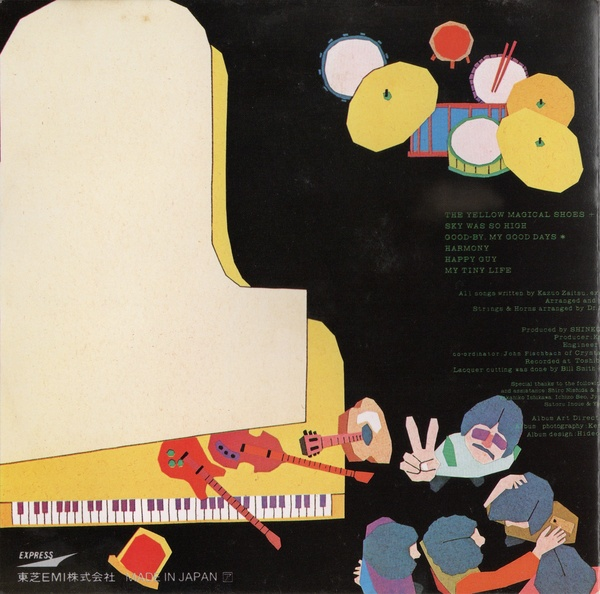](images/Tulip-1972-魔法の黄色い靴-CA32-1188-1.jpg)

[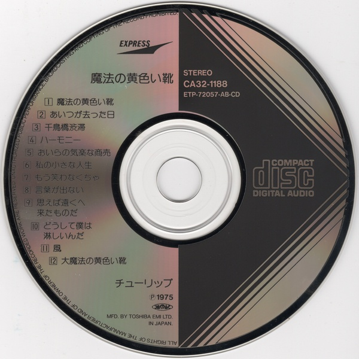](images/Tulip-1972-魔法の黄色い靴-CA32-1188-3.jpg)

### 心の旅 (Tulip Best) (CA32-1189)

- ベストアルバム
- 発売日: 1985年11月1日
- 所持品:
  - マトリクス: CA32-1189 3A1 TO

[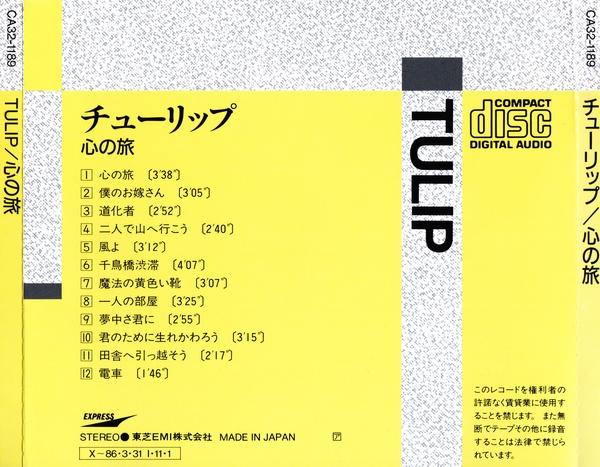](images/Tulip-1973-心の旅-CA32-1189-2.jpg)

### ぼくがつくった愛のうた (CA32-1190)

- 4thアルバム
- 発売日: 1985年11月1日
- 所持品:
  - マトリクス: CA32-1190 2A1 (3A1)

[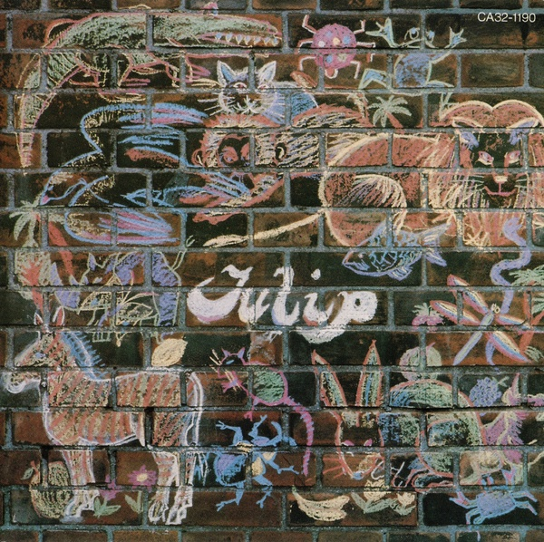](images/Tulip-1974-ぼくがつくった愛のうた-CA32-1190-0.jpg)
[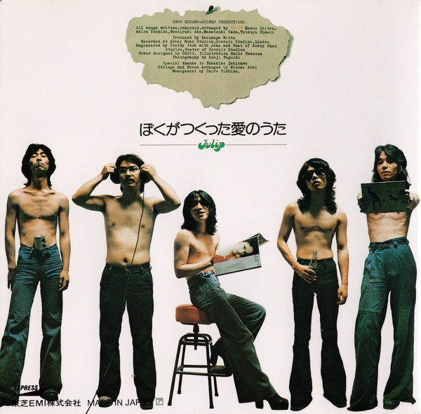](images/Tulip-1974-ぼくがつくった愛のうた-CA32-1190-1.jpg)

[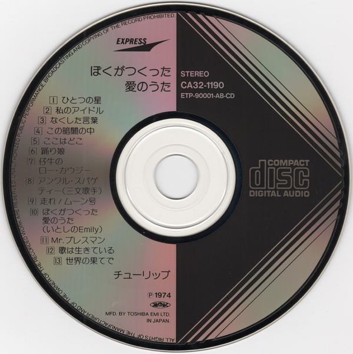](images/Tulip-1974-ぼくがつくった愛のうた-CA32-1190-3.jpg)

### The 10th Odyssey (CA32-1191)

- 12thアルバム
- 発売日: 1985年11月1日
- 所持品:
  - マトリクス: CA32-1191 2A1

[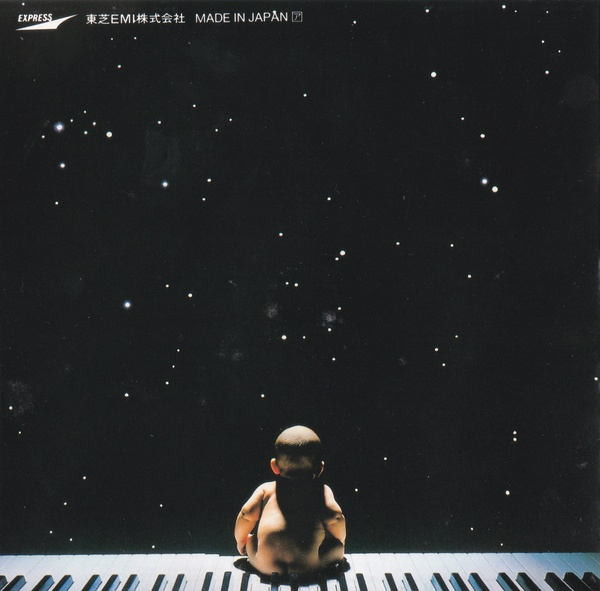](images/Tulip-1981-The-10th-Odyssey-CA32-1191-1.jpg)

[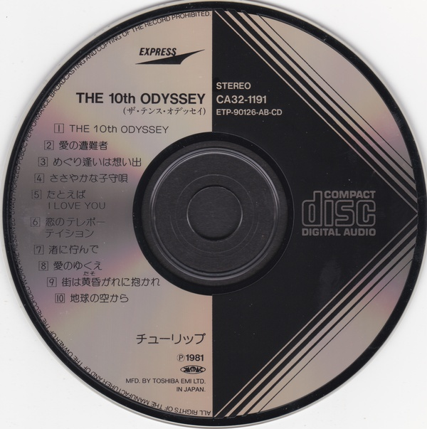](images/Tulip-1981-The-10th-Odyssey-CA32-1191-3.jpg)

### Best Now 心の旅 虹とスニーカーの頃 (CA32-1206)

- ベストアルバム
- 発売日: 1985年12月21日
- 所持品:
  - マトリクス: CA32-1206 2A4

[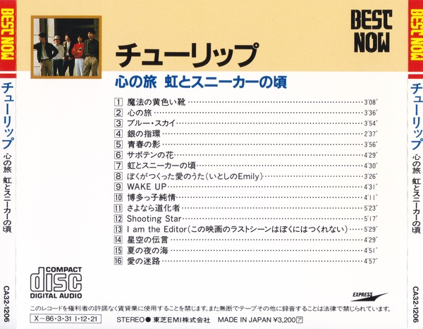](images/Tulip-1985-Best-Now-CA32-1206-2.jpg)

### Tulip Live The 1000th (CA25-1292・93)

- ライブアルバム
- 発売日: 1986年9月20日
- 所持品:
  - マトリクス: CA25-1292 1A1 TO / CA25-1293 1A1 TO

[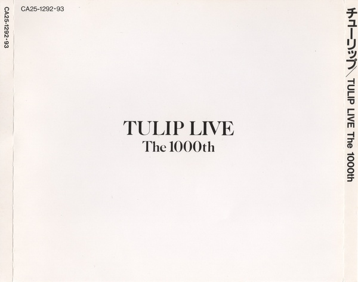](images/Tulip-1982-Live-The-1000th-CA25-1292-93-0.jpg)
[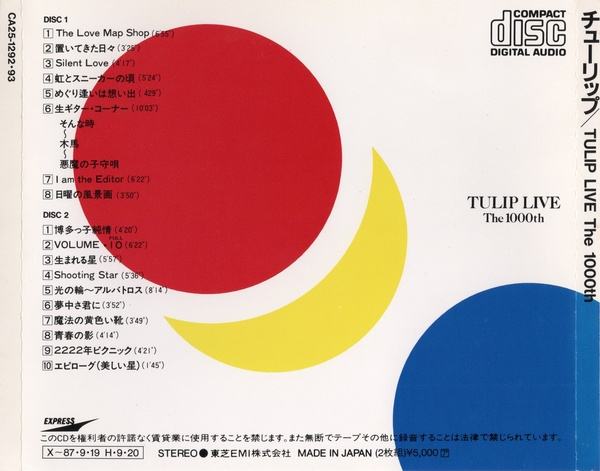](images/Tulip-1982-Live-The-1000th-CA25-1292-93-1.jpg)
[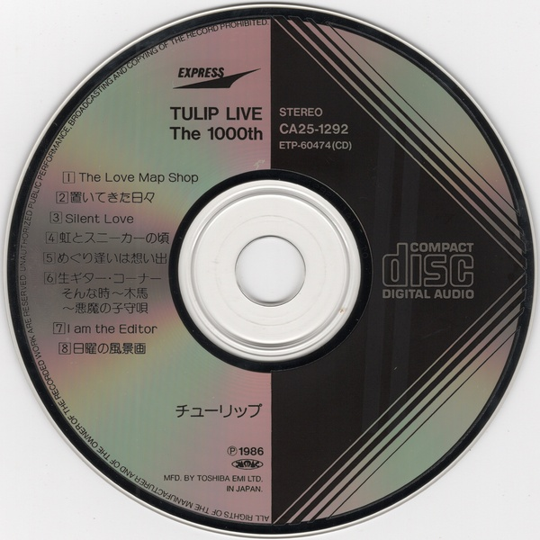](images/Tulip-1982-Live-The-1000th-CA25-1292-93-2.jpg)
[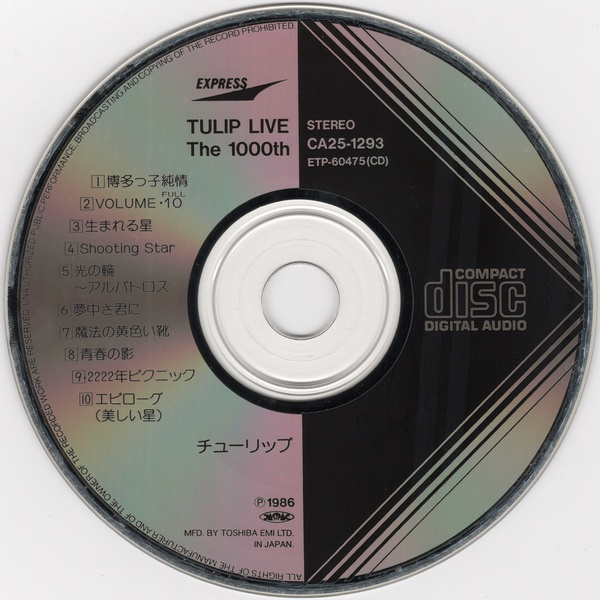](images/Tulip-1982-Live-The-1000th-CA25-1292-93-3.jpg)

### ニュー・ベストナウ (New Best Now) (CA32-1426)

- ベストアルバム
- 発売日: 1987年5月1日
- 所持品:
  - マトリクス: CA32-1426 1A2 TO
- 備考: 1985年発売のBest Nowから、1曲だけ差し替えられているだけです (「	I Am The Editor (この映画のラストシーンはぼくにはつくれない)」から「We Can Fly」)。

