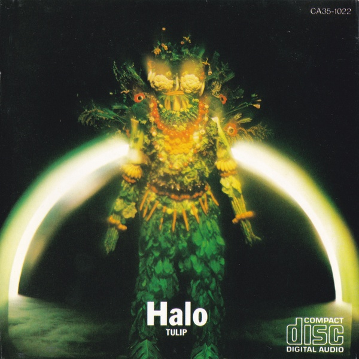
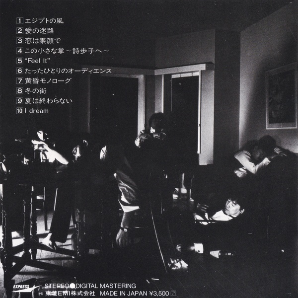
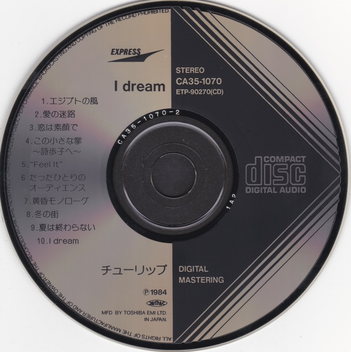
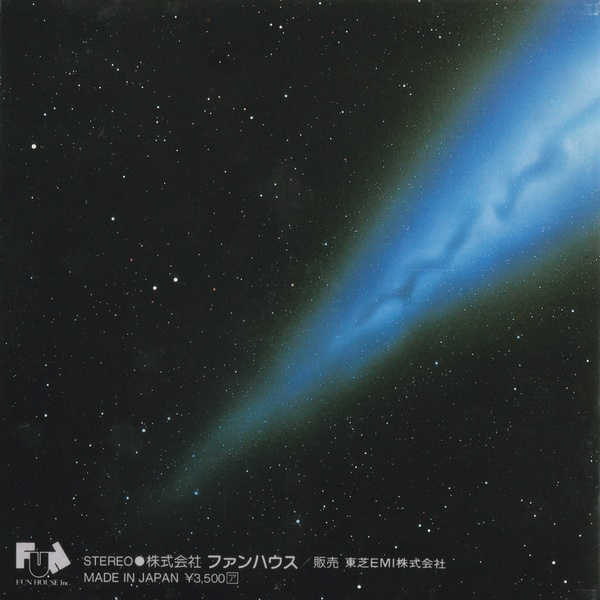

<!--
 pandoc -s -f markdown -t html5 --mathjax --css ./style.css ./tulip-ca35-series.md -o ./tulip-ca35-series.html
-->

[ホームに戻る](./index.html)

## チューリップ CA35・35FDシリーズ

チューリップでは、「Halo (ヘイロウ)」「I Dream」の2作品が、CA35規格のCDとして発売されました。
また「New Tune」が、35FD規格で発売されました。

「Halo」は、チューリップで最初にCD化されたアルバムです。
1983年5月1日にレコードで発売され、それから4か月経った9月1日にCDとなりました。
「I Dream」に関しては、1984年1月21日にレコードで発売され、それから2か月後の3月21日にCDとなっています。
この2枚のCDは、東芝EMIのExpressレーベルから定価3,500円で発売されています。
カタログ番号はそれぞれ、CA35-1022、CA35-1070です。
「New Tune」は、1985年1月19日にレコードで発売され、それから1か月半後の3月1日にCDとして登場しました。
こちらは、ファンハウスから定価3,500円で発売され、カタログ番号は35FD-1005です。
(1) 1983年頃はCDがまだ普及していないこと、(2) レコード (定価2,800円) よりも割高であったこと、(3) メンバーチェンジ後の第2期は宇宙路線を前面に押し出した作風で、第1期ほどの人気が得られなかったこと、などが影響したためか、これら3枚のCDは市場にほとんど流通しておらず、入手するのが大変です。

オフコースについては、[こちらのページ](./off-course-ca35-series.html)で紹介したように、11枚のスタジオアルバムと、3枚のベストアルバム、さらには3枚のインストアルバムがCA35規格で発売されていますが、人気の低迷していたチューリップでは、セールスが見込めなかったのか、CA35規格がたったの2枚しかありません。
寂しい限りです。
1985年11月1日に、「魔法の黄色い靴」「Tulip Best 心の旅」「ぼくがつくった愛のうた」「The 10th Odyssey」の4作品が、定価3,200円でCD化されました。
カタログ番号はそれぞれ、CA32-1188、CA32-1189、CA32-1190、CA32-1191です。
こちらも入手が困難です。
1992年頃になってようやく、音蔵シリーズのおかげで、チューリップの作品がCD化されました。

第2期の作品は素晴らしいと思うので、機会があればぜひ入手してみてください。
特に「Halo」は、チューリップのなかでも一番のお気に入りです。

画像はクリックすると拡大します。

### Halo (CA35-1022)

- 14thアルバム
- 発売日: 1983年9月1日
- 所持品 (CBS/Sonyプレス):
  - マトリクス: CA35-1022 11 (Neat font)
  - 刻印: Manufactured By CBS/Sony Records Inc.
- 備考: 確証はありませんが、このCBS/Sonyプレスしかないと思われます。
3曲目の「輝く星」では、財津さんが歌い出す前の、息を吸う音が入っています。
2007年盤 (VICL-62399) ではカットされています。
「丘に吹く風」は神曲なので、もっと広まって欲しいです。
2分間の間奏が美しすぎて、涙が出ます。
- 入手のしやすさ: 1年ほど待ってようやく入手できました。
少々高めでしたが、チューリップの傑作なので、どうしても欲しい一枚でした。

### I Dream (CA35-1070)

- 15thアルバム
- 発売日: 1984年3月21日
- 所持品 (東芝EMIプレス):
  - マトリクス: CA35-1070-2 1A2 (Big stamped font)
  - 刻印: なし
- 備考: 確証はありませんが、この東芝EMIプレスしかみたことがありません。
マトリクスには、特徴的な幅広いフォント (Big stamped font) がみられます。
このフォントは、東芝EMIでプレスされた最初期のCDにしか使用されていないようで、1983年秋から1984年春頃までの短い期間にしかみられません。
- 入手のしやすさ: 「Halo」よりはみかける気がします。比較的手頃な価格 (2,000円ほど) で入手できました。

### New Tune (35FD-1005)

- 16thアルバム
- 発売日: 1985年3月1日
- 所持品:
  - マトリクス: 35FD-1005 1B2
  - 刻印: なし
- 備考: おそらく東芝EMIプレスだと思います。
「ロベリア」はこの作品では浮いていて、評価が分かれる曲ですが、自分は大好きです。
- 入手のしやすさ: 「I Dream」と同程度の頻度でみかけます。何か月か待てば買えると思います。

